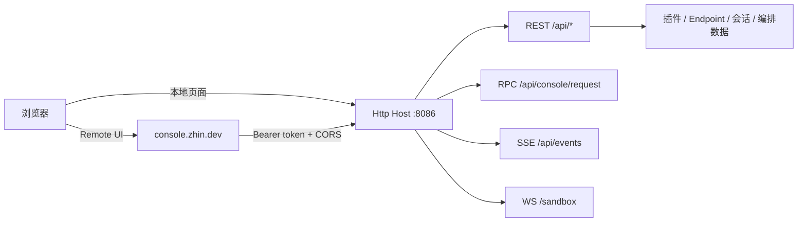

# Console

Zhin.js 自带 Web 控制台：CLI 启动（`zhin runtime start`，项目脚本的 `pnpm dev` / `pnpm start` 最终都走它）时**自动装配** Http Host 与 Console API，无需额外配置即可使用。UI 有两层：

- **Remote Console**：托管在 <https://console.zhin.dev>，连接你的 Host 地址 + token；
- **本地页面**：Host 直接服务插件页面（`/console` 索引 + 各页面路由）与 sandbox 聊天页。



## 部署与配置

全部配置在 `zhin.config.yml` 顶层 `http:` 段：

```yaml
http:
  port: 8086                 # 默认 8086
  host: 127.0.0.1            # 默认 127.0.0.1；远程访问需改 0.0.0.0
  token: ${HTTP_TOKEN}       # 主 token（full scope）
  tokens:                    # 附加作用域 token（可选）
    - token: ${DEMO_TOKEN}
      scope: demo            # full | demo
  corsOrigins:               # CORS 白名单；https://console.zhin.dev 总是自动并入
    - "http://localhost:5173"
  base: /api                 # API 前缀，默认 /api
```

- **鉴权**：配置 token 后，`/api` 下的请求需带 `Authorization: Bearer <token>`（或 `?token=` 查询参数）；`/pub/*`、Console shell 与页面路由保持公开。token 比较走时序安全比较。
- **CORS**：`corsOrigins` 与 Remote Console 源合并，跨域 UI 才能访问。
- **端口占用软降级**：端口被占时 Http Host 记日志跳过，适配器与 Agent 照常启动（Console 不可用）。
- **重启**：Console 触发 `system:restart` 时进程以 exit code 51 退出，由 CLI daemon 自动拉起。

## 页面功能

| 页面 | 数据来源 | 说明 |
|------|----------|------|
| Dashboard | `GET /api/system/status`、`GET /api/stats` | 运行状态、版本、统计概览 |
| Plugins | `GET /api/plugins`、`GET /api/plugins/<name>` | 插件列表与详情（命令、工具、配置 schema） |
| Endpoints | Endpoint 摘要 + 收件箱表 | 各平台端点连接状态；详情页含统一收件箱（消息 / 请求 / 通知） |
| Config | RPC `config:get-yaml` / `config:save-yaml` / `config:set` | 在线查看、编辑 `zhin.config.yml` |
| Logs | `GET /api/logs`、`GET /api/logs/stats`、`DELETE /api/logs`、`POST /api/logs/cleanup` | 系统日志（`SystemLog` 表，需 Database 启动） |
| Cron | RPC `cron:*` | 插件注册的内存任务（list）；安装 Agent 后可增删暂停持久化任务 |
| Database | RPC `db:info` / `db:tables` / `db:select` / `db:insert` / `db:update` / `db:delete` / `db:kv:*` | 数据库浏览与编辑、KV 存储 |
| Files | RPC `files:tree` / `files:read` / `files:save`、`env:list` / `env:save` | 项目文件树与 `.env` 管理 |
| Introspection | `GET /api/introspection/{commands,tools,endpoints,bindings,mcp}` | 分页内省：命令、工具、端点、绑定、MCP |
| Agent Sessions | `GET/POST /api/agent/sessions/*` | AI 会话树查看与分支切换 |
| Orchestration | `GET /api/agent/orchestration/runs[/*]` | 编排 Run / Task 状态追踪 |
| Marketplace | `GET /pub/marketplace/search`、`/pub/marketplace/detail/*`、`GET /api/marketplace/updates` | 插件市场（plugins.json + npmmirror）与更新检查 |
| Sandbox | WS `/sandbox` | 内置沙箱聊天，免平台联调直接对话 |

实时推送走 SSE：`GET /api/events`（页面目录同步、HMR 重载、消息/配置事件）。

## /entries 插件页面机制

插件可以向 Console 贡献自己的页面。机制：

1. 插件声明 client 页面（pagemanager），构建产物由 Host 服务在 `/assets/client/*`；
2. Host 的 ConsoleRuntime 汇总页面目录，`GET /entries` 返回 `{ entries, runtimeEnvHint }`——每条 entry 含 `id`、`title`、`route`、`module`（页面模块 URL）、`order`、`hash`；
3. Remote Console / 本地 shell 拉取 `/entries` 后动态 import 对应模块渲染；浏览器裸导入（react 等）由 Host 的 `/esm/*` 代理为可执行 ESM。

页面目录变化通过 SSE `sync` 事件实时推给已连接的 UI。

## Demo scope（只读部署）

给演示环境发 `scope: demo` 的 token，Console 即进入只读模式：

- 放行：`GET /api/events`、`POST /api/console/request`（仅只读 RPC）、`GET /api/system/status`、`GET /api/stats`、`GET /api/plugins*`；
- WebSocket 仅 `/sandbox`；
- 其余写操作（改配置、清日志、DB 写入等）一律 `403`。

主 token 为 `full` scope，拥有全部权限。

## 相关

- [AI 能力总览](../ai/index.md)
- [Agent 深入](../ai/agent.md)：Console 的 Agent Sessions / Orchestration 页对应的运行时
