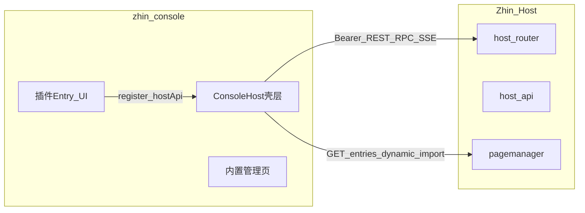

# Remote Console 需求文档

> **受众**：zhin-console 仓库维护者与贡献者  
> **权威方**：Zhin Host（`@zhin.js/host-api` + `@zhin.js/host-router`）  
> **版本**：与 Host API 同步演进；机器可读契约见运行时 `GET /pub/openapi.json`

本文档描述 Remote Console（独立静态站）应实现的全部功能、API 契约与验收标准。Host **不提供** Console UI，仅暴露 API；UI 在 [zhin-console](https://github.com/zhinjs/zhin-console) 维护并部署（如 [console.zhin.dev](https://console.zhin.dev)）。

快速上手见 [console-remote.md](../console-remote.md)。本地联调见 [examples/test-bot/REMOTE_CONSOLE.md](../../examples/test-bot/REMOTE_CONSOLE.md)。

---

## 1. 背景与目标

### 1.1 架构

| 仓库 / 包 | 职责 |
|-----------|------|
| **zhin-console** | Console 壳层、登录、内置管理页、构建与部署 |
| **@zhin.js/host-router** | Koa 监听、Router、Bearer 认证、CORS |
| **@zhin.js/host-api** | 管理面 REST、Console RPC、SSE、PageManager |
| **@zhin.js/pagemanager** | Console Entry 注册、`GET /entries`、`/@dev` 资源 |
| **@zhin.js/contract** | Entry、`PluginRegisterHostApi` 等共享类型 |
| **@zhin.js/client** | 浏览器 SDK：`apiFetch`、`loadConsoleEntries` |



### 1.2 控制台职责

- 连接用户 Host（API Base + Bearer Token）
- 渲染内置管理页面（插件、Bot、配置、日志等）
- 订阅 SSE 实时事件
- 通过 `GET /entries` 动态加载插件 Console Entry 并注册路由/工具
- **不在** Host 端口（如 `:8086`）提供静态 Console 站点

### 1.3 SDK 依赖

Console 壳层应依赖 `@zhin.js/client` 与 `@zhin.js/contract`，不重复实现认证与 Entry 加载逻辑。参考 [packages/console/client/README.md](../../packages/console/client/README.md)。

---

## 2. 连接与认证

| 项 | 规范 |
|----|------|
| 登录字段 | **API Base URL**（如 `http://127.0.0.1:8086`）、**Bearer Token**（`zhin.config` / `.env` 中 `http.token` 或 `HTTP_TOKEN`） |
| localStorage 键 | `zhin_api_base`、`zhin_api_token`（与 `@zhin.js/client` 一致） |
| 请求头 | `Authorization: Bearer <token>` |
| 401 行为 | 清除 Token，派发 `zhin:auth-required` 事件，跳转登录页 |
| CORS | Host 需配置 `http.corsOrigins`，包含 `https://console.zhin.dev` 及本地 dev Origin（如 `http://127.0.0.1:5173`） |
| 深链（仅 API Base） | `https://console.zhin.dev/?apiBaseUrl={encodeURIComponent(origin)}` — **Token 不得出现在 URL** |
| 健康检查 | `GET /pub/health`（无需 Token） |

### 2.1 登录页交互

- 表单校验 API Base 为合法 URL
- 可选：登录前请求 `/pub/health` 探测连通性
- 登录成功后持久化到 localStorage，刷新免重复登录
- 支持修改已保存的 API Base / Token（重新登录）

### 2.2 Demo Console 变体（demo.zhin.dev）

公开在线 Demo 使用 **独立 Console 构建**（非 console.zhin.dev 登录流）：

| 项 | 规范 |
|----|------|
| 站点 | `https://demo.zhin.dev` → 预填 `zhin_api_base` = `https://demo-api.zhin.dev` |
| Token | 构建时注入 `VITE_API_TOKEN`（**demo scope**，见 [ADR 0016](/adr/0016-demo-host-token-scopes)） |
| UI | 默认路由仅 **沙盒**；隐藏配置/文件/cron 写操作 |
| CORS | Host `http.corsOrigins` 含 `https://demo.zhin.dev` |
| 部署 | [deploy/zhin-demo](https://github.com/zhinjs/zhin/blob/main/deploy/zhin-demo/README.md) |

---

## 3. API 契约总览

### 3.0 机器可读契约

运行时拉取：

```
GET {API_BASE}/pub/openapi.json
```

- OpenAPI 3.1，无需 Token
- 内省 5 端点已有完整 `components.schemas`（`Introspection*`）
- 其余端点逐步补齐；Console 可做端点发现与类型生成

**认证规则**：

| 路径前缀 | Bearer |
|----------|--------|
| `/pub/*` | 否 |
| `/entries` | 否（拉取插件 Entry） |
| 含 `/webhook` | 否（平台自有签名校验） |
| `/api/*` | **是** |

---

### 3.1 公开 REST（无需 Token）

| 方法 | 路径 | Query / 说明 |
|------|------|----------------|
| GET | `/pub/health` | 健康检查 |
| GET | `/pub/openapi.json` | OpenAPI 文档 |
| GET | `/pub/marketplace/search` | `q`/`keyword`、`page`、`size`/`limit`、`category`、`official` |
| GET | `/pub/marketplace/detail/{name}` | 插件详情（name 可含 scope） |

**市场搜索响应示例**：

```json
{
  "success": true,
  "data": [
    {
      "name": "@zhin.js/adapter-icqq",
      "displayName": "ICQQ",
      "version": "1.0.0",
      "description": "...",
      "author": "",
      "isOfficial": true,
      "category": "adapter",
      "keywords": [],
      "npm": "https://www.npmjs.com/package/...",
      "downloads": { "weekly": 0, "monthly": 0 }
    }
  ],
  "total": 42,
  "page": 1,
  "size": 20
}
```

---

### 3.2 管理 REST（需 Bearer）

默认 API 前缀为 `/api`（可由 `http.base` 配置）。

#### 系统与统计

| 方法 | 路径 | 响应 `data` 要点 |
|------|------|------------------|
| GET | `/api/system/status` | `uptime`, `memory`, `osMemory`, `cpu`, `platform`, `nodeVersion`, `runtime`, `pid`, `timestamp` |
| GET | `/api/stats` | `plugins.{total,active}`, `bots.{total,online}`, `commands`, `components`, `uptime`, `memory`（MB）, `runtime` |

#### 插件

| 方法 | 路径 | 响应 `data` 要点 |
|------|------|------------------|
| GET | `/api/plugins` | 数组：`name`, `status`（active/inactive）, `description`, `features[]` |
| GET | `/api/plugins/:name` | 单插件：`filename`, `filePath`, `status`, `features`, `contexts[]` |

#### Bot

| 方法 | 路径 | 响应 `data` 要点 |
|------|------|------------------|
| GET | `/api/bots` | 数组：`name`, `adapter`, `connected`, `status`（online/offline） |

#### 配置与 Schema

| 方法 | 路径 | 说明 |
|------|------|------|
| GET | `/api/config` | 主配置对象 |
| GET | `/api/config/:name` | `name=app` 返回主配置；否则返回插件 `name`/`filePath` |
| POST | `/api/config/:name` | 当前为占位（未完整实现写回） |
| GET | `/api/schemas` | 全部 JSON Schema |
| GET | `/api/schemas/:name` | 单个 Schema 或 `null` |

#### 发消息

| 方法 | 路径 | Body |
|------|------|------|
| POST | `/api/message/send` | `{ context, bot, id, type, content }` — `type` 为 `private` \| `group` \| `channel` |

成功响应含 `data.messageId`、`data.timestamp`。

#### 日志

| 方法 | 路径 | 说明 |
|------|------|------|
| GET | `/api/logs` | Query：`limit`（1–1000，默认 100）、`level`（可选，如 `info`/`warn`/`error`/`all`） |
| DELETE | `/api/logs` | 清空日志 |
| GET | `/api/logs/stats` | `total`, `byLevel`, `oldestTimestamp` |
| POST | `/api/logs/cleanup` | Body：`{ days?, maxRecords? }` |

#### 插件市场（已安装更新）

| 方法 | 路径 | 响应 |
|------|------|------|
| GET | `/api/marketplace/updates` | `data[]`：`name`, `latest`, `description` |

#### 运行时内省（分页）

见 **第 5 节**。

| 方法 | 路径 |
|------|------|
| GET | `/api/introspection/commands` |
| GET | `/api/introspection/bots` |
| GET | `/api/introspection/bindings` |
| GET | `/api/introspection/tools` |
| GET | `/api/introspection/mcp` |

#### Agent 会话树（ADR 0010）

见 **第 6 节**。

| 方法 | 路径 |
|------|------|
| GET | `/api/agent/sessions/:sessionKey/tree` |
| POST | `/api/agent/sessions/:sessionKey/leaf` |

#### Assistant（可选，需 Host 启用）

| 方法 | 路径 | 说明 |
|------|------|------|
| POST | `/api/assistant/events` | 事件入口；未启用时 404 |
| GET | `/api/assistant/jobs` | 任务列表；`assistant.enabled=false` 时 404 |

---

### 3.3 Console RPC

**入口**：`POST /api/console/request`

**请求体**：

```json
{
  "type": "config:get",
  "requestId": 1,
  "pluginName": "optional-plugin-name",
  "data": {}
}
```

| 字段 | 说明 |
|------|------|
| `type` | RPC 方法名（必填） |
| `requestId` | 客户端关联 ID（建议递增） |
| `pluginName` | 部分 config/schema 方法需要 |
| 其余字段 | 依 `type` 而定（如 `yaml`、`filePath`、`data`） |

**成功响应**（HTTP 200）：

```json
{ "success": true, "data": {}, "requestId": 1 }
```

**失败响应**（HTTP 400）：

```json
{ "success": false, "error": "错误说明", "requestId": 1 }
```

#### Core RPC（handlers-core）

| type | 请求字段 | 响应 `data` |
|------|----------|-------------|
| `ping` | — | `{ type: "pong" }`（经 emit，REST 层取 data） |
| `entries:get` | — | Entry 数组 |
| `config:get` | `pluginName?` | 全量或单插件配置对象 |
| `config:get-all` | — | 含 schema 别名映射的全量配置 |
| `config:set` | `pluginName`, `data` | `{ success, reloaded?, message? }`；触发 SSE `config:updated` |
| `config:get-yaml` | — | `{ yaml, pluginKeys[] }` |
| `config:save-yaml` | `yaml` | `{ success, message }`（需重启生效） |
| `schema:get` | `pluginName?` | Schema JSON 或 `null` |
| `schema:get-all` | — | `Record<name, schema>` |
| `files:tree` | — | `{ tree: FileTreeNode[] }` |
| `files:read` | `filePath` | `{ content, size }` |
| `files:save` | `filePath`, `content` | `{ success, message }` |
| `env:list` | — | `{ files: string[] }` |
| `env:get` | `filename` | `{ content }` |
| `env:save` | `filename`, `content` | `{ success }` |
| `bot:list` | — | `{ bots: BotRow[] }`（含 pending 状态） |
| `bot:info` | `data: { adapter, botId }` | Bot 详情 |
| `bot:sendMessage` | `data: { adapter, botId, id, type, content }` | `{ messageId }` |
| `cron:list` | — | `{ memory[], persistent[] }` |
| `cron:add` | `cronExpression`, `prompt`, `label?`, `notify?` | 新建 persistent 任务记录 |
| `cron:remove` | `id` | `{ success }` |
| `cron:pause` | `id` | `{ success }` |
| `cron:resume` | `id` | `{ success }` |

`notify` 形状：`{ channel: "im" \| "silent" \| "log", ... }`。

#### 数据库 RPC（`db:*`，handlers-db / websocket 回落）

| type | 请求字段 | 响应 `data` |
|------|----------|-------------|
| `db:info` | — | `{ dialect, type, tables[], available }` |
| `db:tables` | — | `{ tables: { name, columns? }[] }` |
| `db:select` | `table`, `page?`, `pageSize?`, `where?` | `{ rows, total, page, pageSize }` |
| `db:insert` | `table`, `row` | `{ success }` |
| `db:update` | `table`, `row`, `where` | `{ success, affected }` |
| `db:delete` | `table`, `where` | `{ success, deleted }` |
| `db:drop-table` | `table` | `{ success }` |
| `db:kv:get` | `table`, `key` | `{ key, value }` |
| `db:kv:set` | `table`, `key`, `value`, `ttl?` | `{ success }` |
| `db:kv:delete` | `table`, `key` | `{ success }` |
| `db:kv:entries` | `table`, `page?`, `pageSize?` | KV 分页条目 |

`type` 为 `related` \| `document` \| `keyvalue`，UI 应按类型展示不同编辑器。

#### Bot 社交 / Inbox RPC（websocket 回落）

以下方法通过同一 `POST /api/console/request` 调用，`data` 字段承载参数：

| type | 用途 |
|------|------|
| `bot:friends` | 好友列表 |
| `bot:groups` | 群列表 |
| `bot:channels` | 频道列表 |
| `bot:requests` | 好友/群请求 |
| `bot:requestApprove` / `bot:requestReject` | 处理请求 |
| `bot:requestConsumed` | 标记请求已读 |
| `bot:noticeConsumed` | 标记通知已读 |
| `bot:inboxMessages` | 收件箱消息 |
| `bot:inboxRequests` | 收件箱请求 |
| `bot:inboxNotices` | 收件箱通知 |
| `bot:deleteFriend` | 删除好友 |
| `bot:groupMembers` | 群成员 |
| `bot:groupKick` / `bot:groupMute` / `bot:groupAdmin` | 群管理 |
| `system:restart` | 触发 Host 重启 |

具体 `data` 字段因适配器而异；Console 应按 adapter 能力降级展示。

---

### 3.4 SSE 实时

**连接**：`GET /api/events`

- `Content-Type: text/event-stream`
- 支持 `Last-Event-ID` / `lastEventId` 断线续传
- 使用 `EventSource` 或等价实现；Token 通过 query 或自定义头（若 Host 支持）— 当前标准做法为 Bearer 头 + fetch 流式读取

**连接时初始事件**：

| type | data |
|------|------|
| `sync` | `{ key: "entries", value: ConsoleEntry[] }` |
| `init-data` | `{ timestamp }` |

**运行时推送**：

| type | 说明 | data 形状（概要） |
|------|------|-------------------|
| `config:updated` | 配置变更 | `{ pluginName, config }` |
| `bot:message` | 新收件消息 | 消息行字段（adapter, bot_id, sender, channel 等） |
| `bot:request` | 好友/群请求 | 请求行 + `canAct` |
| `bot:notice` | 平台通知 | notice 行 |
| `system:restarting` | 即将重启 | — |
| `data-update` | 通用刷新信号 | `{ timestamp }` |

Console 应在相关页面订阅 SSE 并增量更新列表，避免全页轮询。

---

### 3.5 插件扩展（Console Entry）

#### 发现

```
GET /entries
```

响应（`ConsoleEntriesResponse`）：

```json
{
  "entries": [
    {
      "id": "icqq",
      "resolvedModule": "/@dev/icqq/client/index.js",
      "order": 10,
      "enabled": true,
      "meta": { "name": "ICQQ", "version": "1.0.0" }
    }
  ],
  "runtimeEnvHint": "development"
}
```

#### 加载流程

1. 登录后调用 `loadConsoleEntries({ hostApi, assetOrigin, fetchInit })`
2. 对每个 entry 动态 `import(resolvedModule)`
3. 调用模块导出 `register(hostApi)` 或 `default.register`
4. `hostApi.addRoute` / `addTool` 注册侧栏与页面

#### Register Host API

| 方法 | 说明 |
|------|------|
| `addRoute({ path, name, element, icon?, parent?, meta? })` | 注册页面路由 |
| `addPage(...)` | `addRoute` 别名 |
| `addTool({ id?, name, icon?, parent?, path? })` | 注册侧栏工具入口 |

`meta` 支持：`hideInMenu`, `order`, `group`, `fullWidth`。

#### 已知扩展

| Entry | 路由 | 说明 |
|-------|------|------|
| ICQQ | `/icqq` | 含「登录辅助」Tab；登录 HTTP API 由 `@zhin.js/adapter-icqq` 注册，**不在** host-api |
| Sandbox | `/@dev` 相关 | 浏览器调试扩展 |

未启用对应适配器时，Entry 可能不存在或页面内显示不可用 — 属预期行为。

---

## 4. 内置页面需求

以下每页需实现：**路由**、**数据加载**、**加载/空/错态**、**与 SSE 联动**（如适用）。

### 4.1 登录页

- **路由**：`/login` 或未认证时默认页
- **数据**：`/pub/health`（可选）
- **交互**：保存 API Base + Token；支持深链 `?apiBaseUrl=`

### 4.2 仪表盘

- **路由建议**：`/dashboard` 或 `/`
- **数据**：`GET /api/stats`、`GET /api/system/status`
- **展示**：插件数、Bot 在线数、命令/组件数、运行时间、内存
- **刷新**：手动 + 可选定时；`data-update` SSE 触发刷新

### 4.3 插件

- **路由建议**：`/plugins`、`/plugins/:name`
- **数据**：`GET /api/plugins`、`GET /api/plugins/:name`、RPC `schema:get`
- **展示**：插件列表、Feature 统计、contexts、关联 Schema
- **空态**：无子插件时提示

### 4.4 Bot 管理

- **路由建议**：`/bots`、`/bots/:adapter/:botId`
- **数据**：`GET /api/bots`、RPC `bot:list` / `bot:info` / `bot:sendMessage`、`POST /api/message/send`
- **展示**：在线状态、发消息表单（私聊/群/频道）
- **实时**：SSE `bot:message`

### 4.5 收件箱

- **路由建议**：`/inbox` 或 Bot 详情子 Tab
- **数据**：RPC `bot:inboxMessages` / `bot:inboxRequests` / `bot:inboxNotices` 及消费/审批方法
- **展示**：消息、好友请求、通知分栏；未读标记
- **持久化**：IndexedDB 缓存列表，刷新后仍可浏览（见验收 §8）
- **实时**：SSE `bot:message` / `bot:request` / `bot:notice`

### 4.6 配置编辑器

- **路由建议**：`/config`
- **数据**：RPC `config:get-all`、`config:set`、`config:get-yaml`、`config:save-yaml`、`schema:get-all`
- **展示**：按插件分 Tab；YAML 与表单双模式（若有 Schema）
- **保存反馈**：区分 `reloaded: true`（热重载）与需重启提示
- **实时**：SSE `config:updated`

### 4.7 项目文件与 .env

- **路由建议**：`/files`、`/env`
- **数据**：RPC `files:tree` / `files:read` / `files:save`、`env:list` / `env:get` / `env:save`
- **限制**：单文件读取上限 1MB（Host 侧限制）

### 4.8 数据库浏览器

- **路由建议**：`/database`
- **数据**：RPC `db:*`
- **展示**：按 `type`（relational / document / kv）切换 UI；表浏览、分页、增删改

### 4.9 系统日志

- **路由建议**：`/logs`
- **数据**：`GET /api/logs`、`GET /api/logs/stats`、`DELETE /api/logs`、`POST /api/logs/cleanup`
- **展示**：按 level 筛选、时间倒序、统计卡片、清理操作

### 4.10 插件市场

- **路由建议**：`/marketplace`
- **数据**：`GET /pub/marketplace/search`、`GET /pub/marketplace/detail/{name}`、`GET /api/marketplace/updates`
- **展示**：搜索、分页、详情、已安装更新提示

### 4.11 定时任务

- **路由建议**：`/cron`
- **数据**：RPC `cron:list` / `cron:add` / `cron:remove` / `cron:pause` / `cron:resume`
- **展示**：memory 与 persistent 分栏；新建表单含 cron 表达式、prompt、notify

### 4.12 运行时内省

见 **第 5 节**。

### 4.13 Agent 会话树

见 **第 6 节**。

### 4.14 Assistant Jobs

- **路由建议**：`/assistant/jobs`
- **数据**：`GET /api/assistant/jobs`
- **显示条件**：响应非 404；或 Host 配置 `assistant.enabled`
- **展示**：任务列表、`eventsActive` 状态

### 4.15 通用 UX

- 所有列表页：加载态、错误 Toast、503「依赖未就绪」文案
- 长列表：**服务端分页**，禁止一次渲染千行
- 401 统一跳转登录
- 侧栏：内置页 + `addRoute` / `addTool` 注册的插件页，支持 `meta.order` / `meta.group` 排序分组

---

## 5. 运行时内省模块

与 IM 命令 `/cmd`、`/bots`、`/bindings`、`/tools`、`/mcp` **数据同源**。

### 5.1 端点与 Query

| 资源 | 路径 | 默认 pageSize | filter 匹配字段 |
|------|------|---------------|-----------------|
| 命令 | `/api/introspection/commands` | 25 | pattern, desc, plugin |
| Bot | `/api/introspection/bots` | 30 | adapter, name |
| Agent 绑定 | `/api/introspection/bindings` | 30 | name, provider, model |
| 工具 | `/api/introspection/tools` | 15 | name, source, description |
| MCP | `/api/introspection/mcp` | 30 | name |

**Query 参数**（全部可选）：

| 参数 | 说明 |
|------|------|
| `page` | 页码，从 1 开始，默认 1 |
| `pageSize` | 每页条数；缺省用上表默认值 |
| `filter` | 子串筛选，大小写不敏感 |

### 5.2 响应 Envelope

```json
{
  "success": true,
  "data": {
    "items": [],
    "page": 1,
    "pageSize": 25,
    "total": 120,
    "totalPages": 5,
    "filter": "github",
    "note": "可选说明，如 MCP 未初始化"
  }
}
```

**503**（依赖未就绪，如 AI / CommandFeature 不可用）：

```json
{
  "success": false,
  "error": "CommandFeature 不可用",
  "data": {
    "items": [],
    "page": 1,
    "pageSize": 25,
    "total": 0,
    "totalPages": 0
  }
}
```

### 5.3 Item Schema（OpenAPI）

完整定义见 `/pub/openapi.json` → `components.schemas`：

| Schema | 字段 |
|--------|------|
| `IntrospectionCommandItem` | `pattern`, `desc`, `plugin?` |
| `IntrospectionBotItem` | `adapter`, `name`, `online` |
| `IntrospectionBindingItem` | `name`, `provider`, `model`, `mcpServers[]`, `hasAgentFile` |
| `IntrospectionToolItem` | `name`, `description`, `source?` |
| `IntrospectionMcpItem` | `name`, `connected`, `toolCount` |

### 5.4 请求/响应示例（tools）

```
GET /api/introspection/tools?page=2&filter=github&pageSize=15
Authorization: Bearer <token>
```

```json
{
  "success": true,
  "data": {
    "items": [
      {
        "name": "github_create_issue",
        "source": "mcp",
        "description": "Create a GitHub issue"
      }
    ],
    "page": 2,
    "pageSize": 15,
    "total": 28,
    "totalPages": 2,
    "filter": "github"
  }
}
```

### 5.5 Console UI 要求

- **布局**：单页五 Tab 或侧栏子菜单（命令 / Bot / 绑定 / 工具 / MCP）
- **搜索框**：输入 debounce 后更新 `filter` 并重置 `page=1`
- **表格列**：与 OpenAPI item 字段一一对应
- **分页器**：展示 `page/totalPages/total`；切换页码重新请求
- **503**：展示 `error` 文案 + 空表，不白屏
- **路由建议**：`/introspection/commands?page=2&filter=github`（便于分享书签）
- **页脚（可选）**：展示 REST 直链，格式与 IM 页脚一致：
  - `完整列表: {apiBase}/introspection/tools?page=2&filter=github`

---

## 6. Agent 会话树模块

依据 [ADR 0010 D3](../adr/0010-pi-coding-agent-harness-alignment.md)：Host 已交付 HTTP API，**图形化 UI 由 Console 实现**。行为与 IM `/tree` 命令一致，Console 无需实现 IM 命令本身。

### 6.1 GET 会话树

```
GET /api/agent/sessions/:sessionKey/tree
```

- `sessionKey`：URL 编码（如 `private%3Auser123` 表示 `private:user123`）

**成功 200**：

```json
{
  "success": true,
  "data": {
    "sessionKey": "private:user123",
    "sessionId": "sess_abc",
    "activeLeafMessageId": 42,
    "points": [
      { "index": 1, "messageId": 10, "preview": "你好，帮我查天气" },
      { "index": 2, "messageId": 25, "preview": "改成查北京" }
    ]
  }
}
```

| 字段 | 说明 |
|------|------|
| `points[].index` | 用户消息在活跃路径上的序号（供 POST `index` 使用） |
| `points[].messageId` | 数据库消息 ID（供 POST `messageId` 使用） |
| `points[].preview` | 用户消息预览（最多约 80 字符） |
| `activeLeafMessageId` | 当前活跃叶节点；`null` 表示默认最后一条 |

**404**：无活跃会话  
**503**：`Agent session tree runtime 未就绪`

### 6.2 POST 切换叶节点

```
POST /api/agent/sessions/:sessionKey/leaf
Content-Type: application/json

{ "index": 2 }
```

或 `{ "messageId": 25 }` — **二选一**。

**成功 200**：

```json
{
  "success": true,
  "message": "已切换 active leaf 至消息 #25",
  "data": {
    "sessionKey": "private:user123",
    "sessionId": "sess_abc",
    "activeLeafMessageId": 25
  }
}
```

**400**：参数无效或切换失败  
**404** / **503**：同 GET

### 6.3 Console UI 要求

- **路由建议**：`/agent/sessions` 或 `/agent/tree`
- **sessionKey 输入**：文本框 + 历史记录下拉（可选）
- **分支列表**：展示 `index`、`preview`；高亮 `activeLeafMessageId` 对应行
- **操作**：点击行 → 确认 → POST leaf → 刷新 GET tree
- **错误态**：404 提示「无活跃会话」；503 提示「Agent 未就绪」
- **说明文案**：切换叶节点后，后续 AI 对话从该用户消息点继续分支（与 `/tree N` 一致）

---

## 7. 非功能需求

| 类别 | 要求 |
|------|------|
| OpenAPI | 以 `/pub/openapi.json` 为契约来源；内省 schema 已完整 |
| 安全 | Token 仅存 localStorage，不得出现在 URL（`apiBaseUrl` 除外）；生产 HTTPS |
| CORS | 仅访问用户配置的 Host Origin |
| 性能 | 内省 tools 默认 pageSize=15；列表虚拟滚动可选 |
| 离线 | 收件箱等关键列表 IndexedDB 持久化 |
| 国际化 | UI 文案由 zhin-console 决定；API 字段名保持英文 |
| 兼容性 | 对接 `@zhin.js/client` 当前 major 版本；React >= 18 |

---

## 8. 联调与验收

### 8.1 环境准备

**Host**（本仓库 test-bot）：

```bash
cd examples/test-bot
pnpm dev
```

`zhin.config.yml` 示例：

```yaml
http:
  port: 8086
  token: <HTTP_TOKEN>
  corsOrigins:
    - "http://127.0.0.1:5173"
    - "https://console.zhin.dev"
```

**Console**（zhin-console 仓库）：

```bash
cd zhin-console && pnpm install && pnpm dev
```

浏览器打开开发地址，登录 API Base `http://127.0.0.1:8086` + Token。

### 8.2 验收清单

- [ ] 登录成功，Token 持久化，401 跳转登录
- [ ] 仪表盘展示 stats / system status
- [ ] 插件列表与详情可访问
- [ ] Bot 列表、发消息成功
- [ ] 收件箱加载，刷新后 IndexedDB 数据仍在
- [ ] 配置页读写，保存后 SSE `config:updated` 触发刷新
- [ ] 日志列表、筛选、清理
- [ ] 插件市场搜索与详情
- [ ] `GET /entries` 加载 ICQQ/Sandbox 等扩展路由
- [ ] Network 命中 `/api/console/request`、`/api/events`
- [ ] **内省五 Tab**：分页、filter、503 不崩溃
- [ ] **会话树**：加载 tree、切换 leaf 后 `activeLeafMessageId` 更新
- [ ] `/pub/openapi.json` 中 `getIntrospectionTools` schema 与实调响应一致

---

## 9. 明确不在范围

- Host 端口提供 Console 静态站（`serveClientHost: false`）
- ICQQ 登录辅助 HTTP 实现（由 `@zhin.js/adapter-icqq` 提供；Console 只嵌扩展 Tab）
- IM 出站消息链、Agent 推理与工具执行逻辑
- plan mode、子 agent 编排可视化（另文档跟踪）
- Host 侧 OpenAPI 全端点 schema 一次性补全（逐步迭代）

---

## 10. 参考索引

| 文档 / 代码 | 说明 |
|-------------|------|
| [console-remote.md](../console-remote.md) | Remote Console 使用说明 |
| [packages/host/api/README.md](../../packages/host/api/README.md) | Host API 功能列表 |
| [packages/console/client/README.md](../../packages/console/client/README.md) | 浏览器 SDK |
| [packages/console/contract/src/index.ts](../../packages/console/contract/src/index.ts) | Entry 与 Host API 类型 |
| [packages/host/router/src/introspection-openapi.ts](../../packages/host/router/src/introspection-openapi.ts) | 内省 OpenAPI schema |
| [ADR 0010](../adr/0010-pi-coding-agent-harness-alignment.md) | 会话树决策 |
| `{API_BASE}/pub/openapi.json` | 运行时 OpenAPI |

---

## 附录 A：提交到 zhin-console 项目

在 zhin-console 仓库创建 Issue / Epic 时，建议引用：

- **需求文档 URL**（main 分支）：  
  `https://github.com/zhinjs/zhin/blob/main/docs/console/requirements.md`
- **联调文档**：[examples/test-bot/REMOTE_CONSOLE.md](../../examples/test-bot/REMOTE_CONSOLE.md)
- **阻塞依赖**：无 — Host API 已就绪；内省与会话树 REST 已实现
- **建议里程碑**：登录与核心页 → 内省模块 → 会话树 UI → Assistant / 扩展打磨

复制 Issue 描述模板：

```markdown
## 需求来源
- [Remote Console 需求文档](https://github.com/zhinjs/zhin/blob/main/docs/console/requirements.md)
- 章节：<!-- 如 §5 运行时内省 -->

## 验收
见需求文档 §8.2 相关 checkbox

## 联调
Host: examples/test-bot `pnpm dev` → :8086
Console: `pnpm dev` → 登录 API Base + HTTP_TOKEN
```
