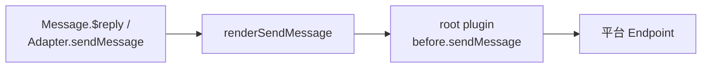

# 代码约定

这些约定不是风格偏好——大多有对应的 harness 门禁（见[开发流程](./development.md)），违反会直接红 CI。改动前先读根目录 `AGENTS.md`。

## TypeScript 与模块

- 全仓库 TypeScript ESM。**本地相对导入必须带 `.js` 扩展名**：

```ts
import { DisposeStack } from './dispose.js';        // ✅
import { DisposeStack } from './dispose';           // ❌
```

- Node 侧源码放 `src/`，构建产物放 `lib/`；浏览器侧源码放 `client/`，产物放 `dist/`。
- 新增 workspace 包必须落在 `pnpm-workspace.yaml` 覆盖的目录内，并带独立 `package.json`。
- `pnpm-workspace.yaml` 的 `overrides` 承担大量安全版本抬升（undici、hono、tar、js-yaml、nodemailer 等），不要随手删改；新增依赖注意 `pnpm check:dependency-policy` 的约束。

### 模块边界与源码布局

- 对外导入只经过包的公开入口或已声明的子路径；禁止跨包导入另一个包的 `src/`。包内文件可以调整，但使用方的导入路径应保持稳定。
- 默认使用一层、按能力命名的源码文件。只有一个能力已经形成独立入口、内部还有多个协作模块时，才建立子目录；不要先按 `types/`、`utils/`、`services/` 等泛化类别分层。
- 按职责拥有的状态和决策拆分文件，而不是按行数拆分。一个模块应隐藏一组相关实现细节，并提供比内部实现更小的接口。
- 纯契约模块可以依赖其他类型契约，但不能反向依赖生命周期、注册表或运行时编排。推荐依赖方向为“运行时编排 → 能力实现 → 边界契约”。
- 避免新增 `utils.ts`、`common.ts`、`helpers.ts`。用能力命名模块，例如 `content-resolver.ts`、`endpoint-lifecycle.ts`，让调用方从文件名就能判断边界。
- 包含多个主要模块的包，应在 README 提供“源码地图”，说明从哪个文件开始阅读，以及模块之间的单向依赖关系。

## 新插件：Plugin Runtime（默认）

唯一启动路径是 `zhin runtime start`。新插件：

- `plugin.ts` default-export `definePlugin()`（从 `zhin.js` 导入）
- 能力放在约定目录（`commands/` → `defineCommand`，`tools/` → `defineAgentTool`，…），一个文件一个 default export
- **不要**调用已移除的 `usePlugin()` / `getPlugin()`，也不要导入已删除的 `zhin.js/node`

见 [编写第一个插件](../getting-started/first-plugin.md)、[definePlugin](../authoring/define-plugin.md)。

## Removed：`usePlugin()` / `getPlugin()` / `bootstrapNode`

`zhin.js/node`、`bootstrapNode`、`usePlugin()` 与 `getPlugin()` **已删除且不再导出**。唯一入口是 `definePlugin()` + `zhin runtime start`。门禁 `pnpm check:no-removed-plugin-api` 阻止重新引入这些调用。迁移：`.github/skills/migrate-zhin-plugin-runtime`。
## 代级状态：Snapshot Resource

共享连接、数据库和其他有状态对象必须在 setup 中通过 `context.resources.provide`
发布，并由当前 operation 持有的 Generation View 解析。禁止新增模块级 `let` 单例、
latest-value stack 或 `createGenerationStore`；这些形式会跨 Root 串扰，也会让 shadow
candidate 在 commit 前可见。现存内部 `createGenerationStore` 调用属于待删除技术债，
不得作为插件创作接口继续扩散。详见[模块状态](../authoring/module-state.md)。

## WS/SSE 端点：createEndpointLifecycle

长连接端点（napcat、milky、onebot11/12 这类 WS/SSE 适配器）的 start/stop/重连/心跳统一走 `createEndpointLifecycle`（`@zhin.js/adapter`），不要手写状态机：

- 状态机：`idle → connecting → open → reconnecting → open … → stopped / closed`。
- `start(connectFn)`：连接失败自动复位回 `idle` 且不武装重连。
- `stop()`：清全部定时器、调用强关函数、唤醒竞态等待，绝不重连。
- `handle.notifyClosed()`：对端断开时由适配器调用，仅在连接曾 open 时按指数退避 + jitter 重连。
- `startHeartbeat(fn, interval)`：心跳 + 看门狗，连续 N 轮无回包（未 `notifyHeartbeatAck()`）时主动强关，由 close 事件驱动重连。
- 退避参数可配：`initialIntervalMs`（默认 5000）、`multiplier`（默认 2）、`maxIntervalMs`（默认 60000）、`jitterMs`、`maxAttempts`（默认 Infinity）。

适配器专有的逻辑（如 agent 注册/反注册）留在适配器侧，`start` 失败时要对称反注册。

## 消息统一链路

所有出站消息必须走统一链路，禁止旁路发送（门禁 `pnpm check:harness-paths`）：



跨平台出站（从一个平台发到另一个平台）用 `root.inject(adapter).sendMessage`，不要直接操作 Endpoint。

## Host token 模式

HTTP Host（`@zhin.js/host-http`）不内置会话体系，统一用 Bearer token 鉴权：

- 客户端请求带 `Authorization: Bearer <token>`，token 来自 `http.token` 配置；服务端用 `TokenRegistry`（`packages/host/http/src/token-registry.ts`）校验，`extractBearerToken` 解析头。
- token 比对走 `timingSafeEqualString`（常数时间比较），不要手写 `===` 比对。
- token 按 scope 分级（`ScopedTokenConfig` / `AuthScope`）：写操作要求 full scope，demo token 一律 403。
- Remote Console 登录 = API Base URL + Bearer Token，没有账号密码概念。

## 测试约定

- 测试用 Vitest，配置在根 `vitest.config.ts`：`globals: true`（无需 import `describe`/`it`/`expect`）、`environment: 'node'`、匹配 `**/*.test.ts`。
- 文件级隔离开启（`isolate: true`），避免 `vi.spyOn` / `vi.mock` 跨文件泄漏；写测试时不要依赖跨文件的全局状态。
- 覆盖率阈值（v8 provider）：lines 45% / branches 35%。
- **数据库回归优先用真实 SQLite**：`basic/database` 的测试用 Node 内置 `node:sqlite` 的 `DatabaseSync` 跑真实方言（需要 Node 22.5+，推荐 24+；版本不足时跳过），而不是 mock 掉 SQL 层。
- 单包测试优先 `pnpm --filter <pkg> test`；全量 `pnpm test`。
