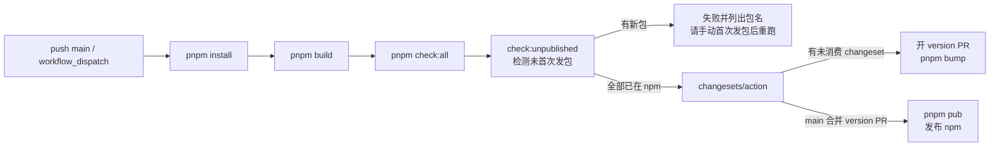

# 开发流程

改完代码到合进 main，中间有几道关卡：本地构建与测试、完整 harness 门禁、changeset、CI 发版。本页按这个顺序讲一遍日常闭环。

## 环境准备

- Node.js `^20.19.0` 或 `>=22.12.0`
- pnpm 9（仓库锁定 `packageManager: pnpm@9.0.2`）

```bash
pnpm install   # 安装全部 workspace 依赖
```

## 常用命令

```bash
pnpm dev        # 启动 examples/minimal-bot（Sandbox + Console），首次验证改动推荐它
pnpm dev:full   # 启动 examples/full-bot（L4 参考）
pnpm dev:test   # 启动 examples/test-bot（维护者厨房水槽）
pnpm build      # turbo 按 basic → packages → plugins 顺序构建全部包
pnpm test       # 全量 Vitest
pnpm type-check # tsc --noEmit（tsconfig.typecheck.json）
pnpm lint       # ESLint
```

只验证单个包时优先用 `pnpm --filter <pkg> build|test`，不要默认跑全量构建。

改 CLI 或 create-zhin-app 之前，如果报找不到 `@zhin.js/scaffold-wizard`，先构建它（产物在 `lib/`，未构建时 Node 无法解析）：

```bash
pnpm --filter @zhin.js/scaffold-wizard build   # 或 pnpm prepare:cli
```

## harness 门禁（pnpm check:all）

发布候选还必须通过 `pnpm check:created-project`：脚本打包候选依赖，在临时空目录运行
已打包的 `create-zhin-app -y --skip-install`，安装后通过真实 Sandbox WebSocket 验证
`/hello`、命令热重载、生产重启和 `doctor --live`。CI 的 Linux/Node 24 作业及发布
workflow 均执行此项；它需要 npm 网络与本机随机端口，不属于离线单测。
失败时可设置 `ZHIN_KEEP_ACCEPTANCE_TEMP=1` 保留临时项目排查，成功时自动清理。

`pnpm check:platform-candidates` 验证 QQ 官方与 Telegram 的离线契约，
覆盖范围与实机缺口见[平台稳定认证](./platform-acceptance.md)。离线通过不会自动升档。

提交前最值得跑一次的是 `pnpm check:all`：它运行 `scripts/check-all-harness.mjs` 中登记的全部检查（含 type-check、lint、单测），全部通过才算绿——CI 跑的就是同一套。CI 若另跑 coverage 作业，可设 `HARNESS_SKIP_TEST=1` 跳过其中的 `pnpm test`，避免双跑。

下面按职责分组列出（括号内是单项命令，均可单独运行）。

**质量基线**

| 检查 | 说明 |
| --- | --- |
| Type Check（`pnpm type-check`） | `tsc --noEmit` |
| Lint（`pnpm lint`） | ESLint（.ts/.tsx） |
| Unit Tests（`pnpm test`） | 全量 Vitest |
| Production Config（`pnpm check:prod`） | 生产配置无调试代码 |

**架构与依赖**

| 检查 | 说明 |
| --- | --- |
| Architecture Layers（`pnpm check:architecture`） | 分层依赖方向（basic → kernel → ai → core → agent → zhin） |
| Dependency Policy（`pnpm check:dependency-policy`） | 脚手架依赖策略、Changesets 配置与内部 peer 范围 |
| Release Plan（`pnpm check:release-plan`） | 默认只允许 patch；minor/major 必须有 owner 授权记录 |
| No Koa Import（`pnpm check:no-koa`） | 插件不得直接 import koa |
| Install Size（`pnpm check:install-size`） | zhin.js IM 核心 production `node_modules` ≤ 10MB |

**API 快照与插件规范**

| 检查 | 说明 |
| --- | --- |
| API Surface（`pnpm check:api-surface`） | public API surface 快照 |
| Plugin Runtime API（`pnpm check:plugin-runtime-api`） | 约定式插件运行时 API surface 快照 |
| Plugin Spec（`pnpm check:plugin`） | 插件符合标准规范 |
| Plugin Agent Publish（`pnpm check:plugin-agent-publish`） | 带 `agent/` 的插件发布清单（files、prepublishOnly、peer 依赖） |
| Publish Repository（`pnpm check:publish-repository`） | 可发布包 `repository.url` 匹配 github.com/zhinjs/zhin（npm provenance） |
| Agent Tool Schema（`pnpm check:agent-tool-schema`） | `agent/tools` inputSchema 与 defineAgentTool/execute 类型一致 |
| No Package-Root skills/（`pnpm check:no-package-skills`） | 插件包禁止顶层 `skills/`，须用 `agent/skills/*.md` |

**IM 链路与运行时约定**

| 检查 | 说明 |
| --- | --- |
| IM Send Path（`pnpm check:harness-paths`） | 不得绕过 Adapter.sendMessage 统一链路 |
| IM Session SSOT（`pnpm check:im-session-ssot`） | IM 场景/session 身份解析走 core SSOT |
| usePlugin Top-Level（`pnpm check:use-plugin-top-level`） | 禁止调用已移除的 `usePlugin()`（throwing stub） |
| getPlugin Runtime（`pnpm check:get-plugin-runtime`） | 禁止调用已移除的 `getPlugin()`（含运行时回调；throwing stub） |
| Workroom SSOT（`pnpm check:workroom-ssot`） | Workroom 状态只经 Journal + CAS Kernel；禁止恢复并行可变权威 |

**AI 层**

| 检查 | 说明 |
| --- | --- |
| getModel Import Disambiguation（`pnpm check:get-model-imports`） | 运行时代码用 getLlmTransportModel，不用歧义 getModel |
| Legacy AI Exports（`pnpm check:legacy-ai-exports`） | `@zhin.js/ai` 不再导出 SessionManager 等符号 |
| Provider Gateway（`pnpm check:provider-gateway`） | LLM 网关 sdk/contextWindow 预设契约 |
| A2A Mesh（`pnpm check:a2a-mesh`） | 禁止残留 MCP Agent Mesh v1 符号 |

**适配器契约**

| 检查 | 说明 |
| --- | --- |
| Rich Segment Adapters（`pnpm check:rich-segments`） | outboundRichSegmentPolicy 声明与契约测试 |
| AI Outbound Adapters（`pnpm check:ai-outbound`） | aiOutboundExtensions 声明与契约测试 |
| Interactive Segments（`pnpm check:interactive-segments`） | interactivePolicy 声明与契约测试 |
| Segment Adapters（`pnpm check:segments`） | defineAdapter segments 声明契约（sandbox 必须达标） |

**文档一致性**

| 检查 | 说明 |
| --- | --- |
| Doc Links（`pnpm check:doc-links`） | 文档相对链接不断裂 |
| Doc Orphans（`pnpm check:doc-orphans`） | 站点 Markdown 都在侧栏或 allowlist |
| ADR Manifest（`pnpm check:adr-manifest`） | ADR README 与侧栏覆盖所有 ADR |
| README Exports（`pnpm check:readme-exports`） | README import 与包导出一致 |
| Config Docs（`pnpm check:config-docs`） | 配置文档与 DEFAULT_CONFIG 关键字段对齐 |
| Generated Config Reference（`pnpm check:config-reference`） | 自动生成配置字段与 Runtime 源码、插件 JSON Schema 无漂移 |
| Source-owned Config Enums（`pnpm check:config-enums`） | 源码既定配置枚举在 Runtime/插件 Schema、生成参考和叙事文档间无漂移 |
| Troubleshooting Center（`pnpm check:troubleshooting`） | 故障目录与“症状 → 原因 → 操作 → 验证”中英文页面无漂移 |
| Install Tiers SSOT（`pnpm check:install-tiers-ssot`） | 中文 `README.zh-CN.md` Install tiers 表与 `docs/snippets/install-tiers.md` 一致 |
| Adapter Docs Sync（`pnpm check:adapter-docs`） | 平台适配器文档与 `plugins/adapters/*/README.md` 同步（修复用 `pnpm sync:adapter-docs`） |
| Platform Tiers SSOT（`pnpm check:platform-tiers-ssot`） | 能力分档/适配器索引与 `scripts/adapter-meta.mjs` 一致 |
| Deployment Templates（`pnpm check:deployment-templates`） | Compose、systemd、Kubernetes 模板与中英文下载入口一致 |

**冒烟**

| 检查 | 说明 |
| --- | --- |
| Stable Smoke（`pnpm check:stable`） | Sandbox + Agent 核心单测 + minimal-bot 契约 |
| L4-CI（`pnpm check:l4-ci`） | L4 确定性子集（编排/记忆/full-bot 契约）；全量 `pnpm check:l4` 在 nightly 跑 |

## changeset 工作流

仓库用 [changesets](https://github.com/changesets/changesets) 管理版本与 changelog（配置见 `.changeset/config.json`：`baseBranch: main`、`access: public`）。任何影响已发布包行为的改动都要记 changeset：

```bash
pnpm release   # = pnpm changeset，交互式选择受影响的包与 semver 级别，生成 .changeset/*.md
pnpm bump      # = pnpm changeset version，消费 changeset、升版本号、写 CHANGELOG
pnpm pub       # = pnpm changeset publish，发布到 npm
```

日常开发只需 `pnpm release` 提交 changeset 文件；`bump` 和 `pub` 由 CI 执行。

版本策略默认只允许 `patch`。`pnpm check:release-plan` 会读取 Changesets 的完整发布计划，
只要出现未授权的 `minor` 或 `major`（包括依赖传播推导出的升级）就会让 CI 失败。
确需非 patch 发版时，由版本 owner 在 `.changeset/version-policy.json` 的
`approvedNonPatchReleases` 中记录 changeset 文件名、包范围、级别、`approvedBy` 和原因；
该策略文件由 `.github/CODEOWNERS` 指定 owner 审核。示例：

```json
{
  "changeset": "intentional-breaking-change.md",
  "packages": ["zhin.js"],
  "type": "major",
  "approvedBy": "lc-cn",
  "reason": "Remove the deprecated compatibility API"
}
```

内部 `peerDependencies` 使用 `workspace:^`，避免兼容的内部 minor 升级被发布成精确版本，
进而把无关的上游包推成 major。私有示例包不参与 Changesets version/tag。

### 1.1 稳定线

官方 npm 生态统一使用 1.1.x 稳定线。81 个未占用该版本号的包从 1.1.0 开始；
7 个历史上已经发布过 1.1.0 的包使用各自在 1.1.x 中下一个可用 patch，因为 npm
不允许复用已发布版本号。历史更高版本保留在 npm 以免破坏已有 lockfile，并标记为
由对应包的 1.1.x 稳定版本取代。发布后每个官方包的 `latest` 与 `stable` 均指向其
1.1.x 稳定版本，后续常规发布只增加 patch。

| 1.1.0 已占用的包 | 稳定版本 |
| --- | --- |
| `@zhin.js/adapter` | `1.1.12` |
| `@zhin.js/agent` | `1.1.23` |
| `@zhin.js/ai` | `1.1.33` |
| `@zhin.js/client` | `1.1.5` |
| `@zhin.js/console-protocol` | `1.1.5` |
| `@zhin.js/core` | `1.1.35` |
| `@zhin.js/plugin-runtime` | `1.1.9` |

## 发版（GitHub CI）

发版由 `.github/workflows/publish.yml` 驱动：`push` 到 `main` 或在 Actions 里 **workflow_dispatch 手动运行**。



### 新包首次发包

npm 不再允许本流水线代发「第一次」：包名必须先由维护者用 token 手动发布一次，之后才走 changesets。

本地检测：

```bash
pnpm check:unpublished
```

若列出未发布包，构建后逐个首次发布，例如：

```bash
pnpm build
(cd path/to/pkg && npm publish --access public)
```

然后到 Actions → **Build and Publish** → **Run workflow** 重新执行（或再 push `main`）。

PR 门禁在 `.github/workflows/ci.yml`（Node 22/24 矩阵），同样跑 `pnpm check:all`。

## 调试

- **日志级别**：`zhin.config.yml` 的 `log_level` 调为 `debug`（默认 `info`），可看到框架内部细节日志。
- **Console 日志页**：运行期日志经 `DatabaseLogTransport` 写入 `SystemLog` 数据库模型，Remote Console 的 logs 页读取它。浏览器打开 [console.zhin.dev](https://console.zhin.dev)，填 API Base URL（如 `http://127.0.0.1:8086`）和 Bearer Token（`http.token` 配置）即可查看。
- **单包调试**：`pnpm --filter <pkg> test` 加 `-t '<用例名>'` 过滤用例；`pnpm test:watch` 进入 watch 模式。
