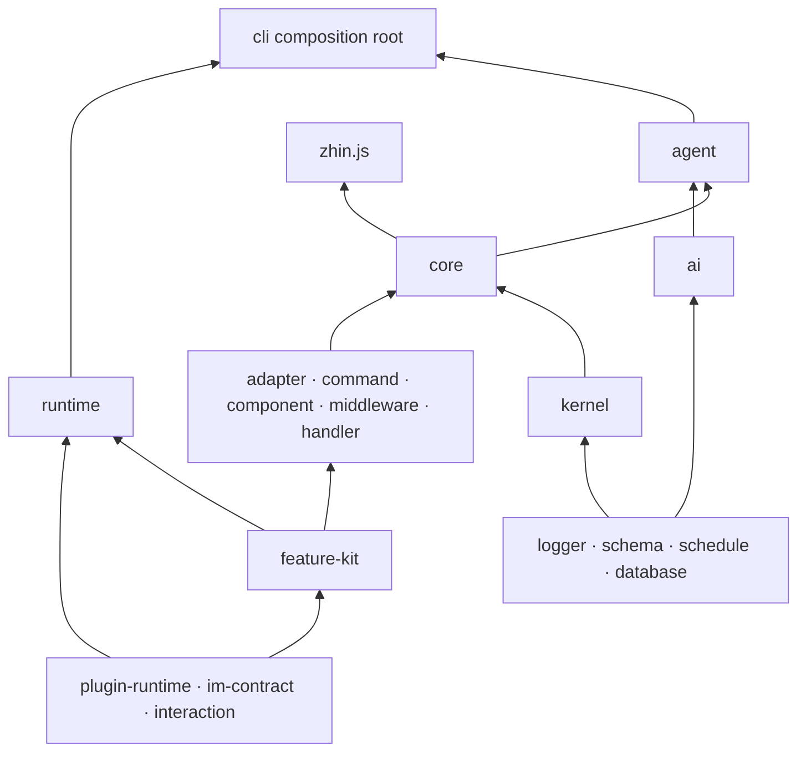

# 仓库结构

第一次 clone 这个仓库，顶层二十多个目录容易劝退；其实它们是 pnpm workspace（pnpm 9，构建编排用 turbo）按职责切出来的几块，看完本页就知道改东西该往哪钻。工作区覆盖范围以根目录 `pnpm-workspace.yaml` 为准。

## 顶层目录

| 目录 | 内容 |
| --- | --- |
| `basic/` | 基础层：`cli`、`database`、`logger`、`schedule`、`schema`（日志、数据库、配置校验、命令行） |
| `packages/im/` | IM 核心层：`adapter`、`agent`、`ai`、`command`、`component`、`config-file`、`core`、`feature-kit`、`handler`、`isolate`、`kernel`、`mcp-feature`、`middleware`、`plugin-runtime`、`runtime`、`skill`、`tool`、`zhin` 等 |
| `packages/console/` | Remote Console 支撑包（`client`、`contract`、`layout`、`page`、`pagemanager`、`plugin-contract`、`protocol`）。Host 只提供 API，UI 在独立仓库 [zhin-console](https://github.com/zhinjs/console)（console.zhin.dev） |
| `packages/host/` | Host 运行时：`http`（`@zhin.js/host-http`）、`mcp`（MCP Server）、`a2a`（A2A Server） |
| `packages/toolkit/` | `create-zhin`（`pnpm create zhin-app`）、`scaffold-wizard`（配置向导）、`satori`、`html-renderer`、`speech` |
| `packages/game-kit/` | 游戏开发套件（供 `plugins/games/` 使用） |
| `plugins/adapters/` | 平台适配器：sandbox、qq、icqq、napcat、onebot11/12、discord、telegram、slack、kook、dingtalk、lark、line、wecom、email、github、satori 等 |
| `plugins/features/` | 功能插件（如 `process-monitor`） |
| `plugins/games/` | 游戏插件（blackjack、guess-number、idiom-chain、rps、tic-tac-toe 等） |
| `plugins/services/` | 服务插件（如 `activity-feedback`） |
| `plugins/utils/` | 工具插件（rss、repeater、lottery、music、qrcode、short-url、code-runner 等） |
| `examples/` | 参考实现，按复杂度分层：`single-file-bot`（一个 `bot.ts`）→ `minimal-bot`（Stable 约定目录，仅 IM）→ `full-bot`（L4）→ `test-bot`（维护者厨房水槽，非用户模板） |
| `deploy/` | 部署样例（如 `huggingface/`） |
| `scripts/` | harness 门禁脚本与构建/发布辅助脚本（`check-*.mjs`、`run-*.mjs`、`sync-*.mjs`） |
| `tests/` | 跨包契约测试、文档/配置对齐测试、快照（`contracts/`、`docs/`、`snapshots/`） |
| `docs/` | 本站点（VitePress） |
| `config/` | 仓库自用的 `zhin.config.yml` 参考配置 |
| `data/` | 本地运行数据（数据库、媒体、记忆等，不入库） |

每个 workspace 包都有独立的 `package.json`。目录内部的惯例也统一：Node 侧源码放 `src/`、构建产物放 `lib/`；浏览器侧源码放 `client/`、产物放 `dist/`。

## 分层与依赖方向

核心包之间的依赖方向是单向的，由 `pnpm check:architecture`（`scripts/check-architecture-layers.mjs`）强制检查。完整关系以[架构概览](../concepts/architecture.md)为 SSOT，常用主干如下：

`plugin-runtime`、`im-contract` 与 `interaction` 是底层契约；Feature 包在其上描述单一能力，
`core` 负责组装 IM 链路。`kernel` 与 `ai` 不含 IM 概念。唯一跨层装配点是
`basic/cli`，`zhin runtime start` 在这里组合 IM、Agent 与 Console Host。

大型领域采用“一个 canonical 入口 + 单向内部协作”的深模块结构。当前收敛后的阅读入口是：

| 领域 | 阅读入口 | 内部职责 |
| --- | --- | --- |
| Workroom Journal | `packages/im/agent/src/workroom/journal/index.ts` | 契约、事件校验/编解码、受治理载荷、Memory/File/Database 适配器 |
| Workroom Projection | `packages/im/agent/src/workroom/projection-outbox/index.ts` | 契约、Repository CAS、投影规则、Tracer、Delivery Worker |
| Extended Console RPC | `packages/host/http/src/console-rpc-extended/index.ts` | 薄 Dispatcher、schedule/inbox/login/Endpoint/Workroom RPC 域 |

目录存在的目的不是缩短单个文件，而是让调用方只依赖稳定入口，让状态、策略和 IO
实现保持单向关系。`pnpm check:domain-module-boundaries` 禁止模块外深层导入和旧平面入口回归。

插件的约定能力也遵循同一原则：`commands/<path>/index.ts`、`adapters/<name>/index.ts`、
`agents/<name>/`、`skills/<name>/`、`tools/<name>/index.ts` 是能力所有权边界。仅供某个能力
使用的 definition、handler 或 helper 放在该能力目录内；多个能力共享且属于插件运行态的实现
才放在 `src/`，并通过稳定包入口或一个局部桥接模块使用。叶子 `index.ts` 不得用多层相对路径
回穿包根 `src/`。适配器 Command 与 Agent Skill Tool 的这项约束由
`pnpm check:agent-tool-authoring-boundaries` 强制检查。

## AGENTS.md 导读

改代码前，先读仓库根目录的 [`AGENTS.md`](https://github.com/zhinjs/zhin/blob/main/AGENTS.md)——它是给 AI 编码代理和贡献者的最小入口。里面有项目概览与版本约束（Node `^20.19.0 || >=22.12.0`、pnpm 9、changesets 发布流）、常用命令（`pnpm dev` / `pnpm build` / `pnpm test` / `pnpm check:all`，详见[开发流程](./development.md)）、必须遵守的代码约定（`.js` 扩展名导入、**新插件走 `definePlugin` / 约定目录**、Legacy `usePlugin`/`getPlugin` 残留规则、消息统一链路等，详见[代码约定](./conventions.md)），还有一份任务路由：按改动领域列出该看的包和文档（核心 → `packages/im/core`，AI 引擎 → `packages/im/ai`，编排 → `packages/im/agent`，适配器 → `plugins/adapters`……），外加最常改动的高价值文件清单（`plugin.ts`、`adapter.ts`、`dispatcher.ts` 等）。

部分子目录还有自己的 `AGENTS.md` 或 `CONTEXT.md`（如 `packages/im/plugin-runtime/CONTEXT.md` 描述 generation / Root lifecycle 的术语与约束）。在某个包里工作时，优先看离它最近的那一份。
