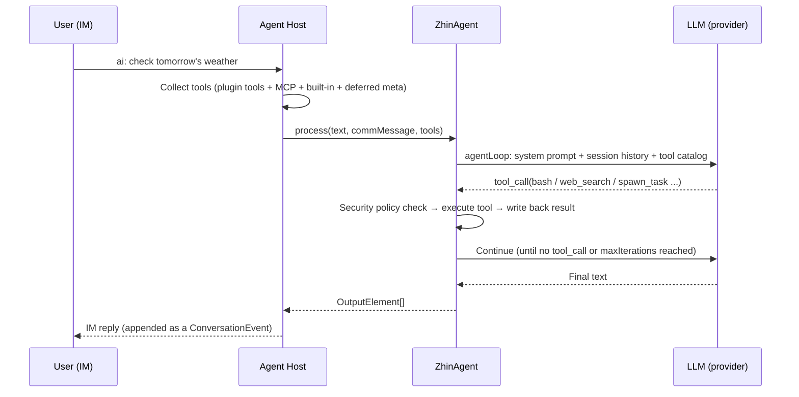

# Agent Deep Dive

Someone sends `ai: check tomorrow's weather` in a group, and a few seconds later the bot replies with a data-backed answer -- what happened in between? This page follows that path to expand on the [AI overview](./index.md) runtime: ZhinAgent's turn flow, deferred tools, sub-agents and orchestration, session persistence and compaction, Assistant profile and scheduled tasks.

## ZhinAgent turn

After a trigger match, Agent Host calls `zhinAgent.process(text, commMessage, tools)` to run a turn:



A few facts worth remembering. ZhinAgent, sub-agents, background workers, and `AIService.runAgent` all go through the **same agentLoop**, so behavior can be consistently expected. Messages in the same session queue up per `ai.agent.inboundQueue` (`groupMode: supersede | fifo`), and concurrent turns do not overwrite each other. When the preferred model fails, it falls back along a candidate chain to other available models from the same provider. `maxIterations` defaults to 15 (`DEFAULT_CONFIG.maxIterations`) and can be overridden per provider/model via the model harness (see below). Timeouts have three layers: the trigger-side single turn is bounded by `ai.trigger.timeout` (default 60000ms), the overall Agent turn defaults to 120000ms (`DEFAULT_CONFIG.timeout`), and tool pre-execution has a separate 15000ms cap (`preExecTimeout`).

The tool pool for a turn = plugin-registered tools + `ai.mcpServers` connected tools + built-in tools + deferred meta tools + `schedule_*` + `bash` + Host extension tools (e.g. `voice_stt` / `voice_tts`).

### Thinking transparency and step visualization

During turn execution, the Agent pushes real-time status to the IM side via Activity Feedback. The default behavior sends a static "Thinking..." placeholder, but you can enable **thinking transparency** to show the LLM's actual thinking content (truncated) as activity feedback:

```yaml
ai:
  agent:
    thinkingPreview: true          # Show LLM actual thinking content (truncated), default false
    thinkingPreviewMaxLength: 200  # Max chars to show, default 200
```

When enabled, users see snippets of the model's reasoning process while waiting for the AI reply, instead of a static placeholder.

When a turn requires multiple tool iterations (e.g. the model calls a tool then continues reasoning), each iteration emits an `iteration_start` event. Activity Feedback updates to show progress like `Processing [2/15]...`. Plugin developers can listen for the `iteration_start` event in the `TurnEvent` stream:

| TurnEvent type | Description |
|----------------|-------------|
| `iteration_start` | A new iteration begins, with `iteration` (current round) and `maxIterations` |
| `thinking` | LLM thinking text fragment (accumulated and pushed continuously when `thinkingPreview` is on) |

### Cancelling a running turn

Users can send any of the following messages in IM to **cancel a running Agent turn**:

- `取消`
- `/cancel`
- `cancel`

When ZhinAgent receives a cancel message, it aborts the current turn's LLM call and tool execution via `PromptController.cancelSession()`, and replies "已取消" (cancelled). If no turn is currently running, it replies "当前没有正在执行的任务" (no active task).

The cancellation terminal event appears as `turn_cancelled` (`code: 'cancelled'`) in the `TurnEvent` stream. Timeout-induced interruptions (`DEFAULT_CONFIG.timeout`) similarly appear as `turn_cancelled` (`code: 'timeout'`).

## Deferred tools (discover / load_tool / load_skill)

When the number of tools is large, stuffing all schemas into the prompt crowds the context. Zhin.js uses **lazy loading**: a turn keeps only a small set of meta-tools resident, and the model retrieves and loads by name on demand.

Resident tools (default `alwaysLoadedTools`): `ask_user`, `spawn_task`, `discover`, `load_tool`, `load_skill`.

| Meta-tool | Purpose |
|-----------|---------|
| `discover` | Search for tools/skills by query (`kind: tool|skill|all`, filterable by MCP server); returns Top-K summaries |
| `load_tool` | Load a tool schema into the current session by name; callable thereafter |
| `load_skill` | Load a skill's description text and its declared tools |

Tuning (`ai.agent.deferredTools`):

```yaml
ai:
  agent:
    deferredTools:
      maxLoadedPerSession: 12   # Max tools loaded per session (default 12)
      discoverTopK: 5           # Number of discover results (default 5)
      alwaysLoadedTools: [ask_user, spawn_task, discover, load_tool, load_skill]
      mcpServers:
        icqq: { alwaysLoaded: [send_msg] }   # Resident tools for a specific MCP server
```

Reserved/built-in tool names (`bash`, `read_file`, `spawn_task`, etc.) cannot be overridden by plugins. For non-reserved tools, later registrations override earlier ones with the same name, and conflicts are logged as warnings.

## Sub-agents and spawn_task

The main Agent uses `spawn_task` to delegate complex/time-consuming tasks to **background sub-agents** without blocking the main conversation:

```yaml
ai:
  agent:
    maxParallelSubagents: 5        # Hard cap on parallel sub-agents (default 5)
    toolExecution: tiered          # parallel | sequential | tiered (default)
    subagentAutoContinue: true     # Wake main Agent to continue after async completion (default true)
    subagentDirectImDelivery: false # Also send sub-task summary directly to IM (default false)
    subagentTools: []              # Additional tools allowlisted for sub-agents
```

Key `spawn_task` parameters:

| Parameter | Description |
|-----------|-------------|
| `task` | Task description (goal, scope, expected output) |
| `agent` | Sub-agent name (must exist in `ai.agents` or `agents/*.agent.md` presets) |
| `wait` | When `true`, waits synchronously; result returns to the current turn via tool result |
| `context` | `fork` (inject recent messages from parent session) / `fresh` (empty context) |
| `tools` / `skills` | Declare tools and skills needed for the sub-task |

Several behavioral constraints apply: multiple `spawn_task` calls can be initiated in a single turn -- independent sub-tasks should run in parallel. In `tiered` mode, read-only tools and spawns run in parallel while write/bash operations execute sequentially. Sub-agents use a restricted tool set by default (`read_file` / `write_file` / `edit_file` / `list_dir` / `glob` / `grep` / `web_search` / `web_fetch` / `bash` + deferred meta) and do not automatically inherit all tools from the main session; use `ai.agent.subagentTools` to explicitly add more. The sub-agent types visible to the main Agent are constrained by `ai.agents.<name>.permission.task` (glob -> allow/deny). After async completion, results are **returned to the main Agent first** (written to the main session and auto-continued); the user-visible reply is composed and sent by the main Agent. Additionally, sub-agent presets can be declared as files using `agents/<name>.agent.md` (YAML frontmatter + description), auto-discovered and registered at startup.

## Workroom Kernel

`WorkroomKernel` accepts only explicit Project-scoped commands and uses a versioned append-only Journal as the sole source of truth for Runs, Tasks, and Assignments. Ordinary chat and `spawn_task` never create a Workroom implicitly, and no generic model-writable transition tool can fabricate execution or acceptance facts. A command adapter must hold an authenticated Project capability and connect dedicated Scheduler, Executor, and Acceptance ports.

After a normal Workroom discussion is durably recorded in the Project Inbox, a one-shot handoff continues into the Catalog Orchestrator turn and returns the Agent response instead of stopping at an inbox receipt. That turn uses a Project-scoped session and trusted Project/Proposal envelope, excludes the ordinary room session tail and `spawn_task`, and sends through the Catalog Orchestrator Endpoint on the unified outbound path. A projection reply or named-member mention becomes exact TaskInput only when it resolves to one active Assignment; otherwise the runtime asks for clarification. Only an explicit `/work` request enters governed planning and may create a Run or Tasks.

Persistent Workroom Catalog entries may list `sponsors[]` as authenticated principal ids (for example, `owner:<platform-user-id>`). This membership—not message metadata—authorizes typed Project Sponsor controls and is pinned by the exact Catalog/Project digest carried by a Plan. A member may pin Assignment locality with `assignmentRoute: { "kind": "local" }` or an exact remote route with `assignmentRoute: { "kind": "remote", "endpointId": "..." }`. Omitted routes retain the legacy local meaning; remote execution never guesses among endpoints, and the selected route is covered by the Catalog revision/digest rechecked before claim. A member may also select its Bot/App message outlet with `messageRoute: { "adapter": "icqq", "endpoint": "reviewer-bot" }`; omission reuses the primary `conversation` Endpoint. The routed Bot accepts messages from the same shared room into this Workroom, and that member's progress, milestone, and conclusion projections leave through that Bot. `conversation` remains the ordinary Workroom space. An optional `group | channel` `sponsorConversation` carries typed Sponsor ingress, governed lifecycle/overdue alerts, and Project-scoped Portfolio lane/queue/grant/budget/fairness cards. Several Projects may declare the same address to form one portfolio-level Sponsor Room, while retaining separate Project delivery views. Governance controls may use `/control data-lifecycle project <projectId> ...`, and Portfolio controls may use `/control portfolio <portfolioId> project <projectId> ...`; the Project segment may be omitted only when replying to a current single-Project card. The room address never implies Project authority. A conflicting explicit/reply Project, stale card revision, or retired Endpoint capability produces clarification instead of a command. Ordinary Workroom addresses remain unique and cannot collide with Sponsor Rooms. The Host derives the exact current Endpoint binding at startup/scan time, so the first outbound alert does not depend on prior inbound traffic.

`/work` never falls back to a fixed single Task. The production ingress creates a Run only when the composition root installs a governed `HumanIngressPlanningPort`; otherwise it persists the request and returns a `planning_unavailable` clarification. `DynamicWorkflowPlanningPort` treats model/Strategy structured DAG output as untrusted: trusted ports inject the exact Project/Catalog, Profile, Orchestrator, planning policy, budget, and Sponsor Gate authority. `WorkflowPlanBuilder` then revalidates the Profile capability ceiling, required/optional Tasks, dependencies/cycles, Task/attempt budgets, and approval gates. Only `WorkroomKernel.admitWorkflowPlan()` may atomically write the resulting Plan and Task facts. A Plan Gate first materializes as an `approval` Blocker, and generic Orchestrator `resolve_blocker` cannot clear it. With a `WorkroomPlanGateAuthorityPort` installed, a human Sponsor can submit an exact replay-safe decision with `/control plan-gate <approve|reject|request-changes|cancel> <runId> <taskKey> <gateId> [reason]`.

The Workroom Journal backend is fixed when the process starts: `ai.sessions.useDatabase !== false` selects `workroom_events`, and an unready Database Root Host rejects the candidate generation; explicitly setting it to `false` selects the atomic file event stream at `.zhin/workroom-journal`. Hot reload cannot switch this backend. Changing the selection requires a process restart so retired-generation leases and the new generation cannot write to unrelated authorities without shared CAS. Console Run list/detail endpoints remain Project-scoped read-only projections (for example, `GET /api/agent/workroom/runs?projectId=...`) and cannot mutate a Task or Assignment. An authenticated Console has separate typed control surfaces: Profile and Project Knowledge publication/rollback use `workroom.profile.*` / `workroom.knowledge.*` RPCs, Portfolio Sponsors submit exact commands to `POST /api/agent/workroom/portfolio/commands`, and Effect Sponsors use `POST /api/agent/workroom/effects/sponsor-decisions` only for authorization bound to an exact Intent; the command accepts a closed `reasonCode` rather than persistable free-form explanation text. Data Steward, Privacy, and Compliance operators use `/api/agent/workroom/data-lifecycle`, `/overdue`, and `/commands` for content-free lifecycle projections plus Hold, subject erasure/export, retention purge, and reconciliation; these routes are published only when Root-private role authority, the current Catalog Project, and the P12 Console recipient all match. Each surface rederives the principal from the authenticated token and revalidates the current Catalog/Profile/governance revision; identity, approval, or discussion fields supplied in a request body grant no state-writing authority. The optional Remote A2A Executor uses the same Assignment lease/fence/event contract. A new claim is allowed only when persistent Profile, Authority Grant, Workspace, Disclosure, and endpoint Card/auth/transport snapshots match exactly; missing authority remains durably blocked. The old `ai.remoteAgents` poller is not retained.

For legacy data, `zhin agent legacy-runs <input>` performs a read-only audit of legacy Run exports, while `zhin agent legacy-payloads <input> --kind <kind>` performs a read-only scan for embedded legacy bodies. Both produce create-only audit/proposal output and never write a new Journal, accept an old result, delete a payload, or run an automatic migration. See [Legacy Concepts](../contributing/legacy-concepts.md).

## Session persistence and session tree

When a database is available, Agent Host persists canonical conversation and Agent-session tables (with an in-memory implementation when no database is installed):

| Table | Contents |
|-------|----------|
| `agent_sessions` | Agent session metadata (including session tree `parent_id` / `active_leaf`) |
| `agent_messages` | Agent turn messages (context store) |
| `conversation_events` | Canonical IM messages, reference relations, and notice facts (idempotent append) |
| `conversation_event_cursors` | Unread conversation-event cursor per Agent session |

Set `ai.sessions.useDatabase: false` to force in-memory mode.

Within the same IM conversation, sessions can also be branched into a session tree, managed via IM commands:

| Command | Purpose |
|---------|---------|
| `/compact` | Manually compact the current session context |
| `/tree` / `/tree N` | View / switch session branches |
| `/reset` | Reset the session |
| Send `clear` / `reset` | Archive and clear the current session's AI multi-turn context |

Other management commands (master / authorized users): `/models`, `/health`, `/cmd`, `/endpoints`, `/bindings`, `/tools`, `/mcp`.

## Compaction

Context is automatically compressed when approaching the window limit. Configure with `ai.agent.compaction`:

```yaml
ai:
  agent:
    compaction:
      enabled: true
      auto: true
      keepRecentTokens: 20000   # Token budget for keeping recent messages (default 20000)
      minKeepCount: 2           # Minimum number of messages to keep (default 2)
```

Compression triggers when estimated tokens exceed `contextWindow x 0.6`. Compression has two stages: first a micro-compact (trimming redundant tool results, etc.), then the LLM generates a `[Previous conversation summary]` to replace old history. If consecutive auto-compressions fail up to the limit, auto-compaction stops to avoid repeated consumption.

## Model harness

Override execution loop parameters per provider / model (currently consuming `maxIterations`). Merge order: TS default table -> `providerPatterns` (supports `*` wildcards) -> `models` exact keys:

```yaml
ai:
  agent:
    modelHarness:
      providerPatterns:
        "open*": { maxIterations: 7 }
      models:
        "gpt-4o": { maxIterations: 8 }
        "openai:gpt-4o": { maxIterations: 9 }
```

## Built-in tools

| Category | Tools |
|----------|-------|
| Execution | `bash`, `run_deferred_task` |
| File | `read_file`, `write_file`, `edit_file`, `list_dir`, `glob`, `grep` |
| Network | `web_search`, `web_fetch` |
| Interaction | `ask_user` |
| Task | `spawn_task`, `todo_read`, `todo_write` |
| Memory/Retrieval | `memory_search`, `memory_upsert`, `knowledge_search`, `inspect_conversation_reference` |
| Media | `generate_image`, `analyze_media` |
| Meta | `discover`, `load_tool`, `load_skill`, `install_skill` |
| Scheduling | `schedule_list`, `schedule_add`, `schedule_remove`, `schedule_pause`, `schedule_resume`, `schedule_preview` |

File tools run only inside the project workspace explicitly authorized for the current Turn. Relative paths resolve from that workspace; absolute paths must still remain inside it; `~`, directory traversal, and symlinks targeting paths outside the workspace fail closed in the shared policy facade. Only the canonical path approved by policy reaches the ToolFeature executor, and `glob` / `grep` do not spawn shell processes.

Network tools receive HTTPS authority only with `ai.agent.execPreset: network`. `web_fetch` revalidates protocol, domain, and SSRF policy for the initial URL and every redirect target. DNS results in private, link-local, CGNAT, or multicast ranges are denied, and the actual connection is pinned to the reviewed address. Other presets, including `readonly`, do not implicitly enable network access.

`todo_read` and `todo_write` operate only on the plan owned by the current canonical session; their input no longer accepts a `chat_id` or filesystem path. State is atomically stored under `.zhin/todos`, and the entire `.zhin/` directory is runtime-private state that generic file tools cannot read or enumerate.

## Assistant profile and scheduled tasks

The Assistant runtime productizes "doing things on a schedule": persistent tasks are stored in `data/schedule-jobs.json` and executed by `ScheduleJobEngine` at the designated time, with results pushed back to IM.

```yaml
assistant:
  enabled: true
  profile:
    enabled: true
    file: assistant.profile.yml   # Relative to project root, this is the default name
  events:
    enabled: true                 # Enable POST /api/assistant/events external event endpoint
  defaults:
    notifyOnFailure: false
```

`assistant.profile.yml` declares the persona and routines, which are synced to scheduled tasks at startup:

```yaml
version: 1
persona:
  soul: You are a thoughtful life assistant.
routines:
  heartbeat:
    enabled: true
    everyMs: 1800000
    prompt: Check to-dos and report.
  morningBrief:
    enabled: true
    scheduleKind: solar      # solar | lunar | workday | freeDay | holiday
    cron: "0 0 8 * * *"
    tz: Asia/Shanghai
    prompt: Generate today's morning briefing.
```

Built-in routines include `heartbeat` (interval execution), `morningBrief` (default 08:00), `bedtimeCheck` (default 22:00), and `weatherReport`; custom keys are also supported. Note that for mainland China "workday" scenarios, use `workday` (which accounts for make-up workdays) instead of solar's `1-5`.

Users can also manage tasks directly in IM by having the Agent use `schedule_add` / `schedule_list` / `schedule_preview` and other tools. External systems can inject events via `POST /api/assistant/events` and query tasks via `GET /api/assistant/jobs`.

## Related

- [AI Capabilities Overview](./index.md): Installation, providers, triggers & security
- [Voice capabilities](./speech.md): STT/TTS for voice messages
