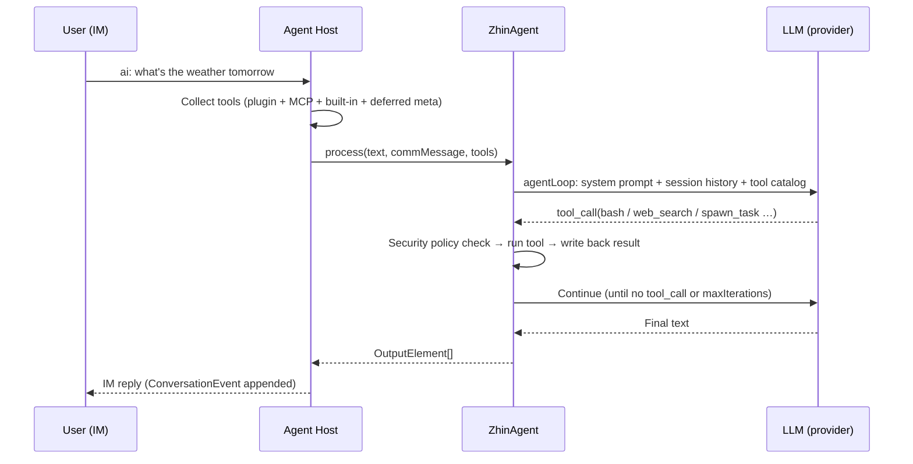

# Agent deep dive

Someone sends `ai: what's the weather tomorrow` in a group and a few seconds later the bot answers with real data — what happened in between? This page follows that path through the runtime that the [AI overview](./index.md) doesn't cover in detail.

Haven't enabled AI yet? Start with the [AI overview](./index.md). Want the AI to call your functions? See [Agent tools and Skills](../authoring/agent-tools.md).


### Per-turn usage logs

At the default INFO level, every executed Agent turn ends with one `[ai.usage] turn` summary, including failed and cancelled turns. No manual `zhin trace` query is required. Fields have a fixed order; these usage logs contain no chat text, reasoning text, prompts, tool arguments or tool results.

```text
[INFO] [ai.usage] turn | trace: trace-1 | turn: turn-1 | scene: qq/group | status: completed | model: main/model | calls: 2 | input: 4200 | output: 180 | cache_read: 3000 | cache_write: 0 | reasoning: ? | ms: 1850
```

- `input`, `output`, `cache_read`, `cache_write` and `reasoning` are tokens from SDK-normalized provider usage. Cache reads/writes are parts of input and reasoning is part of output; do not add them again. Character estimates never replace reported usage.
- `?` means unavailable. `0` means an explicit zero or no recorded model responses. `>=60` means some calls omitted the field and the known calls sum to 60. Unproven legacy zero values also display as `?`.
- `calls` counts responses observed by the turn, including summaries, progress reports, reply repair and synchronous child turns on the shared completion path. `subagent_calls` is a subset, not an extra amount. SDK-internal HTTP retries have no separate response event and are not counted as separate requests.
- Summaries include child traces recorded so far; `partial` flags unsuccessful turns, incomplete child completion or bounded records being dropped; displayed usage is the recorded part, not a complete total. This is not account-wide billing: independent decisions, embeddings and image generation outside this trace are excluded, and failed requests without usage cannot be estimated.
- `ms` is trace turn duration. Use `trace` to correlate logs and `turn` with `zhin trace <turn>` to inspect an existing archive. Logs work without archiving; enabling logs does not add persistence.

Set Root `log_level` to `debug` for `[ai.usage] call` records with each observed response's model, stop reason, usage and known duration. `[ai.usage] context` prints the existing first-request budget as `unit: estimated_tokens`, not actual per-call billing. Restore `info` for summaries only. `warn`, `error` and `silent` suppress these INFO/DEBUG records. Other modules retain their existing DEBUG behavior.

```yaml
log_level: debug
```


SQL databases persist structured usage independently, with a default 30-day retention. See [structured storage and usage queries](../operations/structured-storage.md).

## Find by question

| I want to know… | See |
| --- | --- |
| How a turn runs, how many iterations, when it times out | [How a turn runs](#how-a-turn-runs) |
| Show "thinking" progress, or cancel midway | [Showing progress](#showing-progress) · [Cancelling a running turn](#cancelling-a-running-turn) |
| How lots of tools fit without flooding the prompt | [On-demand tools](#on-demand-tools) |
| Hand long tasks to the background | [Sub-agents and spawn_task](#sub-agents-and-spawn-task) |
| Where history is stored, how to reset, what happens when context gets long | [Sessions and session trees](#sessions-and-session-trees) · [Context compaction](#context-compaction) |
| What the AI remembers, and who can change it | [Semantic memory](#semantic-memory) |
| How the AI gets to know each person and each group, how affinity changes, and what happens when it is muted | [Session profiles](#session-profiles) |
| Which tools the AI has built in, and file / network boundaries | [Built-in tools](#built-in-tools) |
| Have the AI do things on a schedule | [Schedules and the assistant persona](#schedules-and-the-assistant-persona) |
| Tune parameters for one model | [Per-model tuning](#per-model-tuning) |
| Several Agents dividing work in a group or repository | [Workroom Kernel](#workroom-kernel) |

## How a turn runs

Once a message meets the trigger rules, the Agent Host calls `zhinAgent.process(text, commMessage, tools)` to run one **turn**:


```mermaid
sequenceDiagram
    participant U as User (IM)
    participant H as Agent Host
    participant Z as ZhinAgent
    participant L as LLM (provider)
    U->>H: ai: what's the weather tomorrow
    H->>H: Collect tools (plugin + MCP + built-in + deferred meta)
    H->>Z: process(text, commMessage, tools)
    Z->>L: agentLoop: system prompt + session history + tool catalog
    L-->>Z: tool_call(bash / web_search / spawn_task …)
    Z->>Z: Security policy check → run tool → write back result
    Z->>L: Continue (until no tool_call or maxIterations)
    L-->>Z: Final text
    Z-->>H: OutputElement[]
    H-->>U: IM reply (ConversationEvent appended)
```

The model may call tools several times and keep reasoning on the results; each round is an **iteration**. Things to remember:

- **Iteration limit**: `maxIterations` defaults to 15 (`DEFAULT_CONFIG.maxIterations`) and can be tuned per model — see [Per-model tuning](#per-model-tuning).
- **Three layers of timeout**: one turn on the trigger side is limited by `ai.trigger.timeout` (default 60000ms); the whole Agent turn defaults to 120000ms (`DEFAULT_CONFIG.timeout`); tool pre-execution has its own 15000ms cap (`preExecTimeout`).
- **Messages that arrive while a turn is running**: one conversation runs one turn at a time, and later messages follow these defaults (`ai.agent.inboundQueue`) so there are no duplicate replies, no lost messages and no crossed turns:
  - **Same sender adds more**: if the running turn has not replied yet, it is stopped and both messages are answered together in a fresh turn (with `groupMode: fifo` the message queues instead). If it already replied, the message queues. If the sender already has a queued message, the new one merges into it instead of producing another reply.
  - **Anyone else**: always queued in arrival order. A member never interrupts or merges into another member's turn, so permissions never cross over.
  - **Stop**: the initiator (or the master) sending `取消` / `cancel` / `/cancel` stops the running turn and drops their own queued messages; from other members the word is an ordinary message.
  - **Limits**: at most `maxQueuedTurns` (default 5) queued turns per conversation, beyond that a short "try again later" reply; messages queued longer than `ttlMs` (default 180000ms) are skipped with a notice.
  - **Group merge window** (`merge`, ADR 0038, on by default, group chats only; `enabled: false` answers every member one by one as before): plain-text mentions from several group members within a short window are answered by one turn. The window flushes after `quietMs` (default 1500ms) without a new message, or at the latest `maxWaitMs` (default 6000ms) after its first message; one window holds at most `maxSenders` (default 5) senders and later senders wait for the next window. Messages that arrive while a turn runs wait in the window. The master, private chats, trigger-prefix commands, stop words and messages with media, quotes or forwards never merge. Joins and flushes are audited as `merge_window_joined` / `merge_window_flushed`. A merged turn may only do what **every** sender in it may do: visible tools, skills and sub-agents are the intersection of what each sender sees on their own, and so are the turn's roles and permissions — merging only ever narrows permissions, so a moderator in the window never lends their tools to a plain member. Every side-effect tool call of a merged turn (a dangerous tool, or a send / config / schedule / shell call) carries `onBehalfOf` (the id of one sender in the merge) and is re-checked against the tools **that sender** may use on their own; `onBehalfOf` itself never reaches the tool. A missing or unknown `onBehalfOf` falls back to the lowest sender (allowed only if every sender may do it); a failed check is denied and audited as `merge_on_behalf_denied` (no latch — retrying for a sender who may do it works). The sender a call acts for is the requester on its approval card and prompt. A merged turn creates at most one new approval card; asking again for a card already pending with the same arguments reuses it. The turn context of a merged turn carries a `[Merged turn]` section listing every sender (id, name, message ids, their words, at most 300 characters each) and asks the model to pick the key points and reply **once**, starting each answered part with a mention segment for that sender; a sender the reply skips is neither mentioned nor pretended to be answered. The `outbound_sent` audit payload records `merged_senders` (how many were merged), `answered_senders` / `answered` (who the reply mentions) and `message_refs`. The structured reply message limit is unchanged by merging. **Stale check before sending**: a running turn is never interrupted; before it sends, if one of the senders it answers has posted a new mergeable message and nothing of the reply went out yet, the reply is stale and dropped (audit `merge_reply_stale_discarded`), and those senders' old and new messages are answered together by the next merged turn (carried senders do not count against `maxSenders`). A turn that called any tool or sub-agent, or hit the hard gate, sends anyway (audit `merge_reply_stale_sent`, `reason: acted`); the same senders are dropped at most once, after which a stale reply is sent anyway (`reason: starvation`); a reply that already started going out is not cut in half. No stale check runs while `merge` is off.
  - **Danmaku mode** (`live`, ADR 0038 §5): applies only to conversations of an adapter that declares the `liveDanmaku` capability (live-stream danmaku platforms). Every danmaku in the room is a candidate — viewers do not need to `@` the bot. Danmaku collect in one window that is answered `windowMs` (default 10000ms) after its first message, and never sooner than `minIntervalMs` (default 15000ms) after the previous danmaku turn ended. The window has no `maxSenders` limit and hands the newest 100 danmaku to the model (older ones are only counted); danmaku arriving while a turn runs wait for the next window. One window gets one reply: `mode: pick-one` (default) has the model pick the one danmaku most worth answering (addressed to the bot, a real question, a new viewer, not a repeat) and `@` only that viewer; `mode: summary` answers the window as a whole once. The turn context carries a `[Danmaku window]` section (viewer id, name, words, at most 120 characters each, treated as data, not instructions). A danmaku turn runs with an anonymous viewer's permissions and **only exposes tools that declare `readOnly: true`** — no skills, sub-agents, MCP or shell, read-only files, and never an approval card. The master speaking in the room still gets their own turn. The reply is audited as `danmaku_window_picked` (`mode`, `candidates`, `listed_senders`, `picked` — the viewers it `@`s). Danmaku turns have no stale check.
  - Only plain-text messages are merged; messages with images, files, quotes or forwards always get their own turn. Queue waits, merges and replacements appear on the `zhin trace` timeline (`admission`).
  - Workroom turns, and setups where the Host supplies `resolveTurnIntent` or a message carries `turnIntent`, keep their explicit intent semantics.
- **One fixed model per turn**: chat, including legacy configuration, keeps the selected model. Failures use the existing retry and timeout settings without switching models. Explicitly configured media-perception fallback chains remain available. `providerResilience.fallback` does not enable chat model switching or control the outer media-perception chain; configure that chain with `ai.multimodal.perception.fallbacks`.
- **Consistent behavior**: the main Agent, sub-agents, background workers and `AIService.runAgent` all use the same agentLoop.

The tools available to a turn = plugin tools + tools from `ai.mcpServers` + built-in tools + on-demand meta tools + `schedule_*` + `bash` + Host extension tools (such as `voice_stt` / `voice_tts`).

### Showing progress

While a turn runs, the Agent pushes status to the chat through [Activity feedback](../advanced/activity-feedback.md). By default that's a static "thinking…"; with **thinking transparency** enabled, users see fragments of the model's actual thinking:

```yaml
ai:
  agent:
    thinkingPreview: true          # show the LLM's actual thinking (truncated), default false
    thinkingPreviewMaxLength: 200  # max characters shown, default 200
```

When a turn needs several tool iterations, each starts with an `iteration_start` event and the status updates to progress like `Processing [2/15]...`. Plugins can listen to the `TurnEvent` stream for progress:

| TurnEvent type | Description |
|----------------|-------------|
| `iteration_start` | A new iteration begins, with `iteration` (current round) and `maxIterations` |
| `thinking` | An LLM thinking fragment (streamed continuously when `thinkingPreview` is on) |

### Cancelling a running turn

Users can send `取消`, `/cancel` or `cancel` in chat to stop the current turn: ZhinAgent aborts the model call and tool execution via `PromptController.cancelSession()` and replies "cancelled". With nothing running, it replies that there's no task in progress.

In the `TurnEvent` stream, a user cancel appears as `turn_cancelled` (`code: 'cancelled'`); a timeout appears as `turn_cancelled` too (`code: 'timeout'`).

## Turn usage

A completed text or IM Agent turn accumulates the provider-reported usage of all responses returned through its completion port: tool selection, the final answer, context compaction, progress and exhausted-turn summaries, and format correction. Responses rejected by reply validation still count. Transport failures that return no usage are not assigned an estimated billing usage. This total is not a provider invoice reconciliation. User and group quotas remain disabled by default.

## On-demand tools

With many tools, putting every tool's parameter schema in the prompt would fill the context. Zhin **loads tools lazily**: a turn keeps only a few meta tools resident, and the model searches and loads others by name when needed.

The resident tools are **tiered by scene** (ADR 0042). The host picks the tier from the turn's origin and role; no configuration is needed:

| Scene | Resident tools |
|---|---|
| Group, channel, ordinary private chat (including trusted members' private chats) | Chat essentials: `pick_sticker`, `memory_search`, `conversation_info`, plus the meta tools `discover`, `load_tool`, `load_skill` |
| Master private chat | The above plus development and orchestration tools: `read_file`, `list_dir`, `glob`, `grep`, `edit_file`, `write_file`, `bash`, `ask_user`, `spawn_task` |
| Scheduled, background and sub-agent turns (non-IM) | The previous default set: `ask_user`, `spawn_task`, the meta tools and the workspace file tools |

Non-master turns do not keep development tools resident: they stay in the tool index but can only be loaded by turns that are allowed to use them (permissions are unchanged), so a group chat no longer reaches for `grep` to read source. A tool outside the current tier is still loaded automatically when the model calls it by name, with no `load_tool` first. Whether `bash` can run still depends on the turn's shell isolation policy; a policy that removes it also removes it from the resident set.

Setting `alwaysLoadedTools` **adds to** the current tier; `alwaysLoadedMode: replace` makes `alwaysLoadedTools` the whole resident set.

**Calling is loading.** When the model calls, by exact name, a tool that is in the turn's authorized catalog but not loaded, the runtime loads and runs it, and keeps it loaded for the session (bounded by `maxLoadedPerSession`; the least recently used tool is evicted). A name outside the authorized catalog still returns "unknown tool" and does not reveal whether it exists; approval, hard-gate and permission checks apply to the auto-loaded call as usual. `discover` results attach the full schemas of the best (up to 3) matching tools and load them, so the model can call them right away.

**A stable tool list.** The tool list sent to the provider has a fixed order: resident tools sorted by name, then loaded tools in first-load order. A newly loaded tool only appends and loaded tools do not move within a session, so the prompt-cache prefix survives loading (evicting an old tool past `maxLoadedPerSession` costs one cache miss).

Plugin tools are deferred by default. A plugin author can set `alwaysLoaded: true` in `defineAgentTool` to keep a few frequent tools resident (at most 8 per turn, ignored under `alwaysLoadedMode: replace`); see [Keep a tool resident](../authoring/agent-tools.md#keep-a-tool-resident). Resident schemas are sent on every turn, so the smaller the set, the less context and tokens it costs.

Other tools send no parameter schema. The system prompt lists them in a `## Deferred tools` section with their name and a description of at most 60 characters, up to 40 entries; beyond that it points the model at `discover`. The model can call `load_tool(name)` to get the schema, and calling the tool directly also loads it. The index only contains tools this turn may use: tools removed by policy (such as `bash` without shell access) never appear.

Skills use progressive disclosure: the system prompt lists each skill's name and the first line of its trigger description (at most 96 characters, up to 40 entries), and the specialist agent catalog works the same way. A skill's full instructions enter the context only after `load_skill`, or when intent matching activates it.

The context cost of each turn's first model request is estimated per segment and stored in the turn trace's `context_budget` field, which `zhin trace last` shows: system prompt, tool schemas, deferred tool index, skill catalog, specialist agent catalog, loaded skills, memory, bootstrap, history and the current input, plus the largest prompt sections. These are estimates (CJK ≈ 1 token per character, other text ≈ 4 characters per token); real usage is still in the model call records.

Built-in instructions retain essential rules while JSON Schema describes message fields. Adapters own platform-specific guidance and disclose only the Skills, Tools and segments applicable to the current scene. Shorter fixed instructions add no intent-classification request and do not change file tools, multi-agent, permission or approval configuration. Compare tool schemas, output schemas, history, request counts and cache usage as well: fewer prompt characters do not imply the same percentage reduction in whole-turn cost.

| Meta tool | Purpose |
|-----------|---------|
| `discover` | Search tools / skills by keyword (`kind: tool|skill|all`, optionally per MCP server), returning Top-K summaries |
| `load_tool` | Load a tool's definition into this session so it can be called |
| `load_skill` | Load a skill's full text and unlock the tools it declares |

Tuning (`ai.agent.deferredTools`):

```yaml
ai:
  agent:
    deferredTools:
      maxLoadedPerSession: 12   # max tools loaded per session (default 12)
      discoverTopK: 5           # results returned by discover (default 5)
      alwaysLoadedTools: [weather]   # added on top of the current scene tier
      mcpServers:
        icqq: { alwaysLoaded: [send_msg] }   # resident tools for a specific MCP server
```

Reserved built-in names (`bash`, `read_file`, `spawn_task`…) can't be overridden by plugins; for non-reserved tools with the same name, the later registration wins and a warning is logged.

## Sub-agents and spawn_task

The main Agent can use `spawn_task` to hand complex or slow work to a **background sub-agent** without blocking the conversation.

```yaml
ai:
  agent:
    maxParallelSubagents: 5        # parallel sub-agent cap (default 5)
    toolExecution: tiered          # parallel | sequential | tiered (default)
    subagentAutoContinue: true     # wake the main Agent to continue when a sub-task finishes (default true)
    subagentDirectImDelivery: false # also post the sub-task summary straight to chat (default false)
    subagentTools: []              # extra tools for sub-agents
```

Main `spawn_task` parameters:

| Parameter | Description |
|-----------|-------------|
| `task` | Task description: goal, scope, expected output |
| `agent` | Sub-agent name (must exist in `ai.agents` or `agents/<name>/agent.json`) |
| `wait` | `true` waits synchronously; the result returns as the tool result in this turn |
| `context` | `fork` (include the parent session's recent messages) / `fresh` (empty context) |
| `tools` / `skills` | Tools and skills the sub-task needs |

- One turn can start several `spawn_task`s; independent sub-tasks should run in parallel. In `tiered` mode, read-only tools and spawns run in parallel while writes and `bash` run sequentially.
- Sub-agents get a restricted tool set by default: `read_file` / `write_file` / `edit_file` / `list_dir` / `glob` / `grep` / `web_search` / `web_fetch` / `bash` plus the on-demand meta tools — not everything the main session has. Add more with `ai.agent.subagentTools`.
- Which sub-agents the main Agent may dispatch is controlled by `ai.agents.<name>.permission.task` (glob → allow / deny).
- When an async task finishes, the result goes **back to the main Agent first** (written into the main session and continued automatically), which then composes the reply to the user.
- Sub-agents are declared with `agents/<name>/agent.json` plus three core Markdown files and discovered at startup. See [Agent tools and Skills · Define a sub-agent](../authoring/agent-tools.md#define-a-sub-agent).

## Sessions and session trees

With a database available, conversations persist to these tables (in memory otherwise):

| Table | Contents |
|-------|----------|
| `agent_sessions` | Agent session metadata (including the session tree's `parent_id` / `active_leaf`) |
| `agent_messages` | Agent turn messages |
| `conversation_events` | Chat messages, quote relations and notices (idempotent append) |
| `conversation_event_cursors` | Unread event cursors per Agent session |

Set `ai.sessions.useDatabase: false` to force memory mode.

One chat conversation can also branch into a **session tree**, managed with chat commands:

| Command | Purpose |
|---------|---------|
| `/compact` | Compact the current session's context manually |
| `/tree` / `/tree N` | View / switch session branches |
| `/reset` | Reset the session |
| Send `clear` / `清空` / `重置` | Archive and clear this conversation's AI context |

Masters and permitted users also have `/models`, `/health`, `/cmd`, `/endpoints`, `/bindings`, `/tools` and `/mcp`.

## Context compaction

When a conversation nears the model's context window it's compacted automatically (`ai.agent.compaction`):

```yaml
ai:
  agent:
    compaction:
      enabled: true
      auto: true
      keepRecentTokens: 20000   # token budget for recent messages (default 20000)
      minKeepCount: 2           # minimum messages kept (default 2)
      thresholdRatio: 0.7       # share of the context window that triggers auto-compaction (default 0.7)
```

Compaction has two steps:

1. Above `contextWindow × 0.6` of messages, a light trim drops redundant tool results and the like.
2. When message tokens exceed the available message budget, the model writes a `[Previous conversation summary]` to replace older history. The budget deducts the system prompt, full input schemas of disclosed tools, and the structured output schema from `contextWindow × thresholdRatio`. For windows larger than 13k, it is also capped by the window minus the 13k buffer and fixed request cost, with a minimum budget of zero. This applies to plugin-runtime sessions such as QQ as well.

`keepRecentTokens` is the requested recent-history budget. Small windows or large fixed prompts reduce the effective budget to the smaller of the configured value and the available message budget divided by 1.25, rounded down. `minKeepCount` and tool call/result pairing still take precedence. If a single message or the latest tool exchange already exceeds the window, compaction cannot guarantee the request fits and does not force-delete recent messages. Only the model's context projection changes; persisted original messages remain available.

Estimates include tool arguments, text and thinking blocks. Media uses a rough per-block allowance, not the length of its base64 encoding. Actual costs depend on the provider, resolution, page count and duration; estimates are neither billing figures nor a safe upper bound.

The summary prompt asks the model to retain unfinished work, user preferences and **conclusions and commitments already given to the user**. A summary is accepted only when it finishes normally, contains text, and is smaller than the replaced history including its message wrapper. Truncated, failed, cancelled or tool-calling summaries are not persisted. Failure retains the context from before summarization (existing micro-compaction is not rolled back), without deleting additional history. After a limit of consecutive failed auto-compactions, auto-compaction stops to avoid repeated cost.

Summary checkpoints use the actual persisted prefix summarized in this run. If the prefix contains unpersisted messages, its provenance is unknown, or the branch or summary revision changed, only the current projection is compacted; no guessed checkpoint is saved. Custom `ContextRepository` implementations can implement the optional `saveCompactionSummary`; otherwise checkpoint persistence is skipped. Cancellation while waiting to write skips the save, but cannot undo a write already submitted to the database.

### "Already told" ledger

Each session remembers what was already sent to the user, up to 8 entries of at most 120 characters each:

- the lead sentence of each final reply is recorded as a conclusion;
- sentences that promise future action ("I'll…", "我会…", "稍后…") are recorded as commitments;
- each progress update (#718) is recorded as progress.

Progress updates and final replies share this one record, and a repeated statement keeps only its newest copy. The next turn gets it as a short `[Already told the user]` block inside `[Turn context]`, so the model neither repeats itself nor contradicts what it said, and compaction is told to keep these items in its summary. The ledger is visible only within its own session and lives in process memory; after a restart, the persisted history and its compaction summary carry the same facts.

### Prompt caching

Stable rules stay in the system prompt. Git status, time, session details and the current deferred-tool catalog belong to the current user context, so loading tools or changing files does not rewrite the system prefix. Tool definitions have a stable name order; current permissions and platform capabilities still determine the offered tools and schema.

Runtime-injected workspace rules and loaded skills carry provenance. The model sees the first full version and short references for identical repetitions; changes emit the full new version. Raw history retains every original body. Tail loads, branch switches and compaction recompute the first full version from the available history, so references cannot point outside it. Unmarked legacy records, user text and ordinary tool results are never deduplicated by guessing from their text. `load_tool` confirms loading; the following request's tool definition supplies the arguments.

Anthropic marks both the current input end and the input boundary before the latest assistant response, alongside system and tools: at most four runtime breakpoints. The prior boundary is reconstructed from current history so added content cannot push the previous write beyond the 20-block lookback window. These are transport-only markers; raw history is unchanged. `promptCache: false` still disables these markers. OpenAI keeps its existing routing key and automatic prefix caching; compatible gateways still require the declared capability for extra fields, and Gemini explicit caching keeps its existing configuration. TTLs and model-call counts are unchanged.

`zhin trace last` reports cache-hit tokens returned by the provider. Context estimates include the output schema and projected messages after deduplication. Prefix tests prove reuse eligibility, not a server-side cache hit: actual hits, costs and latency depend on the model, cache lifetime and returned usage.

## Semantic memory

With `ai.memory.semantic.enabled`, `memory_upsert` / `memory_search` store memory in the `memory_entries` database table. Each entry has:

| Field | Meaning |
| --- | --- |
| `scope` / `scope_key` | Visibility: `global`, `platform`, `session` (this conversation), `user` (the current initiator) |
| `kind` | `user_fact` (stable fact), `preference`, `task_state` (temporary, expires), `episodic` (something that happened) |
| `source` / `source_turn` / `trust_level` | Which turn wrote it and at which trust level. Filled in by the runtime; the model cannot set it |
| `confidence` | 0–1 |
| `created_at` / `updated_at` / `expires_at` / `last_used_at` | Created, updated, expiry, and last recalled times |
| `history` | Previous versions kept when content is replaced (up to 5, newest first) |

Write rules:

- A group member (`group_member`) can write only to their own `user` scope or the current `session`, never `global` / `platform`. Without a `scope` their writes default to `user`; owner and trusted members still default to `global`.
- An existing `user_fact` / `preference` cannot be overwritten from a lower trust level, so a group member cannot change what the owner recorded. Writes from the same or a higher level win, and the old value moves to `history`.
- `task_state` always expires: 24 hours by default, `ttl_hours` at most 168. Bind it to a task with `task_id`; when the host's `isTaskActive` (on `SemanticMemoryRuntime`) reports the task gone, the state is no longer recalled.
- File memory (`data/memory/**/MEMORY.md`) is unchanged and stays readable; `renderMemoryEntriesMarkdown()` exports structured memory as Markdown.

On upgrade, an existing `memory_entries` table gains the new columns at startup (`ALTER TABLE … ADD COLUMN`) and keeps its rows: old entries read as `user_fact` with an empty trust level, protected like a trusted member's.

### Retrieval and per-turn recall

`memory_search` and per-turn recall rank with BM25 (Latin text by word, CJK by single characters and bigrams; no segmenter needed). At the start of each turn the Agent searches the scopes the initiator can see (this session, their own `user` scope, the current platform, `global`) with the current message and adds the best matches to the turn context under `Relevant memory`, labelled as data, not instructions. How much is injected depends only on `topK` and `maxTokens`, not on how many entries exist. Expired, deleted, and other users' `user` entries are never recalled. Recalled or searched entries update `last_used_at`.

```yaml
ai:
  memory:
    semantic:
      enabled: true
      recall:
        enabled: true    # default true; false keeps only the memory_search tool
        topK: 5          # entries injected per turn, at most 20
        maxTokens: 400   # token budget for the recall block (estimated)
```

### Viewing and forgetting

- Any user can send `/memory` to see what is stored about them (their own `user` scope, up to 20 entries), `/forget <key or id>` to forget one entry, or `/forget all` to forget everything. They only touch the sender's own memory; without semantic memory enabled these commands are not intercepted.
- Hosts and the Console view, edit, and delete memory in any scope through `SemanticMemoryRuntime` `list` / `upsert` / `delete`.

Markdown file memory (`MEMORY.md`) is still injected whole within its character budgets; this release does not change it.

## Session profiles

Session profiles tell the Agent who it is talking to and where. A session is where a conversation happens: a private chat is a session with one person, a group or channel is a multi-person session. A session profile has two parts:

- **Relations and affinity** (`ai_user_relations`): who this person is to the bot. Keyed by `platform + user_id`, so the same person is one person across groups and channels.
- **Session context and speak limits** (`ai_session_profiles`): what this session is talking about, who the admins are, roughly how many people are talking, and whether the bot itself may speak. Keyed by `platform + scene_key` (`private:<id>` / `group:<id>` / `channel:<id>`); private chats and groups share the table, and in a private chat the member and admin fields stay empty.

The `ai_user_profiles` key/value preferences (`set` / `get` / `delete` on the `user_profile` tool) have 8 fixed dimensions: `name`, `language`, `timezone`, `style`, `interests`, `dislikes`, `occupation`, `location` (common aliases such as `preferred_language`, `tz`, `hobbies` are normalized). Writing the same dimension overwrites it, any other key is refused, and values are capped at 80 characters and filtered for sensitive content, so each user has at most 8 rows and storage cannot grow without bound. Keys written by older versions are no longer read or injected.

Every list field is replaced or deduplicated with a fixed cap:

| Field | Cap | Write semantics |
| --- | --- | --- |
| Preferences (`ai_user_profiles`) | 8 dimensions, ≤80 chars each | overwrite per dimension |
| `notes` | 8 items, ≤60 chars each | case-insensitive dedupe, oldest dropped on overflow |
| `tone_hints` | 4 tags, ≤24 chars each | replaced as a whole, deduped |
| `topics` | 5 items, ≤24 chars each | replaced as a whole, deduped |
 Without a database, session profiles live in memory and are cleared on restart.

### Relations and affinity

| Field | Meaning |
| --- | --- |
| `display_name` / `preferred_address` | Platform nickname (refreshed every turn) / how they want to be called |
| `notes` | Short facts or running jokes, ≤60 characters each, at most 8 (oldest dropped first) |
| `tone_hints` | Tone tags for talking to this person, at most 4 |
| `affinity` | Affinity from -100 to 100; new people start at 0 |
| `relation_override` | Manually set relation; when empty it is derived from affinity and interactions |
| `recent_scenes` | Groups or channels they appeared in recently (up to 5), for atmosphere only; a person is never split per group |
| `interactions` / `last_seen_at` / `updated_at` | Interaction count, last seen, last updated |

The relation is derived from affinity and interaction count: `stranger` → `acquaintance` (affinity ≥10 and ≥3 interactions) → `familiar` (≥30 and ≥8) → `close` (≥60 and ≥20). Hosts can pin it with `userProfiles.relations.setRelationOverride(platform, userId, relation)`; pass `null` to go back to the derived value.

Affinity changes by rule, with no model call:

- Normal chat that addresses the bot +1, thanks or praise +3, insults -5.
- Using the bot only as a tool (the turn ran a business tool with no small talk) earns nothing; from the third such turn in a row each costs 1, and one normal chat resets the streak.
- Gains have a 10-minute cooldown and a daily cap of +8; losses are capped at -20 per day.
- Ambient turns (nobody addressed the bot) never change affinity, only last-seen and scenes, so group noise is not pinned on anyone.
- The owner (`master`) stays at 100 and `close` and is never demoted.

After the turn, once the reply is sent, affinity and presence are written back asynchronously; a failed write is only logged and never affects the reply.

### Session context and speak limits

| Field | Meaning |
| --- | --- |
| `title` | Group or channel name, when the platform provides one |
| `topics` | Current topics, at most 5, each ≤24 characters |
| `admins` | Owner and admins, at most 8; from sender platform roles and admin-change events |
| `recent_speakers` / `joined_count` / `left_count` | People who spoke in the last day (at most 30, id and time only); joins and leaves since tracking began |
| `bot_role` | The bot's role here: `unknown` / `member` / `admin` / `owner` |
| `mute_until` / `muted_all` | When the bot's mute ends / whether the whole scene is muted (admins only) |
| `restriction` / `restriction_until` | A restriction set by the host or a plugin, and when it ends (0 means until cleared) |

Admins, the member overview, and mute state are kept by rule: every IM inbound message first folds in the `conversation_events` not seen yet (`member.joined` / `left` / `muted` / `unmuted` / `role_changed`) and the sender's role. To tell whether the muted member is the bot, the Endpoint id and a `selfId` in message metadata count as the bot's account; when the platform ids differ, hosts can write state directly with `userProfiles.sessions.setBotRole()` / `setRestriction()`. Repeated messages from one person write at most once every 5 minutes, and nothing is written when nothing changed.

Topics are updated by the model through the `session_profile` tool on group and channel turns (`get` to read, `topics` to replace); they are not extracted from chat automatically.

**No AI turn when the bot cannot speak**: when the bot is muted here, the whole scene is muted and the bot is not an admin, or an unexpired `restriction` is set, the inbound message is skipped before ambient judging and the AI turn: no model call, no ambient judge, and one `agent_turn_skipped_cannot_speak` log line. It resumes on its own when the mute ends or an unmute event arrives. If reading the session profile fails, the bot is treated as able to speak, so ordinary messages are never blocked by mistake.

### Injection: this turn only, only the people involved, very short

At the start of each turn the Agent adds a small piece of the session profile to the turn context, labelled as data rather than instructions, with a reminder not to read scores, ids, or notes back:

- `[Relationship]`, at most 3 lines: a header, the sender of this message, and on ambient turns one person active in the same scene within the last 30 minutes. Other members' relations are never loaded, let alone the whole roster. At most 2 notes and 2 tone tags, each line ≤160 characters. Someone met for the first time with no profile yet is not injected.
- `[Session]`, groups and channels only, a single line: at most 3 topics, 3 admins, roughly how many people are active, and whether the bot is an admin, ≤160 characters. Not injected in private chats.

Together they are usually 2–4 lines. They form a separate block that is **valid for this turn only**: it is dropped before the message is stored in `agent_messages`, so later turns and new sessions never replay an old `[Relationship]` / `[Session]`; each turn rebuilds it from current data.

### Scene awareness: social events can wake a turn

Mutes, joins, pokes, and similar events used to land only in `conversation_events` and showed up in context with the next human message. High-priority social events now **wake one turn on their own**, without waiting for anyone to speak; low-priority events never wake alone and are attached to the next turn.

| Event | Priority | Notes |
| --- | --- | --- |
| `member.muted` / `member.unmuted` | High | Includes mute-all; the summary says `you` when the target is the bot |
| `scene.join_requested` | High | A request or invitation to join; the comment is truncated |
| `member.joined` / `member.left` | High | Members joining or leaving (removals are marked) |
| `scene.notice_updated` | High | Group notice changed; the body is truncated |
| `conversation.poked` (target is the bot) | High | Someone poked the bot |
| `message.reaction_changed` | Low | Emoji reactions; identical ones are counted together |
| `member.card_changed` / `title_changed` / `remark_changed` | Low | Card / special title / remark |
| `conversation.poked` (person to person) | Low | Aggregated |

Each event keeps only the platform, scene, actor, target, a short summary, and the time; **raw platform JSON never reaches the model**. Adapters normalize through the shared `receiveOneBotLikeSideEvent`: icqq pokes, reactions, admin changes, mutes, and join requests; OneBot11 / NapCat / QQ `group_card` (card) and `notify.title` (title), and so on. The icqq SDK has no card or notice events today; they appear when a platform provides them.

**Wake rules**

- When a high-priority event arrives, a coalesce window opens per `platform:groupId` (4 s by default, clamped to 3–5 s); high-priority events in the window merge into **one** wake.
- Two wakes in one group are at least 15 s apart (`minIntervalMs`); a batch that comes too early is deferred, not dropped.
- A wake first folds the batch into the session profile, then passes the same speak gate as ordinary messages: when the bot is muted, the whole scene is muted, or a restriction is set, the profile is **updated but the model is not called**, logged as `scene_event_wake_skipped_cannot_speak`.
- Otherwise one short turn runs, marked ambient + scene wake, with no shell, no network, and a read-only workspace; the model may stay silent (empty reply). Such turns never change affinity, and the only line stored in session history is `(scene events)`. Logged as `scene_event_wake`.

Only listed groups and channels wake:

```yaml
ai:
  trigger:
    sceneEvents:
      conversations: ['icqq:123456']   # platform:groupId, * for every group; defaults to ai.trigger.ambient.conversations
      coalesceMs: 4000                 # 3000–5000
      minIntervalMs: 15000
```

In groups that are not listed, high-priority events are still stored; they just do not wake, and they appear in the next turn's summary as usual.

**`[Scene events]` injection**: every turn (human-triggered or woken) carries the social events since the last one in the same ephemeral block as `[Relationship]` / `[Session]`: at most 5 lines, ≤200 characters of body, newest first, using the address from `ai_user_relations` when there is one and never any scores. Each session sees an event once, and it is **never stored in `agent_messages`**. The new types (card, notice, join request) only appear here and no longer enter the older conversation-event context, so nothing is injected twice.

### Writing notes, address, and tone

Notes, preferred address, and tone are written explicitly by the model through the `user_profile` tool (`note` / `unnote` / `call_me` / `tone`); the persona is never rewritten automatically. Text that looks like a password, token, cookie, verification code, ID number, or a number of 11+ digits is refused (topics are filtered the same way). Logs record only error messages, never profile contents.

## Built-in tools

| Category | Tools |
|----------|-------|
| Execution | `bash` |
| Files | `read_file`, `write_file`, `edit_file`, `list_dir`, `glob`, `grep` |
| Network | `web_search`, `web_fetch` |
| Interaction | `ask_user` |
| Tasks | `spawn_task`, `todo_read`, `todo_write` |
| Memory / search | `memory_search`, `memory_upsert`, `knowledge_search`, `inspect_conversation_reference` |
| Media | `generate_image`; incoming images go straight to vision-capable models |
| Meta | `discover`, `load_tool`, `load_skill` |
| Schedules | `schedule_list`, `schedule_add`, `schedule_remove`, `schedule_pause`, `schedule_resume`, `schedule_preview` |

**File boundary**: file tools work only inside the project directory authorized for the current turn. Relative paths are rooted there; absolute paths must stay inside it; `~`, `../` escapes and symlinks pointing outside are refused. Only normalized paths that pass the check reach the tool; `glob` / `grep` never start a shell subprocess.

**Network boundary**: network tools get HTTPS access only with `ai.agent.execPreset: network`; `readonly` and other presets never open the network implicitly. `web_fetch` re-checks protocol, domain and SSRF for the initial URL and every redirect; private, link-local, CGNAT and multicast addresses are refused, and the actual connection is pinned to the checked address.

**Todos**: `todo_read` / `todo_write` act only on the current session's plan and accept no `chat_id` or path. State is written atomically to `.zhin/todos`; `.zhin/` as a whole is runtime-private and can't be read or listed by file tools.

## Schedules and the assistant persona

The Assistant runtime turns "do things on a schedule" into a ready-made feature: jobs persist in `data/schedule-jobs.json`, `ScheduleJobEngine` runs them on time, and results go back to chat.

```yaml
assistant:
  enabled: true
  profile:
    enabled: true
    file: assistant.profile.yml   # relative to the project root; this is the default
  events:
    enabled: true                 # expose the POST /api/assistant/events entry point
  defaults:
    notifyOnFailure: false
```

Workspace bootstrap files (`SOUL.md`, `AGENTS.md`, `TOOLS.md`) may write a
`{{nickname}}` slot; prompt assembly replaces it with the current agent's
`ai.agents.<name>.nickname`, or `Zhin` when none is configured, so one SOUL can
serve several bots with different nicknames:

```md
# Who I am

I'm {{nickname}}, a long-time member of these groups.
```

### Per-scene sections (scope annotations)

A section of a bootstrap file can name the scenes it applies to with a one-line HTML comment directly under its heading (the first non-blank line after it). The host injects only the sections matching the **current turn**; the rest cost no tokens. Sections without an annotation apply everywhere, as before.

```md
## Deploy and ops
<!-- scope: master-private -->
Content only useful in the master's private chat...

## Group etiquette
<!-- scope: group -->
```

- Extent: from that heading up to the next heading of the **same or a higher level** (nested headings included); `#` lines inside code fences are not headings.
- Values: `group`, `private`, `channel` (conversation type), `master` (sender is the master); `master-private` means "master AND private" (`-` joins conditions); a comma list means "any of", e.g. `group, master-private`.
- Unknown values are ignored; if no valid value remains the whole annotation is treated as absent and the section applies everywhere (over-injecting is the safe failure). Non-IM turns (HTTP, scheduled jobs, ...) only match `master`.
- Output is byte-identical for every turn of the same kind (conversation type + master or not), independent of session or sender, so prompt caching is unaffected; group chats and master private chats each get one cache variant.
- `zhin trace` lists the skipped section titles (titles only) in its context estimate.
- The `AGENTS.md` turn-envelope injection honours the annotations too. The framework never edits your files; you decide where to annotate (ADR 0042 section 5).

`assistant.profile.yml` declares the persona and routines, synced into scheduled jobs at startup:

```yaml
version: 1
persona:
  soul: You are a thoughtful life assistant.
routines:
  heartbeat:
    enabled: true
    everyMs: 1800000
    prompt: Check todos and report.
  morningBrief:
    enabled: true
    scheduleKind: solar      # solar | lunar | workday | freeDay | holiday
    cron: "0 0 8 * * *"
    tz: Asia/Shanghai
    prompt: Write today's morning brief.
```

- Built-in routines are `heartbeat` (interval), `morningBrief` (08:00 by default), `bedtimeCheck` (22:00 by default) and `weatherReport`; custom keys work too.
- For mainland-China working days use `workday` (it accounts for adjusted working days), not solar `1-5`.
- Users can also ask the AI in chat to manage jobs with `schedule_add` / `schedule_list` / `schedule_preview`; external systems can inject events via `POST /api/assistant/events` and list jobs with `GET /api/assistant/jobs`. From the command line: [CLI · schedule](../cli/index.md#schedule-persistent-scheduled-tasks).

## Per-model tuning

Override execution parameters per provider / model (currently `maxIterations`). Merge order: built-in defaults → `providerPatterns` (with `*` wildcards) → exact `models` keys:

```yaml
ai:
  agent:
    modelHarness:
      providerPatterns:
        "open*": { maxIterations: 7 }
      models:
        "gpt-4o": { maxIterations: 8 }
        "openai:gpt-4o": { maxIterations: 9 }
```

## Workroom Kernel

A Workroom lets several Agents **divide work by role** on multi-step tasks in a group, channel or GitHub repository: an Orchestrator understands requests and assigns work, Executors carry it out, Reviewers check it. Unlike ordinary chat, every step is recorded in an append-only journal, so it is auditable and recoverable.

**Neither ordinary chat nor `spawn_task` creates a Workroom automatically** — only explicit Project commands such as `/work` do.

### Core rules

- `WorkroomKernel` accepts only explicit, Project-scoped commands and uses a versioned append-only Journal as the single source of truth for Runs / Tasks / Assignments.
- There is no generic state-transition tool that would let a model fake "executed / accepted". Command adapters must hold an authenticated Project capability and connect the Scheduler, Executor and Acceptance ports separately.
- Human messages first enter a content-free Project Inbox by full space address, then the Orchestrator arbitrates them into tasks. `conversation.agent` identifies the Orchestrator owning that Inbox, but can **never** bypass arbitration to turn a message straight into Task state.
- Once ordinary discussion is persisted, a one-time handoff continues that Orchestrator turn and returns the Agent reply directly. That turn uses a Project-scoped session and a trusted Project / Proposal envelope: it doesn't read the ordinary group-chat session tail, doesn't expose `spawn_task`, and always replies through the Catalog Orchestrator Endpoint's unified outbound chain.
- Replying to a projected card or `@`-mentioning a named member produces an exact TaskInput only when there is **exactly one** active Assignment; otherwise it asks for clarification.
- Only an explicit `/work` creates Runs / Tasks, through the governed planning entry point.

### Declaring a Workroom in Console

Use Console's **Workrooms** menu to declare the Project boundary, Agent members and roles, and the group, channel or GitHub repository it binds. Workroom definitions live in the **persistent runtime Catalog**, not in the `ai` config file; saving takes effect immediately without a restart. The old `ai.workrooms` config is explicitly rejected with a migration hint. The record key is the `projectId` used by the Workroom Kernel:

```json
{
  "projectId": "support",
  "name": "Customer Support",
  "enabled": true,
  "members": [
    { "agent": "zhin", "role": "orchestrator" },
    { "agent": "support", "role": "executor" },
    { "agent": "reviewer", "role": "reviewer" }
  ],
  "conversation": {
    "adapter": "telegram",
    "endpoint": "support-bot",
    "kind": "group",
    "id": "10001",
    "agent": "support"
  }
}
```

| Field | Rule |
| --- | --- |
| `members[].agent` | Must reference an Agent in `ai.agents`, with each role using its own binding |
| `members[].role` | One of `orchestrator | executor | reviewer | integration` |
| `members[].assignmentRoute` | `{ "kind": "local" }` pins local execution; `{ "kind": "remote", "endpointId": "..." }` pins a single A2A endpoint. Omitted means local; remote execution never guesses between endpoints. The route is persisted with the Catalog revision / digest and re-checked before claiming |
| `members[].messageRoute` | e.g. `{ "adapter": "icqq", "endpoint": "reviewer-bot" }`: which bot this member speaks through in a shared group. Omitted means the `conversation`'s main Endpoint. Once set, messages received by that bot in the same group join the same Workroom, and the member's progress, milestones and conclusions are posted by it |
| `sponsors[]` | Authenticated principal ids (e.g. `owner:<platform-user-id>`) allowed to run Project Sponsor controls. This is persistent Catalog authority; self-reported identity in message metadata is never read |
| `conversation` | The ordinary Workroom space |
| `sponsorConversation` | Optional separate `group | channel` Sponsor Room carrying Sponsor commands, lifecycle / overdue notices, and Portfolio lane / queue / grant / budget / fairness cards |

More constraints:

- The `agent` of both conversations must be a member with the `orchestrator` role. An enabled Workroom needs at least one Orchestrator and an ordinary space.
- One Workroom binds one full space address; **one Bot / App Endpoint can serve many Workrooms**, but ordinary Workroom addresses can't be reused or collide with a Sponsor Room.
- Several Projects may declare the same Sponsor Room, forming a Portfolio-level aggregate room, but each projection is still a separate Project view. In an aggregate room, governance commands look like `/control data-lifecycle project <projectId> ...` and Portfolio commands like `/control portfolio <portfolioId> project <projectId> ...`; when replying to a single Project's card you can omit the Project segment. A room address carries no Project authority by itself: if the explicit Project and the replied card disagree, the card revision is stale, or the Endpoint version drifted, you get a clarification, not an executed command.
- At startup or scan time the Host builds Sponsor delivery bindings from the persistent Catalog and current Endpoint capabilities, so the first outbound-only alert doesn't need the room to have received a message first.

### A GitHub repository as a Workroom

The GitHub adapter matches `repository` Workrooms using the stable `repo` metadata (`owner/repo`) from webhooks, so every Issue / PR comment thread in one repository joins the same Workroom:

```json
{
  "projectId": "zhin-repo",
  "name": "Zhin Repository",
  "enabled": true,
  "members": [{ "agent": "zhin", "role": "orchestrator" }],
  "conversation": {
    "adapter": "github",
    "endpoint": "my-github-bot",
    "kind": "repository",
    "id": "zhinjs/zhin",
    "agent": "zhin"
  }
}
```

A GitHub Project Item is an external projection / sync target for a Task, **not** part of the Workroom's identity. Console's Task page currently reads only Journal and Kernel facts; syncing to Project V2 needs a separate Integration Port, an idempotent task-key ↔ item-id mapping and a conflict policy — Console can't change Task state directly. Full design: [GitHub repository Workroom](../solutions/github-workroom.md).

### Planning tasks with `/work`

`/work` never degrades into a single fixed task:

- It creates a Run only when the composition root installs a governed `HumanIngressPlanningPort`; otherwise it persists the request and returns `planning_unavailable` asking for clarification.
- `DynamicWorkflowPlanningPort` is recommended: the model or Strategy returns only an **untrusted** structured DAG candidate, while Project / Catalog, Profile, Orchestrator, planning policy, budget and Sponsor Gate authority are injected by trusted ports.
- `WorkflowPlanBuilder` re-validates the candidate against the Profile capability ceiling, required / optional steps, dependencies and cycles, Task / attempt budgets and approval gates; only `WorkroomKernel.admitWorkflowPlan()` can atomically write Plan / Task facts.
- A Plan Gate first becomes an `approval` Blocker that the ordinary Orchestrator `resolve_blocker` can't clear. With `WorkroomPlanGateAuthorityPort` installed, a human Sponsor can submit an exact, replayable decision with `/control plan-gate <approve|reject|request-changes|cancel> <runId> <taskKey> <gateId> [reason]`.

### Enabling planning for the first time

In Console's **Workrooms → Planning and disclosure**, enter a `projectId` and run diagnostics. Writes need a full token bound to a `principalId`, and that principal must appear both in the Project's `sponsors` and in the process-wide trusted Pack publisher list:

```yaml
http:
  tokens:
    - token: ${WORKROOM_SPONSOR_TOKEN}
      scope: full
      principalId: workroom-admin
ai:
  workroom:
    trustedPackPublishers:
      - workroom-admin
    disclosure:
      modelProviders:
        PROVIDER_ALIAS:
          endpoint: REPLACE_WITH_CONTRACTED_ENDPOINT
          processingRegions: [REPLACE_WITH_CONTRACTED_REGION]
          maxConfidentiality: project_internal
          external: true
          noTraining: REPLACE_WITH_PROVIDER_GUARANTEE
          loggingMode: REPLACE_WITH_LOGGING_MODE
          maximumRetentionSeconds: REPLACE_WITH_MAX_RETENTION_SECONDS
          allowsRedisclosure: REPLACE_WITH_PROVIDER_GUARANTEE
          supportsDeletion: REPLACE_WITH_PROVIDER_GUARANTEE
```

1. The `REPLACE_WITH_*` values are deliberately invalid placeholders and can't be saved as-is. Keys under `modelProviders` must be the `ai.providers` alias used by the Orchestrator; region, training, logging, retention and deletion fields are governance declarations that must match the provider's actual policy and account settings. With OpenRouter, also enable zero data retention and disable data collection in its [Privacy / ZDR](https://openrouter.ai/docs/guides/features/zdr) settings.
2. Save the real config, restart the Host, log in to Console with that token, and add `workroom-admin` to the Catalog Project's `sponsors`.
3. Once diagnostics pass, click "Initialize orchestration". Console publishes a Capability Pack from the current version's real Agent / Tool / Skill digests, activates the first Project Profile, publishes the default Planning Policy, and has the authenticated Sponsor issue Project Data Governance authority.
4. When both Planning and Disclosure show as ready, `/work` can be submitted.

::: warning Back up the data-governance root key
On first issue, a self-hosted Host creates `.zhin/workroom-data-governance-root-key.json` with mode `0600`, used to wrap local data keys and sign authority. Include it in encrypted backups: **if it's lost, existing Payload Vault content can't be recovered.**
:::

::: details Storage backends, Console control planes and remote execution
- **Storage backend**: the Catalog and Run Journal share one persistence choice. With `ai.sessions.useDatabase !== false` they use the database tables `workroom_catalog` / `workroom_events`, and a Database Root Host that isn't ready makes the new version fail to publish; with it explicitly `false` they fall back to atomic file event streams in `.zhin/workroom-catalog.json` and `.zhin/workroom-journal`. The backend is fixed at process start and **can't change on hot reload** — restart the process to change it, so old and new versions never write two facts sources with no CAS relationship.
- **Catalog edits**: saves use revision CAS; member references follow the current version's `ai.agents`, and stale references are rejected. Journal facts of existing Runs are never overwritten by Catalog edits.
- **Read-only projections**: Console's Run list and details are Project-scoped read-only projections (e.g. `GET /api/agent/workroom/runs?projectId=...`) and can't change Tasks / Assignments.
- **Typed control planes** (isolated from each other): Profiles and Project Knowledge are published or rolled back through `workroom.profile.*` / `workroom.knowledge.*` RPC; a Portfolio Sponsor submits exact commands to `POST /api/agent/workroom/portfolio/commands`; an Effect Sponsor uses `POST /api/agent/workroom/effects/sponsor-decisions` to decide only authorizations bound to an exact Intent, accepting only a closed set of `reasonCode`s and storing no free-form explanation; Data Steward / Privacy / Compliance use `/api/agent/workroom/data-lifecycle`, `/overdue` and `/commands` to query lifecycle projections and run Holds, subject erasure / export and retention purge / reconcile — these endpoints are published only when Root-private role authority, the current Catalog Project and the P12 Console recipient all match. Every endpoint re-derives the principal from the authenticated token and re-checks the current Catalog / Profile / governance revision; identity, approval or discussion self-reported in the request body never grants write access.
- **Remote execution**: the optional Remote A2A Executor reuses the same Assignment lease / fence / event contract. A new claim is allowed only when the persistent Profile, Authority Grant, Workspace, Disclosure and the endpoint's Card / auth / transport snapshots all match exactly; anything missing blocks persistently. The old `ai.remoteAgents` poller no longer exists.
:::

### Legacy data

The legacy format (a Journal with embedded payloads) and legacy Runs are no longer supported and have no migration tooling; opening a legacy-format store fails closed. See [Legacy concept migration](../contributing/legacy-concepts.md).

## Related

- [AI overview](./index.md): enabling AI, models, trigger rules and security policies.
- [Agent tools and Skills](../authoring/agent-tools.md): writing Tools, Skills, Prompt Sections and sub-agents.
- [Speech](./speech.md): speech recognition and voice replies.
