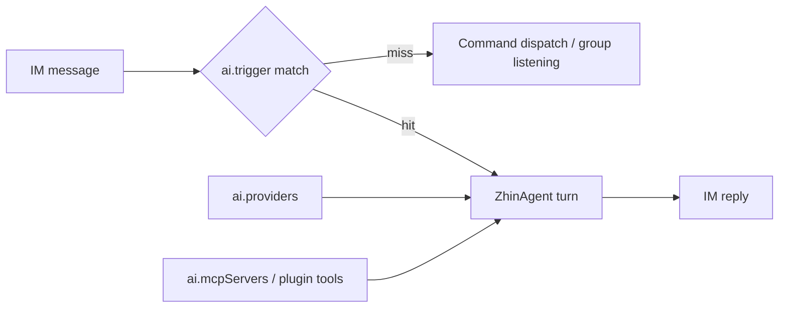

# AI Capabilities Overview

A default installation of zhin.js only sends and receives messages -- it does not "converse." To make it understand `#check tomorrow's weather`, you need to add the AI layer: install a few packages, write an `ai:` section in your config, and the CLI will automatically assemble the Agent Host at startup, routing messages that don't match any command to **ZhinAgent** for processing.



## Installation

```bash
pnpm add @zhin.js/agent zod ai
pnpm add @ai-sdk/openai   # Install the provider SDK for the vendor you use
```

The provider SDK is an optional peer dependency -- install whichever `sdk` package you use; if missing, the runtime will report `Missing peer dependency` with the install command. On the code side, import `ZhinAgent`, `AIService`, etc. from `zhin.js/agent` (or `@zhin.js/agent`).

## Configuration skeleton

All configuration lives in the top-level `ai:` section of `zhin.config.yml`; `${VAR}` expands from environment variables:

```yaml
ai:
  providers:        # Vendor connections (required)
    openrouter:
      sdk: openai-compatible
      baseUrl: ${OPENROUTER_BASE_URL}
      apiKey: ${OPENROUTER_API_KEY}
  agents:           # Agent bindings (at least zhin is required)
    zhin:
      provider: openrouter
      model: openrouter/free
  mcpServers: []    # MCP client connections (optional)
  agent: {}         # Execution security & behavior tuning (optional)
  trigger: {}       # Trigger rules (optional)
  access: {}        # Access gating (optional)
```

At startup, the `ai:` section undergoes **soft-prune**: providers whose credentials expand to empty are removed (logged at debug level only); agents bound to removed providers are skipped along with them. If the `zhin` binding is missing, the Agent Host is not assembled, but IM startup is unaffected.

## ai.providers

Each provider is named by alias; `sdk` determines which AI SDK adapter to use (closed set, ADR 0018):

| sdk | Peer dependency | Key config |
|-----|-----------------|------------|
| `openai` | `@ai-sdk/openai` | `apiKey`, optional `baseUrl` |
| `openai-compatible` | `@ai-sdk/openai-compatible` | `baseUrl` + `apiKey` (`baseUrl` auto-appends `/v1`); Cloudflare Workers AI can use `accountId` instead of `baseUrl` |
| `anthropic` | `@ai-sdk/anthropic` | `apiKey`, optional `baseUrl` (auto-appends `/v1`) |
| `deepseek` | `@ai-sdk/deepseek` | `apiKey`, optional `baseUrl` |
| `google` | `@ai-sdk/google` | `apiKey`, optional `baseUrl` (auto-appends `/v1beta`) |
| `ollama` | `@ai-sdk/openai-compatible` (uses OpenAI-compatible interface internally) | `host` (default `http://127.0.0.1:11434`, auto-appends `/v1`), no `apiKey` needed |

Common fields: `models` (explicit model allowlist), `contextWindow`, `imageGeneration` (text-to-image defaults).

When `models` is not specified, `ModelRegistry` calls `/v1/models` in the background after startup to auto-populate the available model list (restoring the previous cache first, then refreshing asynchronously). When `models` is specified, the YAML allowlist takes precedence. `agents.<name>.model` only needs to appear in the discovered list or allowlist -- no need to list each one manually.

## ai.agents

Bind an agent name to a `provider + model`:

```yaml
ai:
  agents:
    zhin:                       # Main Agent, must exist
      provider: openrouter
      model: openrouter/free
      mcpServers: [icqq]        # MCP servers mounted on this agent (referenced by name)
      nickname: Zhi             # LLM self-reference + IM collaboration display name
    planner:
      provider: openrouter
      model: openrouter/free
      match:                    # Optional routing rules (can be an array)
        scene: group
      permission:               # Sub-agent types visible to spawn_task
        task: { "researcher": allow, "*": deny }
```

| Field | Description |
|-------|-------------|
| `provider` / `model` | Reference to the `ai.providers` alias and model id (required) |
| `mcpServers` | List of `name` references from `ai.mcpServers` |
| `nickname` | Display nickname for collaboration scenarios |
| `match` | Routing rules: `adapter` / `endpoint` / `scene` / `sceneId` / `hasMedia` / `contentContains` |
| `permission.task` | glob -> `allow` / `deny`, constraining which sub-agents `spawn_task` can dispatch |

## ai.mcpServers

Register MCP (Model Context Protocol) servers; lazy-connected before each turn. Successfully connected server tools are merged into the tool pool. Requires the peer dependency `@modelcontextprotocol/sdk`.

```yaml
ai:
  mcpServers:
    - name: icqq
      transport: streamable-http      # stdio | streamable-http | sse
      url: ${ICQQ_MCP_URL}
      headers:
        Authorization: Bearer ${ICQQ_MCP_TOKEN}
    - name: filesystem
      transport: stdio
      command: npx
      args: ["-y", "@modelcontextprotocol/server-filesystem", "/tmp/zhin-mcp-test"]
```

A single server connection failure only logs a warning and does not block the turn (the next turn will retry). Additionally, setting `ai.memoryMcp: true` registers the built-in `@modelcontextprotocol/server-memory` knowledge graph (disabled by default).

## Trigger rules (ai.trigger)

Messages that don't match any command are evaluated in a fixed order to determine whether they should be handed to AI:

1. **Ignore prefixes**: If matched by `ignorePrefixes` (default `/`, `!`, `!`), skip immediately to avoid conflicts with commands;
2. **Prefix trigger**: If matched by `prefixes` (default `#`, `AI:`, `ai:`), the text after the prefix is taken (works in both direct messages and groups);
3. **@ trigger**: In groups/channels, if `respondToAt !== false` and the adapter has flagged `mentioned` (e.g. CQ code, app_mention);
4. **Direct message pass-through**: When `respondToPrivate !== false`, the full text of direct messages goes straight to AI;
5. **Keywords**: Direct messages only, matches any substring in `keywords`.

```yaml
ai:
  trigger:
    prefixes: ["ai:"]
    respondToAt: true        # Default true
    respondToPrivate: true   # Default true
    timeout: 60000           # Single turn timeout (ms)
    thinkingMessage: Thinking...  # Optional: placeholder reply before entering AI
    errorTemplate: "❌ AI processing failed: {error}"
    masters: ["10001"]       # Trigger-level masters (participate in Owner approval)
    trusted: []              # Trigger-level trusted (weaker than master)
```

`peerMode` (`mention-only` / `off`) controls whether peer Bot messages within a collaboration unit trigger AI; default is `mention-only`.

## Access gating (ai.access)

Controls which conversations the LLM reply path is open to (useful for platform AIGC compliance scenarios):

```yaml
ai:
  access:
    mode: whitelist     # open (default) | closed | whitelist
    users: ["10001"]    # Allowlisted sender.id
    groups: ["123456"]  # Allowlisted group/channel id
    denyMessage: AI features are not enabled for this conversation.
```

Direct message denials reply with `denyMessage`; group/channel denials are silent.

## Security policies (ai.agent)

Execution-type tools like `bash` are subject to defense-in-depth constraints under `ai.agent`:

```yaml
ai:
  agent:
    execSecurity: allowlist       # deny | allowlist (default) | full
    execPreset: readonly          # readonly | network | development | custom
    execAllowlist: [make]         # Allowlist when execPreset=custom
    execApprovalMode: ask         # ask (default) | allow | deny
    gitStatus: true               # Default true: inject a one-line git status summary into the Runtime section (skipped outside git repos)
    contextPaths: []              # Extra context files injected into the system prompt (supports ~ and relative paths)
    systemPromptMaxChars: 100000  # Total system prompt char budget; truncatable sections are cut in sacrifice order when exceeded
```

In addition to `contextPaths`, the global context files `~/.config/zhin/AGENTS.md` and `~/.config/zhin/ZHIN.md` are loaded by default (skipped when missing) and injected as a `# User Context` section before the project bootstrap context; per-file cap is 8KB and the total cap is 16KB.

`execPreset` preset allowlists widen progressively: `readonly` (ls/cat/grep/find etc.) -> `network` (adds curl/wget/ping etc.) -> `development` (adds npm/node/git/python etc.). Regardless of the mode, dangerous commands like `sudo`, `eval`, `dd`, `export` are always rejected, and operations like `rm -rf node_modules` are hard-blocked.

The full check chain is: dangerous blocklist -> environment variable prefix stripping (`FOO=bar cmd` matches against `cmd`) -> wrapper stripping (`timeout 10 cmd`) -> compound command splitting (`&&`/`|` checked segment by segment) -> non-full mode rejects newlines / `$(...)` / backticks -> read-only commands auto-approved. When `execApprovalMode: ask`, commands exceeding permissions trigger **Owner approval**, where a master approves via `/approve` in IM; `allow` approves everything, `deny` rejects everything.

## Next steps

- [Agent deep dive](./agent.md): ZhinAgent turns, deferred tools, sub-agents, orchestration, sessions & compaction
- [Voice capabilities](./speech.md): STT / TTS and `voice_stt` / `voice_tts` tools
- [Console](../console/index.md): Observe agent sessions and orchestration runs in the web console
