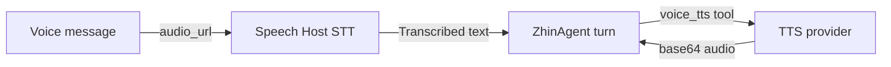

# Speech

A voice message arrives in the group chat, the bot understands the content, and can even reply with synthesized speech -- this pipeline is provided by `@zhin.js/speech`. It is an optional package: add a `speech:` section at the top level of `zhin.config.yml` and install the package, then the CLI automatically assembles the Speech Host at startup. Inbound voice messages are automatically transcribed (STT), and the Agent is provided with `voice_stt` / `voice_tts` tools. If the package is not installed, it is simply skipped (only a warning is logged) without affecting other capabilities.

```bash
pnpm add @zhin.js/speech
```



## Configuration

```yaml
speech:
  stt:
    provider: openai          # ollama | openai
    model: whisper-1
    host: https://api.openai.com
    apiKey: ${OPENAI_API_KEY}
  tts:
    provider: edge            # edge | openai | azure | custom
    voice: zh-CN-XiaoxiaoNeural
```

## STT (Speech-to-Text)

| Provider | Description |
|----------|-------------|
| `openai` | Calls `{host}/v1/audio/transcriptions` (OpenAI-compatible whisper interface); `model` defaults to `whisper-1`, `host` defaults to `https://api.openai.com`, language fixed to `zh`, timeout 60s |
| `ollama` | **Currently unavailable**: Ollama does not have audio transcription models; calling it will produce an immediate error suggesting to switch to `openai` |

`stt.enabled: false` can disable STT independently. Inbound voice first passes through the shared media materialization and real MIME/size validation pipeline. With the `transcribe` strategy, Agent Host then adds the transcript as derived text for the current Turn. Download, validation, and transcription failures produce explicit media terminal states; they never pretend that the model successfully understood the audio.

Audio format extension is inferred from MIME type (wav / mp3 / ogg / webm / amr / silk / m4a / flac); unrecognizable formats are treated as wav.

## TTS (Text-to-Speech)

`tts.provider` defaults to `edge`. Four providers:

| Provider | Key Configuration | Description |
|----------|-------------------|-------------|
| `edge` | `voice` (default `zh-CN-XiaoxiaoNeural`), `rate` (default `+0%`), `pitch` (default `+0Hz`), `edgeTtsCommand` (default `edge-tts`) | Calls the local `edge-tts` CLI, outputs mp3; requires installing this command separately |
| `openai` | `host` (default `https://api.openai.com`), `model` (default `tts-1`), `voice` (default `alloy`), `speed` | Calls `{host}/v1/audio/speech`; apiKey uses `tts.apiKey`, falls back to `stt.apiKey` if absent |
| `azure` | `region` (default `eastasia`), `subscriptionKey`, `voice` | Azure Cognitive Services REST, outputs 16kHz mp3 |
| `custom` | `baseUrl` (required), `headers`, `model`, `voice`, `speed` | Any OpenAI-compatible TTS endpoint, body matches `/v1/audio/speech` |

TTS request timeout is uniformly 30s, output format is mp3 (`openai` / `custom` can optionally use wav).

## Agent Tools

After the Speech Host is assembled, two tools are registered with the Agent (`source: speech`):

| Tool | Parameters | Returns |
|------|-----------|---------|
| `voice_stt` | `audio_url` or `file_path` (local absolute path, choose one) | `{ text }`; returns `{ error }` on failure |
| `voice_tts` | `text` (required), `voice` (overrides default), `provider` (`edge` / `openai` / `azure` / `custom`) | `{ audio(base64), format, size }` |

`voice_tts` can temporarily switch providers per call, making it convenient to use multiple voices within a single deployment.

## Complete Example

```yaml
speech:
  stt: { provider: openai, model: whisper-1, host: https://api.openai.com, apiKey: ${OPENAI_API_KEY} }
  tts: { provider: edge, voice: zh-CN-XiaoxiaoNeural }
```

## Related

- [AI Capabilities Overview](./index.md)
- [Agent Deep Dive](./agent.md)
