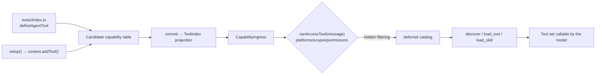

# Agent Tools and Skills

Choose a Tool directory from the disclosure scope the capability needs. Every authoring path writes the same candidate-generation capability table and becomes visible through the sole `ToolIndex` only after commit. There is no second dynamic registry.

| Directory | Ownership | Model disclosure |
| --- | --- | --- |
| `tools/<name>/index.ts` | Plugin-wide Tool | Enters the public deferred catalog when the plugin is enabled |
| `agents/<agent>/tools/<name>/index.ts` | Agent-private Tool | Enters the capability set after that Agent is selected |
| `skills/<skill>/tools/<name>/index.ts` | Skill-private Tool | Unlocks after `load_skill` activates that Skill |
| `agents/<agent>/skills/<skill>/tools/<name>/index.ts` | Tool private to an Agent Skill | Requires both Agent selection and Skill activation |

The initial model surface contains root Tools plus summaries for root Skills and Agents. Private Tool definitions are still validated while preparing the generation, but they do not enter the model Tool catalog before their owner is activated.

Reserve root `tools/` for cross-task, frequently useful capabilities that need no domain instructions. A Tool that only makes sense for a platform, workflow, or role belongs to that Skill or Agent. Split a Skill again when it contains independently triggered task domains, so a narrow request does not disclose every Tool schema for an entire platform.

Adapter Skills belong under `agents/<platform>/skills/<name>/`. The platform Agent is selected automatically for matching IM ingress, so turns from other platforms do not receive its private Skill summaries. Declaring multiple automatic Agent candidates for one platform is a routing conflict; merge their responsibilities or require an explicit user selection.



## Path One: Directory Conventions

After mounting the `@zhin.js/tool` Feature, `index.ts` in any of the four Tool locations is discovered and must default-export `defineAgentTool(...)`. Supporting modules stay beside the entry in the same named directory:

```ts
// tools/echo/index.ts
import { defineAgentTool } from '@zhin.js/tool';
import { z } from 'zod';

export default defineAgentTool<{ message: string }>({
  description: 'Echo a message back',
  inputSchema: z.object({ message: z.string().min(1) }),
  async execute({ message }) {
    return `echo: ${message}`;
  },
});
```

Definition fields (`packages/im/tool/src/definition.ts`):

| Field | Required | Description |
| --- | --- | --- |
| `description` | Yes | Functional description for the model |
| `inputSchema` | No | A Zod 4 object or an object-root JSON Schema; the Tool Feature owns projection and pre-execution validation |
| `requiresApproval` | No | When the Tool requires approval: `'never' \| 'on-risk' \| 'once' \| 'always'`, default `'on-risk'` |
| `platforms` | No | Restrict to adapter platforms (e.g., `['icqq']`), empty = all |
| `scopes` | No | Restrict to session scenes `'private' \| 'group' \| 'channel'`, empty = all |
| `permissions` | No | Permit string list (see access control below) |
| `hidden` | No | Registered but not exposed to the model (callable by name only) |
| `execute(input, context)` | Yes | `context` is the capability context (`config` / `use(token)` / `owner` / `generation`) |

The file name is the owner-local name. Agent turns expose the complete tool tree to the model by `qualifiedName`: root tools keep their local name, while child tools join owner path segments and the file name with `__` (for example, `maps__get-weather`). Execution remains bound to the original owner's fixed-generation capability context; it is not re-resolved through the caller's owner.

## Path Two: Conditional setup Declaration

When configuration or injected resources decide whether a tool exists, call `context.addTool()` directly in `setup()`:

```ts
// plugins/utils/lottery/plugin.ts (excerpt)
import { definePlugin } from 'zhin.js';
import { defineAgentTool } from '@zhin.js/tool';

export default definePlugin({
  name: 'lottery',
  async setup(context) {
    if (!context.config.get().agentToolsEnabled) return;
    context.addTool('lottery_sync', defineAgentTool({
      description: 'Synchronize lottery draws',
      requiresApproval: 'always',
      inputSchema: { type: 'object', properties: {} },
      execute: async (_input, toolContext) => toolContext.use(lotteryDatabaseToken).sync(),
    }));
  },
});
```

`addTool()` writes only the shadow generation. It is never visible if prepare fails and becomes visible atomically on commit, so no manual unregister function is needed. The definition is the same `defineAgentTool()` used by convention files:

```ts
context.addTool('lottery_sync', defineAgentTool({
  description: tool.description,
  inputSchema: tool.inputSchema, // zod object or JSON Schema
  platforms: tool.platforms,
  scopes: tool.scopes,
  permissions: tool.permissions,
  hidden: tool.hidden,
  requiresApproval: 'never',
  execute: (input, context) => tool.execute(input, context),
}));
```

Note: the `execute` closure captures dependencies at `setup()` time. **Do not call plugin locators** (such as `getPlugin()`) **inside the closure** -- the runtime path prohibits dynamic plugin retrieval.

## Unified Access Control: canAccessTool

Tools registered via both paths are filtered by Core's `canAccessTool(tool, message)` against the message context on every Agent turn -- **one predicate governs both paths** (`packages/im/core/src/built/tool.ts`; on the Plugin Runtime side, it's applied through `CapabilityIngress`, see `packages/im/agent/src/plugin-runtime/capability-ingress.ts`).

Four-tuple semantics:

| Field | Determination |
| --- | --- |
| `platforms` | Reject if the message's source adapter name (`String(message.$adapter)`) is not in the list |
| `scopes` | Reject if the session scene (`message.$channel.type`, default `private`) is not in the list |
| `permissions` | Permit list, checked item by item (AND); commas inside parentheses mean OR |
| `hidden` | Not included in the tool list given to the model, but still executable by name |

Permit syntax is defined by `@zhin.js/permission` (`packages/im/permission/src/builtin.ts`): built-in `adapter(name)`, `group(id,...)`, `private(id,...)`, `channel(id,...)`, `user(id,...)`, `role(master|trusted|user)`; platform identity `platform(adapter,perm)` (e.g., group owner/admin, determined by adapter checker); unrecognized permits are always rejected.

`requiresApproval` is evaluated after Tool admission and immediately before execution. `always` asks every time; `once` lets the standard Host remember that Tool for the current session; `on-risk` keeps unknown plugin actions behind confirmation, while Bash, file, and network Tools do not ask twice after their dedicated policy has validated the concrete command, path, or URL. `never` skips only declarative confirmation and cannot bypass permission, network, filesystem, shell, or generation policies.

## Deferred Catalog and load_tool

Tools are not included in the full prompt. Each turn first builds a **catalog** of tools that pass access control and creates its own deferred controller (`packages/im/agent/src/tool-catalog/deferred-turn-controller.ts`); by default only `alwaysLoadedTools` are exposed to the model. The controller creates three meta-tools for that turn: `discover` searches tools/skills by query (and can filter by MCP server), `load_tool` loads a tool schema by name, and `load_skill` loads complete skill instructions and unlocks associated tools. Concurrent turns and subagents use isolated controllers; IM `Message` identity is not a state key.

Loading state is persisted per session (`DeferredToolSessionSnapshot`), with an eviction limit. Configuration key `deferredTools` (`ZhinAgentConfig`):

| Key | Default | Description |
| --- | --- | --- |
| `maxLoadedPerSession` | `12` | Maximum number of tools loaded per session |
| `discoverTopK` | `5` | Number of results returned by `discover` |
| `alwaysLoadedTools` | `['ask_user', 'spawn_task', 'discover', 'load_tool', 'load_skill']` | Always visible to the model |
| `mcpServers` | `{}` | Override `alwaysLoaded` list per MCP server |

The Anthropic SDK channel marks unloaded tools with `deferLoading`; other channels only deliver the loaded set.

`ask_user` is a framework-provided, generation-owned Tool capability rather than Plugin Prompt middleware.
It requests input through the current Turn's `QuestionPort` and matches replies by canonical session and authenticated subject. Plugin tools that need the same interaction must depend on `ToolExecutionContext.question` and handle an absent port. Unattended Turns, including Schedule, do not receive this port and must not fall back to global Message, Adapter, or user queues.

## Skills, main Agents, and sub-agents

Skills use `skills/<name>/SKILL.md`. A plugin main Agent uses the standard root `AGENTS.md`. Named sub-agents use self-contained `agents/<name>/` directories discovered by `@zhin.js/agent-feature`.

Every sub-agent requires `agent.json`, `system.md`, `boundaries.md`, and `conventions.md`; `workflows/`, `tools/`, `skills/`, `hooks/`, and `knowledge/` are optional. `conventions.md` extends the root `AGENTS.md` and must not conflict with it. Add recurring project mistakes to that file. See the [`@zhin.js/agent-feature` README on GitHub](https://github.com/zhinjs/zhin/blob/main/packages/im/agent-feature/README.md) for the complete manifest and directory contract.

The `tools` field in `agent.json` may request additional public Tools. `agents/<agent>/tools/<name>/index.ts` defines an Agent-private Tool. A Skill-private Tool lives at `skills/<skill>/tools/<name>/index.ts`; an Agent-private Skill and its Tools live at `agents/<agent>/skills/<skill>/SKILL.md` and its nested `tools/<name>/index.ts`. Every Tool still passes the same permission, approval, and generation admission path.

## Plugin Agent authoring directories

```text
my-plugin/
├── AGENTS.md
├── tools/
│   └── short-url/
│       ├── index.ts
│       └── client.ts
├── skills/short-url/
│   ├── SKILL.md
│   ├── tools/normalize/index.ts
│   └── hooks/audit/index.ts
├── hooks/audit/index.ts
└── agents/reviewer/
    ├── agent.json
    ├── system.md
    ├── boundaries.md
    ├── conventions.md
    ├── workflows/
    ├── tools/check-result/index.ts
    ├── skills/review/
    │   ├── SKILL.md
    │   ├── tools/check-result/index.ts
    │   └── hooks/audit/index.ts
    ├── hooks/audit/index.ts
    └── knowledge/
```

`tools/<name>/index.ts` and `addTool()` use the same `AgentToolDefinition`, `ToolExecutionContext`, and `ToolIndex`. The execution context provides fixed-generation `config`, `use(token)`, `origin`, `principal`, `policy`, `question`, and an adapter-inferred `$client`.

## Give an Agent plugin-owned context

Use Prompt Sections when a plugin needs the Agent to understand business vocabulary,
output rules, or tool-use constraints. A section is a generation-owned capability:
a failed hot reload publishes nothing, while an in-flight turn keeps the exact
generation it started with.

### 1. Mount the Prompt Section Feature

Declare both the dependency and the Feature:

```json
{
  "dependencies": {
    "@zhin.js/prompt-section": "latest"
  },
  "zhin": {
    "features": [
      { "package": "@zhin.js/prompt-section", "api": "^1.0.0" }
    ]
  }
}
```

### 2. Declare a context section

Create `prompt-sections/project-rules/index.ts` at the plugin root:

```ts
import { defineAgentPromptSection } from '@zhin.js/prompt-section';

export default defineAgentPromptSection({
  title: 'Project rules',
  content: 'Answer with repository-local terminology and cite changed files.',
  layer: 'context',
  order: 70,
  retention: 'preferred',
  maxChars: 1000,
  profiles: ['interactive'],
});
```

The first-level directory name supplies the local name; Zhin combines it with the plugin
owner to form a globally unique identity. `order` controls presentation only.
`retention` controls what happens when the prompt budget is tight:
`required` must fit or the turn fails explicitly, `preferred` is retained before
`opportunistic`, and opportunistic content yields first. `maxChars` caps this
section, while `profiles` selects interactive turns, scheduled turns, or both.
Use optional `platforms` to publish the section only to matching IM turns, for
example `platforms: ['github']`.
The total budget is configured by `ai.agent.systemPromptMaxChars`.

### 3. Verify the published generation

Open **Prompt Sections** in the Console capability catalog to inspect owner,
source, generation, profiles, and budget policy. Introspection deliberately omits
the prompt text because it can contain internal product policy. A runnable example
is in `examples/full-bot/prompt-sections/custom/index.ts`.

A Prompt Section changes model context; it **does not grant tool, data, or approval
authority**. Those permissions still come from Tool Features, Runtime resources,
and Host policy.
