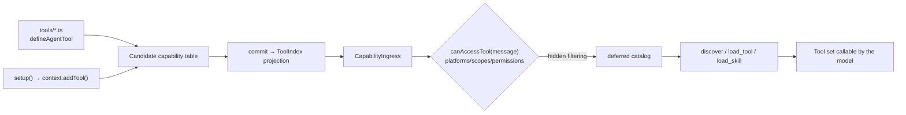

# Agent Tools and Skills

Want the model to search a song or check a lottery recommendation for the user? Put the logic in `tools/`, or conditionally call `context.addTool()` from `setup()`. Both forms write the same candidate-generation capability table and become visible through the sole `ToolIndex` only after commit. There is no second dynamic registry.



## Path One: `tools/*.ts` Convention

After mounting the `@zhin.js/tool` Feature, each `.ts` file under `tools/` (non-recursive) in the plugin package root default-exports `defineAgentTool(...)`:

```ts
// tools/echo.ts (examples/minimal-bot)
import { defineAgentTool } from '@zhin.js/tool';
import { z } from 'zod';

export default defineAgentTool<{ message: string }>({
  description: 'Echo a message back',
  inputSchema: z.object({ message: z.string().min(1) }),
  async execute({ message }) {
    return `echo: ${message}`;
  },
});
```

Definition fields (`packages/im/tool/src/definition.ts`):

| Field | Required | Description |
| --- | --- | --- |
| `description` | Yes | Functional description for the model |
| `inputSchema` | No | zod object or JSON Schema, drives parameter validation and catalog display |
| `approval` | No | `'never' \| 'on-risk' \| 'always'`, default `'on-risk'` |
| `platforms` | No | Restrict to adapter platforms (e.g., `['icqq']`), empty = all |
| `scopes` | No | Restrict to session scenes `'private' \| 'group' \| 'channel'`, empty = all |
| `permissions` | No | Permit string list (see access control below) |
| `hidden` | No | Registered but not exposed to the model (callable by name only) |
| `execute(input, context)` | Yes | `context` is the capability context (`config` / `use(token)` / `owner` / `generation`) |

The file name is the owner-local name. Agent turns expose the complete tool tree to the model by `qualifiedName`: root tools keep their local name, while child tools join owner path segments and the file name with `__` (for example, `maps__get-weather`). Execution remains bound to the original owner's fixed-generation capability context; it is not re-resolved through the caller's owner.

## Path Two: Conditional setup Declaration

When configuration or injected resources decide whether a tool exists, call `context.addTool()` directly in `setup()`:

```ts
// plugins/utils/lottery/plugin.ts (excerpt)
import { definePlugin } from '@zhin.js/plugin-runtime';
import { defineAgentTool } from '@zhin.js/tool';

export default definePlugin({
  name: 'lottery',
  async setup(context) {
    if (!context.config.get().agentToolsEnabled) return;
    context.addTool('lottery_sync', defineAgentTool({
      description: 'Synchronize lottery draws',
      approval: 'always',
      inputSchema: { type: 'object', properties: {} },
      execute: async (_input, toolContext) => toolContext.use(lotteryDatabaseToken).sync(),
    }));
  },
});
```

`addTool()` writes only the shadow generation. It is never visible if prepare fails and becomes visible atomically on commit, so no manual unregister function is needed. The definition is the same `defineAgentTool()` used by convention files:

```ts
context.addTool('lottery_sync', defineAgentTool({
  description: tool.description,
  inputSchema: tool.inputSchema, // zod object or JSON Schema
  platforms: tool.platforms,
  scopes: tool.scopes,
  permissions: tool.permissions,
  hidden: tool.hidden,
  approval: 'never',
  execute: (input, context) => tool.execute(input, context),
}));
```

Note: the `execute` closure captures dependencies at `setup()` time. **Do not call plugin locators** (such as `getPlugin()`) **inside the closure** -- the runtime path prohibits dynamic plugin retrieval.

## Unified Access Control: canAccessTool

Tools registered via both paths are filtered by Core's `canAccessTool(tool, message)` against the message context on every Agent turn -- **one predicate governs both paths** (`packages/im/core/src/built/tool.ts`; on the Plugin Runtime side, it's applied through `CapabilityIngress`, see `packages/im/agent/src/plugin-runtime/capability-ingress.ts`).

Four-tuple semantics:

| Field | Determination |
| --- | --- |
| `platforms` | Reject if the message's source adapter name (`String(message.$adapter)`) is not in the list |
| `scopes` | Reject if the session scene (`message.$channel.type`, default `private`) is not in the list |
| `permissions` | Permit list, checked item by item (AND); commas inside parentheses mean OR |
| `hidden` | Not included in the tool list given to the model, but still executable by name |

Permit syntax (`packages/im/core/src/built/permit-parse.ts`) has three categories: built-in `adapter(name)`, `group(id,...)`, `private(id,...)`, `channel(id,...)`, `user(id,...)`, `role(master|trusted|user)`; platform identity `platform(adapter,perm)` (e.g., group owner/admin, determined by adapter checker); unrecognized permits are always rejected.

## Deferred Catalog and load_tool

Tools are not included in the full prompt. Each turn first builds a **catalog** of tools that pass access control and creates its own deferred controller (`packages/im/agent/src/tool-catalog/deferred-turn-controller.ts`); by default only `alwaysLoadedTools` are exposed to the model. The controller creates three meta-tools for that turn: `discover` searches tools/skills by query (and can filter by MCP server), `load_tool` loads a tool schema by name, and `load_skill` loads complete skill instructions and unlocks associated tools. Concurrent turns and subagents use isolated controllers; IM `Message` identity is not a state key.

Loading state is persisted per session (`DeferredToolSessionSnapshot`), with an eviction limit. Configuration key `deferredTools` (`ZhinAgentConfig`):

| Key | Default | Description |
| --- | --- | --- |
| `maxLoadedPerSession` | `12` | Maximum number of tools loaded per session |
| `discoverTopK` | `5` | Number of results returned by `discover` |
| `alwaysLoadedTools` | `['ask_user', 'spawn_task', 'discover', 'load_tool', 'load_skill']` | Always visible to the model |
| `mcpServers` | `{}` | Override `alwaysLoaded` list per MCP server |

The Anthropic SDK channel marks unloaded tools with `deferLoading`; other channels only deliver the loaded set.

`ask_user` is a framework-provided, generation-owned ToolFeature rather than Plugin Prompt middleware.
It requests input through the current Turn's `QuestionPort` and matches replies by canonical session and authenticated subject. Plugin tools that need the same interaction must depend on `ToolExecutionContext.question` and handle an absent port. Unattended Turns, including Schedule, do not receive this port and must not fall back to global Message, Adapter, or user queues.

## skills and agents/*.agent.md

Skills and named Agents are also file conventions, discovered by the `@zhin.js/skill` and `@zhin.js/agent-feature` Features respectively.

Skills go in `skills/<name>/SKILL.md` (one skill per subdirectory): the body is the instruction for the model, the first Markdown heading line serves as the description, and `load_skill` unlocks tools associated via `toolNames`. Named Agents use `agents/<name>.agent.md` (file name must be lowercase kebab, e.g., `agents/planner.agent.md`): the entire Markdown file is that Agent's instructions, and the first heading line serves as the description. See `examples/test-bot/agents/planner.agent.md` for a real-world example.

```markdown
<!-- agents/planner.agent.md -->
# planner

You are **planner** (coordinator): break down user goals, define acceptance
criteria, and coordinate specialist roles.
```

### Plugin `agent/` Directory (An Alternative Organization)

Plugins with `@zhin.js/agent` installed can also use an `agent/` directory to centrally declare the AI surface (`packages/im/agent/src/discovery/agent-surface.ts` scans it):

```text
my-plugin/
├── agent/
│   ├── agent.ts           # defineAgent: description, keywords, toolNames, systemPrompt
│   ├── instructions.md    # System prompt body
│   ├── tools/*.ts         # defineAgentTool (from '@zhin.js/agent/tools')
│   ├── skills/*.{md,ts}   # .md can have frontmatter (description / tools / always)
│   └── subagents/<name>/  # Recursively isomorphic sub-Agents
```

The difference from `@zhin.js/tool`'s `defineAgentTool`: the `@zhin.js/agent/tools` version's `execute(input, ctx)` receives `{ pluginName, runtimeName, filePath }` context as the second argument, `approval` supports `'always' | 'once' | 'never'` or a custom predicate, and it can configure `toModelOutput` to shape the text returned to the model. Real-world example: `plugins/utils/short-url/agent/tools/short_url.ts`.

```ts
// agent/tools/short_url.ts (plugins/utils/short-url, excerpt)
import { defineAgentTool } from '@zhin.js/agent/tools';
import { z } from 'zod';

export default defineAgentTool<{ url: string }>({
  description: 'Shorten a URL and return the short link',
  inputSchema: z.object({ url: z.string().min(1) }),
  keywords: ['短链', '缩短', 'shorten'],
  async execute({ url }) {
    // ...
  },
});
```
