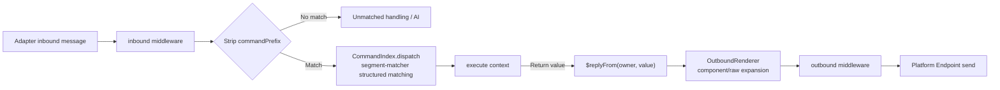

# Commands (defineCommand)

Create a `commands/` directory in your plugin package root and drop a `hello.ts` file in it -- users can then type `hello` in a group chat to trigger it. **The file path is the command name**, and after editing a file, hot reload takes effect immediately without restarting the process. This pipeline is provided by the `@zhin.js/command` Feature, no manual registration needed.

```ts
// commands/hello.ts
import { defineCommand } from '@zhin.js/command';

export default defineCommand({
  description: 'Say hello',
  execute: () => 'Hello from zhin.',
});
```

Single-file Bots can register the same definition in the plugin entry:

```ts
import { definePlugin } from '@zhin.js/plugin-runtime';

export default definePlugin({
  name: 'my-bot',
  setup({ addCommand }) {
    addCommand('hello', defineCommand({
      description: 'Say hello',
      execute: () => 'Hello from one file.',
    }));
  },
});
```

`addCommand` and directory discovery share the same `CommandIndex`, manifest, conflict detection, and generation lifecycle.
When commands grow in number, move the definition to a `commands/hello.ts` default export; the directory mode also narrows
HMR granularity to individual command files.

## File Routing

Command name = the plugin's path segments in the plugin tree + the file's relative path segments, joined by spaces. Root plugins (the application itself) have no prefix.

| File | Plugin | Command name |
| --- | --- | --- |
| `commands/hello.ts` | root | `hello` |
| `commands/endpoint/list.ts` | `qq` | `qq endpoint list` |
| `commands/endpoint/add/[name:string=].ts` | `qq` | `qq endpoint add [name]` |

First, nesting: `commands/` is scanned recursively, and nested directories map directly to subcommand segments. Directory and file names must be lowercase kebab-case (`/^[a-z0-9][a-z0-9-]*$/`).

Dynamic parameter segments are written in the file name: `[name:type=default].ts` (`.tsx` also works) and must be the last segment of the path. `=default` can be omitted -- no default value means required, shown as `<name>` in help; with a default value it shows as `[name]`, and the default is used when the parameter is omitted.

| Parameter category | Supported types | Match result |
| --- | --- | --- |
| Text | `string` / `word` / `text` | String; `text` can consume continuous text |
| Numeric | `number` / `integer` / `float` | Finite number; `integer` requires an integer, `float` requires a decimal |
| Boolean | `boolean` | `true` / `false` |
| IM segments | `mention` / `image` / `face` / `reply` / `forward` / `dice` / `rps` | Corresponding field of canonical segment |

Structured IM parameters do not support file name default values. At runtime, `segment-matcher` matches directly on canonical segments,
without first degrading image, mention, etc. to text; type mismatches are treated as "command not matched" during dispatch.

Route conflict has two rules: **static priority** -- `list.ts` always wins over `[name:string].ts`, and among dynamic routes, those with more static segments (more specific) take priority; **same-shape rejection** -- duplicate registration of the same route shape reports an error at startup (`Duplicate runtime Command`).

Real-world example (`plugins/adapters/qq/commands/endpoint/remove/[name:string].ts`, command definition generated by the [endpoint management command suite](#adapter-endpoint-management-command-suite)):

```ts
import { qqEndpointCommands } from '../../../src/qq-endpoint-commands.js';

export default qqEndpointCommands.remove;
```

## execute Context

`execute(context)` receives a frozen `CommandContext`:

| Field | Type | Description |
| --- | --- | --- |
| `args` | `readonly string[]` | Remaining words after command name matching (split by whitespace) |
| `params` | `Record<string, CommandParameterValue>` | Typed values from parsed dynamic parameter segments; structured parameters can be media objects |
| `segments` | `readonly CommandSegment[]` | Remaining structured segments after command pattern consumption; preserves media, mention, and other non-text information |
| `config` | `Readonly<TConfig>` | This plugin's configuration snapshot (from `zhin.config.yml`) |
| `input` | `TInput \| undefined` | Call source; when dispatched via IM, it is a Runtime `Message` (satisfying `CommandMessage`); may be absent for Host / `execute(name)` calls |
| `adapter` | `string \| undefined` | Adapter plugin instance id (e.g., `root/icqq`) |
| `endpoint` | `string \| undefined` | Endpoint name (`metadata.endpoint`) |
| `scene` | `CommandScene \| undefined` | `{ id, type, name? }`; prefers upstream structured fields, otherwise parsed from `target` / metadata |
| `sender` | `CommandSender \| undefined` | `{ id, name?, role: string[] }`; `role` contains platform identity and framework roles |
| `use(token)` | `<T>(token: Token<T>) => T` | Retrieve Plugin Runtime resources (see below) |
| `owner` | `PluginNodeSnapshot` | Plugin node that owns the command |
| `generation` | `number` | Current generation number |

`TInput` defaults to being constrained to `CommandMessage` (the command-side message contract). Because `@zhin.js/command` cannot import `@zhin.js/core` due to architectural layering, it declares this independently; the Runtime `Message` structure is compatible.

```ts
export default defineCommand({
  description: 'Who is where',
  execute: ({ adapter, endpoint, scene, sender }) =>
    `${sender?.name ?? sender?.id} @ ${scene?.type}:${scene?.id} via ${adapter}/${endpoint} roles=${sender?.role.join(',')}`,
});
```

`use(token)` reads resources registered during the plugin's `setup()` via `resources.provide(...)`; it throws when absent. The QQ command above uses `use(qqRuntimeStateToken)` to get the adapter's shared state -- this is the standard pattern for command-adapter collaboration.

## Return Values and Component Rendering

The return value (or the resolved value of a `Promise`) of `execute` is the reply content, typed as `SendContent`. It can be a string (used directly as a text reply), `component(name, props)` (invokes [component](./middleware-components.md#definecomponent) rendering, exported from `zhin.js/core/runtime`), `raw(payload)` (a wire segment sent as-is, such as `{ type: 'html', data: { html, width } }`), or an **array** of these three for multi-segment messages. Returning `undefined` means no reply -- the command has already replied via `input.$reply(...)`, or intentionally stays silent.

The full pipeline for IM inbound:



During dispatch, compiled command patterns are tried in deterministic priority order: static commands before dynamic commands, and among dynamic commands,
more specific paths take priority. After a match, remaining text is split by whitespace into `args`, and the full rich-message tail is preserved in `segments`.
Therefore `qq endpoint remove mybot` matches `qq endpoint remove <name>`, `args` is empty, and
`params.name === 'mybot'`.

Structured parameter example:

```ts
// commands/upload/[asset:image].ts
import { defineCommand } from '@zhin.js/command';

export default defineCommand({
  execute: ({ params, args, segments }) => ({
    uploaded: params.asset,
    captionWords: args,
    remainingSegments: segments,
  }),
});
```

When a message consists of the text `upload `, an image segment, and caption text, `params.asset` is the image's
`MediaRef`, and the caption is provided both as the `args` text-compatible view and the `segments` structured view.

## master / trusted Permission Model

The framework-level sender roles have three tiers: `user` -> `trusted` -> `master` (`master` implies `trusted`). Roles are resolved from adapter instance configuration:

```yaml
# zhin.config.yml
plugins:
  qq:
    master: '10001'        # Top-level master (endpoint owner)
    endpoints:
      - name: main
        appid: ${QQ_APPID}
        master: '10001'    # endpoints[i] can override per-item
```

The `master` / `trusted` lists are read by Core's role resolution (`resolveSenderRoles`, `packages/im/core/src/built/ai-trigger.ts`); permits like `role(master)`, `role(trusted)`, and [Agent tool](./agent-tools.md) `permissions` all rely on the same role system.

Commands themselves have no built-in permission declaration; permission checks are written inside `execute`. Using the common check for endpoint management commands as an example (`isEndpointOperator`, `packages/im/adapter/src/endpoint-commands.ts`):

```ts
export function isEndpointOperator(config: unknown, input: unknown): boolean {
  const cfg = (config ?? {}) as { master?: unknown; endpoints?: unknown };
  const masters = new Set<string>();
  // Collect top-level master and each endpoints[i].master ...
  if (masters.size === 0) return true; // Allow all when master is not configured
  const sender = String((input as { sender?: unknown } | null)?.sender ?? '').trim();
  return !!sender && masters.has(sender);
}
```

The key points of this pattern: use `config` (plugin configuration) to get the declared `master` list, use `input` (message) to get the sender id, then compare and return a rejection message (`Only master can execute <Adapter> endpoint management commands`). When `master` is not configured, all are allowed, and the first person to scan-bind becomes the owner (the QQ binding flow writes the operator as the new endpoint's `master`). Note that `input` is not necessarily a message (it could be a Host call), so a type guard is needed before getting the sender; for non-message sources, `$reply` degrades to a no-op.

## Adapter Endpoint Management Command Suite

`@zhin.js/adapter`'s `createEndpointCommands(spec, defineCommand)` generates **list / add / remove** commands for `<adapter> endpoint`. Except for email (smtp/imap nested objects, not expressible in kv) and sandbox (built-in debug adapter, no credentials), all platform adapters are integrated: qq, icqq, napcat, onebot11, onebot12, milky, satori, slack, telegram, discord, kook, lark, dingtalk, line, wecom, wechat-mp, weixin-ilink, github.

- `<adapter> endpoint list`: running endpoints (runtime state registered by the adapter's `create()`) + the configuration list from `plugins.<adapterKey>.endpoints` in `zhin.config.yml`.
- `<adapter> endpoint add <name> <key=value...>`: manual field entry. Credential field values with `env: true` are written to `.env` (key names derived as `<ADAPTER>_<NAME>_<FIELD>` in uppercase, e.g., `TELEGRAM_BOT1_TOKEN`, `SLACK_BOT1_SIGNING_SECRET`), with `${REF}` references saved in yaml; other fields are written inline. YAML uses Document-node-level operations to preserve existing comments; duplicate names are rejected; both `add`/`remove` go through the master gate described above.
- `<adapter> endpoint remove <name>`: removes from configuration (takes effect on restart; `.env` keys are retained for manual cleanup).
- Special add flows (such as QQ scan-code binding) are handled by the `spec.bindFlow` hook taking over the add command; QQ therefore has a fourth command `qq endpoint cancel`.

Integrating an adapter requires only four steps (using telegram as an example):

```ts
// 1. src/telegram-runtime-state.ts -- runtime endpoint registry token
export const telegramRuntimeStateToken = defineEndpointRuntimeStateToken('telegram');

// 2. plugin.ts setup() -- provide state; register in adapters/telegram.ts create()
context.resources.provide(telegramRuntimeStateToken, createEndpointRuntimeState());
// create(): context.use(telegramRuntimeStateToken).endpoints.set(config.name, { name: config.name, mode: config.mode });

// 3. src/telegram-endpoint-commands.ts -- generate commands (defineCommand is injected
//    from the adapter side, provider packages must not import each other)
export const telegramEndpointCommands = createEndpointCommands({
  adapterKey: 'telegram',          // = plugins.<key> in zhin.config.yml
  adapterDisplayName: 'Telegram',
  fields: [{ key: 'token', required: true, env: true, description: 'Telegram bot token' }],
  running: (use) => use(telegramRuntimeStateToken).endpoints.values(),
  describeEntry: (entry) => `token: ${String(entry.token)}`,
}, defineCommand);

// 4. commands/endpoint/{list.ts, add/[name:string].ts, remove/[name:string].ts}
export default telegramEndpointCommands.list; // / .add / .remove
```

`fields` aligns with the adapter's `schema.json` `endpoints.items.properties`; `add`'s kv arguments go through `args` (remaining words after longest prefix match), and values containing `=` are split at the first `=`.

## commandPrefix Adapter Configuration

By default there is no prefix: any text will be tried for command matching. After configuring `commandPrefix` for an adapter instance, only messages starting with the prefix enter command matching:

```yaml
plugins:
  qq:
    commandPrefix: '/'     # Only "/qq endpoint list" triggers
    endpoints:
      - name: main
        commandPrefix: ''  # endpoints[i] can override the top-level
```

Resolution rules (`packages/im/core/src/plugin-runtime/im/message-dispatcher.ts`): read `commandPrefix` from the adapter instance the message belongs to (default `''`); when the instance declares an `endpoints` array, find the entry by the message's source endpoint name, where `entry.commandPrefix` overrides the top-level. After prefix stripping, command matching proceeds; messages not matching the prefix fall into the unmatched path (such as AI conversation).

## Troubleshooting Tips

`description` appears in command listings, so it's recommended to always include one. Command name conflicts (same-name static commands or same-shape dynamic routes) throw errors at startup; running a startup after configuration changes catches them early. Commands returning `Promise` can implement multi-round interactions -- resolve the first reply, then append subsequent ones with `input.$reply`; see the QQ `qq endpoint add` scan-code binding flow for reference.
