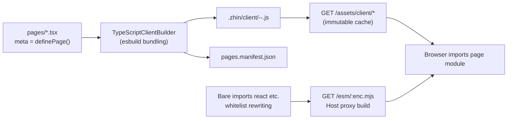

# Console Pages and Layout

Plugins can do more than send messages to groups -- they can contribute entire React pages to the Remote Console. The sandbox adapter's `/sandbox` chat page is built exactly this way. The mechanism is consistent with commands and components: **`pages/` is a convention directory**, discovered by the `@zhin.js/page` (pages) and `@zhin.js/layout` (layout) Features, with the client build pipeline compiling TSX into browser-loadable ES modules.

## pages/ Convention (@zhin.js/page)

Under the `pages/` directory at the plugin package root, each `.tsx` / `.ts` file (lowercase kebab naming) is a page: **default-export a React component**, and use the named export `meta` to declare metadata (`definePage` from `@zhin.js/console-contract`):

```tsx
// pages/index.tsx (plugins/adapters/sandbox)
import { definePage } from '@zhin.js/console-contract';
import SandboxChat from './SandboxChat';

export const meta = definePage({
  title: 'Sandbox',
  icon: 'Box',
  order: 10,
});

export default function SandboxPage() {
  return <SandboxChat />;
}
```

All `meta` fields are optional; `definePage` validates unknown keys and throws:

| Field | Default | Description |
| --- | --- | --- |
| `title` | Generated from file name (`foo-bar` -> `Foo Bar`) | Navigation and page header title |
| `icon` | None | Icon name (lucide style, e.g., `'Box'`, `'Workflow'`) |
| `order` | `100` | Navigation sort order, smaller values appear first |
| `hideInNav` | `false` | Don't appear in navigation |
| `requiredPermissions` | `[]` | Permissions required for access |
| `requiredRoles` | `[]` | Roles required for access |

### Routing Rules

Route = plugin path + page name (`pageRoute`, `packages/console/plugin-contract/src/page.ts`):

| File | Plugin | Route |
| --- | --- | --- |
| `pages/index.tsx` | `sandbox` | `/sandbox` |
| `pages/orchestration.tsx` | root (application) | `/p-orchestration` |
| `pages/index.tsx` | root (application) | `/` |

That is: `index` maps to the plugin path itself (no leaf segment), while other files map to `p-<name>` leaf segments. Route conflicts (two pages computing the same route) report errors at startup.

## Layout (@zhin.js/layout)

Two reserved file names under `pages/` provide layout slots: `pages/$nav.tsx` corresponds to the `nav` slot (navigation area), and `pages/$footer.tsx` corresponds to the `footer` slot (footer area). Layout files only need to default-export a React component, no `meta` needed; when both `.ts` and `.tsx` exist for the same slot, `.tsx` takes precedence.

## Client Build Pipeline

Page/layout files have `target: client`, so they don't go through Node module loading during discovery. Instead, they are handed to the Client Module adapter (`TypeScriptClientBuilder`, `packages/console/pagemanager`):



First, the output: each page is bundled into `<owner>-<localName>-<contentHash>.js`, written to `.zhin/client/` under the project, and served via the Host route `GET /assets/client/*` (`cache-control: immutable` -- when the content hash changes, the file name changes). `@zhin.js/console-contract` is inlined as an identity-function stub during bundling, and `meta` is obtained through static extraction.

Next, the bare import problem. Browsers cannot resolve bare imports like `import 'react'`, so imports in the whitelist `ALLOWED_ESM_CANONICAL` (`react`, `react-dom`, `react-dom/client`, `react/jsx-runtime(-dev)`, `react-router`, `react-router-dom`) are rewritten to `/esm/<enc>.mjs`, built on demand and proxied by the Host, ensuring the entire Console has only one React instance; canonical imports outside the whitelist return 403.

Host routes are mounted in `basic/cli/src/plugin-runtime/console-host-installer.ts`: `GET /console` is the page index, `GET /console/api/pages` returns the page list, `GET /*` catch-all matches routes to pages and returns the page shell (containing importmap and module mount script), returning 404 for no match and 403 for insufficient permissions. Page modules are loaded in the browser via `import(moduleUrl)`, with the default export mounted to `#root`.

## sandbox Adapter Page Instance

The sandbox adapter (`plugins/adapters/sandbox`) is the canonical consumer of this mechanism. Its `package.json#zhin` declares:

```json
{
  "zhin": {
    "protocol": 1,
    "type": "plugin",
    "entry": "./plugin.ts",
    "runtime": "trusted",
    "features": [
      { "package": "@zhin.js/adapter", "api": "^1.0.0" },
      { "package": "@zhin.js/page", "api": "^1.0.0" }
    ]
  }
}
```

The two Features each handle their own domain: `@zhin.js/adapter` discovers the adapter under `adapters/` (WebSocket `/sandbox` Endpoint); `@zhin.js/page` discovers `pages/index.tsx`, so the Console gets a **`/sandbox` chat page**. The `SandboxChat` component connects via WebSocket to the Host's `/sandbox` (base and token from `pages/sandboxTransport.ts`), with message sending and receiving going through the unified IM pipeline -- sending a message in the page is equivalent to a real platform's inbound message, going through middleware, command matching, and AI unmatched handling.

This makes "debugging without a real platform" the default development path: `pnpm dev` (examples/minimal-bot) starts Sandbox + Console, which can verify commands, component rendering, and Agent behavior. Pages render outbound html segments inline (the sandbox adapter directly consumes html, skipping image/text normalization -- see [Middleware and Components](./middleware-components.md)).

The plugin entry itself can remain minimal (`plugins/adapters/sandbox/plugin.ts`):

```ts
import { definePlugin } from 'zhin.js/plugin-runtime';

export default definePlugin({
  name: 'sandbox',
  metadata: { displayName: 'Sandbox Adapter' },
});
```

Pages and adapters are all discovered by Feature conventions -- the entry doesn't need to manually mount anything.
