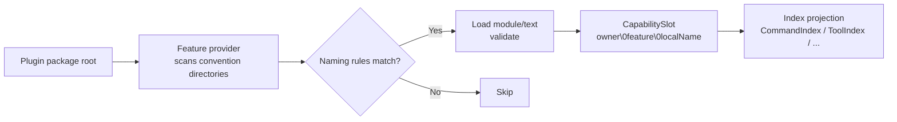

# Convention Directories

Create `commands/hello/index.ts` in a plugin package and the command appears without separate registration. These automatically scanned locations are **convention directories**. Code capabilities use named directories with fixed `index.ts` entries; Skills use `SKILL.md` and Agents use `agent.json`. Other files in a capability directory are ordinary helpers. The discovery flow:



A few key points. The full capability id takes the form `owner\0feature\0localName` (`\0`-separated), where `localName` is determined by the relative path within the directory; duplicate `localName`s (or the same file source) under the same owner throw `DiscoveryConflictError`. When a directory does not exist or has no matching files, that Feature is silently skipped -- plugins only need to declare the directories they use. Additionally, modules with `target: server` are loaded and executed on the Node side, while `target: client` (pages) are loaded in the browser via build artifacts.

**Author imports (do not reinstall Features):** Apps that depend on `zhin.js` should import `define*` from facade subpaths -- `zhin.js/command`, `zhin.js/middleware`, `zhin.js/handler`, `zhin.js/adapter`, `zhin.js/component` (and `definePlugin` from `zhin.js`). The "Feature package" column below is the implementation package mounted by `platformFeatures`; Roots that depend on `zhin.js` / `@zhin.js/core` already inherit them -- **do not** `pnpm add @zhin.js/command` and friends.

**`zhin.features` vs package dependencies** (`@zhin.js/runtime` ≥1.0.12): every Feature package named in the manifest must also appear in that plugin's `dependencies` / `peerDependencies` / `optionalDependencies`, or startup throws `PackageResolutionError`. Child plugins should list Stable Features (command / middleware / component / handler) as **optional `peerDependencies`** provided by the Root via `zhin.js` -- **do not** add them to `dependencies`. Keep `@zhin.js/adapter` and experimental `@zhin.js/tool` in `dependencies` (or non-optional peers) when the plugin mounts them.

## Directory Overview

| Directory | File format | Recursive | target | Feature package | featureId | Default export |
| --- | --- | --- | --- | --- | --- | --- |
| `commands/` | route directories + `index.ts` / `index.tsx` | Yes (directory segments form hierarchy) | server | `@zhin.js/command` | `zhin.command` | `defineCommand(...)` |
| `middlewares/` | `<name>/index.ts` | Named directory | server | `@zhin.js/middleware` | `zhin.middleware` | `defineMiddleware(...)` |
| `handlers/` | `<name>/index.ts` | Named directory | server | `@zhin.js/handler` | `zhin.handler` | `defineHandler(...)` |
| `components/` | `<name>/index.ts` / `index.tsx` | Named directory | server | `@zhin.js/component` | `zhin.component` | `defineComponent(...)` |
| `adapters/` | `<name>/index.ts` | Named directory | server | `@zhin.js/adapter` | `zhin.adapter` | `defineAdapter(...)` |
| `tools/` | `<name>/index.ts` | Named directory | server | `@zhin.js/tool` | `zhin.agent-tool` | `defineAgentTool(...)` |
| `hooks/` | `<name>/index.ts` | Named directory | server | `zhin.js/agent` | Agent Hook | `defineHook(...)` |
| `prompt-sections/<name>/` | `index.ts` | Yes | server | `@zhin.js/prompt-section` | `zhin.agent-prompt-section` | `defineAgentPromptSection(...)` |
| `skills/` | Subdirectory + `SKILL.md` | One level | server | `@zhin.js/skill` | `zhin.skill` | Markdown text |
| `agents/` | `<name>/agent.json` plus 3 core Markdown files | One level | server | `@zhin.js/agent-feature` | `zhin.agent` | Directory Agent definition |
| `mcps/` | `<name>/index.ts` | Named directory | server | `@zhin.js/mcp-feature` | `zhin.mcp` | `defineMcp(...)` |
| `schedules/` | `<name>/index.ts` | Named directory | server | `@zhin.js/schedule-feature` | `zhin.schedule` | `defineSchedule(...)` |
| `pages/` | `<name>/index.ts(x)`, with `nav` / `footer` layout slots | Named directory | client | `@zhin.js/page` / `@zhin.js/layout` | `zhin.page` / `zhin.layout` | Page constructs |

## Naming Rules

Code capabilities use named directories and a fixed `index.ts` entry. Sibling files are helpers and are not discovered. Skills use `<name>/SKILL.md`, and Agents use `<name>/agent.json`. Named directories use lowercase kebab-case; Tool names may also use snake_case.

**Exception: `commands/`** static segments also allow Unicode names (e.g. `赞我/`), matching `isCapabilityLocalSegment` (`zhin.js`). Dynamic parameter directories (`[name]/`, etc.) remain ASCII-only. Tool directories also allow ASCII snake (e.g. `send_user_like/`).

Supplementary rules per directory:

| Directory | localName derivation | Example |
| --- | --- | --- |
| `commands/` | Directories joined with `/`; dynamic directories use `[name]`, `[[name]]`, `[...name]`, or `[[...name]]`; type and default live in `defineCommand({ params })` | `commands/lottery/[[game]]/index.ts` -> `lottery/$game` |
| `middlewares/` | One named directory | `middlewares/keyword-reply/index.ts` -> `keyword-reply` |
| `handlers/` | One named directory; omit `event` only when the directory name is the event name | `handlers/message-receive/index.ts` with explicit `event: 'message.receive'` |
| `components/` | One named directory | `components/share-music/index.ts` -> `share-music` |
| `adapters/` | One named directory | `adapters/napcat/index.ts` -> `napcat` |
| `tools/` | `<name>/index.ts`; ASCII kebab or snake | `tools/music-search/index.ts` -> `music-search`; `tools/send_user_like/index.ts` -> `send_user_like` |
| `hooks/` | `<name>/index.ts`; private Hooks may be nested in an Agent or Skill | `hooks/audit/index.ts` -> `audit` |
| `prompt-sections/` | First-level named directory | `prompt-sections/project-rules/index.ts` -> `project-rules` |
| `skills/` | First-level directory name; only its `SKILL.md` is registered, while references and scripts may live beside it | `skills/memory-consolidate/SKILL.md` -> `memory-consolidate` |
| `agents/` | First-level directory containing `agent.json` | `agents/planner/agent.json` -> `planner` |
| `mcps/` | One named directory | `mcps/my-server/index.ts` -> `my-server` |
| `schedules/` | One named directory; `plugin.ts` injection is also supported | `schedules/daily-report/index.ts` -> `daily-report` |
| `pages/` | One named directory; `nav` / `footer` are layout slots | `pages/workroom/index.tsx` -> `workroom`; `pages/nav/index.tsx` -> `nav` |

Malformed bracket syntax in command parameter directories throws `CommandPathSyntaxError`; a default value requires double brackets, and the parameter must be declared in `params`.

## Minimal Form for Each Directory

### commands/ -- `defineCommand`

```ts
// plugins/utils/lottery/commands/lottery-today/index.ts
import { defineCommand } from 'zhin.js/command';

export default defineCommand<LotteryConfig>({
  description: 'Show today published recommendation report',
  async execute({ use }) {
    const { db } = use(lotteryRuntimeToken);
    // ...return a string to reply
  },
});
```

### middlewares/ -- `defineMiddleware`

```ts
// plugins/utils/group-suite/middlewares/keyword-reply/index.ts (excerpt)
import { defineMiddleware } from 'zhin.js/middleware';

export default defineMiddleware<Message, GroupSuiteConfig>({
  target: 'inbound',
  async handle(context, next) {
    const config = resolveGroupSuiteConfig(context.config);
    if (!config.keywordReply) {
      await next();
      return;
    }
    // ...reply on keyword match, otherwise await next() to pass through
  },
});
```

### handlers/ -- `defineHandler`

Register listeners by **Runtime event name** (no `next()` chain). `handlers/<name>/index.ts` supplies a one-level capability name; when `event` is omitted, that name is the event. Declare dotted events such as `message.receive` explicitly in `defineHandler`; the canonical IM event map then supplies typed arguments.

Plugins that depend on `zhin.js` / `@zhin.js/core` get `@zhin.js/handler` via `platformFeatures` — no extra declaration or install needed. `ImRuntime` dispatches:

- `message.receive` (before command/middleware)
- `notice.receive` (notifications) and `request.receive` (approval requests)
- `system.receive` (independent login and endpoint lifecycle signals)

Adapters emit these through `Endpoint.emit(...)`; Runtime constructs each canonical payload in the held generation.

Handler `this` is `HandlerContext`:

- `this.interaction` — user input, confirmation, and selection (available for Notice / Request only when a real `conversation` exists; unavailable for SystemEvent)

`Message`, `Notice`, `Request`, and `SystemEvent` have the same contracts from `zhin.js`, `@zhin.js/core`, and `@zhin.js/core/runtime`. Notice / Request / SystemEvent use ordinary camelCase data fields:

- `id`, `type`, `name`, `timestamp`, `metadata`: canonical identity, category, full semantic name, milliseconds, and native platform data.
- `endpoint`, `generation`: runtime-owned identity and generation; `endpointId` identifies the platform account, and `clientAdapter` identifies the platform.
- Notice / Request may include `conversation`, `actor`, and `target`; Request requires `actor`.
- SystemEvent has no chat conversation or participants. For example, `system.login.qrcode` is a `system.receive` payload, not a notice.

`$client` and Request's `$approve()` / `$reject()` are operation-scoped capabilities and expire after dispatch. Read native data from `metadata`, or use an adapter-specific native-event Handler for SDK event types.

vs `middlewares/`: use middleware for ordered inbound/outbound chains with `await next()`; use handlers for fire-and-forget work on a named event.

```ts
// handlers/message/receive/index.ts
import { defineHandler } from 'zhin.js/handler';

export default defineHandler({
  event: 'message.receive',
  async handle(event) {
    const message = event.payload;
    if (!message.content) return;
    await this.interaction?.ask({ type: 'text', title: 'Continue?' });
  },
});
```

```ts
// handlers/notice/receive/index.ts
import { defineHandler } from 'zhin.js/handler';

export default defineHandler({
  event: 'notice.receive',
  handle(event) {
    const notice = event.payload;
    console.log(notice.name, notice.conversation, notice.target);
  },
});
```

```ts
// handlers/request/receive/index.ts
import { defineHandler } from 'zhin.js/handler';

export default defineHandler({
  event: 'request.receive',
  async handle(event) {
    const req = event.payload;
    if (await this.interaction?.ask({ type: 'confirm', title: 'Approve?' })) await req.$approve();
  },
});
```

You can also call `addHandler(localName, defineHandler(...))` in `setup`; it lands in the same `HandlerIndex` as directory discovery.

### adapters/ -- `defineAdapter`

```ts
// plugins/adapters/napcat/adapters/napcat/index.ts (excerpt)
import { defineAdapter } from 'zhin.js/adapter';
import { httpHostToken } from '@zhin.js/host-http';

export default defineAdapter<NapCatEndpointConfig>({
  capabilities: ['inbound', 'outbound'],
  create(context) {
    const config = resolveNapCatConfig(context.config);
    if (config.connection === 'wss') {
      return new NapCatWssEndpoint({ id: context.id, http: context.use(httpHostToken), config });
    }
    if (config.connection === 'http') {
      return new NapCatHttpEndpoint({ id: context.id, http: context.use(httpHostToken), config });
    }
    return new NapCatWsEndpoint({ id: context.id, config });
  },
});
```

`capabilities` must contain at least one of `inbound` / `outbound`; the lifecycle of the Endpoint returned by `create` is described in [WS/SSE Endpoint Lifecycle](./endpoint-lifecycle.md).

### tools/ -- `defineAgentTool`

```ts
// plugins/utils/music/tools/music-search/index.ts (excerpt)
import { defineAgentTool } from '@zhin.js/tool';

export default defineAgentTool<{ keyword: string; source?: MusicSource; limit?: number }>({
  description: 'Search for music and return a result list',
  inputSchema: {
    type: 'object',
    properties: { keyword: { type: 'string', description: 'Search keyword' } },
    required: ['keyword'],
  },
  requiresApproval: 'never',
  execute: ({ keyword, source, limit }) => searchMusic(String(keyword), source, limit ?? 5),
});
```

### skills/ and agents/ -- directory capabilities

`skills/<name>/SKILL.md` has frontmatter (`name` / `description` / `tools` allowlist, etc.), such as `examples/full-bot/skills/memory-consolidate/SKILL.md`:

```markdown
---
name: memory-consolidate
description: At the end of a round or when master says "remember", write 1-3 retrievable facts to memory_entries
tools:
  - memory_upsert
  - memory_search
---
```

`agents/<name>/` requires `agent.json`, `system.md`, `boundaries.md`, and `conventions.md`. The main Agent uses the plugin root `AGENTS.md`; sub-agent conventions only extend those root rules. Optional `workflows/`, `tools/`, and `knowledge/` hold scenario procedures, dedicated resources, and domain knowledge. See the [`@zhin.js/agent-feature` README on GitHub](https://github.com/zhinjs/zhin/blob/main/packages/im/agent-feature/README.md).

### pages/ -- Console Pages

`pages/<name>/index.tsx` is compiled into browser artifacts and mounted in the Remote Console. `pages/nav/index.tsx` and `pages/footer/index.tsx` are consumed by `@zhin.js/layout`.

## Repository Examples

For production references, see `plugins/utils/lottery/commands/` (including `lottery/[[game]]/index.ts`), `plugins/utils/group-suite/middlewares/`, `plugins/utils/music/components/share-music/index.ts`, `plugins/adapters/napcat/adapters/napcat/index.ts`, and `examples/full-bot/pages/workroom/index.tsx`.
