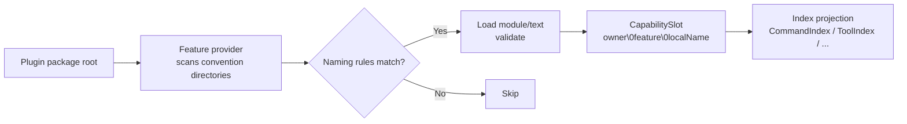

# Convention Directories

Place a `commands/` folder in your plugin package root, drop a `.ts` file in it, and the command appears -- no registration anywhere. These directories that are automatically scanned by the Feature discovery mechanism are called **convention directories**: each directory corresponds to a Feature package (feature provider), and files in the directory are mapped to capabilities according to naming rules. The discovery flow:



A few key points. The full capability id takes the form `owner\0feature\0localName` (`\0`-separated), where `localName` is determined by the relative path within the directory; duplicate `localName`s (or the same file source) under the same owner throw `DiscoveryConflictError`. When a directory does not exist or has no matching files, that Feature is silently skipped -- plugins only need to declare the directories they use. Additionally, modules with `target: server` are loaded and executed on the Node side, while `target: client` (pages) are loaded in the browser via build artifacts.

**Author imports (do not reinstall Features):** Apps that depend on `zhin.js` should import `define*` from facade subpaths -- `zhin.js/command`, `zhin.js/middleware`, `zhin.js/handler`, `zhin.js/adapter`, `zhin.js/component` (and `definePlugin` from `zhin.js`). The "Feature package" column below is the implementation package mounted by `platformFeatures`; Roots that depend on `zhin.js` / `@zhin.js/core` already inherit them -- **do not** `pnpm add @zhin.js/command` and friends.

**`zhin.features` vs package dependencies** (`@zhin.js/runtime` ≥1.0.12): every Feature package named in the manifest must also appear in that plugin's `dependencies` / `peerDependencies` / `optionalDependencies`, or startup throws `PackageResolutionError`. Child plugins should list Stable Features (command / middleware / component / handler) as **optional `peerDependencies`** provided by the Root via `zhin.js` -- **do not** add them to `dependencies`. Keep `@zhin.js/adapter` and experimental `@zhin.js/tool` in `dependencies` (or non-optional peers) when the plugin mounts them.

## Directory Overview

| Directory | File format | Recursive | target | Feature package | featureId | Default export |
| --- | --- | --- | --- | --- | --- | --- |
| `commands/` | `.ts` / `.tsx`, supports dynamic parameter files | Yes (subdirectories form hierarchy) | server | `@zhin.js/command` | `zhin.command` | `defineCommand(...)` |
| `middlewares/` | `.ts` | Yes | server | `@zhin.js/middleware` | `zhin.middleware` | `defineMiddleware(...)` |
| `handlers/` | `.ts` | Yes (`/` segments; omit `event` → map to `.` event name) | server | `@zhin.js/handler` | `zhin.handler` | `defineHandler(...)` |
| `components/` | `.ts` / `.tsx` | Yes | server | `@zhin.js/component` | `zhin.component` | `defineComponent(...)` |
| `adapters/` | `.ts` | Yes | server | `@zhin.js/adapter` | `zhin.adapter` | `defineAdapter(...)` |
| `tools/` | `.ts` | No | server | `@zhin.js/tool` | `zhin.agent-tool` | `defineAgentTool(...)` |
| `skills/` | Subdirectory + `SKILL.md` | One level | server | `@zhin.js/skill` | `zhin.skill` | Markdown text |
| `agents/` | `*.agent.md` | No | server | `@zhin.js/agent-feature` | `zhin.agent` | Markdown text |
| `mcp/` | `.ts` | No | server | `@zhin.js/mcp-feature` | `zhin.mcp` | `defineMcp(...)` |
| `pages/` | `.ts` / `.tsx`, with `$nav` / `$footer` layout slots | No | client | `@zhin.js/page` / `@zhin.js/layout` | `zhin.page` / `zhin.layout` | Page constructs |

## Naming Rules

Default segment rule: after removing extensions, directory names and regular file names must match `^[a-z0-9][a-z0-9-]*$` (lowercase letter/digit start, hyphens allowed). Non-matching files are skipped.

**Exception: `commands/`** static segments also allow Unicode names (e.g. `赞我.ts`), matching `isCapabilityLocalSegment` (`zhin.js`) — ASCII kebab, or a Unicode identifier with at least one non-ASCII character and no ASCII uppercase. Dynamic parameter files (`[name].ts`, etc.) remain ASCII-only. `tools/` also allows ASCII snake (e.g. `send_user_like.ts`). Other convention directories (middlewares / adapters / …) are not relaxed.

Supplementary rules per directory:

| Directory | localName derivation | Example |
| --- | --- | --- |
| `commands/` | Subdirectories and file names joined with `/`; static segments may be ASCII kebab or Unicode names (e.g. `赞我`); dynamic parameter files use Next.js-style brackets to declare their shape and map to `$name` segments: `[name].ts(x)` required, `[[name]].ts(x)` optional, `[...name].ts(x)` catch-all, `[[...name]].ts(x)` optional catch-all; type and default value are declared in `defineCommand({ params })` | `commands/lottery-today.ts` -> `lottery-today`; `commands/赞我.ts` -> `赞我`; `commands/lottery/[[game]].ts` -> `lottery/$game` |
| `middlewares/` | Relative path without extension, joined with `/` | `middlewares/keyword-reply.ts` -> `keyword-reply` |
| `handlers/` | Relative path without extension, `/`-joined capability localName; when `event` is omitted, `/` maps to `.` for the Lifecycle event name | `handlers/message/receive.ts` → localName `message/receive` → event `message.receive` |
| `components/` | Relative path without extension, joined with `/` | `components/share-music.ts` -> `share-music` |
| `adapters/` | Same as above | `adapters/napcat.ts` -> `napcat` |
| `tools/` | File name without extension (no subdirectory recursion); ASCII kebab or snake | `tools/music-search.ts` -> `music-search`; `tools/send_user_like.ts` -> `send_user_like` |
| `skills/` | Subdirectory name is the localName, directory must contain `SKILL.md` | `skills/memory-consolidate/SKILL.md` -> `memory-consolidate` |
| `agents/` | File name with `.agent.md` suffix removed | `agents/planner.agent.md` -> `planner` |
| `mcp/` | File name without extension (no recursion) | `mcp/my-server.ts` -> `my-server` |
| `pages/` | File name without extension; `$nav.tsx` / `$footer.tsx` are layout slots (when both `.ts` and `.tsx` exist for the same slot, `.tsx` takes precedence) | `pages/orchestration.tsx` -> `orchestration`; `pages/$nav.tsx` -> `nav` |

Malformed bracket syntax in command dynamic parameter files throws `CommandPathSyntaxError`, with the message `expected [name].ts(x), [[name]].ts(x), [...name].ts(x) or [[...name]].ts(x)`; a default value requires double brackets in the file name, and the parameter must be declared in `params`, otherwise the same error is thrown.

## Minimal Form for Each Directory

### commands/ -- `defineCommand`

```ts
// plugins/utils/lottery/commands/lottery-today.ts
import { defineCommand } from 'zhin.js/command';

export default defineCommand<LotteryConfig>({
  description: 'Show today published recommendation report',
  async execute({ use }) {
    const { db } = use(lotteryRuntimeToken);
    // ...return a string to reply
  },
});
```

### middlewares/ -- `defineMiddleware`

```ts
// plugins/utils/group-suite/middlewares/keyword-reply.ts (excerpt)
import { defineMiddleware } from 'zhin.js/middleware';

export default defineMiddleware<Message, GroupSuiteConfig>({
  target: 'inbound',
  async handle(context, next) {
    const config = resolveGroupSuiteConfig(context.config);
    if (!config.keywordReply) {
      await next();
      return;
    }
    // ...reply on keyword match, otherwise await next() to pass through
  },
});
```

### handlers/ -- `defineHandler`

Register listeners by **Lifecycle event name** (no `next()` chain). Directory paths use `/` as the capability localName; when `event` is omitted, `/` maps to `.` for the event name (e.g. `handlers/notice/receive.ts` → `notice.receive`). Importing from `@zhin.js/core/feature/handler` merges `Plugin.Lifecycle` into `HandlerEventMap`, so `event: 'message.receive'` gets typed arguments.

Plugins that depend on `zhin.js` / `@zhin.js/core` get `@zhin.js/handler` via `platformFeatures` — no extra declaration or install needed. `ImRuntime` dispatches:

- `message.receive` (before command/middleware)
- `notice.receive` / `request.receive` / `system.receive` (via `sideEventGatewayToken`)

Handler `this` is `HandlerContext`:

- `this.prompt` — interactive Q&A (same machinery as command `CommandPrompt`)

The event `$endpoint` field is immutable identity. Handlers never receive an escapable live
Endpoint; delivery, approval, and interaction use generation-bound ports.

vs `middlewares/`: use middleware for ordered inbound/outbound chains with `await next()`; use handlers for fire-and-forget work on a named event.

```ts
// handlers/message/receive.ts
import { defineHandler } from 'zhin.js/handler';

export default defineHandler({
  event: 'message.receive',
  async handle(message) {
    await this.prompt?.text('Continue?');
  },
});
```

```ts
// handlers/request/receive.ts
import { defineHandler } from 'zhin.js/handler';

export default defineHandler({
  event: 'request.receive',
  async handle(req) {
    if (await this.prompt?.confirm('Approve?')) await req.$approve();
  },
});
```

You can also call `addHandler(localName, defineHandler(...))` in `setup`; it lands in the same `HandlerIndex` as directory discovery.

### adapters/ -- `defineAdapter`

```ts
// plugins/adapters/napcat/adapters/napcat.ts (excerpt)
import { defineAdapter } from 'zhin.js/adapter';

export default defineAdapter<NapCatAdapterConfig>({
  capabilities: ['inbound', 'outbound'],
  create(context) {
    const config = resolveNapCatConfig(context.config);
    const gateway = context.use(messageGatewayToken);
    return new NapCatWsEndpoint({ id: context.id, gateway, config });
  },
});
```

`capabilities` must contain at least one of `inbound` / `outbound`; the lifecycle of the Endpoint returned by `create` is described in [WS/SSE Endpoint Lifecycle](./endpoint-lifecycle.md).

### tools/ -- `defineAgentTool`

```ts
// plugins/utils/music/tools/music-search.ts (excerpt)
import { defineAgentTool } from '@zhin.js/tool';

export default defineAgentTool<{ keyword: string; source?: MusicSource; limit?: number }>({
  description: 'Search for music and return a result list',
  inputSchema: {
    type: 'object',
    properties: { keyword: { type: 'string', description: 'Search keyword' } },
    required: ['keyword'],
  },
  approval: 'never',
  execute: ({ keyword, source, limit }) => searchMusic(String(keyword), source, limit ?? 5),
});
```

### skills/ and agents/ -- Markdown

`skills/<name>/SKILL.md` has frontmatter (`name` / `description` / `tools` whitelist, etc.), such as `examples/full-bot/skills/memory-consolidate/SKILL.md`:

```markdown
---
name: memory-consolidate
description: At the end of a round or when master says "remember", write 1-3 retrievable facts to memory_entries
tools:
  - memory_upsert
  - memory_search
---
```

`agents/<name>.agent.md` is an Agent persona/instruction file, such as `examples/multi-agent-room/agents/planner.agent.md`.

### pages/ -- Console Pages

`pages/*.tsx` is compiled into browser artifacts and mounted in the Remote Console; `examples/full-bot/pages/orchestration.tsx` is a ready-made example. `$nav.tsx` / `$footer.tsx` are consumed by `@zhin.js/layout`, injecting navigation and footer.

## Repository Examples

When looking for production-grade references, browse these directories directly: `commands` -- see `plugins/utils/lottery/commands/` (including dynamic parameter `lottery/[[game]].ts`); `middlewares` -- see `plugins/utils/group-suite/middlewares/` and `plugins/games/*/middlewares/`; `handlers` -- use `handlers/message/receive.ts` + `defineHandler` (see the minimal form above; add in-repo examples as needed); `components` -- see `plugins/utils/music/components/share-music.ts`; `adapters` -- see `plugins/adapters/napcat/adapters/napcat.ts`; `tools` -- see `plugins/utils/music/tools/` and `plugins/utils/group-suite/tools/`; `skills` -- see `examples/full-bot/skills/memory-consolidate/`; `agents` -- see `examples/multi-agent-room/agents/`; `pages` -- see `examples/full-bot/pages/orchestration.tsx`.
