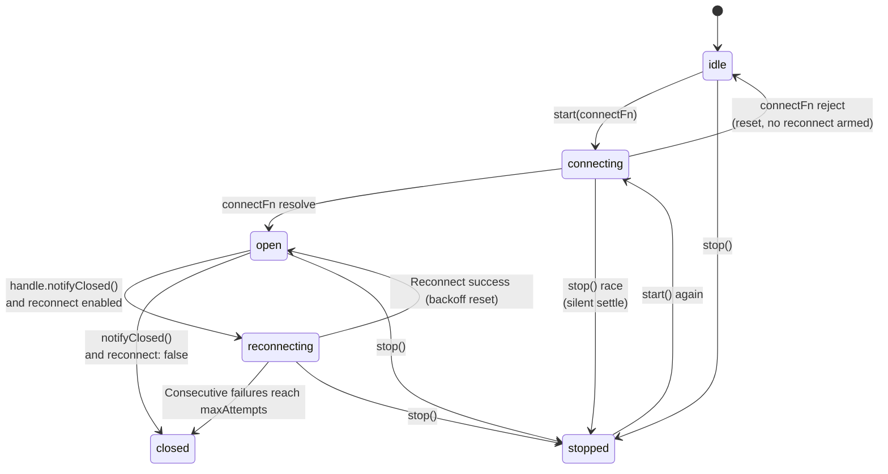

# WS/SSE Endpoint Lifecycle

Anyone who has hand-written a long-lived connection reconnection loop has hit the same pitfalls: a stale socket's late close event kills the new connection, a race between stop and connect throws unhandled rejections, and backoff timers are forgotten during cleanup. Long-lived connection endpoints (WebSocket / SSE) actually need the same state machine -- connect, disconnect, exponential backoff reconnect, heartbeat watchdog, and active stop. `@zhin.js/adapter`'s `createEndpointLifecycle` consolidates this state machine into a base, used by adapters like napcat. **When writing new WS/SSE endpoints, use the base directly -- don't hand-write `#started` / `#reconnectTimer` flags anymore.**

## State Machine



The most easily misunderstood point first: **initial connection failure is not the same as disconnect-reconnect**. When `start()`'s `connectFn` rejects, the state resets to `idle` and reconnect is not armed; the caller gets the error and can retry. Only connections that have **been open** arm backoff reconnect upon receiving `notifyClosed()`. Second, the stop-during-connect race: if `stop()` is called while `connectFn` is awaiting, `start()` silently resolves (active stop is not a failure).

Two more state-checking details: `started` is `true` if and only if the state is `connecting` / `open` / `reconnecting`; each connect attempt increments an internal generation, and **stale connection handles' `notifyClosed` / `onForceClose` are always ignored** -- late events from old sockets do not pollute the new connection.

## Configuration

```ts
import { createEndpointLifecycle } from 'zhin.js/adapter';

const lifecycle = createEndpointLifecycle({
  name: config.name,              // Used only for log fields
  reconnect: {
    initialIntervalMs: 5_000,     // First reconnect interval, default 5000
    multiplier: 2,                // Backoff multiplier, default 2 (1 = fixed interval)
    maxIntervalMs: 60_000,        // Backoff cap, default 60000
    jitterMs: 250,                // Random jitter upper bound, default 250
    maxAttempts: Infinity,        // Consecutive failure limit, exhausted enters closed terminal state
  },
  heartbeat: {
    intervalMs: 30_000,           // Default interval for startHeartbeat; <=0 disables it
    watchdogMisses: 0,            // Watchdog rounds, default 0 = disabled
  },
});
```

`reconnect: false` disables automatic reconnect; after the remote end disconnects, it goes directly to `closed`. The actual delay = `min(initial * multiplier^attempt, max) + random(0, jitter)`, with the attempt counter resetting on successful reconnect; the first disconnect logs a WARN, subsequent retries are silently demoted to DEBUG to avoid log flooding. Tests can inject `random: () => 0` for a deterministic backoff sequence.

## start / stop / notifyClosed

The `connectFn` contract: resolve when the connection opens, reject on failure or close before opening. It receives an `EndpointConnectHandle`:

```ts
await lifecycle.start(async (handle) => {
  const ws = new WebSocket(url, { headers });
  // Register the force-close function each time a new socket is obtained: both stop() and watchdog will call it
  handle.onForceClose(() => { try { ws.close(); } catch { /* ignore */ } });

  await new Promise<void>((resolve, reject) => {
    let settled = false;
    ws.on('open', () => {
      settled = true;
      lifecycle.startHeartbeat(() => ws.ping(), config.heartbeat_interval);
      resolve();
    });
    ws.on('close', (code, reason) => {
      // Remote disconnect: notify the base (reconnect only armed if previously open)
      handle.notifyClosed(new Error(`WS closed: ${code} ${reason}`));
      if (!settled) { settled = true; reject(new Error(`WS closed: ${code}`)); }
    });
    ws.on('error', (err) => {
      if (!settled) { settled = true; reject(err); }
    });
  });
});
```

`stop()` is an active stop: it clears all timers (reconnect + heartbeat), calls registered force-close functions, wakes all race waiters, **never triggers reconnect**, and is idempotent. Adapters call the base first in `stop()`, then perform their own cleanup:

```ts
// plugins/adapters/napcat/src/ws-endpoint.ts (excerpt)
async stop(): Promise<void> {
  await this.#lifecycle.stop();          // Clear timers + force-close ws + race settle
  this.#unregisterAgent?.();             // Adapter-specific cleanup
  rejectAllPending(this.#pending);
  this.#inboundDeduper.clear();
  if (this.#ws) {
    try { this.#ws.close(); } catch { /* ignore */ }
    this.#ws = undefined;
  }
}
```

## Heartbeat and PONG Watchdog

The heartbeat API has only three methods:

```ts
lifecycle.startHeartbeat(beat, intervalMs?);  // Start heartbeat (repeated calls clear old timer first)
lifecycle.stopHeartbeat();                    // Manually clear heartbeat (base auto-calls on close/stop/watchdog)
lifecycle.notifyHeartbeatAck();               // Feed the watchdog: reset counter on any response
```

Watchdog logic: when `watchdogMisses: N` is enabled, each heartbeat round first increments the miss counter; **after N consecutive rounds without any response** (`notifyHeartbeatAck` was not called), the base proactively calls the force-close function registered via `onForceClose` -- the underlying `close` event drives `notifyClosed`, following the normal backoff reconnect. Both `message` and `pong` callbacks on the ws should feed the watchdog:

```ts
ws.on('pong', () => this.#lifecycle.notifyHeartbeatAck());
ws.on('message', (data) => {
  this.#lifecycle.notifyHeartbeatAck();   // Traffic means alive
  handleMessage(data);
});
```

## Reference Implementation: napcat ws-endpoint

`plugins/adapters/napcat/src/ws-endpoint.ts` is the canonical usage of the base, structured in just four blocks:

```ts
export class NapCatWsEndpoint implements EndpointInstance {
  readonly #lifecycle: EndpointLifecycle;
  #ws?: NapCatWsSocket;
  #unregisterAgent?: () => void;

  constructor(options: NapCatWsEndpointOptions) {
    // 1. Create the base during construction; reconnect_interval legacy semantics = fixed interval:
    //    multiplier 1 + no jitter + no cap
    this.#lifecycle = createEndpointLifecycle({
      name: options.config.name,
      reconnect: {
        initialIntervalMs: options.config.reconnect_interval,
        multiplier: 1,
        maxIntervalMs: Number.MAX_SAFE_INTEGER,
        jitterMs: 0,
      },
    });
  }

  async start(): Promise<void> {
    if (this.#lifecycle.started) return;                 // Idempotent
    this.#unregisterAgent = registerNapcatAgentEndpoint(this.#options.config.name, this);
    try {
      await this.#lifecycle.start((handle) => this.#connect(handle));
    } catch (err) {
      // Start failure reset guaranteed by the base; agent register/unregister is adapter-specific, stays on adapter side
      this.#unregisterAgent?.();
      this.#unregisterAgent = undefined;
      throw err;
    }
  }
  // stop() see previous section; #connect(handle) see start/notifyClosed section
}
```

Compared to hand-written state machines, the base removes these fields and branches:

| Hand-written era | After base takeover |
| --- | --- |
| `#started` / `#stopping` / `opened` flags | `lifecycle.state` / `lifecycle.started` |
| `#reconnectTimer` + hand-written `setTimeout` chains | Built-in backoff loop, interruptible sleep, stop wakes immediately |
| `#heartbeatTimer` + missed PONG counting | `startHeartbeat` + `watchdogMisses` + `notifyHeartbeatAck` |
| "Stale socket's late close event kills new connection" | Generation-expired handles auto-invalidated |
| "stop vs connect race causing unhandled rejection" | stopWaiters race settle, silent resolve |

The adapter side retains only three categories of specific logic: agent registration mount/unmount (`registerNapcatAgentEndpoint`), pending request table rejection (`rejectAllPending`), and inbound deduplicator cleanup (`deduper.clear()`).

## Adapter 1:N Endpoints and Per-Endpoint Config

An Adapter package is declared once (`adapters/napcat.ts` -> `defineAdapter`), but can be expanded into **multiple endpoint instances** in configuration. The expansion rules are in `packages/im/adapter/src/adapter-index.ts`'s `expandEndpointConfigs`: when the plugin instance config contains a non-empty `endpoints: [{ name, ...overrides }]`, endpoints are created per array item, with base config = instance config minus the `endpoints` key, shallow-merged per item, with `name` forcibly written; when `endpoints` is empty or absent, a single endpoint is created from the instance config. `name` must be a non-empty string without `~` or `\0`; duplicate names keep the first and warn. The expanded endpoint id is `<capabilityId>~<name>`.

```yaml
# examples/full-bot/zhin.config.yml (excerpt)
plugins:
  napcat:
    connection: ws                 # Base config: shared by all endpoints
    endpoints:
      - name: full-bot-napcat      # Each endpoint's individual config
        url: ${ONEBOT11_WS_URL}
        access_token: ${ONEBOT11_ACCESS_TOKEN}
```

The `context.config` received by `create(context)` is the **merged single-endpoint config**, and `context.name` is that endpoint's name -- adapter code does not need to be aware of the 1:N expansion; one endpoint instance serves one connection.

The lifecycle hooks of the Endpoint instance itself are driven by the Adapter Index, aligned with generation transactions:

| Hook | Timing |
| --- | --- |
| `start()` | Allocate transport resources while the candidate activates |
| `open()` | Open the Endpoint-local event flow during candidate activation; the central generation gate still rejects inbound traffic before commit |
| `close()` | Stop admitting new events, preserve in-flight work |
| `stop()` | Release transport resources, call must be idempotent |
| `send(request)` | Outbound send |

`NapCatWsEndpoint` correspondence: `start()` internally uses `lifecycle.start(...)` to establish connection; `open()` / `close()` toggle the `#open` flag (`admit()` only accepts events when open); `stop()` goes through the base stop plus specific cleanup.

## References, merged forwards, and media resolution

An Endpoint that can retrieve content by a native platform id should expose the single `content: EndpointContentPort`. Do not add `$getMsg`, quote metadata, or eager-forward text enrichment:

```ts
interface EndpointContentPort {
  resolve(
    reference: ConversationReference, // message | forward | media
    context: {
      signal: AbortSignal;
      maxDepth: number;
      maxEntries: number;
      maxChars: number;
    },
  ): Promise<ConversationResolution>;
}
```

The result must be one of `resolved | not_found | unsupported | forbidden | expired | failed`. Return `unsupported` when the platform has no such capability; never return guessed or empty content. `resolve()` must observe the signal and depth/entry/character budgets. Core holds the current generation's snapshot lease for the complete asynchronous call. Message/forward speakers are neutral `actor` data and must never become model roles. Media may resolve to a stable URL, validated base64/path, or an explicit failure; never expose token-bearing download URLs to the Agent.
