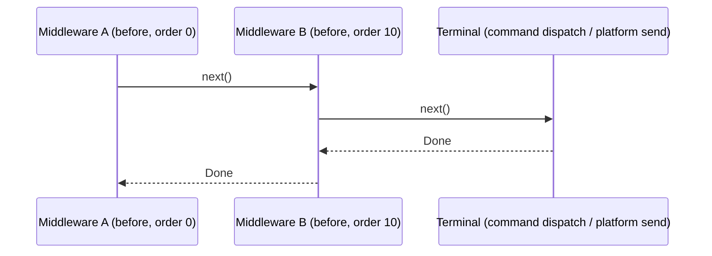
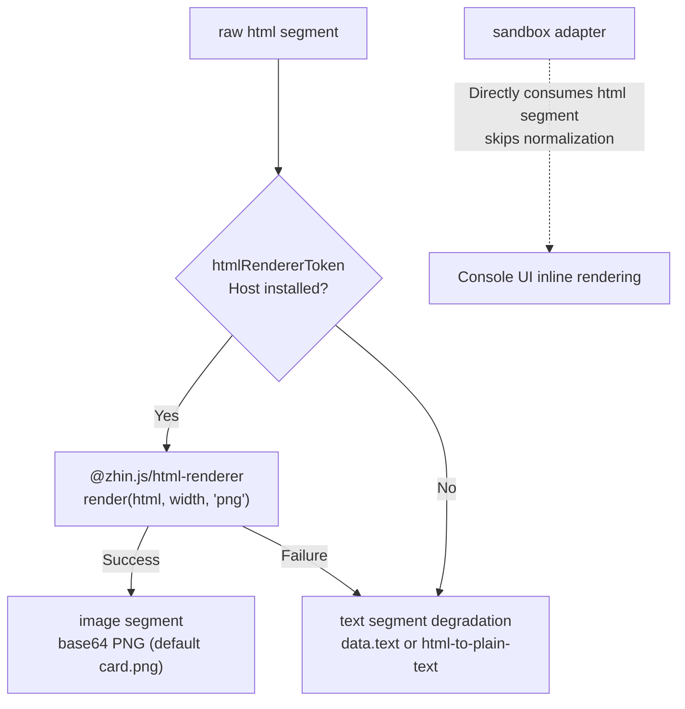

# Middleware and Components

There are two adjacent extension points on the message flow: `defineMiddleware` (`@zhin.js/middleware`) intercepts the message flow, and `defineComponent` (`@zhin.js/component`) renders structured props into sendable content (usually images). Game plugins use them together -- middleware normalizes input, components unify output.

## defineMiddleware

The `middlewares/` directory under the plugin package root is a convention directory. Each `.ts` file default-exports `defineMiddleware(...)`:

```ts
import { defineMiddleware } from '@zhin.js/middleware';
import type { Message } from '@zhin.js/core/runtime';

export default defineMiddleware<Message>({
  target: 'inbound',
  order: 10,
  async handle(context, next) {
    const text = context.input.content?.trim() ?? '';
    if (!text) {
      await next();
      return;
    }
    // ...process; call next() to pass through, return directly to intercept
    await next();
  },
});
```

### Declaration Fields

| Field | Default | Values | Description |
| --- | --- | --- | --- |
| `phase` | `'before-dispatch'` | `before-dispatch` / `after-dispatch` | Execute before or after command dispatch |
| `target` | `'inbound'` | `inbound` / `outbound` | Intercept inbound messages or outbound envelopes |
| `order` | `0` | Safe integer | Sort key within the same phase |

The two `target` values see different `context.input`. Under inbound, it is a Runtime `Message`, with readable `content`, `sender`, `$reply(...)` -- to intercept, simply don't call `next()` and `$reply` then return (this is the text entry pattern for game plugins). Under outbound, it is an outbound envelope (`OutboundEnvelope`), where `payload` is the wire segments about to be sent to the platform, allowing auditing, rewriting, or appending.

### Execution Order

Within the same `target`, the sort keys are, in order: **phase -> order -> plugin topology order (Root first, child plugins in tree order) -> slot id**. The chain follows the onion model:



Two constraints: `next()` may be called at most once; calling it again throws `Middleware next() called more than once`. Not calling `next()` breaks the chain, and the terminal is not executed. `context` also carries `config` / `use(token)` / `owner` / `generation`, consistent with other capability contexts.

For a real-world example, see `plugins/games/rps/middlewares/rps-choice.ts`: it recognizes game payload text (`rps:<session>:<choice>`) or numeric fallback ("1 Rock 2 Paper 3 Scissors"), processes and `$reply`s on match, otherwise calls `next()` to pass through to subsequent middleware and command dispatch.

## defineComponent

`components/` is a convention directory (supporting `.tsx`). Each file default-exports `defineComponent(...)`:

```tsx
// components/status-card.ts (distilled from examples/minimal-bot)
import { defineComponent } from '@zhin.js/component';
import { raw } from 'zhin.js/core/runtime';
import { Card, CardHeader, Row, StatChip, h, wrapCardHtml, DEFAULT_CARD_THEME } from '@zhin.js/satori';

interface StatusCardProps {
  readonly title: string;
  readonly lines: readonly { label: string; value: string }[];
}

export default defineComponent<StatusCardProps>({
  render({ title, lines }) {
    const body = h(Card, {
      children: [
        h(CardHeader, { title, meta: 'minimal-bot' }),
        h(Row, {
          gap: 10,
          children: lines.map((line) =>
            h(StatChip, { label: line.label, value: line.value, accent: DEFAULT_CARD_THEME.accentMem })),
        }),
      ],
    });
    return raw({
      type: 'html',
      data: { html: wrapCardHtml(body, DEFAULT_CARD_THEME.canvas), width: 540 },
    });
  },
});
```

### Invocation and Resolution

Commands (or any outbound content) invoke with `component(name, props)`:

```ts
import { component } from 'zhin.js/core/runtime';

return component('status-card', { title: 'my-bot', lines: [{ label: 'RSS', value: '42MB' }] });
```

Components are resolved **from the calling plugin upward along the plugin tree**: child plugins can first use their own same-named component to override, falling back to the parent plugin's if not found. Rendering is recursive -- a component's `render` can return `component(...)` again, with a depth limit of 32. `render(props, context)` also provides `requester` (the calling plugin node) in `context`, along with the usual `config` / `use` / `owner` / `generation`.

### Rendering to Images (html-renderer)

`raw({ type: 'html', data: { html, width } })` segments are transformed during outbound normalization:



The rendering Host is an optional resource (`htmlRendererToken`, provided by `@zhin.js/html-renderer`). **When not installed, it automatically degrades to text**, and component code needs no changes. Default width is 540px, format is PNG; `data.text` can serve as a custom degradation text, and `data.fileName` customizes the image file name. The sandbox adapter is a special case: it **directly consumes html segments** (inline display in Console UI), bypassing image/text normalization. The entire degradation is "best effort" -- rendering errors also fall back to text and don't block sending.

## Dual-Mode Degradation in Game Plugins

Game plugins (`plugins/games/*` + `@zhin.js/game-kit`) package "button keyboard + text numbers" as two consumption modes for the same content. Platforms supporting keyboards use button mode: `buildGridKeyboard` / `buildChoiceKeyboard` produce `keyboard` segments, with button payloads in the form `ttt:<sessionId>:<cell>`. Platforms without button capability use text mode: the same message includes an ASCII board and `fallbackHint` (e.g., "Place: reply with numbers 1-9 (empty spaces only)"), and `fallback.map` maps numbers back to payloads.

```ts
// plugins/games/tic-tac-toe/src/board-view.ts (excerpt)
return buildGridKeyboard({
  gamePrefix: TTT_PREFIX,
  sessionId,
  rows: 3,
  cols: 3,
  cells: boardToCells(board, highlight),
  statusLine,
  renderAscii: renderTttAscii,
  fallbackHint: '落子：回复数字 1-9（仅空格）',
  postChoices: terminal ? [{ id: 'restart', label: '🔄 再来一局', style: 'primary' }] : undefined,
  channelType,
});
```

The companion inbound middleware normalizes both input paths: direct payloads (button callback converted to text) go through `parseGridPayload`; plain numeric text is reverse-looked-up via `buildGridFallbackMap` into payloads, then processed by the same handler. At this point you can see that middleware and component degradation are two sides of the same idea: **content is written once and rendered according to platform capability**.
