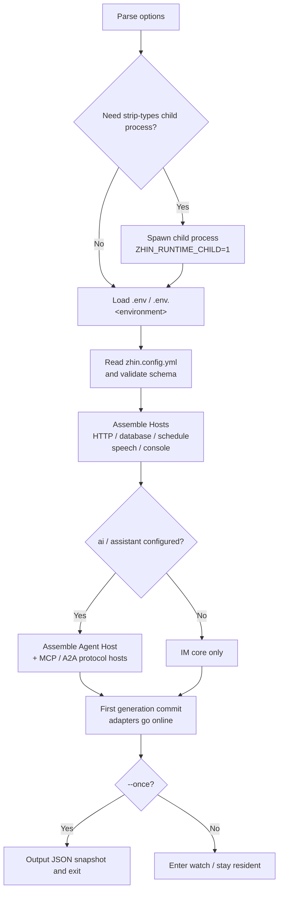

# zhin runtime start in Detail

After modifying a command file, you don't need to restart the process -- the next message runs the new logic. In development mode, all of this is handled by `zhin runtime start`. It directly executes `.ts` plugin source code in your project using Node's native TypeScript capabilities, assembles various Hosts as needed (HTTP / database / Console / Agent / MCP / A2A), and provides in-process hot reloading in development mode.

```bash
zhin runtime start                          # Development mode (default, watch + HMR)
zhin runtime start --mode production --no-watch   # Production mode
zhin runtime start --daemon                 # Daemon mode
zhin runtime start --once                   # Start once then exit (CI / scripts)
```

Scaffolded projects codify common combinations into scripts:

```json
{
  "scripts": {
    "dev": "zhin runtime start",
    "start": "zhin runtime start --mode production --no-watch"
  }
}
```

## Options

| Option | Description |
| --- | --- |
| `--mode <mode>` | Run mode: `development` (default) / `test` / `production` |
| `--environment <name>` | Environment name, default `development`; determines which `.env.<name>` is loaded, must match `/^[a-z0-9][a-z0-9-]*$/` |
| `--no-watch` | Disable file watching and hot reloading |
| `--once` | Output a JSON snapshot after completing one startup, then exit |
| `-d, --daemon` | Daemon mode: writes a pid file, redirects logs, auto-restarts on crash |
| `--log-file <path>` | Daemon log file, default `<project-root>/.zhin/runtime.log` |

Unknown options cause an immediate error before startup (fail fast), and will not enter a restart loop.

## Native TypeScript (strip-types)

Runtime does not compile the project before startup. Node executes plugin source directly. Supported versions match repository `engines`: `^20.19.0 || >=22.12.0`; unsupported versions fail immediately.

Foreground mode selects a wrapper based on Node's TypeScript support. Daemon mode always uses the supervisor -> child-process structure described below.

Because it's "source as runtime," importing local TS files requires the `.js` extension (the runtime does specifier remapping), which is also one of the repository's code conventions.

## Startup Flow



Note that the Agent stack is **loaded on demand**: only when `ai` / `assistant` is configured in any section will `@zhin.js/agent` be resolved; a pure IM project will not load AI dependencies. The output after successful startup also varies by environment -- in a TTY, it's a one-line summary (plugin count, HTTP address, online/offline adapters); in non-TTY or with `--once`, it outputs structured JSON (`{ started: true, ... }`), convenient for script consumption. Configuration validation failure reports `Invalid Plugin config in zhin.config.yml` and lists all issues.

## HMR Semantics

Development mode enables file watching by default (`--once` / `--no-watch` disables it). Changes are handled at two levels based on their scope of impact:

| Change | Handling |
| --- | --- |
| Plugin / application source code | **In-process generation reload**: only the affected capability slots and plugin subtrees are rebuilt; Console receives `hmr:reload` via SSE |
| Dependency manifest files (`pnpm-lock.yaml`, `pnpm-workspace.yaml`, `package-lock.json`, `yarn.lock`) | **Process-level restart**: the process exits with code `75`, and the outer supervisor re-launches it |

Generation reload is transactional: the new generation completes assembly and commit first, then asynchronously disposes the old generation. The HTTP port is released then re-listened during generation switching, preventing port-occupied Console loss. File events from the same batch are merged into a single generation transaction to avoid continuous jitter.

## Process Management

### Daemon Mode

```bash
zhin runtime start --daemon            # Logs go to .zhin/runtime.log
zhin runtime start -d --log-file ./bot.log
zhin stop                              # Stop (reads .zhin.pid)
```

The supervisor stays resident and writes its pid to `<project-root>/.zhin.pid`; the bot process's stdout/stderr is appended to the log file. Crashes (signals or non-zero exit) and exit code `75` both trigger a re-launch; `zhin stop` or `kill -TERM <pid>` performs a normal shutdown. There is also **storm protection**: a maximum of 10 restarts per minute with 3-second intervals; if the budget is exceeded, the supervisor gives up and exits, preventing a crash loop from flooding platform connections.

### Exit Codes

| Exit Code | Meaning |
| --- | --- |
| `0` | Normal exit |
| `51` | Console requested restart (automatically re-launched under daemon) |
| `75` | restartRequired (dependency state changes, etc.); supervisor restarts with storm protection |

### Orphan Watchdog

The bot process checks supervisor (`ZHIN_SUPERVISOR_PID`) and parent process liveness every 2 seconds. If the wrapper is `kill -9`'d, the terminal is closed, or it crashes, the bot will proactively shut down -- preventing zombie processes that still hold platform connections and file watchers. SIGINT / SIGTERM / SIGHUP are also forwarded to the child process.

## Typical Scenarios

```bash
# Daily development: HMR + Console
pnpm dev

# Production: disable watch, logs go to stdout (collected by systemd / container)
zhin runtime start --mode production --no-watch

# Bare-metal persistent: daemon + auto-start on boot
zhin runtime start --daemon
zhin service install

# CI smoke test: start once to verify configuration and assembly
zhin runtime start --once --mode test
```

See [CLI Reference](./index.md) for commands, [Configuration Reference](../configuration/index.md) for values, and [Production operations](../operations/production) for backup and recovery.
