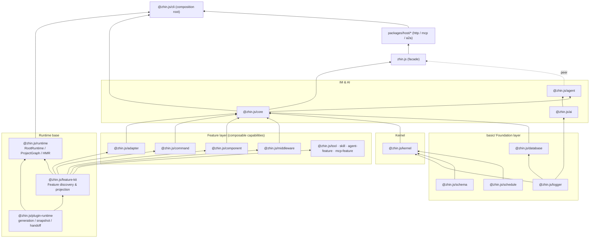

# Layered Architecture

`pnpm check:architecture` catches a class of errors in CI: a lower-layer package importing an upper-layer package. In this pnpm workspace monorepo, the dependency direction between packages is **unidirectional downward** -- upper layers may depend on lower layers, but lower layers never know about upper layers. This direction is enforced by harness checks, not a verbal agreement.

## Layer overview



The authoritative source for dependency relationships is each package's `package.json`. Before reading them, keep a few key facts in mind.

The foundation is `@zhin.js/plugin-runtime`: it depends on no workspace packages; generation, snapshot, dispose, and tokens all grow from here. One layer up, `@zhin.js/feature-kit` depends only on `plugin-runtime` and provides the registration, discovery, and projection mechanism for Feature providers. Feature-layer packages (adapter / command / component / middleware / tool / skill / ...) depend only on `feature-kit` + `plugin-runtime` and do not depend on each other.

Moving further up, `@zhin.js/core` assembles the adapter / command / component / middleware Features together with the kernel into the IM layer (Plugin, Adapter, Endpoint, message send/receive). The facade package `zhin.js` has workspace `dependencies` of only `@zhin.js/core`, `@zhin.js/logger`, and `@zhin.js/plugin-runtime`; `@zhin.js/agent`, `@zhin.js/ai`, etc. are optional peer dependencies -- so the default installation contains only the IM core, with AI added on demand.

## Layer responsibilities

| Layer | Package | Responsibility |
|-------|---------|---------------|
| Foundation | `basic/logger` `schema` `schedule` `database` | Logging, config validation, scheduling, database -- zero/near-zero dependencies |
| Runtime base | `@zhin.js/plugin-runtime` | Generation transactions, snapshot leases, handoff, dispose (see [Generation & lifecycle](./generation-lifecycle.md)) |
| Feature mechanism | `@zhin.js/feature-kit` | Declare Feature providers, discover capabilities by convention, project into runtime indexes |
| Kernel | `@zhin.js/kernel` | Plugin system and error hierarchy, no IM concepts |
| Feature layer | `@zhin.js/adapter` `command` `component` `middleware` ... | Contract for a capability type (e.g. `defineAdapter`) + projection index (e.g. `AdapterIndex`) |
| AI engine | `@zhin.js/ai` | Provider, agentLoop, sessions, memory -- no IM concepts |
| IM layer | `@zhin.js/core` | Plugin, message pipeline, command dispatch (see [Message flow](./message-flow.md)) |
| Agent | `@zhin.js/agent` | Multi-model orchestration, tool security policies, MCP client |
| Facade | `zhin.js` | Re-exports the core authoring surface; `zhin.js/agent`, `zhin.js/ai` sub-paths exposed on demand |
| Runtime | `@zhin.js/runtime` | `RootRuntime`: scans the project graph, composes configuration, executes generation transactions, HMR |
| Assembly | `@zhin.js/cli` | Composition root -- `zhin runtime start` wires everything together |

## Composition root: `@zhin.js/cli`

The framework itself does not "start" anything -- each layer only provides mechanisms. The code that assembles these mechanisms into a runnable process is concentrated in `@zhin.js/cli`, the only place in the entire repo allowed to import across all layers (the sole exception to the layering rules).

`zhin runtime start` (defined in `basic/cli/src/commands/runtime.ts`, assembly logic in `basic/cli/src/plugin-runtime/`) does the following:

1. Wraps `zhin.config.yml` with `YamlConfigDocument` (`@zhin.js/config-yaml`) into a transactional `ConfigDocumentPort`;
2. Creates `RootRuntime` (`@zhin.js/runtime`), injecting the module loader (in dev mode: `NativeDevelopmentModuleRuntime`), config port, and Root resource installer;
3. Installs Host-level resources via `installResources`: HTTP Host, database, Agent Host (including AI fallback handler), Console API, etc.;
4. After startup, attaches `HmrCoordinator` -- file changes trigger generation reloads or process restarts.

A user project's entry point can therefore be minimal. `examples/minimal-bot/package.json`:

```json
{
  "name": "minimal-bot",
  "type": "module",
  "scripts": {
    "dev": "zhin runtime start",
    "start": "zhin runtime start --mode production --no-watch"
  },
  "dependencies": {
    "zhin.js": "workspace:*"
  },
  "zhin": {
    "protocol": 1,
    "type": "plugin",
    "entry": "./plugin.ts",
    "engine": "^1.0.0",
    "runtime": "trusted",
    "features": [],
    "plugins": []
  }
}
```

The project itself is a plugin (Root Plugin), and the CLI is responsible for discovering and starting it. For a full explanation of manifest fields, see [Plugin model](./plugin-model.md); for config declaration and validation, see [Config as data](./config-as-data.md).

## Corollaries of the layering rules

When writing a Feature (a new capability type), depend only on `feature-kit` / `plugin-runtime` -- do not import `core`. `kernel` and `ai` know nothing about IM concepts like "group" or "direct message"; IM concepts only appear in `core` and above. Host packages (`packages/host/http`, `mcp`, `a2a`) sit above `core` and are assembled by the CLI; plugins do not depend on Host processes directly.
