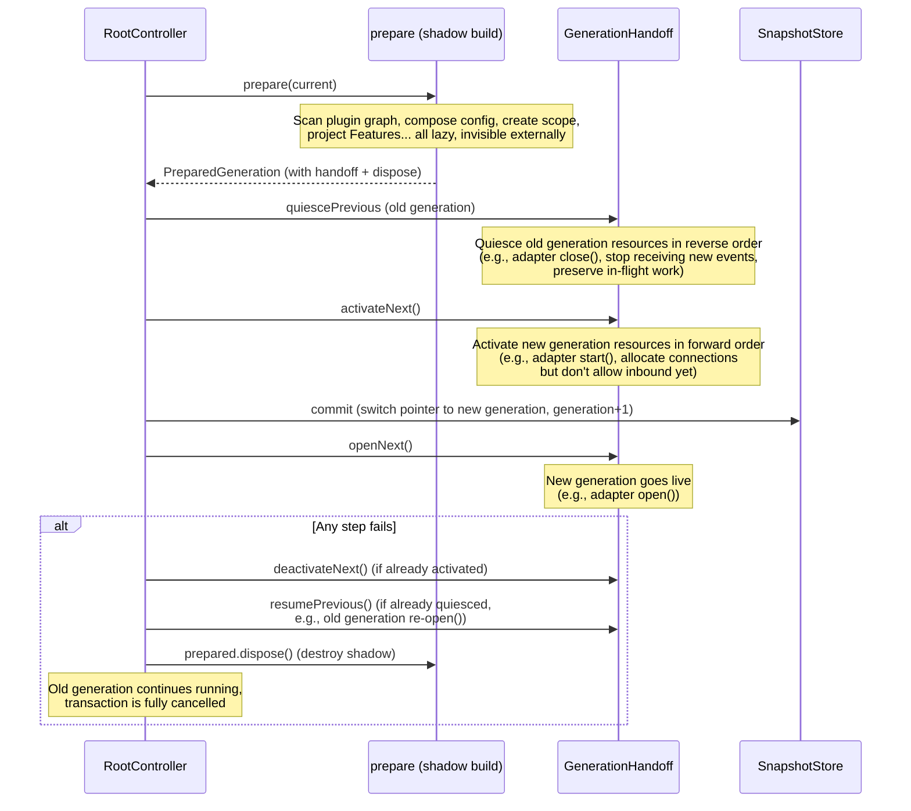

# Generation and Lifecycle

After modifying a command file, you don't need to restart the process, and in-flight messages won't be cut off mid-way -- because startup, hot reload, and configuration changes all follow the same path in the runtime: a **generation transaction**. The new generation is fully built in a "shadow" first, then an atomic handoff is performed. At any moment there is exactly one current generation in the process; if the handoff fails, the old generation continues serving as-is -- there is no half-new, half-old intermediate state.

## Snapshot: The World State of a Generation

Each generation is an immutable `RuntimeSnapshot` (`@zhin.js/plugin-runtime`):

```ts
interface RuntimeSnapshot {
  readonly generation: number;                       // Generation number, monotonically increasing from 0
  readonly root: PluginId;
  readonly tree: ReadonlyMap<PluginId, PluginNodeSnapshot>;   // Plugin tree
  readonly config: ReadonlyMap<PluginId, unknown>;            // Each plugin's ConfigView
  readonly resources: ReadonlyMap<PluginId, ReadonlyMap<TokenId, unknown>>;
  readonly capabilities: ReadonlyMap<CapabilityId, CapabilitySlot>;
  readonly projections: ReadonlyMap<FeatureId, unknown>;      // AdapterIndex, CommandIndex...
}
```

Snapshots are deeply frozen (Maps are read-only views as well), so plugin code always sees the world state of a specific determined generation.

## Five-Phase Atomic Handoff

`RootController` serializes all control operations (promise queue), executing the same pipeline for each transaction:



The corresponding code skeleton (`RootController.transact`):

```ts
const previous = this.snapshots.acquire();
try {
  prepared = await prepare(previous.value);
  if (!prepared) return previous.value;      // No changes, return directly
  if (prepared.handoff) {
    await prepared.handoff.quiescePrevious(previous.value);
    await prepared.handoff.activateNext();
  }
  return this.#commitGeneration(previous.value.generation, prepared);
} catch (error) {
  return this.#rollback(prepared, { quiesced, activated }, error);
} finally {
  previous.release();
}
```

`GenerationHandoffStack` combines handoff actions from multiple resources: quiesce runs in reverse order, activate runs in forward order; if a step fails mid-way, automatic compensation kicks in (quiesced resources are resumed, activated resources are deactivated). If compensation also fails, the errors are aggregated into an `AggregateError` and thrown.

### Adapters Are the Most Intuitive Example

The projection in `@zhin.js/adapter` maps the entire Endpoint lifecycle to these five phases:

| Handoff Phase | Action | Endpoint Method |
|---------------|--------|-----------------|
| quiescePrevious | Old generation stops receiving new messages | `close()` |
| activateNext | New generation establishes connections (no inbound yet) | `start()` |
| After commit, openNext | New generation allows inbound traffic | `open()` |
| On failure, deactivateNext | New generation releases resources | `stop()` |
| On failure, resumePrevious | Old generation resumes inbound traffic | `open()` |

Endpoint contract (`EndpointInstance`): `start` allocates transport resources but must not receive events; `open` allows traffic after the new generation is committed; `close` stops new events but preserves in-flight work; `stop` releases resources and must be idempotent.

## Snapshot Leases: In-Flight Messages Are Not Interrupted

Committing only switches the pointer -- the old generation is not destroyed immediately since it may still be serving in-flight messages. `SnapshotStore` manages this with leases:

- `acquire()` obtains the current generation snapshot and increments the reference count; call `release()` when done;
- A replaced old generation is marked as retired and only truly `dispose()`d when the lease count reaches zero;
- `RootController.stop()` waits for all historical generations to be released before returning, so shutdown does not cut off resources mid-message-processing.

## HMR Semantics

`HmrCoordinator` (`@zhin.js/runtime`) watches for file changes, merges a batch of filesystem events from the same operation into a single transaction, and then uses `InvalidationPlanner` to plan the invalidation scope:

- **Generation-level**: Changes only affect certain plugin subtrees or capability slots -- only the affected parts are rebuilt (subtree / slot / topology, three kinds of preparers), going through the handoff described above;
- **Process-level**: Changes that the module loader cannot safely invalidate, or manifest topology changes that cross the restart boundary (determined by `RestartBoundaryPlanner`, e.g., adding/removing child plugin dependencies) -- handed to `onRestartRequired`, with the outer layer (CLI) restarting the process.

A failed HMR transaction cancels the remaining changes in the batch and invokes `onError`; it will not silently replay.

## Why Resources Must Be Attached to Lifecycle

Hot reload = old generation destroyed, new generation rebuilt. If a plugin stores resources in **module-level variables** (`let _db = ...`), when the module is reloaded the old variable dies with the old generation, but some callbacks still hold references to it -- this is the classic cause of "ghost singleton" incidents (timers firing repeatedly, using an already-closed database connection).

The rule is simple: **all resources with a lifecycle must be registered in `context.lifecycle` (a `DisposeStack`)**, and they are automatically deregistered when the generation ends.

Cross-module generation-scoped state should use `createGenerationStore`, the generation-safe replacement for module-level singletons:

```ts
import { createGenerationStore } from '@zhin.js/plugin-runtime';

const dbStore = createGenerationStore<Database>('my-plugin.db');

// In setup: publish the value for this generation, automatically deregistered when lifecycle disposes
export default definePlugin({
  name: 'my-plugin',
  setup(context) {
    const db = openDatabase(context.config.get());
    context.lifecycle.add(() => db.close());
    dbStore.provide(context, db);
  },
});

// At runtime in any module: always gets the value from the current active generation
const db = dbStore.use();      // Throws an error with the store name if no active value
const maybe = dbStore.tryUse(); // Or returns undefined if no active value
```

Values provided form a stack: the most recent active registration wins; when the owning generation ends and the registration is removed by `lifecycle`, the previous generation's value is automatically re-exposed. This structurally eliminates the possibility of "continuing to run with a reference to a destroyed generation."
