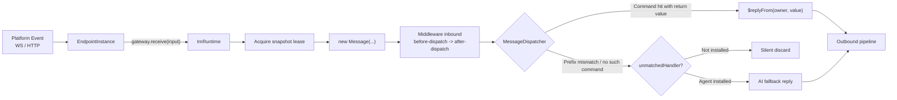
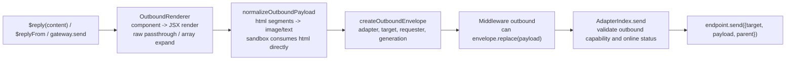

# Message Flow

When a user sends `/ping` in a group chat, through to the Bot's reply landing back on the platform, every step passes through a unidirectional pipeline: **inbound** flows from the platform Endpoint to commands/AI, **outbound** flows from plugin code to the platform Endpoint. The entire pipeline is orchestrated by `ImRuntime` (the `MessageGateway` implementation in `@zhin.js/core`), with each step reading from the current generation snapshot -- naturally hot-reload safe.

## Inbound: Adapter -> Middleware -> Command -> AI Fallback



The actual code locations for each step:

1. **Endpoint normalization**. The platform adapter's Endpoint (e.g., the sandbox's `SandboxWsEndpoint`) normalizes platform events into `IncomingMessage` and calls the `messageGatewayToken` injected at creation time:

   ```ts
   interface IncomingMessage {
     readonly adapter: CapabilityId;  // Source endpoint's capability ID
     readonly target: string;         // Scene, e.g., "group:123" / "private:456"
     readonly content: string;
     readonly id?: string;            // Platform message ID
     readonly sender?: string;
     readonly metadata?: Readonly<Record<string, unknown>>; // e.g., endpoint name
   }
   ```

2. **Lease and Message**. `ImRuntime.receive` first `acquire()`s the current generation snapshot (in-flight messages are not interrupted by reloads, see [Generation and Lifecycle](./generation-lifecycle.md)), looks up the owner plugin for that endpoint as the default requester, and constructs a `Message`. `Message` carries two outbound closures: `$reply(content)` and `$replyFrom(owner, content)`; after dispatch ends, the reply scope is closed, and calling `$reply` afterward throws `Message reply scope has ended`.

3. **Inbound middleware**. `MiddlewareIndex` sorts by `phase` (`before-dispatch` first, `after-dispatch` later) and `order`, wrapping each around the terminal action:

   ```ts
   defineMiddleware({
     phase: 'before-dispatch',   // Default
     target: 'inbound',          // Default; 'outbound' intercepts outbound
     order: 0,
     async handle(context, next) {
       // context.input is Message (inbound) or OutboundEnvelope (outbound)
       await next();             // Not calling next() intercepts the message
     },
   });
   ```

4. **Command dispatch**. `MessageDispatcher` first resolves the command prefix (by default based on the message's adapter instance configuration: `endpoints[i].commandPrefix` overrides the top-level `commandPrefix`, defaulting to `''` with no prefix, see [Config as Data](./config-as-data.md)). If the prefix doesn't match, it's an immediate miss; if the prefix matches, it is stripped and passed to `CommandIndex.dispatch`. When a command has a return value, the dispatcher automatically replies using the command owner's identity via `$replyFrom(owner, value)`.

5. **AI fallback**. On command miss (or unmatched plain text), the `unmatchedHandler` takes over -- a Host with `@zhin.js/agent` installed routes it to the Agent for reply; without it, the message is silently discarded.

6. **Event broadcast**. After dispatch completes, a `RuntimeMessageEvent` is emitted to `onMessage` subscribers (containing direction, adapter, target, sender, a `contentPreview` of up to 200 characters, and timestamp). The Console's real-time message stream consumes this.

## Outbound: $reply -> Render -> Middleware -> Endpoint



- **SendContent forms** (`packages/im/core/src/plugin-runtime/im/contracts.ts`): string; canonical `Segment` (first-class citizen, see "Multimodal" below); `component(name, props)` component call (recursively rendered via `ComponentIndex`, depth limit 32); `raw(payload)` passthrough; and nested arrays of any of these.
- **Envelope** carries `adapter`, `target`, `requester` (the originating plugin, used for component permissions and auditing), `generation`, and provides `replace(payload)` for outbound middleware to rewrite content.
- **Outbound middleware** shares the same definition as inbound; `target: 'outbound'` intercepts outbound messages.
- **The last mile** is in `AdapterIndex.send`: the endpoint must declare `outbound` capability and be in `started && !stopped` state, otherwise an error is thrown; once passed, `endpoint.send()` is called to deliver to the platform.

All sending should go through this unified pipeline (`$reply` / `$replyFrom` / `gateway.send`). Do not directly hold platform SDKs in plugins to send messages -- that would bypass rendering, middleware, and event broadcasting.

## Multimodal: bidirectional Segment uniformity

The framework has exactly one media representation -- canonical `Segment` + `MediaRef` (`packages/im/core/src/built/segment-contract/types.ts`):

```ts
interface MediaRef {
  kind: 'url' | 'path' | 'base64' | 'file';  // file = opaque platform ref (e.g. Telegram file_id)
  value: string;
  mime_type?: string;
  file_name?: string;
  size?: number;
}
// image / audio / video / file segment data is always { media: MediaRef, alt?/duration?/name? }
```

**Inbound**: adapters normalize platform payloads into `Segment[]` via `gateway.receive({ segments })` → the agent's inbound injection (`packages/im/agent/src/turn/inbound-media.ts`) attaches the current turn's media to `UserMessage.media` (the ai layer's Segment-isomorphic `MediaContentBlock`, **never persisted** -- history keeps only the text view). Policy via `ai.multimodal`: images pass through as URL or materialize from path to base64; audio defaults to STT (optional `@zhin.js/speech`, placeholder on failure); video/files default to placeholder text. The provider-edge serializer (`packages/im/ai/src/llm/convert/media-blocks.ts`) filters by a capability table (image-only by default, unsupported kinds degrade to placeholder text at the edge) -- no vendor API format ever appears inside the framework.

**Outbound**: AI reply → `OutputElement[]` → canonical `Segment[]` (`publishOutboundElements`) → `$reply` (Segment is first-class `SendContent`) → `normalizeOutboundPayload` (html→image/text, keyboard, media negotiation) → endpoint. Negotiation is driven by the adapter definition's `segments.outboundMedia` declaration (`'url' | 'path' | 'base64' | 'upload'`): only `url-or-text` endpoints degrade non-URL media to text centrally; other adapters materialize along the platform-optimal path (URL pass-through / base64 / platform upload / disk read). Segments without `data.media` are dropped with a warning -- the legacy `data.url/file/base64` shapes no longer exist.

## Endpoint 1:N Expansion

When an adapter plugin instance configuration declares `endpoints: [{name, ...}]`, `AdapterIndex` expands it into N independent endpoint records (for configuration merge rules see [Config as Data](./config-as-data.md)):

- Each record's capability ID is in the form `<slot id>~<name>`, with its own lifecycle (start/open/close/stop) and online status;
- The `$adapter` on a message carries the expanded identifier (e.g., `icqq~8596238`), and replies are routed back to the corresponding account via the same path;
- The Console side addresses by `(adapter, endpointId)`. `AdapterIndex.resolve` matches in order: local name, capability ID, owner path segment, and the Endpoint's runtime name (e.g., ICQQ's uin). When multiple matches occur, the exact endpoint name takes priority.

Therefore, "two QQ accounts each receiving their own messages and sending their own replies" requires no special code -- just configure two endpoint entries.
