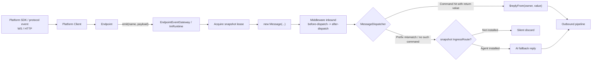
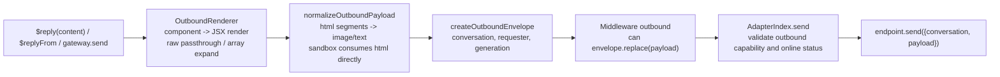

# Message Flow

When a user sends `/ping` in a group chat, through to the Bot's reply landing back on the platform, every step passes through a unidirectional pipeline: **inbound** flows from the platform Endpoint to commands/AI, **outbound** flows from plugin code to the platform Endpoint. `ImRuntime` implements both the sole inbound `EndpointEventGateway` and the outbound `OutboundMessageService`; both use the generation snapshot held by the current operation.

## Inbound: Adapter -> Middleware -> Command -> AI Fallback



The actual code locations for each step:

1. **Client and Endpoint responsibilities**. Client is the real platform SDK or a clean protocol Client. It owns platform APIs and raw events. Endpoint owns the account, transport, hot-reload lifecycle, and framework boundary. Every platform Endpoint extends `Endpoint<TClient>` and enters Core only through `emit(name, payload)`. Core wraps every event as `{ name, payload, endpoint, client }`.

   Native events are first emitted losslessly as `platform.receive` with `{ name, event }`; known events may additionally be projected to `message.receive`, `notice.receive`, `request.receive`, or `system.receive`. Messages, join requests, member changes, online/offline events, and platform extensions therefore all expose the same Client to plugins. Events produced while a candidate generation starts are buffered by the Endpoint base and replayed in order on admission; late events from a retired generation are dropped.

2. **Message normalization**. A `message.receive` payload has this shape:

   ```ts
   interface IncomingMessage {
     readonly conversation: ConversationRef; // Structured conversation (endpoint/kind/id/parent/threadId)
     readonly message?: MessageRef;   // Platform message identity (native message id)
     readonly content: string;
     readonly segments?: readonly Segment[];
     readonly sender?: { id: string; name?: string; roles?: readonly string[] };
     readonly replyTo?: { id: string }; // Explicit platform reference; never guessed from metadata
     readonly metadata?: Readonly<Record<string, unknown>>;
   }
   ```

3. **Lease and Message**. `ImRuntime.endpointEvents.receive` acquires a lease on the event's generation (in-flight events are not interrupted by reloads, see [Generation and Lifecycle](./generation-lifecycle.md)). Message events construct a `Message` with a lazy `$client` getter for the current platform SDK instance, `$reply(content)`, and `$replyFrom(owner, content)`; after dispatch ends, reading `$client` or calling `$reply` fails because the operation scope has ended.

4. **Inbound middleware**. `MiddlewareIndex` sorts by `phase` (`before-dispatch` first, `after-dispatch` later) and `order`, wrapping each around the terminal action:

   ```ts
   defineMiddleware({
     phase: 'before-dispatch',   // Default
     target: 'inbound',          // Default; 'outbound' intercepts outbound
     order: 0,
     async handle(context, next) {
       // context.input is Message (inbound) or OutboundEnvelope (outbound)
       await next();             // Not calling next() intercepts the message
     },
   });
   ```

5. **Command dispatch**. `MessageDispatcher` first resolves the command prefix (by default based on the message's adapter instance configuration: `endpoints[i].commandPrefix` overrides the top-level `commandPrefix`, defaulting to `''` with no prefix, see [Config as Data](./config-as-data.md)). If the prefix doesn't match, it's an immediate miss; if the prefix matches, it is stripped and passed to `CommandIndex.dispatch`. When a command has a return value, the dispatcher automatically replies using the command owner's identity via `$replyFrom(owner, value)`.

6. **AI fallback**. On command miss (or unmatched plain text), `ImRuntime` resolves a generation-owned `IngressRoute` from the root resources of the snapshot held by the message. The composition root provides this internal route during generation setup when `@zhin.js/agent` is installed; without it, the message is silently discarded. It is not a mutable plugin setter on `OutboundMessageService`.

   Core passes canonical user content to this route without encoding sender identity into text. Agent ingress projects the trusted sender, roles, and scene scope once into `UserMessage.actor`; AI persistence stores that actor and renders participant labels only at the LLM boundary. `agent_messages.extra` carries quote presentation context only and cannot become a second identity source.

7. **Event broadcast**. After dispatch completes, a `RuntimeMessageEvent` is emitted to `onMessage` subscribers (containing direction, conversation, sender, a `contentPreview` of up to 200 characters, and timestamp). The Console's real-time message stream consumes this.

## Outbound: $reply -> Render -> Middleware -> Endpoint



- **SendContent forms** (`packages/im/core/src/plugin-runtime/im/contracts.ts`): string; canonical `Segment` (first-class citizen, see "Multimodal" below); `component(name, props)` component call (recursively rendered via `ComponentIndex`, depth limit 32); `raw(payload)` passthrough; and nested arrays of any of these.
- **Envelope** carries `conversation` (structured conversation addressing, `ConversationRef` from `@zhin.js/im-contract`), `requester` (the originating plugin, used for component permissions and auditing), `generation`, and provides `replace(payload)` for outbound middleware to rewrite content.
- **Outbound middleware** shares the same definition as inbound; `target: 'outbound'` intercepts outbound messages.
- **Runtime ownership** belongs to `OutboundDeliveryRuntime`: it exclusively controls rendering, media and interaction policy projection, outbound middleware, Endpoint delivery, conversation fact recording, and observer event publication. `ImRuntime` only acquires the correct generation lease and delegates delivery.
- **The last mile** is in `AdapterIndex.send`: the endpoint must declare `outbound` capability and be in `started && !stopped` state, otherwise an error is thrown; once passed, `endpoint.send()` is called to deliver to the platform.

Ordinary message delivery must go through this unified pipeline (`$reply` / `$replyFrom` / `OutboundMessageService.send`) so rendering, middleware, and event broadcasting are preserved. Non-message business operations such as join approval, role management, and platform queries should resolve the Client from the current event/command/tool operation and call the platform SDK directly. Do not retain a Client beyond that operation.

## Multimodal: bidirectional Segment uniformity

The framework has exactly one media representation -- canonical `Segment` + `MediaRef` from `@zhin.js/im-contract`:

```ts
interface MediaRef {
  kind: 'url' | 'path' | 'base64' | 'file';  // file = opaque platform ref (e.g. Telegram file_id)
  value: string;
  mime_type?: string;
  file_name?: string;
  size?: number;
}
// image / audio / video / file segment data is always { media: MediaRef, alt?/duration?/name? }
```

**Inbound**: adapters normalize platform payloads into `Segment[]` via `emit('message.receive', { segments })`. Opaque platform ids must be materialized through the current generation's `EndpointContentPort`; the snapshot lease remains held until resolution settles. URLs, paths, and base64 then share one pipeline: HTTPS/SSRF and redirect checks → byte limit → file-signature detection → declared/actual type validation → `UserMessage.media`. File extensions and adapter-declared MIME values are not trusted, and binary/base64 data is never persisted in the conversation fact store. Every media item reaches exactly one `accepted | derived | unsupported | rejected | failed` terminal state. Failures are explicit untrusted user-context data, never a placeholder pretending the model saw the media. Providers must explicitly declare `text/image/audio/video/file` input support; omission means text-only.

## Conversation facts, references, and notices

`ConversationEventStore` is the sole IM-context fact source. Inbound/outbound messages, recall tombstones, reactions, member joins/leaves, mute/unmute, and role changes are appended idempotently in conversation order. There is no parallel `im_transcripts` or text `chat_history` ledger. Merged-forward entries use neutral `actor` data and are never assigned model `user/assistant/system` roles.

Each `ImRuntime` privately owns one `ConversationRuntime`. It exclusively controls Store replacement, event normalization, message recording, context aggregation, and consumer cursors. The message gateway submits established inbound, outbound, and notice facts to that owner; CLI and Agent consume a read-only Store view and context methods through `ImRuntime` instead of replacing owner state directly.

Unread inbound conversation messages are consumed from that same Store by the Agent-session cursor and projected as untrusted `user-context`; the message that triggered the current Turn is excluded to prevent duplication. There is no process-global passive buffer. Failed Turns do not advance the cursor, and HMR or multiple Roots cannot share side-channel state.

The current Turn registers `replyTo`, forward, and media values as scoped `TurnReference`s. The Agent exposes only `inspect_conversation_reference(reference, depth?)`: it checks local facts first, then resolves through the lease-bound Endpoint. Cross-conversation, cross-Endpoint, and expired-Turn access fails closed. Important unread notices are attached to the next user Turn as explicitly untrusted conversation data, never as system/developer instructions. The session cursor advances only after a successful Turn; failed Turns retain the events. High-frequency reactions/pokes are aggregated, while login, QR, disconnect, and other process events remain diagnostics only.

**Outbound**: AI reply → `OutputElement[]` → canonical `Segment[]` (`publishOutboundElements`) → `$reply` (Segment is first-class `SendContent`) → `normalizeOutboundPayload` (html→image/text, keyboard, media negotiation) → endpoint. Negotiation is driven by the adapter definition's `segments.outboundMedia` declaration (`'url' | 'path' | 'base64' | 'upload'`): only `url-or-text` endpoints degrade non-URL media to text centrally; other adapters materialize along the platform-optimal path (URL pass-through / base64 / platform upload / disk read). Segments without `data.media` are dropped with a warning -- the legacy `data.url/file/base64` shapes no longer exist.

## User Interaction: Confirmation, Selection, and Input

Command authoring uses `context.interaction` (`UserInteraction`). `ask()` describes a typed text, number, confirmation, selection, multiselection, or list request, while `sequence()` composes consecutive requests. Core projects each request into a transport-neutral view and renders it as markdown plus a canonical keyboard. Adapters that declare native interactive segments encode platform buttons; other adapters receive a numbered-list fallback whose button clicks and manual replies enter the same parser.

`ImRuntime` delegates this concern to its private `RuntimeInteractionCoordinator`. The coordinator exclusively owns pending reply claims, timeouts and cancellation, sequences, action handlers, and numbered fallbacks. State is isolated by user, generation, and conversation, so a new generation cannot consume old keyboard mappings and separate Roots never share interaction state. The message gateway only decides when to invoke the coordinator; it does not implement the interaction state machine.

## Endpoint runtime ownership

Each `ImRuntime` exposes one instance-owned `EndpointRuntime` as the sole runtime entry to the generation-owned `AdapterIndex`. Endpoint listing, capability lookup, Console-addressed delivery, reactions, recalls, edits, typing, and management operations acquire and release the current snapshot lease there. Upper-layer Hosts depend on narrow ports containing only the operations they use. `ImRuntime` retains the canonical inbound gateway and delegates every send to its private `OutboundDeliveryRuntime`, so Console-addressed delivery still follows `render -> before.sendMessage -> AdapterIndex.send` and cannot bypass rendering or middleware.

The former flat `ImRuntime.listEndpoints()`, `sendEndpointMessage()`, and related methods are removed. Internal composition uses `im.endpoints.*` without forwarding aliases or a second Endpoint authority.

Observers use the read-only `im.messageEvents.subscribe()` source. Console and Inbox can consume bounded message projections but cannot publish or forge Core runtime events. The former flat `im.onMessage()` method is removed.

## Endpoint 1:N Expansion

When an adapter plugin instance configuration declares `endpoints: [{name, ...}]`, `AdapterIndex` expands it into N independent endpoint records (for configuration merge rules see [Config as Data](./config-as-data.md)):

- Each record's capability ID is in the form `<slot id>~<name>`, with its own lifecycle (start/open/close/stop) and online status;
- The `$adapter` on a message carries the expanded identifier (e.g., `icqq~8596238`), and replies are routed back to the corresponding account via the same path;
- The Console side addresses by `(adapter, endpointId)`. `AdapterIndex.resolve` matches in order: local name, capability ID, owner path segment, and the Endpoint's runtime name (e.g., ICQQ's uin). When multiple matches occur, the exact endpoint name takes priority.

Therefore, "two QQ accounts each receiving their own messages and sending their own replies" requires no special code -- just configure two endpoint entries.
