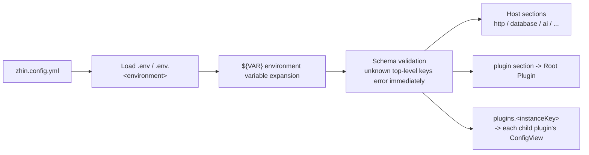

# Configuration Reference

At startup, `zhin runtime start` looks for a configuration file in the project root directory, checking in the following order and stopping at the first one found; if multiple exist simultaneously, it errors out directly and will not guess for you:

1. `config.yml`
2. `config.yaml`
3. `config.json`
4. `zhin.config.yml`
5. `zhin.config.yaml`

It is recommended to use `zhin.config.yml` consistently. All examples in this document use it.

## Loading and Validation Flow



Two things worth remembering beyond the mermaid diagram: the configuration file undergoes JSON Schema validation, and **only the keys listed below are allowed at the top level**. Misspelled key names will produce `Invalid Plugin config in zhin.config.yml` at startup. Keys other than `plugin` / `plugins` (`http`, `database`, `ai`, `mcp`, `a2a`, `speech`, `htmlRenderer`, `assistant`, `collaboration`, `log_level`) are consumed by the CLI's Host assembly layer and are not passed down to plugins.

## Environment Variable Expansion

`${VAR}`, `${VAR:-default}`, and `${VAR:=default}` within string values are expanded:

```yaml
http:
  token: ${HTTP_TOKEN:-dev-token}   # Falls back to dev-token when HTTP_TOKEN is not set
```

When a variable is not set and no default value is specified, it expands to an empty string -- for fields like `apiKey`, this is exactly the soft-prune trigger condition described in the AI section below. Dotenv files are loaded in the order `.env` then `.env.<environment>` (the environment name is specified by `--environment`, default `development`). Secrets should always use environment variables and never be hardcoded in the configuration file.

## Top-Level Keys

| Key | Type | Description |
| --- | --- | --- |
| `log_level` | string \| number | Log level (e.g., `info`, `debug`); `ZHIN_LOG_LEVEL` / `LOG_LEVEL` environment variables can temporarily override |
| `http` | object | HTTP Host (Console / API entry point) |
| `database` | object | Database |
| `speech` | object | Speech STT/TTS (requires `@zhin.js/speech` installed) |
| `assistant` | object | Assistant Runtime (scheduled tasks / event API) |
| `ai` | object | AI stack (requires `@zhin.js/agent` etc., see below) |
| `mcp` | object | MCP Host (exposes bot tools as an MCP Server) |
| `a2a` | object | A2A Host (Agent Card / remote Agent interop) |
| `collaboration` | object | Multi-Agent collaboration |
| `htmlRenderer` | object | HTML rendering (e.g., `width`) |
| `plugin` | object | Root Plugin (the application itself) configuration |
| `plugins` | object | Child plugin configuration, keyed by instanceKey |

## http

```yaml
http:
  port: 8086                 # Default 8086
  host: 127.0.0.1            # Default 127.0.0.1
  token: ${HTTP_TOKEN}       # API Bearer token
  corsOrigins:               # Allowed cross-origin sources
    - "https://console.zhin.dev"
  base: /api                 # API mount path
```

When `token` is not set, local development can access directly; be sure to set it for production environments. `tokens` supports configuring multiple tokens with different scopes.

## database

```yaml
database:
  dialect: sqlite            # Default sqlite
  filename: ./data/bot.db
```

- `dialect` options: `sqlite`, `mysql`, `pg`, `mongodb`, `redis`, `memory`.
- Fields other than `dialect` are passed as-is to the corresponding dialect (e.g., pg/mysql connection parameters).
- When `database` is omitted entirely, it defaults to `<project-root>/.zhin/data.sqlite`.

## speech

```yaml
speech:
  stt: { provider: ollama, model: whisper, host: http://localhost:11434 }
  tts: { provider: edge, voice: zh-CN-XiaoxiaoNeural }
```

When configured, this enables the speech pipeline and exposes `voice_stt` / `voice_tts` tools to the Agent. `@zhin.js/speech` is an optional peer dependency and must be installed separately.

## assistant

```yaml
assistant:
  enabled: true                    # Enable unified JobStore, default false
  profile:
    enabled: true
    file: assistant.profile.yml    # Profile file, drives scheduled tasks
  events:
    enabled: true                  # Open POST /api/assistant/events
    rateLimitPerMinute: 60         # Default 60
  defaults:
    notifyOnFailure: false         # Whether to notify on Job failure, default false
```

Other sub-keys: `queue` (TaskQueue concurrency/retry/timeout), `jobsFile` (custom JobStore filename, default `assistant-jobs.json`). Scheduled tasks can be managed with [`zhin schedule`](../cli/index.md#schedule).

## mcp / a2a

```yaml
mcp:
  enabled: true
  path: /mcp
  token: ${HTTP_TOKEN}                  # Falls back to http.token if unset
  allowUnauthenticatedLocalhost: false  # Recommend false for production

a2a:
  enabled: true
  path: /a2a
```

Both sections are mounted on the HTTP Host and enabled as needed; when not configured, the corresponding SDK is not loaded.

## ai

The `ai` section is consumed by the Agent Host. Whenever `ai` / `assistant` / `collaboration` is configured in any section, the startup graph loads the Agent stack; providers missing credentials are soft-pruned and do not block startup.

### providers: Named Model Providers

```yaml
ai:
  providers:
    deepseek:
      sdk: deepseek                  # Required
      apiKey: ${DEEP_SEEK_API_KEY}
    openrouter:
      sdk: openai-compatible
      baseUrl: ${OPENROUTER_BASE_URL}
      apiKey: ${OPENROUTER_API_KEY}
      contextWindow: 32768
      models:                        # Allowed model whitelist
        - "openrouter/free"
    ollama-local:
      sdk: ollama
      host: http://127.0.0.1:11434   # ollama uses host instead of baseUrl
    cloudflare:
      sdk: openai-compatible
      apiKey: ${CLOUDFLARE_API_TOKEN}
      accountId: ${CLOUDFLARE_ACCOUNT_ID}
```

| Field | Description |
| --- | --- |
| `sdk` | Required, one of six: `openai`, `anthropic`, `google`, `deepseek`, `ollama`, `openai-compatible` |
| `apiKey` / `baseUrl` / `host` | Credentials and endpoint; `ollama` uses `host`, Cloudflare also requires `accountId` |
| `models` | Explicit model list |
| `defaultModel`, `contextWindow`, `timeout`, `maxRetries`, `headers` | Behavior tuning |
| `authScheme` | Authorization header prefix, default `'Bearer '` |
| `imageGeneration` | Text-to-image defaults (for drivers that support this capability, e.g., `defaultModel`, `defaultSize`, `watermarkEnabled`, `promptSuffix`) |

Provider aliases can be named arbitrarily; when `sdk` is not explicitly specified, it is inferred from the alias prefix (e.g., `deepseek-main` -> `deepseek`); if inference fails, it falls back to `openai-compatible`. The corresponding `@ai-sdk/*` packages are optional peers and should be installed based on which SDK is used.

### agents: Bind Models and Roles

```yaml
ai:
  agents:
    zhin:                            # Main Agent, default entry point
      provider: openrouter           # References the provider alias
      model: openrouter/free
      mcpServers: [icqq]             # References names in ai.mcpServers
    researcher:
      provider: openrouter
      model: openrouter/free
      nickname: 'Researcher'         # IM display nickname
```

| Field | Description |
| --- | --- |
| `provider` / `model` | Required, the bound provider alias and model |
| `nickname` | LLM self-reference + IM collaboration display name |
| `mcpServers` | List of MCP Server names visible to this Agent |
| `priority` / `match` | Inbound routing: `match` can match by `adapter` / `endpoint` / `scene` / `sceneId` / `hasMedia` / `contentContains`, single or array |
| `permission.task` | `spawn_task` visible child Agent types (glob -> `allow` / `deny`) |

### mcpServers: External MCP Servers

```yaml
ai:
  mcpServers:
    - name: icqq
      transport: streamable-http     # stdio | streamable-http | sse
      url: ${ICQQ_MCP_URL}
      headers:
        Authorization: Bearer ${ICQQ_MCP_TOKEN}
    - name: local-tools
      transport: stdio
      command: npx
      args: ["-y", "some-mcp-server"]
      env: { FOO: bar }
```

Once connected successfully, these Servers' tools enter the Agent tool pool (assigned by `agents.<name>.mcpServers`).

### Other ai Sub-sections

```yaml
ai:
  sessions:                # Session storage
    maxHistory: 200        # Default 200 in database mode, 100 in memory mode
    expireMs: 604800000    # Default 7 days in database mode, 24h in memory mode
    useDatabase: true      # Default true
  context:                 # Group chat context recording
    enabled: true
    maxRecentMessages: 100
    summaryThreshold: 50
    keepAfterSummary: 10
    maxContextTokens: 4000
  memory:                  # Three-layer Markdown file memory, enabled by default
    semantic:
      enabled: true        # Semantic memory: memory_entries table + memory_search/memory_upsert tools
      autoConsolidate: false
    # Note: the old memoryMcp (memory via MCP server) is deprecated; semantic memory is the built-in solution above
  access:                  # AI access control
    mode: open             # open | closed | whitelist, default open
    users: []              # Allowed user IDs in whitelist mode
    groups: []
    denyMessage: ...
  agent:                   # Tool execution security
    execSecurity: allowlist    # deny | allowlist | full
    execPreset: readonly       # readonly | network | development | custom
    execAllowlist: ["^ls ", "^cat "]
    maxIterations: 15          # Maximum tool iterations per turn, default 15
  trigger:                 # AI trigger rules
    prefixes: ["ai:"]          # Trigger prefixes, default ['#', 'AI:']
    respondToAt: true          # Respond to @bot, default true
    respondToPrivate: true     # Private chats bypass prefix requirement, default true
    ignorePrefixes: ['/', '!', '!']  # Avoid conflicting with commands
    timeout: 60000
```

`ai.remoteAgents` (A2A remote Agents: `id` + `cardUrl` + optional `token`), `ai.multimodal` (image/audio/video inbound and outbound strategies), `ai.knowledge.baseDir` (local knowledge base directory, default `knowledge`), etc., are configured as needed.

## plugin and plugins

```yaml
# Root Plugin (the application itself) configuration; keys are determined by the application's config schema
plugin:
  terminal:
    interactive: true

# Child plugin configuration, keyed by instanceKey
plugins:
  sandbox:
    endpoints:
      - context: sandbox
        name: sandbox-bot
        owner: sandbox-user
```

`instanceKey` is derived from the package name by default: take the last segment of the package name and strip the `adapter-` / `plugin-` / `service-` prefix. For example, `@zhin.js/adapter-icqq` becomes `icqq`. `zhin install` automatically writes to `plugins.<instanceKey>` and adds the package to the `zhin.plugins` manifest in `package.json`.

### Adapter Instances: master / trusted / commandPrefix

Platform adapter plugin instance configurations support three common keys:

| Key | Location | Description |
| --- | --- | --- |
| `master` | Instance top-level | Endpoint Owner: the owner ID for all accounts in this instance (`ask_user` security confirmation target) |
| `trusted` | Instance top-level / per-endpoint | Trusted user ID list; array or whitespace/comma-separated string |
| `commandPrefix` | Instance top-level / per-endpoint | Command prefix, default `''`; per-endpoint values override top-level |

### endpoints Array: One Instance with Multiple Accounts

Multi-account adapters use the `endpoints` array to declare multiple Endpoints:

```yaml
plugins:
  icqq:
    master: "${ICQQ_MASTER}"     # Top-level shared: applies to all endpoints
    endpoints:                   # Per-entry: name is required, other fields merge with top-level (per-entry takes priority)
      - name: "${ICQQ_ACCOUNT_1}"
      - name: "${ICQQ_ACCOUNT_2}"
```

Expansion rules (`@zhin.js/adapter`'s `expandEndpointConfigs`):

- Each endpoint's final configuration = instance configuration (without the `endpoints` key) shallow-merged with the entry's fields, **per-entry fields override top-level**.
- `name` is required and must be a non-empty string; must not contain `~`; duplicates keep only the first with a warning.
- When `endpoints` is empty or all entries are invalid, it falls back to a single Endpoint (named after the instanceKey).

Real-world example (QQ official bot, main account through proxy gateway + sandbox account coexisting):

```yaml
plugins:
  qq:
    endpoints:
      - name: zhin
        appid: "${QQ_APPID}"
        secret: "${QQ_SECRET}"
        mode: websocket
        sandbox: false
        gatewayUrl: "https://bots.example.com/gateway/102005927"
        intents: [GUILDS, GROUP_AND_C2C_EVENT, PUBLIC_GUILD_MESSAGES]
      - name: "102069707"
        appid: "${QQ_SANDBOX_APPID}"
        secret: "${QQ_SANDBOX_SECRET}"
        mode: websocket
        sandbox: true
        intents: [GUILDS, GROUP_AND_C2C_EVENT]

  slack:
    endpoints:
      - name: zhin
        token: "${SLACK_TOKEN}"
        appToken: "${SLACK_APP_TOKEN}"
        signingSecret: "${SLACK_SIGNING_SECRET}"
        socketMode: true
```

For adapter-specific fields (`appid`, `intents`, `socketMode`, `url`, `access_token`, etc.), see the README of the corresponding adapter package.

## Minimal Configuration

You can run without any Host sections -- this is the entire configuration for `examples/minimal-bot`:

```yaml
plugin:
  terminal:
    interactive: true

plugins: {}
```

After starting, use the `zhin setup` wizard to progressively add database / adapters / AI (see [CLI Reference](../cli/index.md)); for how to run, see [zhin runtime start in Detail](../cli/runtime.md).
