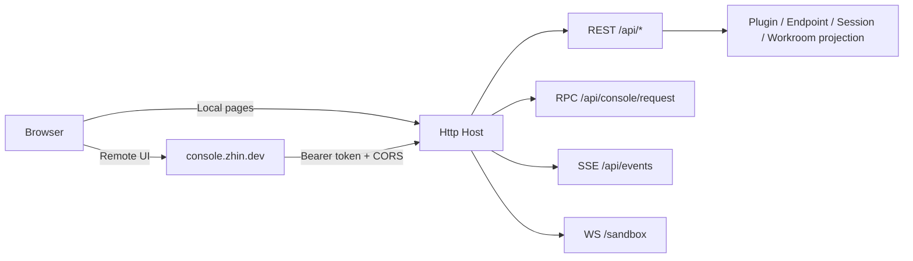

# Console

Console is Zhin's runtime fact surface. It answers what the current generation published, which Endpoint received a message, what an Agent did, and whether durable state recovered.

`zhin runtime start` assembles the HTTP Host and Console API. Connect through <https://console.zhin.dev>, or open the local `/console` and Sandbox pages served by the Host.



## Deployment and Configuration

All configuration is in the `http:` section at the top level of `zhin.config.yml`:

```yaml
http:
  port: 8068                 # Scaffold default; trust project config
  host: 127.0.0.1            # Default 127.0.0.1; change to 0.0.0.0 for remote access
  token: ${HTTP_TOKEN}       # Main token (full scope)
  tokens:                    # Additional scoped tokens (optional)
    - token: ${DEMO_TOKEN}
      scope: demo            # full | demo
  corsOrigins:               # CORS whitelist; https://console.zhin.dev is always automatically included
    - "http://localhost:5173"
  base: /api                 # API prefix, default /api
```

With a token configured, `/api` requests require a Bearer token. `/pub/*`, the Console shell, and page routes stay public. `corsOrigins` is merged with the Remote Console origin.

A port conflict soft-degrades the HTTP Host: Adapters and Agents keep running, but Console is unavailable. A Console restart exits with code 51 and the CLI daemon relaunches the process.

Runtime falls back to 8086 when no config exists; the current scaffold writes 8068. Always trust project configuration and the startup log.

## Find the page from the symptom

| Symptom | Start here | Fact to verify |
| --- | --- | --- |
| Console cannot connect | Dashboard / startup log | Host, port, token, CORS, and HTTP Host degradation |
| Platform is online but receives nothing | Endpoint detail | Connection, inbox, requests/notices, and platform callback |
| Command, middleware, or component is missing | Runtime Capabilities | Current-generation capability, order, and owner |
| Agent does not call a tool | Agent Studio + Runtime Capabilities | Visibility, approval, security policy, trace, and cancellation |
| Messages disappear after refresh | Endpoint conversation + Logs | History RPC recovery and SSE recovery gap |
| Workroom does not claim a chat or repository | Workrooms + Task board | Catalog revision, full space address, Orchestrator, and Project Inbox |
| File changed but behavior did not | Config + Dashboard | Successful save and publication of a new generation |

## Page Features

| Page | Data Source | Description |
|------|-------------|-------------|
| Dashboard | `GET /api/system/status`, `GET /api/stats` | Runtime status, version, statistics overview |
| Plugins | `GET /api/plugins`, `GET /api/plugins/<name>` | Plugin list and details (commands, tools, config schema) |
| Endpoints | Endpoint summary + inbox table | Platform endpoint connection status; detail page includes unified inbox (messages / requests / notifications) |
| Config | RPC `config:get-yaml` / `config:save-yaml` / `config:set` | View and edit `zhin.config.yml` online |
| Logs | `GET /api/logs`, `GET /api/logs/stats`, `DELETE /api/logs`, `POST /api/logs/cleanup` | System logs (`SystemLog` table, requires Database to be running) |
| Cron | RPC `cron:*` | In-memory tasks registered by plugins (list); with Agent installed, can add/delete/pause persistent tasks |
| Database | RPC `db:info` / `db:tables` / `db:select` / `db:insert` / `db:update` / `db:delete` / `db:kv:*` | Database browsing and editing, KV storage |
| Files | RPC `files:tree` / `files:read` / `files:save`, `env:list` / `env:save` | Project file tree and `.env` management |
| Runtime Capabilities | `GET /api/introspection/{commands,middlewares,components,tools,prompt-sections,endpoints,bindings,mcp}`, `POST /api/introspection/components/render` | Current-generation contracts, owners, middleware order, component rendering lab, and Prompt Section governance metadata |
| Agent Sessions | `GET/POST /api/agent/sessions/*` | AI session tree viewing and branch switching |
| Workrooms | Persistent Workroom Catalog + `GET /api/agent/workroom/runs[/*]` | Revision-CAS management for Projects, members, Agent roles, and chat/channel/repository bindings; inspect replayed Runs, Tasks, and Assignments |
| Marketplace | `GET /pub/marketplace/search`, `/pub/marketplace/detail/*`, `GET /api/marketplace/updates` | Plugin marketplace (plugins.json + npmmirror) and update checks |
| Sandbox | WS `/sandbox` | Built-in sandbox chat, direct conversation without platform integration |

Real-time pushes go through SSE: `GET /api/events` (page directory sync, HMR reload, message/configuration events).

## Standard acceptance run

1. Dashboard reports a healthy connection with readable version and runtime data.
2. Send a Sandbox message, refresh, and confirm Endpoint history remains.
3. Inspect current owners for commands, middleware, components, Tools, and Prompt Sections.
4. Run an Agent task and verify working directory, security policy, approval, cancellation, trace, and artifacts.
5. For a Workroom, prove that a real chat, channel, or repository event enters the correct Project.

A release is ready only when the current generation and durable projections agree. Disk configuration and plugin manifests are candidate inputs.

## /entries Plugin Page Mechanism

Plugins can contribute their own pages to the Console. The mechanism has three steps:

1. The plugin declares client pages (pagemanager), and the build output is served by the Host at `/assets/client/*`;
2. The Host's ConsoleRuntime aggregates the page directory. `GET /entries` returns `{ entries, runtimeEnvHint }` -- each entry contains `id`, `title`, `route`, `module` (page module URL), `order`, `hash`;
3. The Remote Console / local shell fetches `/entries` and dynamically imports the corresponding modules for rendering; bare browser imports (react, etc.) are proxied by the Host's `/esm/*` as executable ESM.

Page directory changes are pushed in real-time to connected UIs via SSE `sync` events.

## Demo Scope (Read-Only Deployment)

Issue a `scope: demo` token for demonstrations. Demo exposes only server-authorized, redacted data; a client-side mask is never a secret boundary.

- Allowed: event stream and history, Runtime Capabilities, read-only Console RPC, system status, statistics, and plugin catalog;
- WebSocket only for `/sandbox`;
- All other write operations (changing config, clearing logs, DB writes, etc.) return `403`.

The main token has `full` scope with all permissions.

## Related

- [AI Capabilities Overview](../ai/index.md)
- [Agent Deep Dive](../ai/agent.md): The runtime behind Console's Agent Sessions / Orchestration pages
