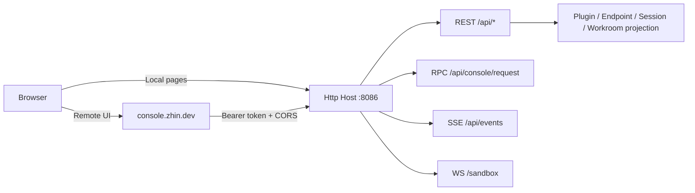

# Console

Whether you want to check the bot's running status, change a line of configuration on the fly, or chat without connecting to a platform -- you don't need to log into the server. When `zhin runtime start` starts up, it **automatically assembles** the Http Host and Console API (the project scripts `pnpm dev` / `pnpm start` ultimately go through it), available with zero configuration. The UI has two layers: the Remote Console hosted at <https://console.zhin.dev>, where you enter your Host address + token to connect; and the local pages served directly by the Host (`/console` index + individual page routes) along with the sandbox chat page.



## Deployment and Configuration

All configuration is in the `http:` section at the top level of `zhin.config.yml`:

```yaml
http:
  port: 8086                 # Default 8086
  host: 127.0.0.1            # Default 127.0.0.1; change to 0.0.0.0 for remote access
  token: ${HTTP_TOKEN}       # Main token (full scope)
  tokens:                    # Additional scoped tokens (optional)
    - token: ${DEMO_TOKEN}
      scope: demo            # full | demo
  corsOrigins:               # CORS whitelist; https://console.zhin.dev is always automatically included
    - "http://localhost:5173"
  base: /api                 # API prefix, default /api
```

A few points relevant in actual deployment. Authentication: with a token configured, requests under `/api` require an `Authorization: Bearer <token>` header (or `?token=` query parameter); `/pub/*`, Console shell, and page routes remain public. Token comparison uses timing-safe comparison. CORS: `corsOrigins` is merged with the Remote Console origin so that cross-origin UIs can access the API. When the port is occupied, it's a soft degradation -- the Http Host logs and skips; adapters and the Agent continue to start, only the Console is unavailable. Additionally, when the Console triggers `system:restart`, the process exits with code 51, and the CLI daemon automatically re-launches.

## Page Features

| Page | Data Source | Description |
|------|-------------|-------------|
| Dashboard | `GET /api/system/status`, `GET /api/stats` | Runtime status, version, statistics overview |
| Plugins | `GET /api/plugins`, `GET /api/plugins/<name>` | Plugin list and details (commands, tools, config schema) |
| Endpoints | Endpoint summary + inbox table | Platform endpoint connection status; detail page includes unified inbox (messages / requests / notifications) |
| Config | RPC `config:get-yaml` / `config:save-yaml` / `config:set` | View and edit `zhin.config.yml` online |
| Logs | `GET /api/logs`, `GET /api/logs/stats`, `DELETE /api/logs`, `POST /api/logs/cleanup` | System logs (`SystemLog` table, requires Database to be running) |
| Cron | RPC `cron:*` | In-memory tasks registered by plugins (list); with Agent installed, can add/delete/pause persistent tasks |
| Database | RPC `db:info` / `db:tables` / `db:select` / `db:insert` / `db:update` / `db:delete` / `db:kv:*` | Database browsing and editing, KV storage |
| Files | RPC `files:tree` / `files:read` / `files:save`, `env:list` / `env:save` | Project file tree and `.env` management |
| Introspection | `GET /api/introspection/{commands,tools,endpoints,bindings,mcp}` | Paginated introspection: commands, tools, endpoints, bindings, MCP |
| Agent Sessions | `GET/POST /api/agent/sessions/*` | AI session tree viewing and branch switching |
| Workroom | `GET /api/agent/workroom/runs[/*]` | Query replayed Run / Task / Assignment state by explicit Project |
| Marketplace | `GET /pub/marketplace/search`, `/pub/marketplace/detail/*`, `GET /api/marketplace/updates` | Plugin marketplace (plugins.json + npmmirror) and update checks |
| Sandbox | WS `/sandbox` | Built-in sandbox chat, direct conversation without platform integration |

Real-time pushes go through SSE: `GET /api/events` (page directory sync, HMR reload, message/configuration events).

## /entries Plugin Page Mechanism

Plugins can contribute their own pages to the Console. The mechanism has three steps:

1. The plugin declares client pages (pagemanager), and the build output is served by the Host at `/assets/client/*`;
2. The Host's ConsoleRuntime aggregates the page directory. `GET /entries` returns `{ entries, runtimeEnvHint }` -- each entry contains `id`, `title`, `route`, `module` (page module URL), `order`, `hash`;
3. The Remote Console / local shell fetches `/entries` and dynamically imports the corresponding modules for rendering; bare browser imports (react, etc.) are proxied by the Host's `/esm/*` as executable ESM.

Page directory changes are pushed in real-time to connected UIs via SSE `sync` events.

## Demo Scope (Read-Only Deployment)

Issue a `scope: demo` token for demonstration environments, and the Console enters read-only mode:

- Allowed: `GET /api/events`, `POST /api/console/request` (read-only RPCs only), `GET /api/system/status`, `GET /api/stats`, `GET /api/plugins*`;
- WebSocket only for `/sandbox`;
- All other write operations (changing config, clearing logs, DB writes, etc.) return `403`.

The main token has `full` scope with all permissions.

## Related

- [AI Capabilities Overview](../ai/index.md)
- [Agent Deep Dive](../ai/agent.md): The runtime behind Console's Agent Sessions / Orchestration pages
