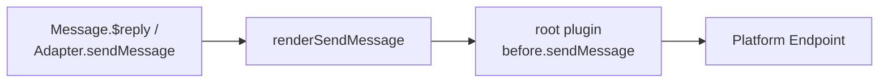

# Code Conventions

These conventions are not style preferences -- most have corresponding harness CI gates (see [Development Workflow](./development.md)), and violations will directly fail CI. Read the root `AGENTS.md` before making changes.

## TypeScript & Modules

- The entire repo uses TypeScript ESM. **Local relative imports must include the `.js` extension**:

```ts
import { DisposeStack } from './dispose.js';        // OK
import { DisposeStack } from './dispose';           // Wrong
```

- Node-side source goes in `src/`, build output in `lib/`; browser-side source goes in `client/`, output in `dist/`.
- New workspace packages must be placed in a directory covered by `pnpm-workspace.yaml` and have their own `package.json`.
- The `overrides` in `pnpm-workspace.yaml` handle a large number of security version bumps (undici, hono, tar, js-yaml, nodemailer, etc.) -- do not casually remove or modify them; note the constraints from `pnpm check:dependency-policy` when adding new dependencies.

## New Plugins: Plugin Runtime (Default)

The only startup path is `zhin runtime start`. For new plugins:

- `plugin.ts` default-exports `definePlugin()` (`@zhin.js/plugin-runtime` / `zhin.js/plugin-runtime`)
- Capabilities go in convention directories (`commands/` -> `defineCommand`, `tools/` -> `defineAgentTool`, ...), one default export per file
- **Do not** use `usePlugin()` / `getPlugin()` / `MessageCommand` anymore

See [Writing Your First Plugin](../getting-started/first-plugin.md), [definePlugin](../authoring/define-plugin.md).

## Legacy: `usePlugin()` / `getPlugin()` (Residual Code Only)

The classic path is only functional under `zhin.js/node` (`bootstrapNode`) and is **not wired to the CLI**. When maintaining legacy modules that still call these two APIs:

- `usePlugin()` must only be called at **module top level** (gate: `pnpm check:use-plugin-top-level`)
- `getPlugin()` is only allowed during initialization/assembly; it is forbidden inside middleware, command actions, tool execute, Cron, and event callbacks (gate: `pnpm check:get-plugin-runtime`); use closures captured at registration time for runtime access

New features should migrate to Runtime rather than continuing to extend the classic API. Migration guide: `.github/skills/migrate-zhin-plugin-runtime`.

## Module-Level State: createGenerationStore

Plugin hot-reload means the same module code will be used by multiple generations in succession. A bare module-level `let _x` singleton would cause a new generation to read resources already released by the previous one, or cause the old generation's teardown to accidentally clear the new generation's value. Use `createGenerationStore<T>(name)` (`@zhin.js/plugin-runtime`) consistently:

```ts
import { createGenerationStore } from '@zhin.js/plugin-runtime';

const dbStore = createGenerationStore<Database>('my-plugin-db');

// Setup phase: provide automatically hooks into context.lifecycle for deregistration;
// when a generation ends, that generation's value is removed and the previous generation's value becomes visible again
dbStore.provide(context, db);

// Runtime paths (tool execute, Cron, event callbacks): read the latest live value
const db = dbStore.use();      // Throws an error with the store name if no value
const maybe = dbStore.tryUse(); // Returns undefined if no value
```

- When multiple generations coexist, the stack top (most recently registered live value) wins; an older generation disposing first does not damage the newer one.
- `clear()` is for test resets only.
- Do not hand-write `if (!x) throw new Error('... not initialized')` -- `use()` already provides that semantic.

## WS/SSE Endpoints: createEndpointLifecycle

Long-lived connection endpoints (WS/SSE adapters like napcat, milky, onebot11/12) should use `createEndpointLifecycle` (`@zhin.js/adapter`) for start/stop/reconnect/heartbeat handling instead of hand-writing state machines:

- State machine: `idle -> connecting -> open -> reconnecting -> open ... -> stopped / closed`.
- `start(connectFn)`: On connection failure, automatically resets to `idle` without arming reconnection.
- `stop()`: Clears all timers, calls the force-close function, wakes up racing waits, and never reconnects.
- `handle.notifyClosed()`: Called by the adapter when the peer disconnects; only reconnects with exponential backoff + jitter when the connection was previously open.
- `startHeartbeat(fn, interval)`: Heartbeat + watchdog; when N consecutive rounds receive no response (no `notifyHeartbeatAck()`), it proactively force-closes, and reconnection is driven by the close event.
- Backoff parameters are configurable: `initialIntervalMs` (default 5000), `multiplier` (default 2), `maxIntervalMs` (default 60000), `jitterMs`, `maxAttempts` (default Infinity).

Adapter-specific logic (e.g. agent registration/deregistration) stays on the adapter side. On `start` failure, deregistration must be symmetric.

## Unified Message Chain

All outbound messages must flow through the unified chain; bypassing it is forbidden (gate: `pnpm check:harness-paths`):



For cross-platform outbound messages (sending from one platform to another), use `root.inject(adapter).sendMessage` -- do not operate on Endpoints directly.

## Host Token Pattern

The HTTP Host (`@zhin.js/host-http`) has no built-in session system; it uses Bearer token authentication uniformly:

- Client requests include `Authorization: Bearer <token>`, where the token comes from the `http.token` config; the server validates using `TokenRegistry` (`packages/host/http/src/token-registry.ts`), with `extractBearerToken` parsing the header.
- Token comparison uses `timingSafeEqualString` (constant-time comparison) -- do not hand-write `===` comparisons.
- Tokens are scoped by level (`ScopedTokenConfig` / `AuthScope`): write operations require full scope; demo tokens always get 403.
- Remote Console login = API Base URL + Bearer Token; there is no username/password concept.

## Testing Conventions

- Tests use Vitest, configured in the root `vitest.config.ts`: `globals: true` (no need to import `describe`/`it`/`expect`), `environment: 'node'`, matching `**/*.test.ts`.
- File-level isolation is enabled (`isolate: true`) to prevent `vi.spyOn` / `vi.mock` leakage across files; do not rely on cross-file global state in tests.
- Coverage thresholds (v8 provider): lines 45% / branches 35%.
- **Database regression tests prefer real SQLite**: `basic/database` tests use Node's built-in `node:sqlite` `DatabaseSync` to run against the real dialect (requires Node 22.5+, 24+ recommended; skipped when the version is insufficient), rather than mocking the SQL layer.
- Prefer `pnpm --filter <pkg> test` for single-package testing; `pnpm test` for full runs.
