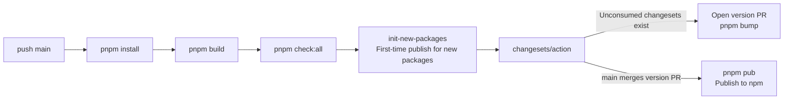

# Development Workflow

From finishing code to merging into main, there are several checkpoints: local build and test, 38 harness CI gates, changeset, and CI publishing. This page walks through the day-to-day workflow in that order.

## Environment Setup

- Node.js `^20.19.0` or `>=22.12.0`
- pnpm 9 (repo pins `packageManager: pnpm@9.0.2`)

```bash
pnpm install   # Install all workspace dependencies
```

## Common Commands

```bash
pnpm dev        # Start examples/minimal-bot (Sandbox + Console); recommended for first-time verification
pnpm dev:full   # Start examples/full-bot (L4 reference)
pnpm dev:test   # Start examples/test-bot (maintainer kitchen sink)
pnpm build      # Turbo builds all packages in order: basic -> packages -> plugins
pnpm test       # Full Vitest run
pnpm type-check # tsc --noEmit (tsconfig.typecheck.json)
pnpm lint       # ESLint
```

When verifying a single package, prefer `pnpm --filter <pkg> build|test` instead of running a full build by default.

If you get an error about `@zhin.js/scaffold-wizard` not being found before working on CLI or create-zhin-app, build it first (output goes to `lib/`; Node cannot resolve it before building):

```bash
pnpm --filter @zhin.js/scaffold-wizard build   # or pnpm prepare:cli
```

## Harness CI Gates (pnpm check:all)

The most valuable command to run before committing is `pnpm check:all`: it runs `scripts/check-all-harness.mjs`, executing **38 checks** sequentially (including type-check, lint, and unit tests). All must pass to go green -- CI runs the exact same suite. If CI runs a separate coverage job, you can set `HARNESS_SKIP_TEST=1` to skip the `pnpm test` portion and avoid running tests twice.

Below are the checks grouped by responsibility (the command in parentheses can be run individually).

**Quality Baseline**

| Check | Description |
| --- | --- |
| Type Check (`pnpm type-check`) | `tsc --noEmit` |
| Lint (`pnpm lint`) | ESLint (.ts/.tsx) |
| Unit Tests (`pnpm test`) | Full Vitest run |
| Production Config (`pnpm check:prod`) | No debug code in production config |

**Architecture & Dependencies**

| Check | Description |
| --- | --- |
| Architecture Layers (`pnpm check:architecture`) | Layer dependency direction (basic -> kernel -> ai -> core -> agent -> zhin) |
| Dependency Policy (`pnpm check:dependency-policy`) | User project scaffold dependencies default to `latest` |
| No Koa Import (`pnpm check:no-koa`) | Plugins must not directly import koa |
| Install Size (`pnpm check:install-size`) | zhin.js IM core production `node_modules` <= 10MB |

**API Snapshots & Plugin Spec**

| Check | Description |
| --- | --- |
| API Surface (`pnpm check:api-surface`) | Public API surface snapshot |
| Plugin Runtime API (`pnpm check:plugin-runtime-api`) | Convention-based plugin runtime API surface snapshot |
| Plugin Spec (`pnpm check:plugin`) | Plugins conform to standard spec |
| Plugin Agent Publish (`pnpm check:plugin-agent-publish`) | Plugins with `agent/` have proper publish checklist (files, prepublishOnly, peer deps) |
| Publish Repository (`pnpm check:publish-repository`) | Publishable packages have `repository.url` matching github.com/zhinjs/zhin (npm provenance) |
| Agent Tool Schema (`pnpm check:agent-tool-schema`) | `agent/tools` inputSchema matches defineAgentTool/execute types |
| No Package-Root skills/ (`pnpm check:no-package-skills`) | Plugin packages must not have top-level `skills/`; use `agent/skills/*.md` instead |

**IM Chain & Runtime Conventions**

| Check | Description |
| --- | --- |
| IM Send Path (`pnpm check:harness-paths`) | Must not bypass the Adapter.sendMessage unified chain |
| IM Session SSOT (`pnpm check:im-session-ssot`) | IM scene/session identity resolution uses core SSOT |
| usePlugin Top-Level (`pnpm check:use-plugin-top-level`) | `usePlugin()` must be at module top level |
| getPlugin Runtime (`pnpm check:get-plugin-runtime`) | `getPlugin()` is forbidden inside runtime callbacks |
| Orchestration SSOT (`pnpm check:orchestration-ssot`) | Orchestration task state must go through OrchestrationKernel |

**AI Layer**

| Check | Description |
| --- | --- |
| getModel Import Disambiguation (`pnpm check:get-model-imports`) | Runtime code uses getLlmTransportModel, not the ambiguous getModel |
| Legacy AI Exports (`pnpm check:legacy-ai-exports`) | `@zhin.js/ai` no longer exports SessionManager and similar symbols |
| Provider Gateway (`pnpm check:provider-gateway`) | LLM gateway sdk/contextWindow preset contract |
| A2A Mesh (`pnpm check:a2a-mesh`) | No residual MCP Agent Mesh v1 symbols |

**Adapter Contracts**

| Check | Description |
| --- | --- |
| Rich Segment Adapters (`pnpm check:rich-segments`) | outboundRichSegmentPolicy declaration and contract tests |
| AI Outbound Adapters (`pnpm check:ai-outbound`) | aiOutboundExtensions declaration and contract tests |
| Interactive Segments (`pnpm check:interactive-segments`) | interactivePolicy declaration and contract tests |
| Segment Adapters (`pnpm check:segments`) | defineAdapter segments declaration contract (sandbox must pass) |

**Documentation Consistency**

| Check | Description |
| --- | --- |
| Doc Links (`pnpm check:doc-links`) | Documentation relative links are not broken |
| Doc Orphans (`pnpm check:doc-orphans`) | All site Markdown files are in sidebar or allowlist |
| ADR Manifest (`pnpm check:adr-manifest`) | ADR README and sidebar cover all ADRs |
| README Exports (`pnpm check:readme-exports`) | README imports match package exports |
| Config Docs (`pnpm check:config-docs`) | Config documentation aligns with DEFAULT_CONFIG key fields |
| Install Tiers SSOT (`pnpm check:install-tiers-ssot`) | Chinese `README.zh-CN.md` Install tiers table matches `docs/snippets/install-tiers.md` |
| Adapter Docs Sync (`pnpm check:adapter-docs`) | Platform adapter docs sync with `plugins/adapters/*/README.md` (fix with `pnpm sync:adapter-docs`) |
| Platform Tiers SSOT (`pnpm check:platform-tiers-ssot`) | Capability tiers/adapter index matches `scripts/adapter-meta.mjs` |

**Smoke Tests**

| Check | Description |
| --- | --- |
| Stable Smoke (`pnpm check:stable`) | Sandbox + Agent core unit tests + minimal-bot contract |
| L4-CI (`pnpm check:l4-ci`) | L4 deterministic subset (orchestration/memory/full-bot contract); full `pnpm check:l4` runs nightly |

## Changeset Workflow

The repo uses [changesets](https://github.com/changesets/changesets) for version management and changelogs (config in `.changeset/config.json`: `baseBranch: main`, `access: public`). Any change that affects the behavior of a published package must include a changeset:

```bash
pnpm release   # = pnpm changeset; interactively select affected packages and semver level, generates .changeset/*.md
pnpm bump      # = pnpm changeset version; consumes changesets, bumps version numbers, writes CHANGELOG
pnpm pub       # = pnpm changeset publish; publishes to npm
```

During daily development you only need `pnpm release` to commit the changeset file; `bump` and `pub` are executed by CI.

## Publishing (GitHub CI)

Publishing is driven by `.github/workflows/publish.yml`, triggered on push to `main`:



PR gates are in `.github/workflows/ci.yml` (Node 22/24 matrix), which also runs `pnpm check:all`.

## Debugging

- **Log level**: Set `log_level` to `debug` in `zhin.config.yml` (default is `info`) to see detailed framework internal logs.
- **Console logs page**: Runtime logs are written to the `SystemLog` database model via `DatabaseLogTransport`. The Remote Console logs page reads from it. Open [console.zhin.dev](https://console.zhin.dev) in your browser, fill in the API Base URL (e.g. `http://127.0.0.1:8086`) and Bearer Token (`http.token` config) to view.
- **Single-package debugging**: `pnpm --filter <pkg> test` with `-t '<test name>'` to filter tests; `pnpm test:watch` to enter watch mode.
