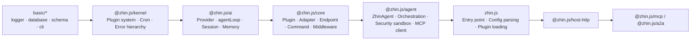

# Repo Structure

Cloning this repo for the first time, the 20-odd top-level directories can feel overwhelming. In reality they are just a few logical blocks carved out by a pnpm workspace (pnpm 9, build orchestration via Turbo) according to responsibility. After reading this page you will know exactly where to look when making changes. The workspace scope is defined by the root `pnpm-workspace.yaml`.

## Top-Level Directories

| Directory | Contents |
| --- | --- |
| `basic/` | Foundation layer: `cli`, `database`, `logger`, `schedule`, `schema` (logging, database, config validation, CLI) |
| `packages/im/` | IM core layer: `adapter`, `agent`, `ai`, `command`, `component`, `config-yaml`, `core`, `feature-kit`, `isolate`, `kernel`, `mcp-feature`, `middleware`, `plugin-runtime`, `runtime`, `skill`, `tool`, `zhin`, etc. |
| `packages/console/` | Remote Console support packages (`client`, `contract`, `layout`, `page`, `pagemanager`, `plugin-contract`, `protocol`). The Host only provides the API; the UI lives in a separate repo [zhin-console](https://github.com/zhinjs/console) (console.zhin.dev) |
| `packages/host/` | Host runtime: `http` (`@zhin.js/host-http`), `mcp` (MCP Server), `a2a` (A2A Server) |
| `packages/toolkit/` | `create-zhin` (`pnpm create zhin-app`), `scaffold-wizard` (config wizard), `satori`, `html-renderer`, `speech` |
| `packages/game-kit/` | Game development kit (used by `plugins/games/`) |
| `plugins/adapters/` | Platform adapters: sandbox, qq, icqq, napcat, onebot11/12, discord, telegram, slack, kook, dingtalk, lark, line, wecom, email, github, satori, etc. |
| `plugins/features/` | Feature plugins (e.g. `process-monitor`) |
| `plugins/games/` | Game plugins (blackjack, guess-number, idiom-chain, rps, tic-tac-toe, etc.) |
| `plugins/services/` | Service plugins (e.g. `activity-feedback`) |
| `plugins/utils/` | Utility plugins (rss, repeater, lottery, music, qrcode, short-url, code-runner, etc.) |
| `examples/` | Reference implementations, tiered by complexity: `single-file-bot` (a single `bot.ts`) -> `minimal-bot` (Stable convention directories, IM only) -> `full-bot` (L4) -> `test-bot` (maintainer kitchen sink, not a user template) |
| `deploy/` | Deployment examples (e.g. `huggingface/`) |
| `scripts/` | Harness CI gate scripts and build/publish helpers (`check-*.mjs`, `run-*.mjs`, `sync-*.mjs`) |
| `tests/` | Cross-package contract tests, doc/config alignment tests, snapshots (`contracts/`, `docs/`, `snapshots/`) |
| `docs/` | This documentation site (VitePress) |
| `config/` | Reference `zhin.config.yml` used by the repo itself |
| `data/` | Local runtime data (database, media, memory, etc. -- not committed) |

Every workspace package has its own `package.json`. Internal directory conventions are also consistent: Node-side source goes in `src/`, build output in `lib/`; browser-side source goes in `client/`, output in `dist/`.

## Layering and Dependency Direction

Dependencies between core packages are strictly unidirectional, enforced by `pnpm check:architecture` (`scripts/check-architecture-layers.mjs`):

Three things to remember: `kernel` and `ai` contain no IM concepts and can be used independently; lower layers must never depend on higher layers, nor should lower-layer code introduce IM concepts; the only exception is `basic/cli` -- it is the Plugin Runtime's composition root (`zhin runtime start` assembles IM / Agent / Console Host here), so it is allowed to import from `packages/im` layers.

## AGENTS.md Overview

Before making code changes, read [`AGENTS.md`](https://github.com/zhinjs/zhin/blob/main/AGENTS.md) in the repo root -- it is the minimal entry point for AI coding agents and contributors. It contains the project overview and version constraints (Node `^20.19.0 || >=22.12.0`, pnpm 9, changesets release flow), common commands (`pnpm dev` / `pnpm build` / `pnpm test` / `pnpm check:all`, detailed in [Development Workflow](./development.md)), mandatory code conventions (`.js` extension imports, **new plugins use `definePlugin` / convention directories**, legacy `usePlugin`/`getPlugin` residual rules, unified message chain, etc., detailed in [Code Conventions](./conventions.md)), and a task routing table: which packages and docs to read based on the area of change (core -> `packages/im/core`, AI engine -> `packages/im/ai`, orchestration -> `packages/im/agent`, adapters -> `plugins/adapters`...), plus a list of high-value files that change most often (`plugin.ts`, `adapter.ts`, `dispatcher.ts`, etc.).

Some subdirectories also have their own `AGENTS.md` or `CONTEXT.md` (e.g. `packages/im/plugin-runtime/CONTEXT.md` describes the terminology and constraints around generation / Root lifecycle). When working in a specific package, prioritize the closest one.
