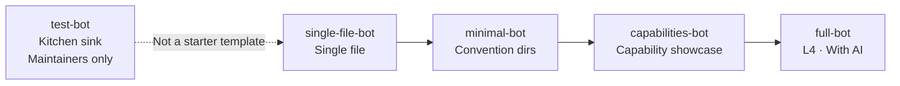

# Examples at a Glance

The best way to learn the framework is to start with something that runs. The `examples/` directory in the repo maintains tiered, progressively complex official examples, all ready to run out of the box (run `pnpm install` at the repo root first):

| Example | Purpose | Start | Channel |
|---------|---------|-------|---------|
| [single-file-bot](#single-file-bot-one-botts-is-a-bot) | **One `bot.ts` is a bot**, zero convention directories | `pnpm --filter single-file-bot dev` | Sandbox + Console |
| [minimal-bot](#minimal-bot-stable-minimal-path) | **Stable convention directory** minimal path, IM only | `pnpm dev` at repo root | Terminal |
| [capabilities-bot](#capabilities-bot-defineplugin-capability-showcase) | `definePlugin` capability showcase, plugin + config = app | `pnpm --filter capabilities-bot dev` | Sandbox + Console |
| [full-bot](#full-bot-l4-reference-with-ai) | **L4 reference**, includes AI stack, semantic memory, MCP | `pnpm dev:full` | Sandbox + NapCat + KOOK |
| [test-bot](#test-bot-maintainer-kitchen-sink) | Maintainer kitchen sink, all platforms and plugins | `pnpm dev:test` | 20+ adapters |



Learning path: **single-file-bot -> minimal-bot -> capabilities-bot -> full-bot**; test-bot is for maintainer reference only.

## single-file-bot: One bot.ts Is a Bot

No `commands/` or `components/` directories needed: register commands inside `setup({ addCommand })`, and they go into the same `CommandIndex` as directory-discovered commands.

```bash
pnpm --filter single-file-bot dev
```

Open [Remote Console](https://console.zhin.dev), set Host to `http://127.0.0.1:8086`, and send **`/hello`** in Sandbox.

```text
single-file-bot/
├── bot.ts              # definePlugin + addCommand('hello')
├── package.json        # zhin.entry -> ./bot.ts; plugins -> sandbox
└── zhin.config.yml     # sandbox commandPrefix: '/'
```

Suitable for demos, one-off scripts, and showing others "how short the startup is". When capabilities grow, split into convention directories (see [minimal-bot](#minimal-bot-stable-minimal-path)). Details in that directory's [README](https://github.com/zhinjs/zhin/tree/main/examples/single-file-bot).

## minimal-bot: Stable Minimal Path

The smallest runnable convention directory project: one `plugin.ts` + `adapters/` `commands/` `components/`.
Stable Features (adapter / command / component) are automatically inherited from the framework core, so `features` / `plugins` in `package.json#zhin` can both be empty.

```bash
# At the repo root
pnpm install
pnpm dev            # = pnpm --filter minimal-bot dev
```

Wait for the `zhin> ` prompt to appear, then type `/hello` or `/card` (renders a Satori status card) in the same terminal.
`Ctrl+C` to exit; editing files in convention directories triggers hot reload.

Requires Node >=22.6 (22.6-22.17: CLI automatically adds `--experimental-strip-types`; 22.18+: native TypeScript).

Directory structure:

```text
minimal-bot/
├── plugin.ts                 # definePlugin() entry
├── schema.json               # Config contract
├── zhin.config.yml           # plugin / plugins layered config
├── adapters/terminal.ts      # stdin/stdout terminal Endpoint
├── commands/hello.ts         # /hello
├── commands/card.ts          # /card -> component rendering
└── components/status-card.ts # Satori card component
```

## capabilities-bot: definePlugin Capability Showcase

**One plugin + one `zhin.config.yml` is all you need to start** -- a capability demonstration template: a single `setup()` covers common capability surfaces -- config view, database tables, scheduled tasks, Agent tools (with optional degradation), proactive outbound, lifecycle cleanup, Console card metadata -- and demonstrates mounting npm package sub-plugins (`@zhin.js/adapter-sandbox`).

```bash
cd examples/capabilities-bot
pnpm dev            # zhin runtime start
```

After startup:

- Console at `http://127.0.0.1:18099` (token `capabilities-dev-token`); the plugins page shows the `Capabilities Bot` card
- `whoami` / `stats` commands are registered (the latter demonstrates database counting)
- Heartbeat scheduled task logs a line every 5 minutes; when `pushOnBoot: true`, it sends a boot-up message to the Sandbox private chat

See that directory's `README.md` for a side-by-side breakdown of capabilities and code.

## full-bot: L4 Reference (With AI)

Builds on convention directories with a full AI stack: `@zhin.js/agent`, semantic memory, MCP, A2A Agent Mesh,
plus Sandbox + NapCat + KOOK three adapters and Skill / Tool / Page features.

```bash
# After pnpm install && pnpm build at repo root
cd examples/full-bot
cp .env.example .env    # Fill in model Provider Key and HTTP_TOKEN
pnpm dev                # Or pnpm dev:full at repo root
```

- Host defaults to `http://127.0.0.1:8069`; Remote Console's API Base / Token matches the `HTTP_TOKEN` in `.env`
- Acceptance checklist and NapCat/KOOK live steps in that directory's `ACCEPTANCE.md`

## test-bot: Maintainer Kitchen Sink

> **This is not a starter template -- do not copy it as the starting point for a new project.** Use `pnpm create zhin-app`, [single-file-bot](#single-file-bot-one-botts-is-a-bot), or [minimal-bot](#minimal-bot-stable-minimal-path) for new projects.

Mounts 20+ platform adapters (Sandbox, ICQQ x5, QQ Official, Slack, Discord, Telegram, KOOK, DingTalk, Lark,
WeCom, LINE, Email, GitHub...) and all feature plugins (game center, lottery, group-suite, rss, code-runner, etc.),
used by maintainers for multi-platform regression testing.

```bash
pnpm install && pnpm build   # At repo root
pnpm dev:test                # Or cd examples/test-bot && pnpm dev
```

Requires Node >=22.18; credentials from that directory's `.env` (template in `.env.example`).
Console: open `https://console.zhin.dev`, set API Base to `http://127.0.0.1:8086`, Token to `test-bot-dev-token`.

Background daemon mode: `pnpm daemon` (`zhin runtime start --daemon`), `pnpm stop` to stop.
