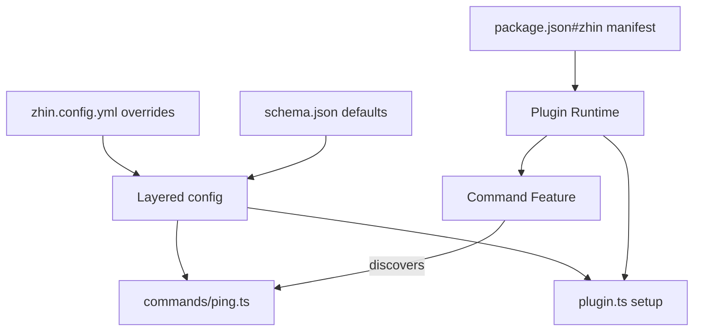

# Writing Your First Plugin

Want to see "one file is enough" first? The repo's [single-file-bot](../examples/index.md#single-file-bot-一个-botts-就是机器人) uses `setup({ addCommand })` to register commands with no `commands/` directory -- get it running, then come back to split files.

Going from an empty directory to a runnable **convention directories** plugin takes just five files: one command, one config schema, one `definePlugin` entry point, plus the zhin manifest in `package.json`.
The `ping-pong` plugin written below uses APIs entirely from the official example [capabilities-bot](https://github.com/zhinjs/zhin/tree/main/examples/capabilities-bot) and can be run directly.

Final directory structure:

```text
ping-pong/
├── package.json      # zhin manifest (topology source of truth)
├── plugin.ts         # definePlugin entry point
├── schema.json       # Config contract (defaults + validation)
├── commands/
│   └── ping.ts       # /ping command
└── zhin.config.yml   # Optional: add this to make "plugin as application"
```

## 1. package.json and the zhin manifest

```json
{
  "name": "ping-pong",
  "private": true,
  "version": "0.1.0",
  "type": "module",
  "scripts": {
    "dev": "zhin runtime start"
  },
  "dependencies": {
    "@zhin.js/command": "^1.0.0",
    "@zhin.js/plugin-runtime": "^1.0.0"
  },
  "devDependencies": {
    "@zhin.js/cli": "^1.0.0"
  },
  "zhin": {
    "protocol": 1,
    "type": "plugin",
    "entry": "./plugin.ts",
    "engine": "^1.0.0",
    "runtime": "trusted",
    "features": [
      { "package": "@zhin.js/command", "api": "^1.0.0" }
    ],
    "plugins": []
  }
}
```

The `zhin` field is the plugin topology manifest:

| Field | Meaning |
|-------|---------|
| `entry` | Plugin entry file; must be a package-relative path starting with `./` |
| `runtime` | `trusted` (runs in the main process) |
| `features` | Enabled Feature providers; `@zhin.js/command` handles discovering the `commands/` directory |
| `plugins` | Mounted sub-plugin instances (empty in this example; see section 5 for mounting) |

## 2. plugin.ts

```ts
import { definePlugin } from '@zhin.js/plugin-runtime';

interface PingPongConfig {
  reply: string;
}

export default definePlugin<PingPongConfig>({
  name: 'ping-pong',
  // Console plugin card display
  metadata: { displayName: 'Ping Pong', icon: 'Blocks' },

  async setup(context) {
    // Config view: schema.json provides defaults, zhin.config.yml overrides
    const config = context.config.get();
    console.log(`[ping-pong] setup: reply=${config.reply}`);

    // Optional: return a Dispose callback, executed at generation end (hot-reload safe)
    return () => console.log('[ping-pong] disposed');
  },
});
```

## 3. commands/ping.ts

Files under `commands/` are auto-discovered by the Command Feature; the filename becomes the command name:

```ts
import { defineCommand } from '@zhin.js/command';

interface PingPongConfig {
  reply: string;
}

export default defineCommand<PingPongConfig, string>({
  description: 'Reply with the configured text',
  execute({ config }) {
    return config.reply;
  },
});
```

The command's `config` and the `context.config.get()` in `setup` share the same layered configuration.

## 4. schema.json and configuration

`schema.json` (JSON Schema 2020-12) declares the config contract and defaults:

```json
{
  "$schema": "https://json-schema.org/draft/2020-12/schema",
  "type": "object",
  "additionalProperties": false,
  "properties": {
    "reply": {
      "type": "string",
      "default": "pong",
      "description": "Reply content for the /ping command"
    }
  }
}
```

Configuration injection is **layered**: the Root plugin reads the `plugin:` section of `zhin.config.yml`;
sub-plugin instances read the `plugins.<instanceKey>` section.

## 5. Mounting to an application

### Method A: `./` local directory sub-plugin (recommended during development)

Reference it as a `./` relative path in the host application's `package.json#zhin.plugins` (no `..` traversal beyond the package root is allowed):

```json
{
  "zhin": {
    "plugins": [
      { "package": "./plugins/ping-pong", "instanceKey": "ping-pong" }
    ]
  }
}
```

Then pass configuration for this instance in the host's `zhin.config.yml`:

```yaml
plugins:
  ping-pong:
    reply: pong!
```

`instanceKey` rules: lowercase letters / digits / hyphens (`^[a-z0-9][a-z0-9-]*$`).

### Method B: Plugin as application

Place `zhin.config.yml` directly in the plugin directory -- the plugin itself becomes the Root:

```yaml
# ping-pong/zhin.config.yml
plugin:
  reply: pong!

plugins: {}
```

```bash
cd ping-pong
pnpm install
pnpm dev        # zhin runtime start
```

## 6. Startup and verification

```bash
zhin runtime start
```

- The startup log should show `[ping-pong] setup: reply=pong!`
- Send `/ping` in a connected channel; the bot replies `pong!`
- Editing `commands/ping.ts` or `zhin.config.yml` triggers hot reload -- no process restart needed
- `zhin runtime start --once` can be used for assembly smoke testing (non-interactive)



## Next steps

- [Examples at a glance](../examples/index.md): capabilities-bot demonstrates all capabilities including database, cron, Agent tools, proactive outbound, and more
- For deeper plugin capabilities (Host Resources, lifecycle, handoff), see [Plugin model](../concepts/plugin-model.md)
