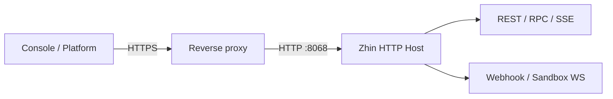

# Run Zhin as a recoverable service

Use this for a single Bot, a team Workroom, or Remote Console. The goal is explicit ownership for process, ingress, secrets, state, monitoring, backup, and recovery.

## 1. Release baseline

- Use Node `^20.19.0 || >=22.12.0` and commit the lockfile.
- Run `zhin doctor`, `pnpm build`, and project tests.
- Run `zhin runtime start --once --mode test` to prove assembly without a long-lived supervisor.
- Record the commit, lockfile hash, configuration version, and data restore point.

The minimum production configuration is an executable fixture:

<<< ../../snippets/production/zhin.config.yml

Inject secrets only through environment variables. The fixture binds to loopback and expects a same-host TLS proxy. Use `0.0.0.0` only when a container or separate gateway must connect directly.

## 2. Network and authentication



The proxy must preserve Authorization, raw Webhook bodies, SSE streaming, and WebSocket Upgrade. Never cache `/api/events` or rewrite a body that a platform signature covers.

`GET /pub/health` is the public probe. It proves the HTTP process responds, not that every Endpoint, Database, or Agent provider is ready. Use Dashboard and Runtime Capabilities for full readiness.

Set a full token in production. Use a separate demo token for read-only observation. Platform Webhooks keep their own signing secrets; a Console token cannot replace them.

## 3. Copy-ready deployment templates

The templates do not depend on an unpublished official Zhin image. They build a traceable image from your project and lockfile. Ensure `package.json` has `build` and `start` scripts, and set `http.host` to `0.0.0.0` inside containers; keep the public edge behind TLS.

### Docker Compose

Download the <a href="/deploy/production/Dockerfile" download>Dockerfile</a>, <a href="/deploy/production/docker-compose.yml" download>docker-compose.yml</a>, <a href="/deploy/production/dockerignore.txt" download=".dockerignore">.dockerignore</a>, and <a href="/deploy/production/env.example.txt" download=".env.example">.env.example</a> into the project root. The last two links use the standard dotfile names when saving:

```bash
cp .env.example .env
# Edit .env and replace at least HTTP_TOKEN.
docker compose config
docker compose up -d --build
docker compose ps
curl --fail http://127.0.0.1:8068/pub/health
```

Compose injects Provider, Adapter, and other secrets from `.env`, while requiring `HTTP_TOKEN`. It runs as non-root with a read-only root filesystem. Only `data/`, `.zhin/`, and the temporary directory are writable, and both state directories use named volumes. Database-consistent backups are still required.

### systemd

Download <a href="/deploy/production/zhin@.service" download>zhin@.service</a>. The Linux username is the instance name and the project lives at `/srv/zhin/<user>`:

```bash
sudo install -m 0644 zhin@.service /etc/systemd/system/zhin@.service
sudo install -d -o zhin -g zhin /srv/zhin/zhin/.zhin /srv/zhin/zhin/data
sudo install -m 0600 -o zhin -g zhin .env /srv/zhin/zhin/.env
sudo systemctl daemon-reload
sudo systemctl enable --now zhin@zhin
sudo systemctl status zhin@zhin
journalctl -u zhin@zhin -f
```

Place the project in `/srv/zhin/zhin`, prepare a local `.env` containing `HTTP_TOKEN`, and ensure `pnpm` is in the unit's PATH. The unit requires that secret file, allows writes only to `.zhin/` and `data/`, and limits restart storms to five attempts in 120 seconds.

### Kubernetes

Download <a href="/deploy/production/kubernetes/resources.yaml" download>resources.yaml</a> and <a href="/deploy/production/kubernetes/kustomization.yaml" download>kustomization.yaml</a> into one directory. Build and push the Dockerfile first, then change `newName` and `newTag`:

```bash
kubectl create secret generic zhin-secrets \
  --from-env-file=.env
kubectl kustomize ./kubernetes
kubectl apply -k ./kubernetes
kubectl rollout status deployment/zhin
kubectl port-forward service/zhin 8068:8068
```

The image keeps your project's own `zhin.config.yml`, while the Secret projects the complete `.env`, so the template does not drop Provider or Adapter keys. Recreate the Secret and roll the Deployment after changing secrets. The template deliberately uses one replica and `Recreate`: default SQLite, file-backed Workroom state, and `ReadWriteOnce` volumes are not multi-writer systems. Before scaling horizontally, move to a shared database and a Workroom store with one write authority. `/pub/health` is only a process probe; use Console acceptance for business readiness.

## 4. Process supervision

```bash
# Container or external supervisor: foreground, logs on stdout
zhin runtime start --mode production --no-watch

# Linux: install a user-level systemd service
zhin service install --user
zhin service status --user
```

On macOS, use the launchd service commands without `--user`. Keep one restart owner: with systemd, launchd, Kubernetes, or PM2, let the external supervisor own a foreground Runtime. Use `--daemon` only for a directly managed bare-metal process.

Exit code 51 means Console requested a restart; 75 means Runtime requires one. An external supervisor should restart both while enforcing a storm limit.

## 5. Durable state and backup

| State | Default location or authority | Backup requirement |
| --- | --- | --- |
| Primary database | `.zhin/data.sqlite` or configured backend | Database-consistent snapshot |
| Workroom Catalog | `workroom_catalog`; file mode `.zhin/workroom-catalog.json` | Same restore point as Journal |
| Workroom Journal | `workroom_events`; file mode `.zhin/workroom-journal` | Copy the full append-only store |
| Scheduled jobs | `data/schedule-jobs.json` | Save with config, timezone, and Endpoint targets |
| Runtime-private state | `.zhin/` | Select by feature; never expose through Agent file tools |
| Secrets | Secret manager / environment injection | Rotate separately; exclude from normal backup archives |

Use a database snapshot or stop writes before copying SQLite. Use the native backup tool for external databases and rehearse restoration regularly.

## 6. Monitoring and alerts

Monitor the HTTP probe, restart count, Endpoint health, SSE recovery gaps, error rate, database capacity, blocked Workroom items, and Agent failure/cancellation ratio.

Logs go to stdout by default; daemon mode writes `.zhin/runtime.log`. Configure host-level rotation. Include Endpoint, Project, runtimeId, or runId in alerts instead of forwarding only an error string.

## 7. Release and rollback

1. Pause ingress that creates new side effects while keeping read-only probes.
2. Back up database, Workroom state, scheduled jobs, configuration, and lockfile.
3. Install locked dependencies, then run doctor, tests, and one-shot startup.
4. Start production and complete [Console acceptance](/en/console/#standard-acceptance-run).
5. Observe one full business window before expiring the previous version and backup.

Rollback restores code, lockfile, configuration, and data from one checkpoint. If the new version wrote a new schema or external side effect, never downgrade packages alone; follow the migration's data recovery plan.

## Incident order

1. Is `/pub/health` reachable?
2. Does Dashboard show the expected Host and version?
3. Is the Endpoint online and receiving inbox events?
4. Did the current generation publish the required capability?
5. Did Database, SSE history, and Workroom Journal recover from one authority?

See [Version compatibility and migration](./upgrades) and the [Console guide](/en/console/).
