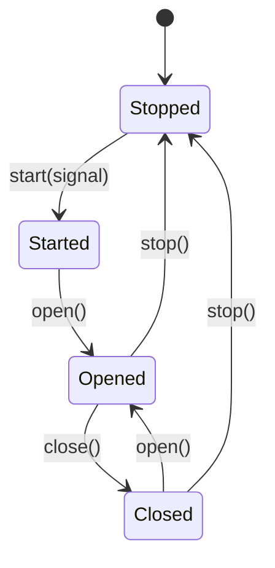
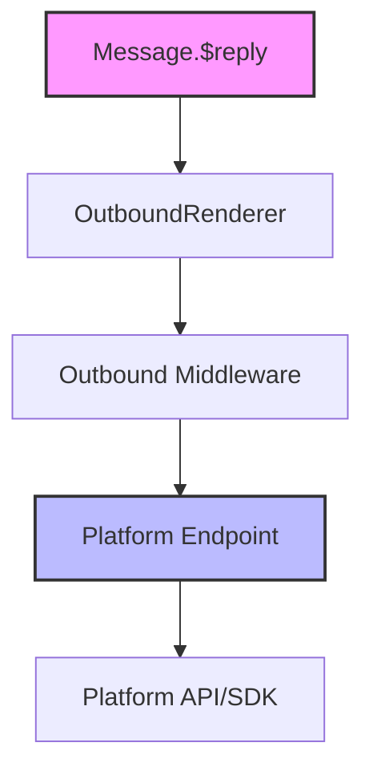

[中文版](/wiki/cubic/adapters-core)

::: warning Generated reference snapshot
[Original Cubic page](https://www.cubic.dev/wikis/zhinjs/zhin?page=page-adapters-core) · captured 2026-09-23 · [source commit](https://github.com/zhinjs/zhin/commit/368db14caa4aa91311fb090f07bd792fe4b22fe7). This AI-generated page has not been verified against the current code. Use the [Zhin documentation](/en/getting-started/) for current behavior and [see known corrections](/en/wiki/).
:::

::: danger Known correction
The lifecycle diagram below conflates a scaffolded Endpoint example with `createEndpointLifecycle`. The latter uses `idle / connecting / open / reconnecting / closed / stopped` and does not expose the diagram's `open()` / `close()` transitions. The example is a partial skeleton, not a copy-ready inbound adapter. See [Endpoint Lifecycle](/en/authoring/endpoint-lifecycle).
:::

::: details Relevant source files

The following files were used as context for generating this wiki page:

- [README.md](https://github.com/zhinjs/zhin/blob/368db14caa4aa91311fb090f07bd792fe4b22fe7/README.md)
- [CLAUDE.md](https://github.com/zhinjs/zhin/blob/368db14caa4aa91311fb090f07bd792fe4b22fe7/CLAUDE.md)
- [AGENTS.md](https://github.com/zhinjs/zhin/blob/368db14caa4aa91311fb090f07bd792fe4b22fe7/AGENTS.md)
- [basic/cli/src/commands/new.ts](https://github.com/zhinjs/zhin/blob/368db14caa4aa91311fb090f07bd792fe4b22fe7/basic/cli/src/commands/new.ts)
- [plugins/adapters/README.md](https://github.com/zhinjs/zhin/blob/368db14caa4aa91311fb090f07bd792fe4b22fe7/plugins/adapters/README.md)
:::

# Adapter Core & Endpoint Lifecycle

The Adapter Core manages platform connections within Zhin.js, providing a unified interface for multiple chat platforms such as QQ, Discord, Telegram, and Slack. It normalizes inbound message streams from various protocols and handles the outbound send chain through standardized platform endpoints.

This system allows a single bot instance to run multiple accounts across many platforms simultaneously. The core ensures that every message matches a command or passes through middleware before reaching the unified send pipeline.
Sources: [README.md:16-20](https://github.com/zhinjs/zhin/blob/368db14caa4aa91311fb090f07bd792fe4b22fe7/README.md#L16-L20), [CLAUDE.md:70-75](https://github.com/zhinjs/zhin/blob/368db14caa4aa91311fb090f07bd792fe4b22fe7/CLAUDE.md#L70-L75), [AGENTS.md:13-18](https://github.com/zhinjs/zhin/blob/368db14caa4aa91311fb090f07bd792fe4b22fe7/AGENTS.md#L13-L18)

## Adapter Architecture

Adapters are implemented as discrete packages found in the `plugins/adapters/` directory. They follow a standard convention for discovery and execution within the Plugin Runtime. An adapter primarily consists of an implementation of the `Endpoint` class and a call to `defineAdapter` to export the definition.

### Capabilities and IO
Adapters split their functionality into `inbound` (receiving messages/events) and `outbound` (sending messages). Some endpoints may be restricted to only one of these capabilities depending on the platform protocol (e.g., a webhook-only inbound source).
Sources: [basic/cli/src/commands/new.ts:318-325](https://github.com/zhinjs/zhin/blob/368db14caa4aa91311fb090f07bd792fe4b22fe7/basic/cli/src/commands/new.ts#L318-L325), [AGENTS.md:180-185](https://github.com/zhinjs/zhin/blob/368db14caa4aa91311fb090f07bd792fe4b22fe7/AGENTS.md#L180-L185)

### Core Components
| Component | Description |
| :--- | :--- |
| `defineAdapter` | A higher-order function that brands and exports an adapter definition for the Zhin runtime. |
| `Endpoint` | The base class for platform-specific clients. It manages transport, heartbeats, and message delivery. |
| `emit()` | A method used by the Endpoint to inject normalized platform events into the Zhin message pipeline. |
| `send()` | The implementation method for delivering messages to the platform-specific API. |
Sources: [basic/cli/src/commands/new.ts:318-362](https://github.com/zhinjs/zhin/blob/368db14caa4aa91311fb090f07bd792fe4b22fe7/basic/cli/src/commands/new.ts#L318-L362), [CLAUDE.md:78-83](https://github.com/zhinjs/zhin/blob/368db14caa4aa91311fb090f07bd792fe4b22fe7/CLAUDE.md#L78-L83)

## Endpoint Lifecycle Management

Long-running connections, particularly those using WebSockets or persistent HTTP streams, use standardized lifecycle methods. The Zhin runtime manages these through an internal `createEndpointLifecycle` mechanism to handle state transitions, heartbeats, and reconnections.

### Lifecycle States
1.  **Start**: Establishes the initial transport connection (e.g., opening a WebSocket).
2.  **Open**: Sets the endpoint to a ready state, allowing it to process and emit events.
3.  **Close**: Pauses the ingestion of new events without necessarily severing the transport.
4.  **Stop**: Fully releases the transport, heartbeats, and reconnection tasks.
Sources: [basic/cli/src/commands/new.ts:335-358](https://github.com/zhinjs/zhin/blob/368db14caa4aa91311fb090f07bd792fe4b22fe7/basic/cli/src/commands/new.ts#L335-L358), [AGENTS.md:177-185](https://github.com/zhinjs/zhin/blob/368db14caa4aa91311fb090f07bd792fe4b22fe7/AGENTS.md#L177-L185)


The diagram above shows the state transitions of a platform endpoint managed by the Zhin runtime.
Sources: [basic/cli/src/commands/new.ts:335-355](https://github.com/zhinjs/zhin/blob/368db14caa4aa91311fb090f07bd792fe4b22fe7/basic/cli/src/commands/new.ts#L335-L355), [AGENTS.md:177-180](https://github.com/zhinjs/zhin/blob/368db14caa4aa91311fb090f07bd792fe4b22fe7/AGENTS.md#L177-L180)

## Outbound Message Pipeline

All outbound messages must follow the unified send chain. Bypassing this chain by directly calling platform-specific SDKs is prohibited by the project's architectural constraints.

### The Send Chain Process
1.  **Message Initiation**: A command or middleware calls `Message.$reply` or `Adapter.sendMessage`.
2.  **Rendering**: The `OutboundRenderer` processes the message content (e.g., converting HTML/Markdown to PNG or text).
3.  **Middleware Processing**: Outbound middleware intercepts the message for logging, filtering, or transformation.
4.  **Endpoint Delivery**: The message reaches the specific `Endpoint` and is delivered via the platform API.
Sources: [CLAUDE.md:78-83](https://github.com/zhinjs/zhin/blob/368db14caa4aa91311fb090f07bd792fe4b22fe7/CLAUDE.md#L78-L83), [AGENTS.md:183-185](https://github.com/zhinjs/zhin/blob/368db14caa4aa91311fb090f07bd792fe4b22fe7/AGENTS.md#L183-L185)


This flow represents the mandatory path for all outgoing messages in the Zhin.js framework.
Sources: [CLAUDE.md:78-83](https://github.com/zhinjs/zhin/blob/368db14caa4aa91311fb090f07bd792fe4b22fe7/CLAUDE.md#L78-L83), [AGENTS.md:183-185](https://github.com/zhinjs/zhin/blob/368db14caa4aa91311fb090f07bd792fe4b22fe7/AGENTS.md#L183-L185)

## Stability Tiers

Zhin.js categorizes adapters into three tiers based on their implementation maturity and maintenance level:

*   **Stable (Core)**: The `Sandbox` adapter, used for local testing and debugging.
*   **Platform Stable**: Adapters meeting strict reliability criteria (currently under development).
*   **Advanced/Experimental**: Adapters for third-party protocols like Telegram, Discord, and Enterprise WeChat. These may require specific configurations like webhooks or HTTP routers.
Sources: [plugins/adapters/README.md:14-25](https://github.com/zhinjs/zhin/blob/368db14caa4aa91311fb090f07bd792fe4b22fe7/plugins/adapters/README.md#L14-L25)

## Implementation Example

The following boilerplate illustrates the standard structure of a Zhin.js adapter using the `defineAdapter` API.

```typescript
// plugins/adapters/my-adapter/adapters/my-adapter/index.ts
import { Endpoint, defineAdapter, type EndpointSendRequest } from 'zhin.js/adapter';

export default defineAdapter({
  capabilities: ['inbound', 'outbound'],
  create(context) {
    return new class extends Endpoint {
      async start(signal: AbortSignal) {
        // Establish connection
      }
      async stop() {
        // Release resources
      }
      async send({ conversation, payload }: EndpointSendRequest) {
        // Call platform API
        return 'message-id';
      }
    }(String(context.id), context.config);
  },
});
```
Sources: [basic/cli/src/commands/new.ts:318-360](https://github.com/zhinjs/zhin/blob/368db14caa4aa91311fb090f07bd792fe4b22fe7/basic/cli/src/commands/new.ts#L318-L360)

## Summary

The Adapter Core and Endpoint Lifecycle systems provide a robust abstraction layer for chat platform communication. By enforcing a single send chain and standardized lifecycle transitions, Zhin.js ensures that plugins remain platform-agnostic while supporting advanced features like hot reloading and AI agent orchestration across diverse communication channels.
Sources: [README.md:43-58](https://github.com/zhinjs/zhin/blob/368db14caa4aa91311fb090f07bd792fe4b22fe7/README.md#L43-L58), [AGENTS.md:177-185](https://github.com/zhinjs/zhin/blob/368db14caa4aa91311fb090f07bd792fe4b22fe7/AGENTS.md#L177-L185)
