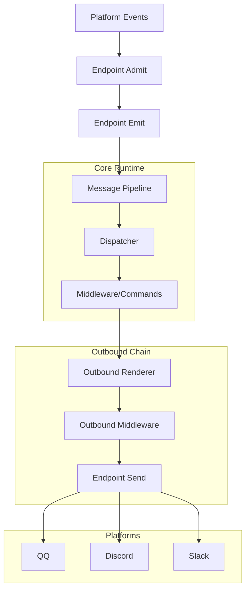
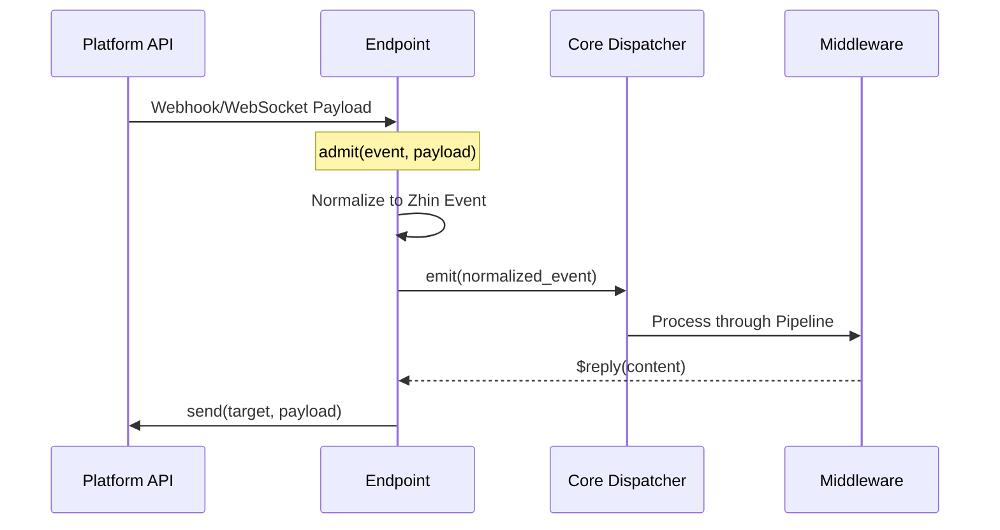

[中文版](/wiki/cubic/adapters-platforms)

::: warning Generated reference snapshot
[Original Cubic page](https://www.cubic.dev/wikis/zhinjs/zhin?page=page-adapters-platforms) · captured 2026-09-23 · [source commit](https://github.com/zhinjs/zhin/commit/368db14caa4aa91311fb090f07bd792fe4b22fe7). This AI-generated page has not been verified against the current code. Use the [Zhin documentation](/en/getting-started/) for current behavior and [see known corrections](/en/wiki/archive).
:::

::: details Relevant source files

The following files were used as context for generating this wiki page:

- [README.md](https://github.com/zhinjs/zhin/blob/368db14caa4aa91311fb090f07bd792fe4b22fe7/README.md)
- [AGENTS.md](https://github.com/zhinjs/zhin/blob/368db14caa4aa91311fb090f07bd792fe4b22fe7/AGENTS.md)
- [plugins/adapters/README.md](https://github.com/zhinjs/zhin/blob/368db14caa4aa91311fb090f07bd792fe4b22fe7/plugins/adapters/README.md)
- [basic/cli/src/commands/new.ts](https://github.com/zhinjs/zhin/blob/368db14caa4aa91311fb090f07bd792fe4b22fe7/basic/cli/src/commands/new.ts)
- [packages/toolkit/scaffold-wizard/README.md](https://github.com/zhinjs/zhin/blob/368db14caa4aa91311fb090f07bd792fe4b22fe7/packages/toolkit/scaffold-wizard/README.md)
:::

# Platform Integrations (QQ, Discord, Slack...)

Zhin.js provides a multi-channel architecture that enables a single codebase to operate across 20+ chat platforms, including QQ, Discord, Slack, Telegram, and WeChat. The system normalizes inbound and outbound message streams, allowing one bot instance to manage multiple accounts and endpoints simultaneously.

Sources: [README.md:18-20](https://github.com/zhinjs/zhin/blob/368db14caa4aa91311fb090f07bd792fe4b22fe7/README.md#L18-L20), [README.md:79-81](https://github.com/zhinjs/zhin/blob/368db14caa4aa91311fb090f07bd792fe4b22fe7/README.md#L79-L81)

## Core Architecture

The integration system consists of two primary layers: **Adapters** and **Endpoints**. An Adapter defines the platform's protocol and logic, while an Endpoint represents a specific account instance and manages its lifecycle and transport.

### The Endpoint Lifecycle
Every platform integration extends the `Endpoint` class, which governs the connection state.
- **`start`**: Establishes the transport connection (e.g., WebSocket, HTTP Long Polling).
- **`open`**: Enables the endpoint to begin processing and emitting events.
- **`stop`**: Idempotently releases transports, heartbeats, and reconnection tasks.
- **`send`**: Delivers a processed payload to the platform target.

Sources: [basic/cli/src/commands/new.ts:310-348](https://github.com/zhinjs/zhin/blob/368db14caa4aa91311fb090f07bd792fe4b22fe7/basic/cli/src/commands/new.ts#L310-L348), [AGENTS.md:154-156](https://github.com/zhinjs/zhin/blob/368db14caa4aa91311fb090f07bd792fe4b22fe7/AGENTS.md#L154-L156)

### Messaging Pipeline
Zhin.js uses a unified send chain for all outbound communications. Messages must flow through the `OutboundRenderer` and outbound middleware before reaching the platform `Endpoint`. Direct calls to platform-specific bot APIs are discouraged to maintain architectural consistency.

Sources: [CLAUDE.md:75-76](https://github.com/zhinjs/zhin/blob/368db14caa4aa91311fb090f07bd792fe4b22fe7/CLAUDE.md#L75-L76), [AGENTS.md:150-152](https://github.com/zhinjs/zhin/blob/368db14caa4aa91311fb090f07bd792fe4b22fe7/AGENTS.md#L150-L152)


*The diagram shows the bidirectional flow between Zhin.js core and external chat platforms via Endpoints.*

## Supported Platforms and Tiers

Adapters are categorized into tiers based on their stability and feature support within the Zhin ecosystem.

| Platform Category | Adapters | Source Package |
| :--- | :--- | :--- |
| **Stable (Core)** | Sandbox | `@zhin.js/adapter-sandbox` |
| **Messaging** | QQ, ICQQ, NapCat, OneBot 11/12 | `@zhin.js/adapter-icqq`, `@zhin.js/adapter-qq` |
| **Community** | Discord, Telegram, Slack, KOOK | `@zhin.js/adapter-discord`, `@zhin.js/adapter-telegram` |
| **Enterprise** | DingTalk, Feishu (Lark), WeChat Work | `dingtalk`, `lark`, `wecom` |
| **Protocol/Other** | GitHub, Email, Satori, LINE | `@zhin.js/adapter-github`, `email`, `satori` |

Sources: [README.md:126-136](https://github.com/zhinjs/zhin/blob/368db14caa4aa91311fb090f07bd792fe4b22fe7/README.md#L126-L136), [plugins/adapters/README.md:7-18](https://github.com/zhinjs/zhin/blob/368db14caa4aa91311fb090f07bd792fe4b22fe7/plugins/adapters/README.md#L7-L18)

### Feature Capabilities
Endpoints declare specific capabilities to indicate their functional scope:
- **`inbound`**: The endpoint can receive events and messages from the platform.
- **`outbound`**: The endpoint can send messages and media to the platform.

Sources: [basic/cli/src/commands/new.ts:352-355](https://github.com/zhinjs/zhin/blob/368db14caa4aa91311fb090f07bd792fe4b22fe7/basic/cli/src/commands/new.ts#L352-L355), [AGENTS.md:154-156](https://github.com/zhinjs/zhin/blob/368db14caa4aa91311fb090f07bd792fe4b22fe7/AGENTS.md#L154-L156)

## Configuration and Setup

Platform integrations are configured via `zhin.config.yml` or through interactive wizards.

### Scaffolding
The `@zhin.js/scaffold-wizard` provides step-by-step configuration for complex platforms:
1. **Selection**: You choose the platform (e.g., Telegram, GitHub App).
2. **Parameters**: You input required credentials (Tokens, App IDs, Webhook secrets).
3. **Environment**: The wizard writes sensitive credentials to `.env` and generates the corresponding `zhin.config.yml` entries.

Sources: [packages/toolkit/scaffold-wizard/README.md:17-29](https://github.com/zhinjs/zhin/blob/368db14caa4aa91311fb090f07bd792fe4b22fe7/packages/toolkit/scaffold-wizard/README.md#L17-L29), [basic/cli/src/commands/setup.ts:220-240](https://github.com/zhinjs/zhin/blob/368db14caa4aa91311fb090f07bd792fe4b22fe7/basic/cli/src/commands/setup.ts#L220-L240)

### Integration via Config
```yaml
plugins:
  qq:
    id: my-qq-bot
    token: ${QQ_TOKEN}
  discord:
    id: my-discord-bot
    token: ${DISCORD_TOKEN}
```
*Example showing configuration using environment variable references for platform tokens.*
Sources: [README.md:113-124](https://github.com/zhinjs/zhin/blob/368db14caa4aa91311fb090f07bd792fe4b22fe7/README.md#L113-L124), [basic/cli/src/commands/new.ts:384-398](https://github.com/zhinjs/zhin/blob/368db14caa4aa91311fb090f07bd792fe4b22fe7/basic/cli/src/commands/new.ts#L384-L398)

## Event Handling
Platforms deliver data through the `admit` and `emit` methods. When an endpoint receives a platform event, it admits the data, normalizing it into a Zhin event before calling `emit`. This allows the `Dispatcher` to handle events consistently regardless of the source platform.


*Sequence of events from platform reception to the internal reply mechanism.*
Sources: [basic/cli/src/commands/new.ts:344-348](https://github.com/zhinjs/zhin/blob/368db14caa4aa91311fb090f07bd792fe4b22fe7/basic/cli/src/commands/new.ts#L344-L348), [CLAUDE.md:75-76](https://github.com/zhinjs/zhin/blob/368db14caa4aa91311fb090f07bd792fe4b22fe7/CLAUDE.md#L75-L76)

## Summary
Platform integrations in Zhin.js leverage a standardized `Endpoint` and `Adapter` pattern to abstract platform-specific protocols. By utilizing a unified send chain and normalized event emission, developers can build assistants that interact seamlessly across 20+ channels using a single codebase. Lifecycle management and interactive scaffolding further simplify the process of scaling a bot across multiple accounts and service providers.
