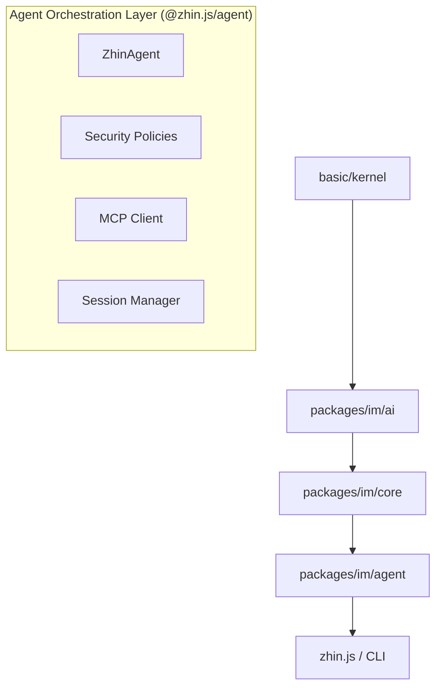
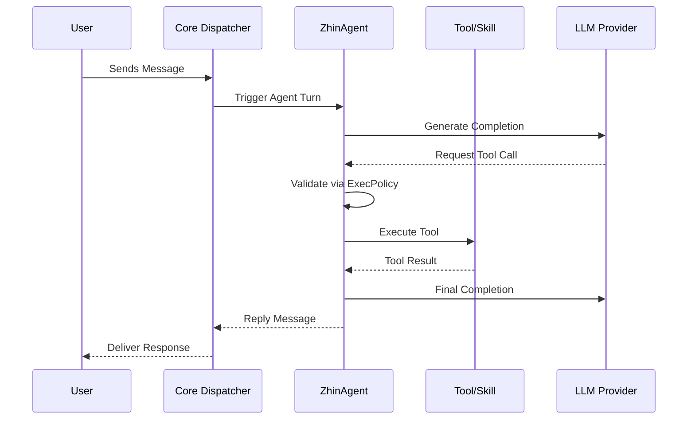

[中文版](/wiki/cubic/ai-orchestration)

::: warning Generated reference snapshot
[Original Cubic page](https://www.cubic.dev/wikis/zhinjs/zhin?page=page-ai-orchestration) · captured 2026-09-23 · [source commit](https://github.com/zhinjs/zhin/commit/368db14caa4aa91311fb090f07bd792fe4b22fe7). This AI-generated page has not been verified against the current code. Use the [Zhin documentation](/en/getting-started/) for current behavior and [see known corrections](/en/wiki/archive).
:::

::: danger Known correction
Tools and Hooks use `tools/<name>/index.ts` and `hooks/<name>/index.ts`. `execSecurity` (`deny | allowlist | full`) and `execApprovalMode` (`ask | auto | bypass`) are separate settings. See [Convention Directories](/en/authoring/conventions) and [Agent configuration](/en/ai/).
:::

::: details Relevant source files

The following files were used as context for generating this wiki page:

- [README.md](https://github.com/zhinjs/zhin/blob/368db14caa4aa91311fb090f07bd792fe4b22fe7/README.md)
- [AGENTS.md](https://github.com/zhinjs/zhin/blob/368db14caa4aa91311fb090f07bd792fe4b22fe7/AGENTS.md)
- [CLAUDE.md](https://github.com/zhinjs/zhin/blob/368db14caa4aa91311fb090f07bd792fe4b22fe7/CLAUDE.md)
- [packages/im/agent/package.json](https://github.com/zhinjs/zhin/blob/368db14caa4aa91311fb090f07bd792fe4b22fe7/packages/im/agent/package.json)
- [packages/im/agent-feature/package.json](https://github.com/zhinjs/zhin/blob/368db14caa4aa91311fb090f07bd792fe4b22fe7/packages/im/agent-feature/package.json)
- [packages/toolkit/create-zhin/src/workspace.ts](https://github.com/zhinjs/zhin/blob/368db14caa4aa91311fb090f07bd792fe4b22fe7/packages/toolkit/create-zhin/src/workspace.ts)
- [packages/toolkit/create-zhin/template/skills/skill-creator/SKILL.md](https://github.com/zhinjs/zhin/blob/368db14caa4aa91311fb090f07bd792fe4b22fe7/packages/toolkit/create-zhin/template/skills/skill-creator/SKILL.md)
:::

# Agent Orchestration & ZhinAgent

ZhinAgent is the primary orchestration component within the Zhin.js framework that handles AI session management, tool execution, and multi-model coordination. It operates as an opt-in layer on top of the Instant Messaging (IM) core, allowing developers to integrate Large Language Models (LLMs) with chat platform adapters. While the base framework remains under 10MB, adding `@zhin.js/agent` enables advanced capabilities such as long-term memory, capability governance, and Model Context Protocol (MCP) integration.

Sources: [README.md:18-22](https://github.com/zhinjs/zhin/blob/368db14caa4aa91311fb090f07bd792fe4b22fe7/README.md#L18-L22), [AGENTS.md:6-10](https://github.com/zhinjs/zhin/blob/368db14caa4aa91311fb090f07bd792fe4b22fe7/AGENTS.md#L6-L10), [packages/im/agent/package.json:3-5](https://github.com/zhinjs/zhin/blob/368db14caa4aa91311fb090f07bd792fe4b22fe7/packages/im/agent/package.json#L3-L5)

## Architectural Positioning

The Agent layer occupies a specific position in the project's monorepo dependency hierarchy. It sits above the AI engine and IM core but below the final assembly entry point. This structure ensures that low-level messaging and kernel logic remain independent of specific AI implementations.


*The diagram shows the dependency flow where higher layers like Agent Orchestration depend on the AI engine and IM core.*
Sources: [CLAUDE.md:46-65](https://github.com/zhinjs/zhin/blob/368db14caa4aa91311fb090f07bd792fe4b22fe7/CLAUDE.md#L46-L65), [AGENTS.md:46-59](https://github.com/zhinjs/zhin/blob/368db14caa4aa91311fb090f07bd792fe4b22fe7/AGENTS.md#L46-L59)

### Execution Pipeline
Agent execution follows a standardized "Turn" runtime. A normalized message stream passes through adapters, matches commands or middleware, and then enters the Agent Turn for processing.


*The sequence illustrates the flow of a message through the Agent, including tool validation and LLM interaction.*
Sources: [README.md:46-59](https://github.com/zhinjs/zhin/blob/368db14caa4aa91311fb090f07bd792fe4b22fe7/README.md#L46-L59), [AGENTS.md:162-168](https://github.com/zhinjs/zhin/blob/368db14caa4aa91311fb090f07bd792fe4b22fe7/AGENTS.md#L162-L168)

## Core Components

The Agent Orchestration module is composed of several specialized sub-packages and utilities exported via the `@zhin.js/agent` package.

| Component | Responsibility | Source Path |
|:---|:---|:---|
| **ZhinAgent** | Main orchestrator managing the execution loop and session state. | `packages/im/agent/src/core/` |
| **ExecPolicy** | Enforces security boundaries, such as allowlists for tool execution. | `packages/im/agent/src/security/` |
| **Session Manager** | Tracks conversation history, user preferences, and memory compaction. | `packages/im/agent/src/session/` |
| **MCP Client** | Integrates external tools via the Model Context Protocol. | `packages/im/agent/src/mcp/` |
| **Resource Hub** | Provides a DI (Dependency Injection) container for agent capabilities. | `packages/im/agent/src/resource-hub/` |

Sources: [packages/im/agent/package.json:8-60](https://github.com/zhinjs/zhin/blob/368db14caa4aa91311fb090f07bd792fe4b22fe7/packages/im/agent/package.json#L8-L60), [CLAUDE.md:75-80](https://github.com/zhinjs/zhin/blob/368db14caa4aa91311fb090f07bd792fe4b22fe7/CLAUDE.md#L75-L80), [AGENTS.md:162-168](https://github.com/zhinjs/zhin/blob/368db14caa4aa91311fb090f07bd792fe4b22fe7/AGENTS.md#L162-L168)

## Capability Discovery

ZhinAgent uses a convention-over-configuration approach to discover tools, skills, and sub-agents. The `Plugin Runtime` scans specific directories within a plugin or the root project to register capabilities automatically.

### Directory Conventions
*   `tools/<name>/index.ts`: Global AI tools defined using `defineAgentTool`.
*   `skills/<name>/SKILL.md`: Reusable agent workflows and documentation.
*   `agents/<name>/agent.json`: Sub-agent definitions including private tools and system prompts.
*   `hooks/<name>/index.ts`: Lifecycle hooks for intercepting agent turns.

Sources: [CLAUDE.md:128-142](https://github.com/zhinjs/zhin/blob/368db14caa4aa91311fb090f07bd792fe4b22fe7/CLAUDE.md#L128-L142), [AGENTS.md:135-145](https://github.com/zhinjs/zhin/blob/368db14caa4aa91311fb090f07bd792fe4b22fe7/AGENTS.md#L135-L145), [packages/toolkit/create-zhin/template/skills/skill-creator/SKILL.md:42-50](https://github.com/zhinjs/zhin/blob/368db14caa4aa91311fb090f07bd792fe4b22fe7/packages/toolkit/create-zhin/template/skills/skill-creator/SKILL.md#L42-L50)

## Security and Governance (Harness Engineering)

The framework employs "Harness Engineering" to ensure Agent safety. Execution is governed by multi-layered policies that prevent unauthorized tool usage or data leakage.

*   **Execution Policies**: Separates `execSecurity` (`deny | allowlist | full`) from `execApprovalMode` (`ask | auto | bypass`).
*   **Sandbox**: Tools execute within a restricted environment to isolate the host system.
*   **File Policy**: Restricts agent access to specific file system paths.
*   **Capability Ingress**: External providers must project through a governed ingress rather than direct execution.

Sources: [README.md:96-115](https://github.com/zhinjs/zhin/blob/368db14caa4aa91311fb090f07bd792fe4b22fe7/README.md#L96-L115), [AGENTS.md:90-110](https://github.com/zhinjs/zhin/blob/368db14caa4aa91311fb090f07bd792fe4b22fe7/AGENTS.md#L90-L110), [CLAUDE.md:183-188](https://github.com/zhinjs/zhin/blob/368db14caa4aa91311fb090f07bd792fe4b22fe7/CLAUDE.md#L183-L188)

## Configuration and Scaffolding

Agents are configured via `zhin.config.yml`. The `create-zhin` toolkit provides interactive scaffolding to set up AI providers and agent defaults.

```yaml
# Example zhin.config.yml for ZhinAgent
ai:
  enabled: true
  providers:
    openai-main:
      sdk: openai
      apiKey: ${AI_API_KEY}
  agents:
    zhin:
      provider: openai-main
      model: gpt-4o-mini
  agent:
    execSecurity: allowlist
    execApprovalMode: ask
```
Sources: [README.md:148-164](https://github.com/zhinjs/zhin/blob/368db14caa4aa91311fb090f07bd792fe4b22fe7/README.md#L148-L164), [packages/toolkit/create-zhin/src/workspace.ts:162-175](https://github.com/zhinjs/zhin/blob/368db14caa4aa91311fb090f07bd792fe4b22fe7/packages/toolkit/create-zhin/src/workspace.ts#L162-L175)

### Installation Tiers
The agent system requires specific peer dependencies to function.

| Tier | Package | Purpose |
|:---|:---|:---|
| **Agent Logic** | `@zhin.js/agent` | Orchestration and Session management. |
| **Validation** | `zod` | Schema validation for tool inputs. |
| **AI SDK** | `ai` | Core LLM interaction library. |
| **Provider** | `@ai-sdk/openai` (or others) | Vendor-specific LLM implementations. |

Sources: [README.md:127-141](https://github.com/zhinjs/zhin/blob/368db14caa4aa91311fb090f07bd792fe4b22fe7/README.md#L127-L141), [packages/im/agent/package.json:117-124](https://github.com/zhinjs/zhin/blob/368db14caa4aa91311fb090f07bd792fe4b22fe7/packages/im/agent/package.json#L117-L124), [AGENTS.md:25-30](https://github.com/zhinjs/zhin/blob/368db14caa4aa91311fb090f07bd792fe4b22fe7/AGENTS.md#L25-L30)

## Summary

ZhinAgent acts as the central intelligence hub for Zhin.js, bridging the gap between raw IM messages and LLM capabilities. By enforcing strict security policies and utilizing convention-based discovery for tools and skills, it provides a structured and safe environment for building autonomous chat assistants. The system relies on a layered architecture where orchestration is cleanly separated from the underlying AI providers and IM protocols.

Sources: [AGENTS.md:158-168](https://github.com/zhinjs/zhin/blob/368db14caa4aa91311fb090f07bd792fe4b22fe7/AGENTS.md#L158-L168), [README.md:85-95](https://github.com/zhinjs/zhin/blob/368db14caa4aa91311fb090f07bd792fe4b22fe7/README.md#L85-L95)
