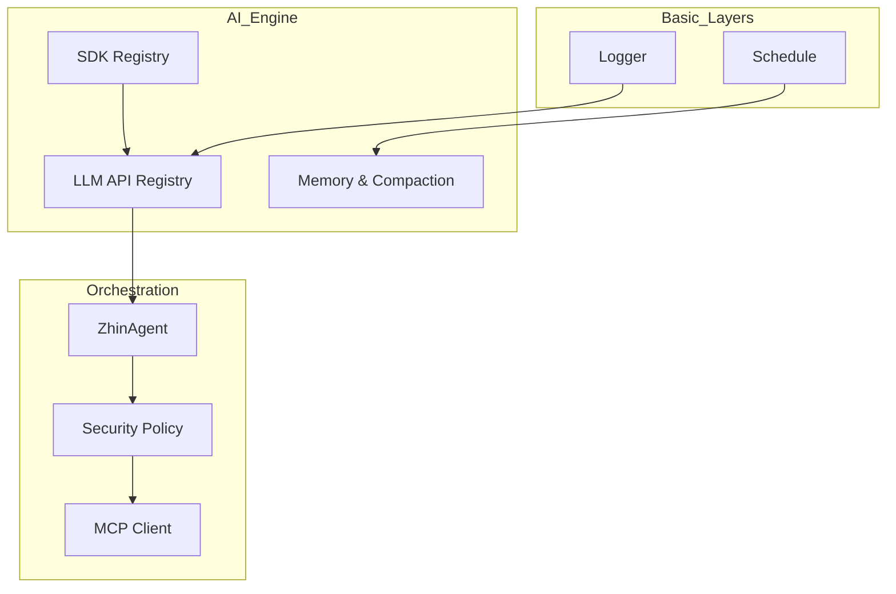
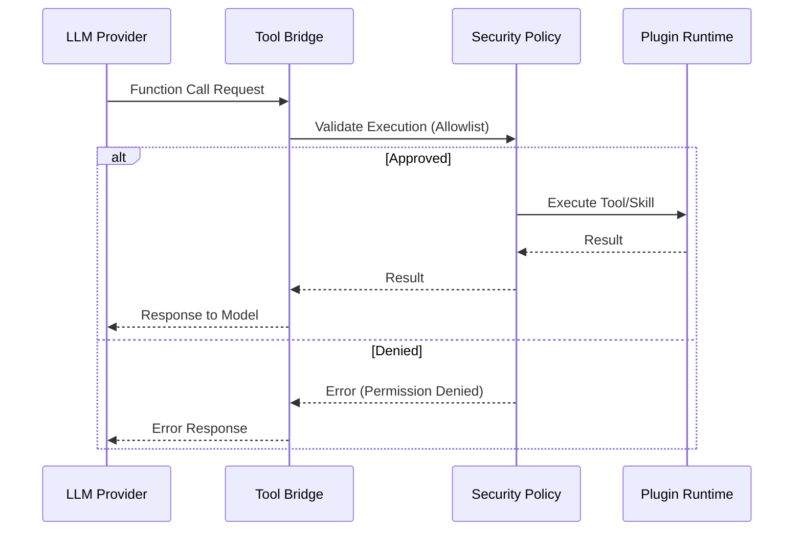

[中文版](/wiki/cubic/ai-providers)

::: warning Generated reference snapshot
[Original Cubic page](https://www.cubic.dev/wikis/zhinjs/zhin?page=page-ai-providers) · captured 2026-09-23 · [source commit](https://github.com/zhinjs/zhin/commit/368db14caa4aa91311fb090f07bd792fe4b22fe7). This AI-generated page has not been verified against the current code. Use the [Zhin documentation](/en/getting-started/) for current behavior and [see known corrections](/en/wiki/archive).
:::

::: details Relevant source files

The following files were used as context for generating this wiki page:

- [packages/im/ai/src/llm/index.ts](https://github.com/zhinjs/zhin/blob/368db14caa4aa91311fb090f07bd792fe4b22fe7/packages/im/ai/src/llm/index.ts)
- [packages/im/ai/src/llm/sdk-registry.ts](https://github.com/zhinjs/zhin/blob/368db14caa4aa91311fb090f07bd792fe4b22fe7/packages/im/ai/src/llm/sdk-registry.ts)
- [packages/im/ai/src/llm/tool-bridge.ts](https://github.com/zhinjs/zhin/blob/368db14caa4aa91311fb090f07bd792fe4b22fe7/packages/im/ai/src/llm/tool-bridge.ts)
- [README.md](https://github.com/zhinjs/zhin/blob/368db14caa4aa91311fb090f07bd792fe4b22fe7/README.md)
- [CLAUDE.md](https://github.com/zhinjs/zhin/blob/368db14caa4aa91311fb090f07bd792fe4b22fe7/CLAUDE.md)
- [AGENTS.md](https://github.com/zhinjs/zhin/blob/368db14caa4aa91311fb090f07bd792fe4b22fe7/AGENTS.md)
- [basic/cli/src/commands/setup.ts](https://github.com/zhinjs/zhin/blob/368db14caa4aa91311fb090f07bd792fe4b22fe7/basic/cli/src/commands/setup.ts)
- [packages/toolkit/scaffold-wizard/README.md](https://github.com/zhinjs/zhin/blob/368db14caa4aa91311fb090f07bd792fe4b22fe7/packages/toolkit/scaffold-wizard/README.md)
- [packages/toolkit/create-zhin/src/workspace.ts](https://github.com/zhinjs/zhin/blob/368db14caa4aa91311fb090f07bd792fe4b22fe7/packages/toolkit/create-zhin/src/workspace.ts)
:::

# LLM Providers & SDK Bridging

Zhin.js implements an opt-in AI architecture that decouples the core Instant Messaging (IM) framework from Large Language Model (LLM) processing. This system uses a tiered installation model where LLM capabilities are provided by the `@zhin.js/ai` and `@zhin.js/agent` packages, which bridge standard AI SDKs (such as Vercel AI SDK) into the Zhin plugin runtime.

The bridging mechanism translates normalized Zhin tool and skill definitions into formats compatible with external LLM providers. It ensures that Agent execution remains governed by security policies, such as execution allowlists and approval workflows, regardless of the underlying model or SDK used.

Sources: [README.md:120-135](https://github.com/zhinjs/zhin/blob/368db14caa4aa91311fb090f07bd792fe4b22fe7/README.md#L120-L135), [CLAUDE.md:46-55](https://github.com/zhinjs/zhin/blob/368db14caa4aa91311fb090f07bd792fe4b22fe7/CLAUDE.md#L46-L55), [AGENTS.md:10-20](https://github.com/zhinjs/zhin/blob/368db14caa4aa91311fb090f07bd792fe4b22fe7/AGENTS.md#L10-L20)

## Architecture & Dependency Layers

The AI engine sits above the kernel and utility layers but below the IM core and orchestration layers. This hierarchy ensures that lower-level services like logging and scheduling are available to the AI engine without creating circular dependencies.


*The diagram illustrates the flow from basic service utilities through the LLM SDK registry to the governed Agent orchestrator.*

### Key AI Components
1.  **AI Engine (`@zhin.js/ai`)**: Handles provider abstraction, Agent loops, model registries, and conversation memory.
2.  **Agent Orchestrator (`@zhin.js/agent`)**: Manages `ZhinAgent` instances, security policies (File/Network/Exec), and the MCP client.
3.  **SDK Registry**: A central hub that manages multiple LLM SDKs and model providers.
4.  **Tool Bridge**: Maps Zhin-native tool definitions to LLM function-calling schemas.

Sources: [CLAUDE.md:40-65](https://github.com/zhinjs/zhin/blob/368db14caa4aa91311fb090f07bd792fe4b22fe7/CLAUDE.md#L40-L65), [AGENTS.md:55-75](https://github.com/zhinjs/zhin/blob/368db14caa4aa91311fb090f07bd792fe4b22fe7/AGENTS.md#L55-L75), [README.md:95-105](https://github.com/zhinjs/zhin/blob/368db14caa4aa91311fb090f07bd792fe4b22fe7/README.md#L95-L105)

## LLM Provider Configuration

Providers are configured via the `zhin.config.yml` file. Zhin.js supports multiple model vendors by bridging their respective SDKs into a unified interface.

### Configuration Schema

| Key | Type | Description |
|-----|------|-------------|
| `ai.enabled` | boolean | Enables the AI agent stack. |
| `ai.providers` | object | Dictionary of LLM SDK configurations (e.g., openai, ollama). |
| `ai.agents` | object | Named agent configurations specifying provider and model. |
| `ai.agent.execSecurity` | string | Security mode for tool execution (e.g., `allowlist`). |
| `ai.agent.execApprovalMode` | string | Approval mode for high-risk tools (e.g., `ask`). |

### Provider Setup Example
```yaml
ai:
  enabled: true
  providers:
    openai-main:
      sdk: openai
      apiKey: ${AI_API_KEY}
  agents:
    zhin:
      provider: openai-main
      model: gpt-4o-mini
  agent:
    execSecurity: allowlist
    execApprovalMode: ask
```
Sources: [README.md:143-160](https://github.com/zhinjs/zhin/blob/368db14caa4aa91311fb090f07bd792fe4b22fe7/README.md#L143-L160), [packages/toolkit/scaffold-wizard/README.md:25-35](https://github.com/zhinjs/zhin/blob/368db14caa4aa91311fb090f07bd792fe4b22fe7/packages/toolkit/scaffold-wizard/README.md#L25-L35), [basic/cli/src/commands/setup.ts:210-230](https://github.com/zhinjs/zhin/blob/368db14caa4aa91311fb090f07bd792fe4b22fe7/basic/cli/src/commands/setup.ts#L210-L230)

## SDK Bridging & Tool Execution

The bridging layer allows LLMs to interact with Zhin capabilities (Tools, Skills, and MCP) through a unified execution path. This path enforces governance before any tool is dispatched.


*The sequence demonstrates how the Tool Bridge intercepts model requests to apply security policies before execution.*

### Capability Mapping
*   **Tools**: Defined via `defineAgentTool` and discovered in `tools/` directories.
*   **Skills**: Markdown-based capability packages (`SKILL.md`) that aggregate tools and instructions.
*   **MCP**: Integrates the Model Context Protocol to provide external resources and tools to the model.

Sources: [AGENTS.md:145-160](https://github.com/zhinjs/zhin/blob/368db14caa4aa91311fb090f07bd792fe4b22fe7/AGENTS.md#L145-L160), [CLAUDE.md:200-220](https://github.com/zhinjs/zhin/blob/368db14caa4aa91311fb090f07bd792fe4b22fe7/CLAUDE.md#L200-L220), [README.md:80-90](https://github.com/zhinjs/zhin/blob/368db14caa4aa91311fb090f07bd792fe4b22fe7/README.md#L80-L90)

## Installation & Tiering

To maintain a small core footprint, AI and LLM SDKs are peer dependencies that you must install explicitly.

| Tier | Package Requirement | Purpose |
|------|---------------------|---------|
| **IM Core** | `zhin.js` | Basic bot messaging and commands. |
| **AI Agent** | `@zhin.js/agent`, `zod`, `ai` | Orchestration, security, and memory. |
| **Provider** | `@ai-sdk/openai` (or others) | Specific LLM vendor communication. |
| **MCP** | `@modelcontextprotocol/sdk` | External context and protocol support. |

Sources: [README.md:120-135](https://github.com/zhinjs/zhin/blob/368db14caa4aa91311fb090f07bd792fe4b22fe7/README.md#L120-L135), [AGENTS.md:95-105](https://github.com/zhinjs/zhin/blob/368db14caa4aa91311fb090f07bd792fe4b22fe7/AGENTS.md#L95-L105), [packages/toolkit/create-zhin/src/workspace.ts:110-130](https://github.com/zhinjs/zhin/blob/368db14caa4aa91311fb090f07bd792fe4b22fe7/packages/toolkit/create-zhin/src/workspace.ts#L110-L130)

## Conclusion

LLM Providers & SDK Bridging serves as the critical junction between Zhin's plugin system and modern AI capabilities. By abstracting SDK-specific logic into a registry and bridging tools through a secure policy facade, Zhin.js provides a governed environment for AI assistants to interact safely with multi-channel chat platforms.

Sources: [README.md:107-115](https://github.com/zhinjs/zhin/blob/368db14caa4aa91311fb090f07bd792fe4b22fe7/README.md#L107-L115), [AGENTS.md:230-245](https://github.com/zhinjs/zhin/blob/368db14caa4aa91311fb090f07bd792fe4b22fe7/AGENTS.md#L230-L245)
