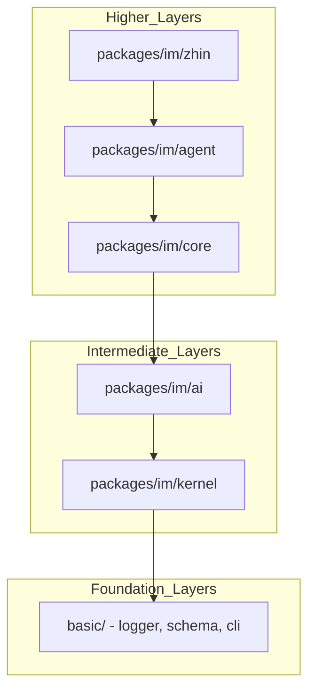
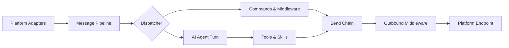

[中文版](/wiki/cubic/arch-core)

::: warning Generated reference snapshot
[Original Cubic page](https://www.cubic.dev/wikis/zhinjs/zhin?page=page-arch-core) · captured 2026-09-23 · [source commit](https://github.com/zhinjs/zhin/commit/368db14caa4aa91311fb090f07bd792fe4b22fe7). This AI-generated page has not been verified against the current code. Use the [Zhin documentation](/en/getting-started/) for current behavior and [see known corrections](/en/wiki/archive).
:::

::: details Relevant source files

The following files were used as context for generating this wiki page:

- [CLAUDE.md](https://github.com/zhinjs/zhin/blob/368db14caa4aa91311fb090f07bd792fe4b22fe7/CLAUDE.md)
- [AGENTS.md](https://github.com/zhinjs/zhin/blob/368db14caa4aa91311fb090f07bd792fe4b22fe7/AGENTS.md)
- [README.md](https://github.com/zhinjs/zhin/blob/368db14caa4aa91311fb090f07bd792fe4b22fe7/README.md)
- [packages/toolkit/create-zhin/README.md](https://github.com/zhinjs/zhin/blob/368db14caa4aa91311fb090f07bd792fe4b22fe7/packages/toolkit/create-zhin/README.md)
- [packages/toolkit/scaffold-wizard/README.md](https://github.com/zhinjs/zhin/blob/368db14caa4aa91311fb090f07bd792fe4b22fe7/packages/toolkit/scaffold-wizard/README.md)
- [packages/toolkit/create-zhin/src/workspace.ts](https://github.com/zhinjs/zhin/blob/368db14caa4aa91311fb090f07bd792fe4b22fe7/packages/toolkit/create-zhin/src/workspace.ts)
- [basic/cli/src/commands/setup.ts](https://github.com/zhinjs/zhin/blob/368db14caa4aa91311fb090f07bd792fe4b22fe7/basic/cli/src/commands/setup.ts)
:::

# System Architecture & Layering

Zhin.js organizes its functionality as a multi-platform, AI-driven chatbot framework built with TypeScript. The system uses a monorepo structure managed by **pnpm workspaces** and **Turborepo** to enforce strict dependency boundaries between its various functional layers.

Sources: [CLAUDE.md:16-24](https://github.com/zhinjs/zhin/blob/368db14caa4aa91311fb090f07bd792fe4b22fe7/CLAUDE.md#L16-L24), [README.md:13-20](https://github.com/zhinjs/zhin/blob/368db14caa4aa91311fb090f07bd792fe4b22fe7/README.md#L13-L20)

## Dependency Layers

The Zhin.js architecture follows a strict bottom-to-top dependency hierarchy. Lower layers provide foundational services and must never import from higher layers. This restriction ensures system stability and prevents circular dependencies.


The diagram shows the one-way dependency flow from high-level orchestration down to foundation utilities.

### Layer Descriptions

| Layer | Package Path | Role & Responsibilities |
| :--- | :--- | :--- |
| **Foundation** | `basic/` | Provides logger, schema validation, database drivers, and the CLI base. |
| **Kernel** | `packages/im/kernel` | Handles task scheduling, identity management, and error hierarchies. |
| **AI Engine** | `packages/im/ai` | Manages model providers, agents, memory compaction, and cost tracking. |
| **Core** | `packages/im/core` | Defines IM runtime, message contracts, and interaction rendering. |
| **Agent** | `packages/im/agent` | Orchestrates ZhinAgent, security policies, and MCP clients. |
| **Main Entry** | `packages/im/zhin` | Assembles the canonical IM runtime; acts as the user-facing entry point. |

Sources: [CLAUDE.md:41-71](https://github.com/zhinjs/zhin/blob/368db14caa4aa91311fb090f07bd792fe4b22fe7/CLAUDE.md#L41-L71), [AGENTS.md:57-75](https://github.com/zhinjs/zhin/blob/368db14caa4aa91311fb090f07bd792fe4b22fe7/AGENTS.md#L57-L75)

## Message Pipeline Architecture

Zhin.js processes messages through a normalized pipeline. This pipeline transforms platform-specific inbound events into standard internal message formats, which then interact with commands, middleware, or AI agents.


The diagram illustrates how messages flow from inbound adapters through processing logic to the outbound send chain.

### Outbound Send Chain Constraints
All outbound messages must follow the unified send chain. Developers must use `Message.$reply` or `Adapter.sendMessage`. The system then processes these through an `OutboundRenderer` and outbound middleware before reaching the platform `Endpoint`. Bypassing this chain is strictly prohibited to ensure consistent rendering and logging.

Sources: [README.md:53-73](https://github.com/zhinjs/zhin/blob/368db14caa4aa91311fb090f07bd792fe4b22fe7/README.md#L53-L73), [CLAUDE.md:73-76](https://github.com/zhinjs/zhin/blob/368db14caa4aa91311fb090f07bd792fe4b22fe7/CLAUDE.md#L73-L76)

## Plugin System & Feature Discovery

The Plugin Runtime serves as the sole entry path for extending the framework. Zhin.js uses a convention-based discovery mechanism where capabilities are loaded from specific directories rather than being registered imperatively.

### Plugin Definition
A plugin must default-export a `definePlugin()` definition in a `plugin.ts` file. The `PluginScopeAssembler` throws an error if this export is missing.

```typescript
// Example plugin structure
import { definePlugin } from 'zhin.js';

export default definePlugin({
  name: 'my-plugin',
  setup(context) {
    // Lifecycle and resource provisioning
    return () => cleanup();
  },
});
```
Sources: [CLAUDE.md:81-93](https://github.com/zhinjs/zhin/blob/368db14caa4aa91311fb090f07bd792fe4b22fe7/CLAUDE.md#L81-L93), [packages/toolkit/create-zhin/src/workspace.ts:257-264](https://github.com/zhinjs/zhin/blob/368db14caa4aa91311fb090f07bd792fe4b22fe7/packages/toolkit/create-zhin/src/workspace.ts#L257-L264)

### Convention Directories
The framework automatically discovers features based on their file paths within a plugin:

| Directory | Feature Type | Authoring API |
| :--- | :--- | :--- |
| `commands/` | Bot Commands | `defineCommand()` |
| `middlewares/` | Message Filters | `defineMiddleware()` |
| `handlers/` | Event Listeners | `defineHandler()` |
| `tools/` | AI Agent Tools | `defineAgentTool()` |
| `skills/` | AI Workflows | `SKILL.md` (Markdown) |
| `pages/` | Console UI | `definePage()` |

Sources: [CLAUDE.md:95-108](https://github.com/zhinjs/zhin/blob/368db14caa4aa91311fb090f07bd792fe4b22fe7/CLAUDE.md#L95-L108), [AGENTS.md:104-108](https://github.com/zhinjs/zhin/blob/368db14caa4aa91311fb090f07bd792fe4b22fe7/AGENTS.md#L104-L108)

## Project Scaffolding and Configuration

The architecture supports both fresh project creation and incremental configuration through shared tools.

- **create-zhin-app**: Generates the initial workspace file tree and manages pnpm workspace setup.
- **scaffold-wizard**: A shared library used by both the creator and the CLI `setup` command to handle interactive prompts for databases, adapters, and AI providers.
- **Generation Lifecycle**: Plugin updates occur through hot-reloads managed as "Generation" transactions. Next plugin trees are prepared off-path and published atomically to ensure a failed update does not crash the active runtime.

Sources: [packages/toolkit/create-zhin/README.md:105-115](https://github.com/zhinjs/zhin/blob/368db14caa4aa91311fb090f07bd792fe4b22fe7/packages/toolkit/create-zhin/README.md#L105-L115), [packages/toolkit/scaffold-wizard/README.md:5-15](https://github.com/zhinjs/zhin/blob/368db14caa4aa91311fb090f07bd792fe4b22fe7/packages/toolkit/scaffold-wizard/README.md#L5-L15), [README.md:96-105](https://github.com/zhinjs/zhin/blob/368db14caa4aa91311fb090f07bd792fe4b22fe7/README.md#L96-L105)

## Architectural Safeguards

The framework employs "Harness Engineering" to enforce architectural integrity:
1. **Architecture Checks**: `pnpm check:architecture` validates that dependency directions are respected.
2. **Send Chain Enforcement**: `pnpm check:harness-paths` detects if plugins attempt to bypass the standard `Adapter.sendMessage` path.
3. **API Restriction**: `check:no-removed-plugin-api` prevents the use of legacy or deleted APIs like `zhin.js/node`.

Sources: [CLAUDE.md:31-40](https://github.com/zhinjs/zhin/blob/368db14caa4aa91311fb090f07bd792fe4b22fe7/CLAUDE.md#L31-L40), [AGENTS.md:120-130](https://github.com/zhinjs/zhin/blob/368db14caa4aa91311fb090f07bd792fe4b22fe7/AGENTS.md#L120-L130)

Zhin.js architecture prioritizes a clear separation between the foundational IM framework and the optional AI agent stack. By enforcing strict layering and convention-based feature discovery, the system maintains high operability and safety in both development and production environments.
