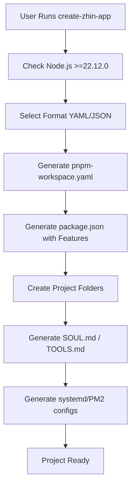
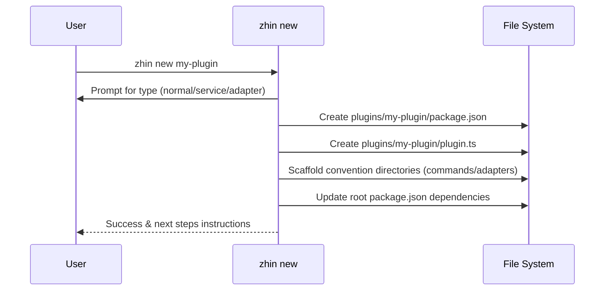

[中文版](/wiki/cubic/cli-tools)

::: warning Generated reference snapshot
[Original Cubic page](https://www.cubic.dev/wikis/zhinjs/zhin?page=page-cli-tools) · captured 2026-09-23 · [source commit](https://github.com/zhinjs/zhin/commit/368db14caa4aa91311fb090f07bd792fe4b22fe7). This AI-generated page has not been verified against the current code. Use the [Zhin documentation](/en/getting-started/) for current behavior and [see known corrections](/en/wiki/).
:::

::: details Relevant source files

The following files were used as context for generating this wiki page:

- [basic/cli/src/commands/new.ts](https://github.com/zhinjs/zhin/blob/368db14caa4aa91311fb090f07bd792fe4b22fe7/basic/cli/src/commands/new.ts)
- [basic/cli/src/commands/migrate.ts](https://github.com/zhinjs/zhin/blob/368db14caa4aa91311fb090f07bd792fe4b22fe7/basic/cli/src/commands/migrate.ts)
- [basic/cli/src/commands/setup.ts](https://github.com/zhinjs/zhin/blob/368db14caa4aa91311fb090f07bd792fe4b22fe7/basic/cli/src/commands/setup.ts)
- [packages/toolkit/create-zhin/src/workspace.ts](https://github.com/zhinjs/zhin/blob/368db14caa4aa91311fb090f07bd792fe4b22fe7/packages/toolkit/create-zhin/src/workspace.ts)
- [packages/toolkit/create-zhin/README.md](https://github.com/zhinjs/zhin/blob/368db14caa4aa91311fb090f07bd792fe4b22fe7/packages/toolkit/create-zhin/README.md)
- [README.md](https://github.com/zhinjs/zhin/blob/368db14caa4aa91311fb090f07bd792fe4b22fe7/README.md)
- [CLAUDE.md](https://github.com/zhinjs/zhin/blob/368db14caa4aa91311fb090f07bd792fe4b22fe7/CLAUDE.md)
:::

# CLI Commands & Tooling

Zhin.js provides a suite of command-line tools to manage the lifecycle of bot projects, from initial scaffolding to maintenance and environment diagnostics. The tooling ecosystem centers around the `@zhin.js/cli` package and the `create-zhin-app` initializer, which enforce the **Plugin Runtime** architecture and project standards.

## Core Tooling Overview

The CLI serves as the primary interface for developers to interact with the Zhin framework. It manages project initialization, plugin scaffolding, interactive configuration, and legacy migrations.

| Command | Tool / Package | Description |
|:---|:---|:---|
| `npm create zhin-app` | `create-zhin-app` | Initializes a new pnpm workspace project with standard directory structures. |
| `zhin new` | `@zhin.js/cli` | Scaffolds new plugins, services, or adapters within an existing project. |
| `zhin setup` | `@zhin.js/cli` | Provides an interactive wizard to configure databases, AI providers, and adapters. |
| `zhin migrate` | `@zhin.js/cli` | Upgrades legacy Zhin projects to the latest Plugin Runtime standards. |
| `zhin doctor` | `@zhin.js/cli` | Performs environment diagnostics and identifies project health issues. |
| `zhin runtime start` | `@zhin.js/runtime` | The primary entry point for starting a Zhin bot instance. |

Sources: [README.md:144-150](https://github.com/zhinjs/zhin/blob/368db14caa4aa91311fb090f07bd792fe4b22fe7/README.md#L144-L150), [packages/toolkit/create-zhin/README.md:121-128](https://github.com/zhinjs/zhin/blob/368db14caa4aa91311fb090f07bd792fe4b22fe7/packages/toolkit/create-zhin/README.md#L121-L128)

## Project Initialization and Workspace Scaffolding

The `create-zhin-app` tool generates a standardized pnpm workspace. This structure separates the root bot logic, local plugins, and shared features.

### Workspace Structure Generation
When you run the initializer, the `createWorkspace` function performs the following actions:
1.  **Environment Check**: Verifies that the Node.js version meets the `>=22.12.0` requirement.
2.  **File Tree Creation**: Generates directories for `commands`, `components`, `middlewares`, `tools`, `skills`, and `agents`.
3.  **Dependency Resolution**: Injects necessary packages like `@zhin.js/core` and specific adapters based on user selection.
4.  **Configuration Scaffolding**: Creates `zhin.config.yml` (or JSON) and `.env` files.
5.  **Service Deployment**: Generates systemd, launchd, and PM2 configuration files for production environments.

Sources: [packages/toolkit/create-zhin/src/workspace.ts:110-385](https://github.com/zhinjs/zhin/blob/368db14caa4aa91311fb090f07bd792fe4b22fe7/packages/toolkit/create-zhin/src/workspace.ts#L110-L385), [packages/toolkit/create-zhin/README.md:162-185](https://github.com/zhinjs/zhin/blob/368db14caa4aa91311fb090f07bd792fe4b22fe7/packages/toolkit/create-zhin/README.md#L162-L185)

The diagram shows the sequential steps taken by the workspace creator to ensure a project is ready for development and deployment. Sources: [packages/toolkit/create-zhin/src/workspace.ts:110-385](https://github.com/zhinjs/zhin/blob/368db14caa4aa91311fb090f07bd792fe4b22fe7/packages/toolkit/create-zhin/src/workspace.ts#L110-L385)

## Plugin Scaffolding with `zhin new`

The `zhin new` command implements the `newCommand` logic to scaffold individual plugin packages within the `plugins/` directory.

### Plugin Types
Developers can choose from three primary templates:
*   **Normal Plugin**: Includes a sample command with dynamic segments (e.g., `commands/echo/[text]/index.ts`).
*   **Service**: Sets up a `plugin.ts` entry with lifecycle management via `context.lifecycle.add`.
*   **Adapter**: Provides a full skeleton for a custom platform adapter, including `Endpoint` and `Client` classes.

### Automatic Integration
After creating the plugin files, the CLI automatically updates the root `package.json` to include the new plugin in the `dependencies` (using `workspace:*`) and provides instructions for mounting the plugin via the `zhin.plugins` array.

Sources: [basic/cli/src/commands/new.ts:50-137](https://github.com/zhinjs/zhin/blob/368db14caa4aa91311fb090f07bd792fe4b22fe7/basic/cli/src/commands/new.ts#L50-L137)

The sequence diagram illustrates the interaction between the user and the CLI during plugin creation. Sources: [basic/cli/src/commands/new.ts:50-137](https://github.com/zhinjs/zhin/blob/368db14caa4aa91311fb090f07bd792fe4b22fe7/basic/cli/src/commands/new.ts#L50-L137)

## Interactive Configuration Wizard

The `zhin setup` command leverages the `@zhin.js/scaffold-wizard` to provide a step-by-step configuration experience. It allows for incremental updates to an existing project.

### Configuration Capabilities
*   **Database**: Supports SQLite, MySQL, PostgreSQL, MongoDB, and Redis.
*   **Adapters**: Connects platforms like Telegram, Discord, and QQ Official.
*   **AI**: Configures providers (e.g., OpenAI), models, and execution security policies.
*   **Bootstrap**: Generates AI personality and instruction files (`SOUL.md`, `TOOLS.md`, `AGENTS.md`).

Sources: [basic/cli/src/commands/setup.ts:145-215](https://github.com/zhinjs/zhin/blob/368db14caa4aa91311fb090f07bd792fe4b22fe7/basic/cli/src/commands/setup.ts#L145-L215)

### AI Bootstrap Templates
If the `--bootstrap` flag is used, the CLI generates standard templates to guide AI behavior:
*   **SOUL.md**: Defines personality traits, emphasizing action over discussion.
*   **TOOLS.md**: Provides principles for tool usage, such as calling declared tools immediately after activation.
*   **AGENTS.md**: Manages long-term memory, user preferences, and task lists.

Sources: [basic/cli/src/commands/setup.ts:18-125](https://github.com/zhinjs/zhin/blob/368db14caa4aa91311fb090f07bd792fe4b22fe7/basic/cli/src/commands/setup.ts#L18-L125), [packages/toolkit/create-zhin/src/workspace.ts:192-200](https://github.com/zhinjs/zhin/blob/368db14caa4aa91311fb090f07bd792fe4b22fe7/packages/toolkit/create-zhin/src/workspace.ts#L192-L200)

## Migration and Maintenance

The `zhin migrate` command automates the transition from legacy project structures to the modern Plugin Runtime.

### Migration Logic
1.  **Dependency Update**: Replaces `zhin` and `@zhin.js/*` versions with `latest`.
2.  **Script Standardization**: Replaces legacy scripts like `zhin dev` with `zhin runtime start`.
3.  **Template Modernization**: Detects old Chinese-language templates in `SOUL.md` or `AGENTS.md` and replaces them with the new English-language action-oriented templates while preserving user data.
4.  **Structure Verification**: Ensures the existence of `data/`, `plugins/`, and `src/plugins/` directories.

Sources: [basic/cli/src/commands/migrate.ts:70-200](https://github.com/zhinjs/zhin/blob/368db14caa4aa91311fb090f07bd792fe4b22fe7/basic/cli/src/commands/migrate.ts#L70-L200)

### Diagnostic Tooling
The `zhin doctor` command performs environment checks to ensure the system meets Zhin's requirements. This includes verifying Node.js versions, checking for missing peer dependencies, and validating configuration file integrity.

Sources: [README.md:144-150](https://github.com/zhinjs/zhin/blob/368db14caa4aa91311fb090f07bd792fe4b22fe7/README.md#L144-L150)

## Maintainer Tooling and Harnesses

For developers working directly on the Zhin repository, `CLAUDE.md` defines several "harness" checks to ensure code quality and architectural integrity.

| Check Command | Purpose |
|:---|:---|
| `pnpm check:architecture` | Enforces the unidirectional dependency flow (basic → kernel → ai → core → agent → zhin). |
| `pnpm check:harness-paths` | Detects if plugins attempt to bypass the `Adapter.sendMessage` chain. |
| `pnpm check:no-removed-plugin-api` | Prevents the use of deleted legacy APIs like `usePlugin()`. |
| `pnpm check:plugin-capability-publish` | Ensures plugins include required capability directories and READMEs before publishing. |

Sources: [CLAUDE.md:27-40](https://github.com/zhinjs/zhin/blob/368db14caa4aa91311fb090f07bd792fe4b22fe7/CLAUDE.md#L27-L40)

Zhin's CLI and tooling ecosystem provide a highly structured environment for bot development, ensuring that both new and legacy projects adhere to modern standards for security, hot-reloading, and multi-platform support.
