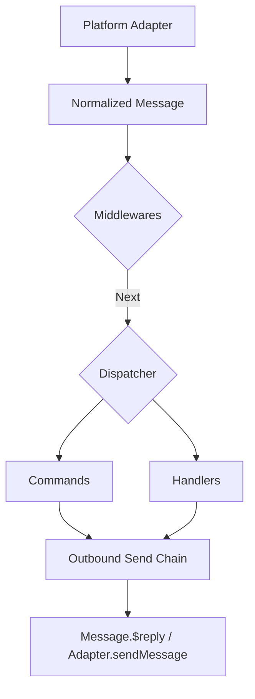

[中文版](/wiki/cubic/commands)

::: warning Generated reference snapshot
[Original Cubic page](https://www.cubic.dev/wikis/zhinjs/zhin?page=page-commands) · captured 2026-09-23 · [source commit](https://github.com/zhinjs/zhin/commit/368db14caa4aa91311fb090f07bd792fe4b22fe7). This AI-generated page has not been verified against the current code. Use the [Zhin documentation](/en/getting-started/) for current behavior and [see known corrections](/en/wiki/).
:::

::: danger Known correction
Commands use route directories ending in `index.ts`; Handlers use one named directory, such as `handlers/message-receive/index.ts` with an explicit `event: 'message.receive'`. The nested Handler file example below is unsupported. See [Convention Directories](/en/authoring/conventions).
:::

::: details Relevant source files

The following files were used as context for generating this wiki page:

- [packages/im/command/src/index.ts](https://github.com/zhinjs/zhin/blob/368db14caa4aa91311fb090f07bd792fe4b22fe7/packages/im/command/src/index.ts)
- [packages/im/middleware/src/index.ts](https://github.com/zhinjs/zhin/blob/368db14caa4aa91311fb090f07bd792fe4b22fe7/packages/im/middleware/src/index.ts)
- [packages/im/handler/src/index.ts](https://github.com/zhinjs/zhin/blob/368db14caa4aa91311fb090f07bd792fe4b22fe7/packages/im/handler/src/index.ts)
- [CLAUDE.md](https://github.com/zhinjs/zhin/blob/368db14caa4aa91311fb090f07bd792fe4b22fe7/CLAUDE.md)
- [README.md](https://github.com/zhinjs/zhin/blob/368db14caa4aa91311fb090f07bd792fe4b22fe7/README.md)
- [packages/toolkit/create-zhin/template/skills/plugin-develop/SKILL.md](https://github.com/zhinjs/zhin/blob/368db14caa4aa91311fb090f07bd792fe4b22fe7/packages/toolkit/create-zhin/template/skills/plugin-develop/SKILL.md)
- [packages/toolkit/create-zhin/template/skills/plugin-init/SKILL.md](https://github.com/zhinjs/zhin/blob/368db14caa4aa91311fb090f07bd792fe4b22fe7/packages/toolkit/create-zhin/template/skills/plugin-init/SKILL.md)
- [basic/cli/src/commands/new.ts](https://github.com/zhinjs/zhin/blob/368db14caa4aa91311fb090f07bd792fe4b22fe7/basic/cli/src/commands/new.ts)
:::

# Commands, Handlers & Middlewares

Commands, Handlers, and Middlewares represent the primary interaction layers within the Zhin.js plugin system. They process normalized message streams from platform adapters, enabling developers to build interactive chatbot capabilities ranging from structured command execution to low-level message interception. Sources: [README.md](https://github.com/zhinjs/zhin/blob/368db14caa4aa91311fb090f07bd792fe4b22fe7/README.md), [CLAUDE.md](https://github.com/zhinjs/zhin/blob/368db14caa4aa91311fb090f07bd792fe4b22fe7/CLAUDE.md)

The framework utilizes a convention-over-configuration directory structure for capability discovery. Features are identified automatically by the Plugin Runtime when placed in specific directories such as `commands/`, `middlewares/`, and `handlers/`. Sources: [packages/toolkit/create-zhin/template/skills/plugin-init/SKILL.md](https://github.com/zhinjs/zhin/blob/368db14caa4aa91311fb090f07bd792fe4b22fe7/packages/toolkit/create-zhin/template/skills/plugin-init/SKILL.md)

## Message Processing Flow

The inbound message pipeline directs data through multiple stages of processing. Messages originate from platform adapters, pass through the middleware chain, and finally match against specific commands or handlers. Sources: [README.md](https://github.com/zhinjs/zhin/blob/368db14caa4aa91311fb090f07bd792fe4b22fe7/README.md)


This diagram illustrates the sequential flow from an inbound platform event to an outbound reply. Sources: [README.md](https://github.com/zhinjs/zhin/blob/368db14caa4aa91311fb090f07bd792fe4b22fe7/README.md), [CLAUDE.md](https://github.com/zhinjs/zhin/blob/368db14caa4aa91311fb090f07bd792fe4b22fe7/CLAUDE.md)

## Commands

Commands provide a structured way to handle specific user instructions. They are defined using the `defineCommand()` API and are discovered from the `commands/` directory of a plugin package. Sources: [packages/toolkit/create-zhin/template/skills/plugin-develop/SKILL.md](https://github.com/zhinjs/zhin/blob/368db14caa4aa91311fb090f07bd792fe4b22fe7/packages/toolkit/create-zhin/template/skills/plugin-develop/SKILL.md)

### Structure and Discovery
- **Directory Path as Route**: The file path within the `commands/` folder determines the command name or route. Sources: [packages/toolkit/create-zhin/template/skills/plugin-init/SKILL.md](https://github.com/zhinjs/zhin/blob/368db14caa4aa91311fb090f07bd792fe4b22fe7/packages/toolkit/create-zhin/template/skills/plugin-init/SKILL.md)
- **Next.js Style Dynamic Segments**: Use `[name].ts` for required parameters, `[[name]].ts` for optional parameters, and `[...name].ts` for catch-all parameters. Sources: [CLAUDE.md:120-125](https://github.com/zhinjs/zhin/blob/368db14caa4aa91311fb090f07bd792fe4b22fe7/CLAUDE.md#L120-L125)
- **Parameters and Arguments**: Types and default values are declared within the `params` property of the `defineCommand` configuration. Sources: [basic/cli/src/commands/new.ts:390-410](https://github.com/zhinjs/zhin/blob/368db14caa4aa91311fb090f07bd792fe4b22fe7/basic/cli/src/commands/new.ts#L390-L410)

### Key Components of defineCommand

| Property | Type | Description |
| :--- | :--- | :--- |
| `description` | `string` | Human-readable explanation of the command. |
| `params` | `Record<string, ParameterDefinition>` | Defines typed parameters extracted from dynamic segments. |
| `execute` | `Function` | The core logic executed when the command matches. |

Sources: [packages/toolkit/create-zhin/template/skills/plugin-develop/SKILL.md](https://github.com/zhinjs/zhin/blob/368db14caa4aa91311fb090f07bd792fe4b22fe7/packages/toolkit/create-zhin/template/skills/plugin-develop/SKILL.md), [basic/cli/src/commands/new.ts:400](https://github.com/zhinjs/zhin/blob/368db14caa4aa91311fb090f07bd792fe4b22fe7/basic/cli/src/commands/new.ts#L400)

```typescript
// Example: commands/greet/[name]/index.ts
import { defineCommand } from 'zhin.js/command';

export default defineCommand({
  description: 'Greet a user',
  params: {
    name: { type: 'string', description: 'User name' },
  },
  execute({ params }) {
    return `Hello, ${params.name}!`;
  },
});
```
Sources: [packages/toolkit/create-zhin/template/skills/plugin-develop/SKILL.md:65-75](https://github.com/zhinjs/zhin/blob/368db14caa4aa91311fb090f07bd792fe4b22fe7/packages/toolkit/create-zhin/template/skills/plugin-develop/SKILL.md#L65-L75)

## Middlewares

Middlewares intercept all inbound messages before they reach commands or handlers. They are defined via `defineMiddleware()` and placed in the `middlewares/` directory. Sources: [packages/toolkit/create-zhin/template/skills/plugin-init/SKILL.md](https://github.com/zhinjs/zhin/blob/368db14caa4aa91311fb090f07bd792fe4b22fe7/packages/toolkit/create-zhin/template/skills/plugin-init/SKILL.md)

### Middleware Chain
Middlewares follow an onion-style execution pattern:
1. They receive the message context and a `next()` function.
2. If `next()` is called, the pipeline continues to the next middleware or the dispatcher.
3. If `next()` is not called, the message is intercepted and processing stops.

Sources: [packages/im/middleware/src/index.ts](https://github.com/zhinjs/zhin/blob/368db14caa4aa91311fb090f07bd792fe4b22fe7/packages/im/middleware/src/index.ts), [README.zh-CN.md](https://github.com/zhinjs/zhin/blob/368db14caa4aa91311fb090f07bd792fe4b22fe7/README.zh-CN.md)

## Handlers

Handlers manage event-based interactions and are often used for more flexible message processing than strict commands. They are defined using `defineHandler()` and stored in the `handlers/` directory. Sources: [CLAUDE.md:120-125](https://github.com/zhinjs/zhin/blob/368db14caa4aa91311fb090f07bd792fe4b22fe7/CLAUDE.md#L120-L125)

### Event Mapping
The directory path of a handler maps to local event names. For example, a file at `handlers/message/receive.ts` responds to the `message.receive` event if the event name is omitted in the definition. Sources: [CLAUDE.md:123](https://github.com/zhinjs/zhin/blob/368db14caa4aa91311fb090f07bd792fe4b22fe7/CLAUDE.md#L123)

### Capabilities
- **Prompt Support**: The `this.prompt` API is available within handlers for multi-turn interactions. Sources: [CLAUDE.md:124](https://github.com/zhinjs/zhin/blob/368db14caa4aa91311fb090f07bd792fe4b22fe7/CLAUDE.md#L124)
- **Event Filtering**: Handlers can listen for specific lifecycle or platform events rather than just text messages. Sources: [packages/im/handler/src/index.ts](https://github.com/zhinjs/zhin/blob/368db14caa4aa91311fb090f07bd792fe4b22fe7/packages/im/handler/src/index.ts)

## Comparison of Capabilities

| Feature | Commands | Handlers | Middlewares |
| :--- | :--- | :--- | :--- |
| **Discovery** | `commands/` | `handlers/` | `middlewares/` |
| **Trigger** | Text pattern match | Event emission | Every inbound message |
| **Route Source** | File path/Name | Event name | Sequential |
| **Async Support**| Yes | Yes | Yes |
| **Main Usage** | User intent handling | Event orchestration | Global interception/filtering |

Sources: [CLAUDE.md:120-125](https://github.com/zhinjs/zhin/blob/368db14caa4aa91311fb090f07bd792fe4b22fe7/CLAUDE.md#L120-L125), [packages/toolkit/create-zhin/template/skills/plugin-init/SKILL.md](https://github.com/zhinjs/zhin/blob/368db14caa4aa91311fb090f07bd792fe4b22fe7/packages/toolkit/create-zhin/template/skills/plugin-init/SKILL.md)

## Implementation Constraints

Developers must adhere to specific architectural constraints when implementing these features:
- **No Direct Send Bypassing**: All outbound communication must flow through `Message.$reply` or the platform `Endpoint` send chain. Sources: [CLAUDE.md:85-88](https://github.com/zhinjs/zhin/blob/368db14caa4aa91311fb090f07bd792fe4b22fe7/CLAUDE.md#L85-L88), [AGENTS.md:162-165](https://github.com/zhinjs/zhin/blob/368db14caa4aa91311fb090f07bd792fe4b22fe7/AGENTS.md#L162-L165)
- **Local Imports**: TypeScript imports for local files within commands or middlewares must include the `.js` extension. Sources: [CLAUDE.md:158](https://github.com/zhinjs/zhin/blob/368db14caa4aa91311fb090f07bd792fe4b22fe7/CLAUDE.md#L158)
- **Default Exports**: Every file in the convention directories must use a `default export` of the corresponding `define*` function result. Sources: [packages/toolkit/create-zhin/template/skills/plugin-init/SKILL.md](https://github.com/zhinjs/zhin/blob/368db14caa4aa91311fb090f07bd792fe4b22fe7/packages/toolkit/create-zhin/template/skills/plugin-init/SKILL.md)

## Summary

Commands, Handlers, and Middlewares form the backbone of the Zhin.js interaction model. Commands provide a structured, parameter-aware entry point for user tasks, Handlers allow for flexible event-driven logic, and Middlewares offer a global pipeline for message filtering and transformation. By following the project's directory conventions and using the provided `define*` APIs, developers can create modular and hot-reloadable bot capabilities. Sources: [README.md](https://github.com/zhinjs/zhin/blob/368db14caa4aa91311fb090f07bd792fe4b22fe7/README.md), [CLAUDE.md](https://github.com/zhinjs/zhin/blob/368db14caa4aa91311fb090f07bd792fe4b22fe7/CLAUDE.md)
