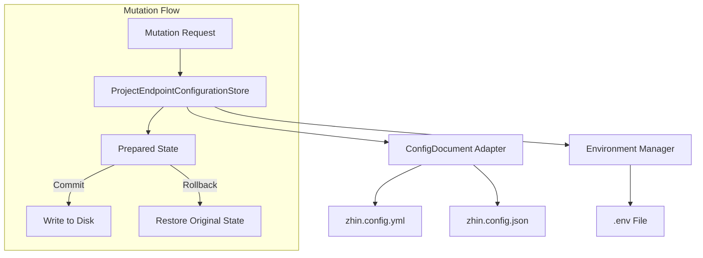
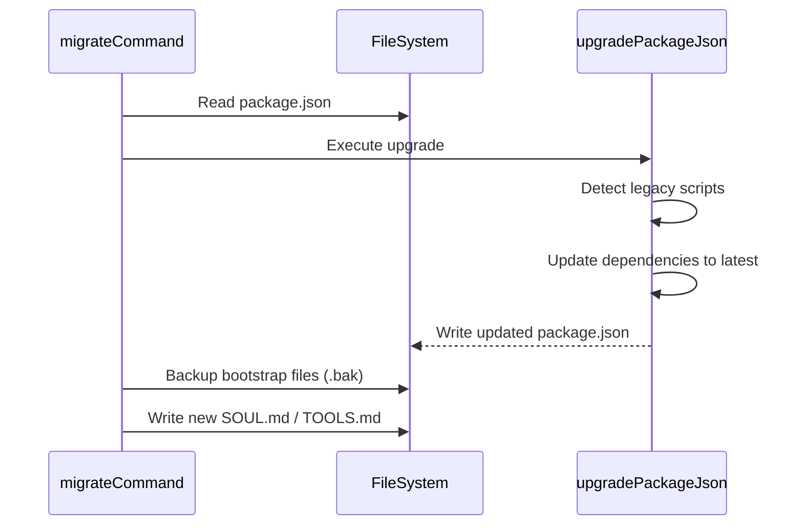

::: warning Generated reference snapshot
[Original Cubic page](https://www.cubic.dev/wikis/zhinjs/zhin?page=page-config) · captured 2026-09-23 · [source commit](https://github.com/zhinjs/zhin/commit/368db14caa4aa91311fb090f07bd792fe4b22fe7). This AI-generated page has not been verified against the current code. Use the [Zhin documentation](/en/getting-started/) for current behavior and [see known corrections](/en/wiki/).
:::

Relevant source files

The following files were used as context for generating this wiki page:

- [packages/im/config-file/package.json](https://github.com/zhinjs/zhin/blob/368db14caa4aa91311fb090f07bd792fe4b22fe7/packages/im/config-file/package.json)
- [basic/cli/src/commands/setup.ts](https://github.com/zhinjs/zhin/blob/368db14caa4aa91311fb090f07bd792fe4b22fe7/basic/cli/src/commands/setup.ts)
- [basic/cli/src/commands/migrate.ts](https://github.com/zhinjs/zhin/blob/368db14caa4aa91311fb090f07bd792fe4b22fe7/basic/cli/src/commands/migrate.ts)
- [packages/toolkit/scaffold-wizard/README.md](https://github.com/zhinjs/zhin/blob/368db14caa4aa91311fb090f07bd792fe4b22fe7/packages/toolkit/scaffold-wizard/README.md)
- [basic/cli/tests/plugin-runtime/endpoint-configuration-store.test.ts](https://github.com/zhinjs/zhin/blob/368db14caa4aa91311fb090f07bd792fe4b22fe7/basic/cli/tests/plugin-runtime/endpoint-configuration-store.test.ts)
- [packages/im/config-file/src/index.ts](https://github.com/zhinjs/zhin/blob/368db14caa4aa91311fb090f07bd792fe4b22fe7/packages/im/config-file/src/index.ts)
- [packages/im/config-file/src/yaml-config-document.ts](https://github.com/zhinjs/zhin/blob/368db14caa4aa91311fb090f07bd792fe4b22fe7/packages/im/config-file/src/yaml-config-document.ts)

# Configuration Management

Configuration Management in Zhin.js provides a unified system for defining, persisting, and migrating framework settings. It handles project-level variables, plugin-specific options, and sensitive environment secrets across different file formats. The system supports YAML and JSON documents while maintaining transactional integrity during updates.

The core configuration resides in `zhin.config.yml` (or `.json`) and is augmented by `.env` files for secrets. This ensures a separation between non-sensitive structural configuration and private credentials like API tokens.

## Configuration Architecture

Zhin employs a layered architecture to manage configuration data. The `ProjectEndpointConfigurationStore` acts as the primary coordinator for configuration mutations. It ensures that changes to adapters, endpoints, and environment variables are synchronized across the physical files on disk.

*The diagram shows the relationship between the Configuration Store and the underlying file adapters, illustrating the transactional commit/rollback flow.*

Sources: [basic/cli/tests/plugin-runtime/endpoint-configuration-store.test.ts:36-110](https://github.com/zhinjs/zhin/blob/368db14caa4aa91311fb090f07bd792fe4b22fe7/basic/cli/tests/plugin-runtime/endpoint-configuration-store.test.ts#L36-L110), [packages/im/config-file/package.json:1-10](https://github.com/zhinjs/zhin/blob/368db14caa4aa91311fb090f07bd792fe4b22fe7/packages/im/config-file/package.json#L1-L10)

## Interactive Configuration Scaffolding

The `@zhin.js/scaffold-wizard` library provides the interactive logic used by both `create-zhin-app` and the `zhin setup` command. This module manages the step-by-step configuration of databases, adapters, and AI providers.

### Configuration Components
*   **Database Configurer**: Handles selection of dialects (SQLite, MySQL, PostgreSQL, etc.) and generates connection strings.
*   **Adapter Configurer**: Manages platform-specific settings for Telegram, Discord, and other IM protocols.
*   **AI Configurer**: Sets up LLM providers, API keys, and agent security policies.
*   **Env Manager**: Escapes and merges environment variables into the `.env` file using `mergeEnvText`.

Sources: [packages/toolkit/scaffold-wizard/README.md:15-35](https://github.com/zhinjs/zhin/blob/368db14caa4aa91311fb090f07bd792fe4b22fe7/packages/toolkit/scaffold-wizard/README.md#L15-L35), [basic/cli/src/commands/setup.ts:205-250](https://github.com/zhinjs/zhin/blob/368db14caa4aa91311fb090f07bd792fe4b22fe7/basic/cli/src/commands/setup.ts#L205-L250)

### Scaffolding Execution Flow
1. Invoke `configureDatabaseOptions`, `configureAdapters`, or `configureAI` based on user flags.
2. Finalize options to ensure dependencies like SQLite are met.
3. Apply finalized options to the configuration object using `applyWizardOptionsToConfig`.
4. Update `package.json` with required features and dependencies.
5. Persist secrets to `.env` via `appendWizardEnvVars`.

Sources: [basic/cli/src/commands/setup.ts:246-260](https://github.com/zhinjs/zhin/blob/368db14caa4aa91311fb090f07bd792fe4b22fe7/basic/cli/src/commands/setup.ts#L246-L260), [packages/toolkit/scaffold-wizard/README.md:46-55](https://github.com/zhinjs/zhin/blob/368db14caa4aa91311fb090f07bd792fe4b22fe7/packages/toolkit/scaffold-wizard/README.md#L46-L55)

## Document Adapters and Transactions

The `@zhin.js/config-file` package provides transactional adapters for YAML and JSON formats. These adapters implement the `ConfigDocumentPort` interface, allowing the system to read, prepare, and commit changes atomically.

### Transactional Logic
When a mutation occurs, the system creates a `ConfigDocumentSnapshot`. The adapter generates a `PreparedConfigDocument`. If the commit fails, the `rollback()` function restores the original file content and environment variables to prevent partial updates.

| Feature | YAML Adapter | JSON Adapter |
| :--- | :--- | :--- |
| **Comments** | Preserves original YAML comments | N/A (JSON standard) |
| **Secrets** | Uses `${VAR}` placeholders | Uses `${VAR}` placeholders |
| **Validation** | Checks for object mappings | Checks for object mappings |
| **Serialization** | Maintains indentation and style | Standard JSON stringify |

Sources: [packages/im/config-file/src/yaml-config-document.ts:1-50](https://github.com/zhinjs/zhin/blob/368db14caa4aa91311fb090f07bd792fe4b22fe7/packages/im/config-file/src/yaml-config-document.ts#L1-L50), [basic/cli/tests/plugin-runtime/endpoint-configuration-store.test.ts:125-145](https://github.com/zhinjs/zhin/blob/368db14caa4aa91311fb090f07bd792fe4b22fe7/basic/cli/tests/plugin-runtime/endpoint-configuration-store.test.ts#L125-L145)

## Configuration Migration

The `zhin migrate` command automates the process of upgrading legacy Zhin projects to the current standard. It modifies `package.json` and updates bootstrap Markdown files to ensure compatibility with the Plugin Runtime.

### Key Migration Actions
*   **Script Alignment**: Replaces legacy commands like `zhin start` with `zhin runtime start`.
*   **Dependency Updates**: Bumps `@zhin.js/*` packages to `latest`.
*   **Structural Refactoring**: Migrates the legacy `bots:` configuration block to the modern `endpoints:` structure.
*   **Bootstrap File Upgrading**: Replaces old Chinese templates in `SOUL.md`, `TOOLS.md`, and `AGENTS.md` with updated English versions while attempting to preserve user data sections like "User Preferences".

*The sequence illustrates how the migration command updates project metadata and scripts safely by creating backups.*

Sources: [basic/cli/src/commands/migrate.ts:70-120](https://github.com/zhinjs/zhin/blob/368db14caa4aa91311fb090f07bd792fe4b22fe7/basic/cli/src/commands/migrate.ts#L70-L120), [basic/cli/src/commands/migrate.ts:285-330](https://github.com/zhinjs/zhin/blob/368db14caa4aa91311fb090f07bd792fe4b22fe7/basic/cli/src/commands/migrate.ts#L285-L330)

## Environment Variable Handling

Zhin prioritizes security by externalizing sensitive data. The configuration store automatically extracts secrets provided during setup and places them in the `.env` file.

### Secret Mapping
In the `zhin.config.yml` file, sensitive fields use the syntax `${VARIABLE_NAME}`. The runtime resolves these values from the environment at startup. For example, a bot token for an adapter named `demo` with ID `my-bot` would typically be mapped to `DEMO_MY_BOT_TOKEN` in the `.env` file.

Sources: [basic/cli/tests/plugin-runtime/endpoint-configuration-store.test.ts:44-55](https://github.com/zhinjs/zhin/blob/368db14caa4aa91311fb090f07bd792fe4b22fe7/basic/cli/tests/plugin-runtime/endpoint-configuration-store.test.ts#L44-L55), [packages/toolkit/scaffold-wizard/README.md:38-42](https://github.com/zhinjs/zhin/blob/368db14caa4aa91311fb090f07bd792fe4b22fe7/packages/toolkit/scaffold-wizard/README.md#L38-L42)

## Summary

Zhin's configuration management system centers on the `ProjectEndpointConfigurationStore` to provide transactional, format-agnostic updates. By combining interactive scaffolding through `@zhin.js/scaffold-wizard` and automated migration via the CLI, the framework ensures that project settings remain secure, organized, and compatible with evolving runtime requirements.
