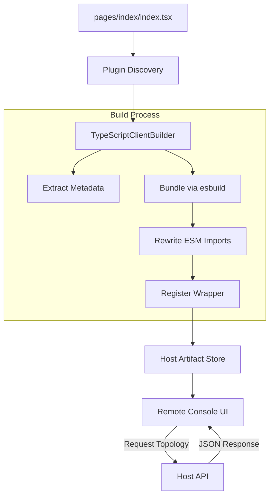
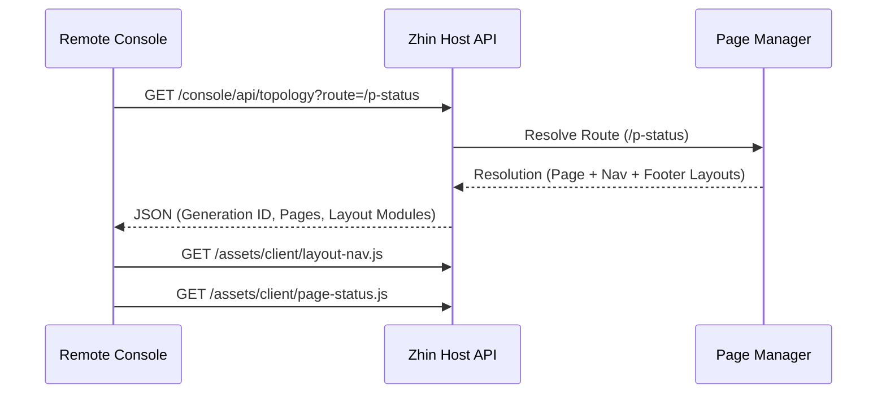

[中文版](/wiki/cubic/console-arch)

::: warning Generated reference snapshot
[Original Cubic page](https://www.cubic.dev/wikis/zhinjs/zhin?page=page-console-arch) · captured 2026-09-23 · [source commit](https://github.com/zhinjs/zhin/commit/368db14caa4aa91311fb090f07bd792fe4b22fe7). This AI-generated page has not been verified against the current code. Use the [Zhin documentation](/en/getting-started/) for current behavior and [see known corrections](/en/wiki/archive).
:::

::: details Relevant source files

The following files were used as context for generating this wiki page:

- [packages/console/pagemanager/src/client-build/typescript-builder.ts](https://github.com/zhinjs/zhin/blob/368db14caa4aa91311fb090f07bd792fe4b22fe7/packages/console/pagemanager/src/client-build/typescript-builder.ts)
- [basic/cli/src/plugin-runtime/console/page-renderer.ts](https://github.com/zhinjs/zhin/blob/368db14caa4aa91311fb090f07bd792fe4b22fe7/basic/cli/src/plugin-runtime/console/page-renderer.ts)
- [packages/im/runtime/tests/console-feature-hmr.test.ts](https://github.com/zhinjs/zhin/blob/368db14caa4aa91311fb090f07bd792fe4b22fe7/packages/im/runtime/tests/console-feature-hmr.test.ts)
- [basic/cli/tests/plugin-runtime/console/host.test.ts](https://github.com/zhinjs/zhin/blob/368db14caa4aa91311fb090f07bd792fe4b22fe7/basic/cli/tests/plugin-runtime/console/host.test.ts)
- [packages/toolkit/create-zhin/src/workspace.ts](https://github.com/zhinjs/zhin/blob/368db14caa4aa91311fb090f07bd792fe4b22fe7/packages/toolkit/create-zhin/src/workspace.ts)
- [README.md](https://github.com/zhinjs/zhin/blob/368db14caa4aa91311fb090f07bd792fe4b22fe7/README.md)
:::

# Remote Console Architecture

The Remote Console is a web-based management interface that allows you to monitor and control Zhin.js bots through a browser. It enables operations such as sending messages in a sandbox, editing configurations, reading logs, and running schedules without writing code. The architecture separates the bot runtime (Host) from the user interface (Remote Console), connecting them via a secured HTTP/WebSocket API.

Sources: [README.md:27-29](https://github.com/zhinjs/zhin/blob/368db14caa4aa91311fb090f07bd792fe4b22fe7/README.md#L27-L29), [packages/toolkit/create-zhin/src/workspace.ts:544-555](https://github.com/zhinjs/zhin/blob/368db14caa4aa91311fb090f07bd792fe4b22fe7/packages/toolkit/create-zhin/src/workspace.ts#L544-L555)

## Core Components

The Remote Console system consists of three primary layers: the Plugin Runtime Discovery, the Client Build System, and the Host API.

### Plugin Runtime Discovery
The `Plugin Runtime` discovers console capabilities through convention directories. Files located in `pages/` and `layouts/` are automatically identified as console features. The `RootRuntime` manages these features and coordinates Hot Module Replacement (HMR) to replace page artifacts atomically without restarting the entire bot process.

Sources: [packages/im/runtime/tests/console-feature-hmr.test.ts:33-55](https://github.com/zhinjs/zhin/blob/368db14caa4aa91311fb090f07bd792fe4b22fe7/packages/im/runtime/tests/console-feature-hmr.test.ts#L33-L55), [packages/toolkit/create-zhin/src/workspace.ts:503-524](https://github.com/zhinjs/zhin/blob/368db14caa4aa91311fb090f07bd792fe4b22fe7/packages/toolkit/create-zhin/src/workspace.ts#L503-L524)

### Client Build System
The `TypeScriptClientBuilder` transforms TSX source files into browser-compatible ECMAScript Modules (ESM). It performs the following actions:
- Extracts static metadata (title, icon, order) using `extractPageMetadata`.
- Inlines stubs for `@zhin.js/console-contract` so the browser can resolve them.
- Wraps components in a `register(api)` function to satisfy the Remote Console mounting contract.
- Rewrites bare imports for libraries like `React` to point to Host-served ESM endpoints.

Sources: [packages/console/pagemanager/src/client-build/typescript-builder.ts:50-80](https://github.com/zhinjs/zhin/blob/368db14caa4aa91311fb090f07bd792fe4b22fe7/packages/console/pagemanager/src/client-build/typescript-builder.ts#L50-L80), [packages/console/pagemanager/src/client-build/typescript-builder.ts:150-180](https://github.com/zhinjs/zhin/blob/368db14caa4aa91311fb090f07bd792fe4b22fe7/packages/console/pagemanager/src/client-build/typescript-builder.ts#L150-L180)

### Host API and Rendering
The Host serves the initial page shell and provides data endpoints.
- **Topology API**: Serializes the active page list, navigation structure, and resolved layouts for a specific route.
- **Page Renderer**: Generates the HTML shell, including the import maps for React and the module script for the bundled page.
- **Sandbox WebSocket**: Provides a real-time communication channel at `/sandbox` for testing chat interactions.

Sources: [basic/cli/src/plugin-runtime/console/page-renderer.ts:25-50](https://github.com/zhinjs/zhin/blob/368db14caa4aa91311fb090f07bd792fe4b22fe7/basic/cli/src/plugin-runtime/console/page-renderer.ts#L25-L50), [basic/cli/tests/plugin-runtime/console/host.test.ts:45-70](https://github.com/zhinjs/zhin/blob/368db14caa4aa91311fb090f07bd792fe4b22fe7/basic/cli/tests/plugin-runtime/console/host.test.ts#L45-L70)

## Data Flow and Transitions

The following diagram illustrates how a TSX page file is discovered, bundled, and finally rendered in the Remote Console.


The build process ensures that project-specific components are converted into a standardized format that the remote management interface can mount dynamically.
Sources: [packages/console/pagemanager/src/client-build/typescript-builder.ts:95-130](https://github.com/zhinjs/zhin/blob/368db14caa4aa91311fb090f07bd792fe4b22fe7/packages/console/pagemanager/src/client-build/typescript-builder.ts#L95-L130), [packages/im/runtime/tests/console-feature-hmr.test.ts:70-85](https://github.com/zhinjs/zhin/blob/368db14caa4aa91311fb090f07bd792fe4b22fe7/packages/im/runtime/tests/console-feature-hmr.test.ts#L70-L85)

## Registration Contract

Every console page must implement a specific registration contract to be compatible with the Remote Console. The `register` function receives a system API that allows the page to define its own routes and UI tools.

```typescript
// Internal wrapper generated by TypeScriptClientBuilder
import Page, * as pageNs from "./source.tsx";

export function register(api) {
  const Component = Page?.default ?? Page;
  const m = pageNs.meta || {};

  api.addRoute({
    path: "/p-status",
    name: m.title || "Status",
    element: api.React.createElement(Component),
    meta: { hideInMenu: m.hideInNav === true },
  });
}
```
Sources: [packages/console/pagemanager/src/client-build/typescript-builder.ts:168-195](https://github.com/zhinjs/zhin/blob/368db14caa4aa91311fb090f07bd792fe4b22fe7/packages/console/pagemanager/src/client-build/typescript-builder.ts#L168-L195)

## Key Metadata Fields

Console pages use the `definePage` helper to provide metadata used for navigation and categorization within the Remote Console.

| Field | Type | Description |
| :--- | :--- | :--- |
| `title` | `string` | The display name in the navigation menu and header. |
| `icon` | `string` | The icon identifier used for the navigation link. |
| `order` | `number` | Determines the sort order in the console catalog. |
| `hideInNav` | `boolean` | If true, the page is accessible via route but hidden from menus. |
| `requiredRoles`| `string[]` | List of roles required to access the page. |

Sources: [packages/console/pagemanager/src/client-build/typescript-builder.ts:114-125](https://github.com/zhinjs/zhin/blob/368db14caa4aa91311fb090f07bd792fe4b22fe7/packages/console/pagemanager/src/client-build/typescript-builder.ts#L114-L125), [packages/console/pagemanager/tests/client-build/client-build.test.ts:20-25](https://github.com/zhinjs/zhin/blob/368db14caa4aa91311fb090f07bd792fe4b22fe7/packages/console/pagemanager/tests/client-build/client-build.test.ts#L20-L25)

## Sequence: Topology Resolution

The Remote Console requests the topology to understand what pages are available and how they should be laid out.


The Host tracks a `generation` ID to ensure the browser always receives artifacts that are consistent with the current plugin state.
Sources: [basic/cli/tests/plugin-runtime/console/host.test.ts:50-80](https://github.com/zhinjs/zhin/blob/368db14caa4aa91311fb090f07bd792fe4b22fe7/basic/cli/tests/plugin-runtime/console/host.test.ts#L50-L80), [packages/im/runtime/tests/console-feature-hmr.test.ts:50-65](https://github.com/zhinjs/zhin/blob/368db14caa4aa91311fb090f07bd792fe4b22fe7/packages/im/runtime/tests/console-feature-hmr.test.ts#L50-L65)

## Summary

The Remote Console Architecture provides a decoupled, secure management plane for Zhin.js bots. By utilizing convention-based discovery in the `pages/` directory and a specialized `TypeScriptClientBuilder`, the system allows developers to create complex management UIs that are bundled as ESM artifacts and served dynamically. This design ensures that the bot runtime remains lightweight while providing rich, real-time management capabilities through the Host API and Sandbox WebSocket.

Sources: [README.md:38-50](https://github.com/zhinjs/zhin/blob/368db14caa4aa91311fb090f07bd792fe4b22fe7/README.md#L38-L50), [packages/toolkit/create-zhin/src/workspace.ts:530-560](https://github.com/zhinjs/zhin/blob/368db14caa4aa91311fb090f07bd792fe4b22fe7/packages/toolkit/create-zhin/src/workspace.ts#L530-L560)
