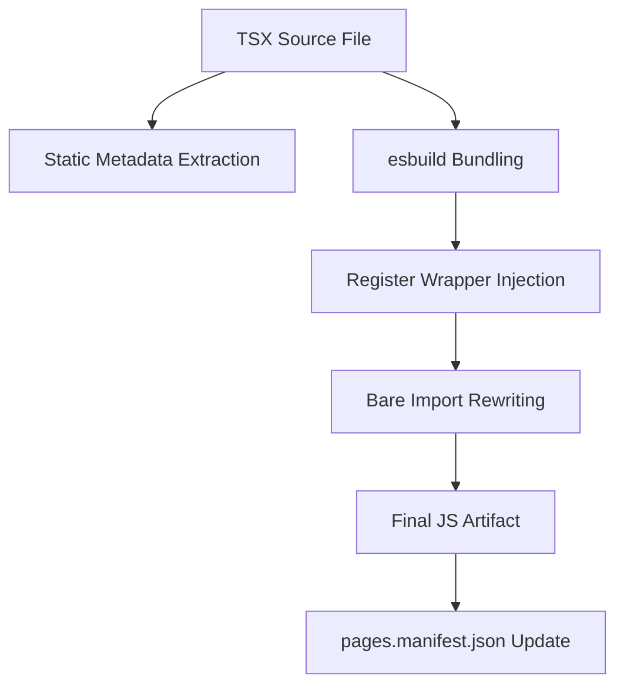
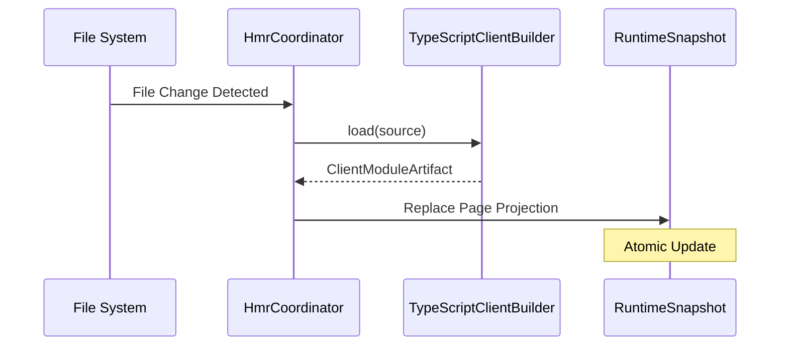

[中文版](/wiki/cubic/console-pages)

::: warning Generated reference snapshot
[Original Cubic page](https://www.cubic.dev/wikis/zhinjs/zhin?page=page-console-pages) · captured 2026-09-23 · [source commit](https://github.com/zhinjs/zhin/commit/368db14caa4aa91311fb090f07bd792fe4b22fe7). This AI-generated page has not been verified against the current code. Use the [Zhin documentation](/en/getting-started/) for current behavior and [see known corrections](/en/wiki/).
:::

::: details Relevant source files

The following files were used as context for generating this wiki page:

- [packages/toolkit/create-zhin/src/workspace.ts](https://github.com/zhinjs/zhin/blob/368db14caa4aa91311fb090f07bd792fe4b22fe7/packages/toolkit/create-zhin/src/workspace.ts)
- [packages/console/pagemanager/src/client-build/typescript-builder.ts](https://github.com/zhinjs/zhin/blob/368db14caa4aa91311fb090f07bd792fe4b22fe7/packages/console/pagemanager/src/client-build/typescript-builder.ts)
- [packages/im/runtime/tests/console-feature-hmr.test.ts](https://github.com/zhinjs/zhin/blob/368db14caa4aa91311fb090f07bd792fe4b22fe7/packages/im/runtime/tests/console-feature-hmr.test.ts)
- [packages/toolkit/create-zhin/template/skills/plugin-develop/SKILL.md](https://github.com/zhinjs/zhin/blob/368db14caa4aa91311fb090f07bd792fe4b22fe7/packages/toolkit/create-zhin/template/skills/plugin-develop/SKILL.md)
- [basic/cli/src/plugin-runtime/console/page-renderer.ts](https://github.com/zhinjs/zhin/blob/368db14caa4aa91311fb090f07bd792fe4b22fe7/basic/cli/src/plugin-runtime/console/page-renderer.ts)
- [packages/console/pagemanager/tests/client-build/client-build.test.ts](https://github.com/zhinjs/zhin/blob/368db14caa4aa91311fb090f07bd792fe4b22fe7/packages/console/pagemanager/tests/client-build/client-build.test.ts)
- [plugins/adapters/sandbox/tests/sandbox-console.test.ts](https://github.com/zhinjs/zhin/blob/368db14caa4aa91311fb090f07bd792fe4b22fe7/plugins/adapters/sandbox/tests/sandbox-console.test.ts)
:::

# Authoring Console Pages

Console Pages allow developers to extend the Zhin.js Remote Console with custom React-based user interfaces. These pages integrate directly into the Plugin Runtime, enabling plugins to provide management dashboards, interactive tools (like the Agent Sandbox), or visualization components.

The system uses a convention-over-configuration approach where pages placed in specific directories are automatically discovered, built, and served to the browser.

## Project Structure and Conventions

You define Console Pages within the `pages/` directory of a plugin. Each page exists in its own subdirectory containing an `index.tsx` file.

| Directory Path | Feature Type | Purpose |
|:---|:---|:---|
| `pages/<name>/index.tsx` | `zhin.page` | Defines a new navigation entry and view. |
| `pages/nav/index.tsx` | `zhin.layout` | Overrides the navigation/layout for the plugin scope. |
| `pages/footer/index.tsx` | `zhin.layout` | Overrides the footer layout for the plugin scope. |

Sources: [packages/toolkit/create-zhin/src/workspace.ts:741-766](https://github.com/zhinjs/zhin/blob/368db14caa4aa91311fb090f07bd792fe4b22fe7/packages/toolkit/create-zhin/src/workspace.ts#L741-L766), [packages/toolkit/create-zhin/template/skills/plugin-develop/SKILL.md:25-35](https://github.com/zhinjs/zhin/blob/368db14caa4aa91311fb090f07bd792fe4b22fe7/packages/toolkit/create-zhin/template/skills/plugin-develop/SKILL.md#L25-L35)

### Scaffolding a Page
A standard page includes a metadata declaration using `definePage` and a React component as the default export.

```typescript
import { definePage } from '@zhin.js/console-contract';

export const meta = definePage({
  title: 'My Custom Page',
  order: 10,
});

export default function MyPage() {
  return <div>Welcome to the Zhin Console!</div>;
}
```
Sources: [packages/toolkit/create-zhin/src/workspace.ts:741-750](https://github.com/zhinjs/zhin/blob/368db14caa4aa91311fb090f07bd792fe4b22fe7/packages/toolkit/create-zhin/src/workspace.ts#L741-L750), [packages/console/pagemanager/tests/client-build/client-build.test.ts:25-29](https://github.com/zhinjs/zhin/blob/368db14caa4aa91311fb090f07bd792fe4b22fe7/packages/console/pagemanager/tests/client-build/client-build.test.ts#L25-L29)

## Page Metadata

The `meta` export provides the Remote Console with information about how to display and route the page. Zhin extracts this metadata **statically** during the build process; it must not contain dynamic logic or process environment variables.

### Metadata Properties
| Property | Type | Description |
|:---|:---|:---|
| `title` | `string` | The display name of the page in the navigation menu. |
| `icon` | `string` | (Optional) Icon name to display alongside the title. |
| `order` | `number` | (Optional) Sorting priority in the menu. |
| `hideInNav` | `boolean` | If true, the page is accessible via route but hidden from the menu. |
| `requiredRoles` | `string[]` | (Optional) Permissions required to access the page. |

Sources: [packages/console/pagemanager/src/client-build/typescript-builder.ts:114-125](https://github.com/zhinjs/zhin/blob/368db14caa4aa91311fb090f07bd792fe4b22fe7/packages/console/pagemanager/src/client-build/typescript-builder.ts#L114-L125), [packages/console/pagemanager/tests/client-build/client-build.test.ts:37-43](https://github.com/zhinjs/zhin/blob/368db14caa4aa91311fb090f07bd792fe4b22fe7/packages/console/pagemanager/tests/client-build/client-build.test.ts#L37-L43)

## The Build Process

The `TypeScriptClientBuilder` compiles TSX source files into browser-compatible JavaScript artifacts. This process involves three primary stages: metadata extraction, bundling, and import rewriting.


The diagram shows the transformation of a TSX source file into a client-side artifact. Sources: [packages/console/pagemanager/src/client-build/typescript-builder.ts:54-85](https://github.com/zhinjs/zhin/blob/368db14caa4aa91311fb090f07bd792fe4b22fe7/packages/console/pagemanager/src/client-build/typescript-builder.ts#L54-L85)

### Register Wrapper
The builder wraps convention-based pages in a `register(api)` function. This allows the Remote Console to mount the component and add routes dynamically.
Sources: [packages/console/pagemanager/src/client-build/typescript-builder.ts:153-195](https://github.com/zhinjs/zhin/blob/368db14caa4aa91311fb090f07bd792fe4b22fe7/packages/console/pagemanager/src/client-build/typescript-builder.ts#L153-L195)

### Import Rewriting
Since the browser cannot resolve bare Node.js imports (e.g., `react`), the builder rewrites these imports to canonical ESM paths, typically pointing to the Console Host's `/esm/` endpoint or an external CDN like `esm.sh`.
Sources: [packages/console/pagemanager/src/client-build/typescript-builder.ts:74-78](https://github.com/zhinjs/zhin/blob/368db14caa4aa91311fb090f07bd792fe4b22fe7/packages/console/pagemanager/src/client-build/typescript-builder.ts#L74-L78), [basic/cli/src/plugin-runtime/console/page-renderer.ts:48-54](https://github.com/zhinjs/zhin/blob/368db14caa4aa91311fb090f07bd792fe4b22fe7/basic/cli/src/plugin-runtime/console/page-renderer.ts#L48-L54)

## Hot Module Replacement (HMR)

The Zhin Plugin Runtime supports HMR for Console Pages. When you modify a page source file, the `HmrCoordinator` triggers a rebuild of that specific artifact and atomically replaces it in the active `RuntimeSnapshot`.


The sequence diagram illustrates the atomic replacement of page artifacts during development. Sources: [packages/im/runtime/tests/console-feature-hmr.test.ts:55-75](https://github.com/zhinjs/zhin/blob/368db14caa4aa91311fb090f07bd792fe4b22fe7/packages/im/runtime/tests/console-feature-hmr.test.ts#L55-L75)

If a build fails (e.g., due to dynamic metadata or syntax errors), the runtime retains the previous successful snapshot to ensure stability.
Sources: [packages/im/runtime/tests/console-feature-hmr.test.ts:76-80](https://github.com/zhinjs/zhin/blob/368db14caa4aa91311fb090f07bd792fe4b22fe7/packages/im/runtime/tests/console-feature-hmr.test.ts#L76-L80)

## Rendering the Shell

The Console Host provides a base HTML shell that loads the built page modules. For simple pages or the built-in Sandbox, the shell includes:
1.  **Import Map**: Defines where to find core libraries like React.
2.  **Plugin Navigation**: Renders components provided by `zhin.layout` features.
3.  **Page Root**: A mounting point for the page component.

Sources: [basic/cli/src/plugin-runtime/console/page-renderer.ts:33-66](https://github.com/zhinjs/zhin/blob/368db14caa4aa91311fb090f07bd792fe4b22fe7/basic/cli/src/plugin-runtime/console/page-renderer.ts#L33-L66)

### Sandbox Fallback
When no React UI runtime is available or for the specific `sandbox` page, the system provides a lightweight fallback script that handles message logs and composition via a standard WebSocket connection.
Sources: [basic/cli/src/plugin-runtime/console/page-renderer.ts:73-125](https://github.com/zhinjs/zhin/blob/368db14caa4aa91311fb090f07bd792fe4b22fe7/basic/cli/src/plugin-runtime/console/page-renderer.ts#L73-L125)

## Implementation Constraints

*   **Default Export**: Every page and layout file **must** have a default export that is a React component. Sources: [packages/console/pagemanager/tests/client-build/client-build.test.ts:117-126](https://github.com/zhinjs/zhin/blob/368db14caa4aa91311fb090f07bd792fe4b22fe7/packages/console/pagemanager/tests/client-build/client-build.test.ts#L117-L126)
*   **Static Meta**: The `meta` export must be a literal object. Dynamic assignments like `const title = process.env.TITLE;` will cause build failures. Sources: [packages/console/pagemanager/tests/client-build/client-build.test.ts:54-65](https://github.com/zhinjs/zhin/blob/368db14caa4aa91311fb090f07bd792fe4b22fe7/packages/console/pagemanager/tests/client-build/client-build.test.ts#L54-L65)
*   **TS Extensions**: When importing local modules within your page, you must use the `.js` extension in the import path to maintain ESM compatibility. Sources: [packages/toolkit/create-zhin/template/skills/plugin-develop/SKILL.md:58-59](https://github.com/zhinjs/zhin/blob/368db14caa4aa91311fb090f07bd792fe4b22fe7/packages/toolkit/create-zhin/template/skills/plugin-develop/SKILL.md#L58-L59)

Console Pages provide a powerful way to visualize bot state and provide interactive controls by leveraging a specialized build pipeline that bridges the gap between Node.js plugin code and browser-side React components.
