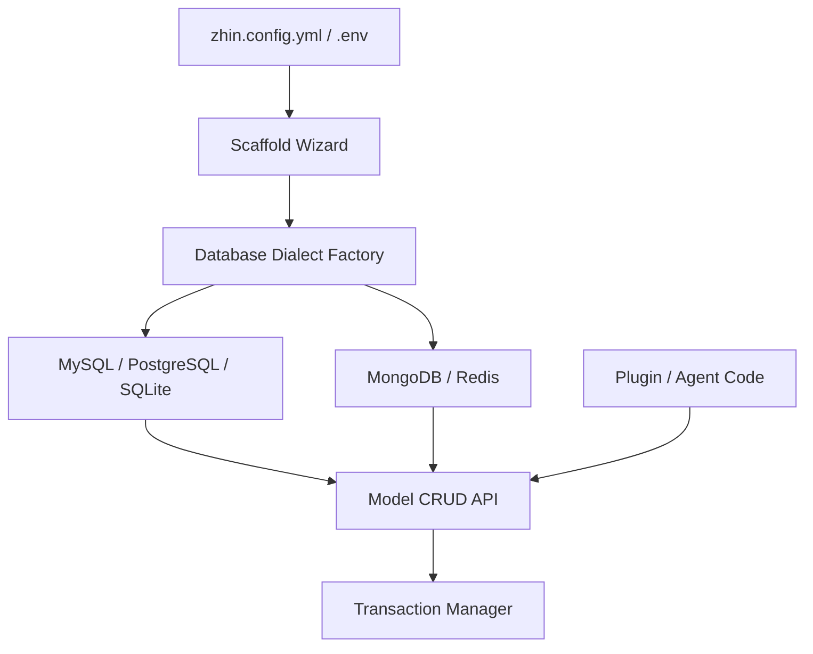

[中文版](/wiki/cubic/database)

::: warning Generated reference snapshot
[Original Cubic page](https://www.cubic.dev/wikis/zhinjs/zhin?page=page-database) · captured 2026-09-23 · [source commit](https://github.com/zhinjs/zhin/commit/368db14caa4aa91311fb090f07bd792fe4b22fe7). This AI-generated page has not been verified against the current code. Use the [Zhin documentation](/en/getting-started/) for current behavior and [see known corrections](/en/wiki/archive).
:::

::: details Relevant source files

The following files were used as context for generating this wiki page:

- [basic/database/tests/live-dialects.test.ts](https://github.com/zhinjs/zhin/blob/368db14caa4aa91311fb090f07bd792fe4b22fe7/basic/database/tests/live-dialects.test.ts)
- [packages/toolkit/scaffold-wizard/README.md](https://github.com/zhinjs/zhin/blob/368db14caa4aa91311fb090f07bd792fe4b22fe7/packages/toolkit/scaffold-wizard/README.md)
- [packages/toolkit/create-zhin/README.md](https://github.com/zhinjs/zhin/blob/368db14caa4aa91311fb090f07bd792fe4b22fe7/packages/toolkit/create-zhin/README.md)
- [packages/toolkit/create-zhin/tests/config.test.ts](https://github.com/zhinjs/zhin/blob/368db14caa4aa91311fb090f07bd792fe4b22fe7/packages/toolkit/create-zhin/tests/config.test.ts)
- [basic/cli/src/commands/setup.ts](https://github.com/zhinjs/zhin/blob/368db14caa4aa91311fb090f07bd792fe4b22fe7/basic/cli/src/commands/setup.ts)
- [AGENTS.md](https://github.com/zhinjs/zhin/blob/368db14caa4aa91311fb090f07bd792fe4b22fe7/AGENTS.md)
:::

# Database Abstraction & Persistence

Zhin.js implements a database abstraction layer within its `basic/` services to provide uniform persistence across various storage engines. This system allows developers to interact with relational, document, and key-value stores using a consistent Model API, shielding the core framework from dialect-specific syntax.

The database layer serves as a foundation for higher-level features such as the Unified Inbox, Agent memory, and persistent message logs. By providing a shared configuration wizard, Zhin ensures that database setup remains consistent whether performed during initial project creation or later through CLI management tools.
Sources: [AGENTS.md:35-50](https://github.com/zhinjs/zhin/blob/368db14caa4aa91311fb090f07bd792fe4b22fe7/AGENTS.md#L35-L50), [packages/toolkit/create-zhin/README.md:120-135](https://github.com/zhinjs/zhin/blob/368db14caa4aa91311fb090f07bd792fe4b22fe7/packages/toolkit/create-zhin/README.md#L120-L135)

## Supported Dialects

The Zhin.js database system supports multiple storage backends, categorized by their underlying data models. Each dialect requires specific connection parameters and environment variables for proper initialization.

| Dialect | Type | Key Features | Primary Configuration |
| :--- | :--- | :--- | :--- |
| **SQLite** | Relational | Zero-configuration, file-based storage. | `filename`, `mode` (e.g., wal) |
| **MySQL** | Relational | Traditional RDBMS, supports connection pooling. | `host`, `port`, `user`, `password`, `database` |
| **PostgreSQL** | Relational | Robust RDBMS, supports connection pooling. | `host`, `port`, `user`, `password`, `database` |
| **MongoDB** | Document | Schema-less document storage. | `url`, `dbName` |
| **Redis** | Key-Value | Fast in-memory storage with native TTL support. | `url` or `socket` (host/port), `password`, `db` |

Sources: [basic/database/tests/live-dialects.test.ts:43-200](https://github.com/zhinjs/zhin/blob/368db14caa4aa91311fb090f07bd792fe4b22fe7/basic/database/tests/live-dialects.test.ts#L43-L200), [packages/toolkit/scaffold-wizard/README.md:25-35](https://github.com/zhinjs/zhin/blob/368db14caa4aa91311fb090f07bd792fe4b22fe7/packages/toolkit/scaffold-wizard/README.md#L25-L35), [packages/toolkit/create-zhin/tests/config.test.ts:10-50](https://github.com/zhinjs/zhin/blob/368db14caa4aa91311fb090f07bd792fe4b22fe7/packages/toolkit/create-zhin/tests/config.test.ts#L10-L50)

## Architecture and Data Flow

The database abstraction follows a layered architecture where Dialect-specific implementations satisfy a common interface. This allows the `Model` API to perform operations regardless of the backend.


This diagram shows the flow from configuration to high-level API usage, highlighting the dialect-agnostic nature of the Model API.

### Connection Lifecycle
Database connections are managed via a start/stop lifecycle. The system performs health checks to verify connectivity before allowing operations.
1.  **Initialization**: The dialect is instantiated with configuration (often utilizing environment variable references like `${DB_HOST}`).
2.  **Start**: The `start()` method establishes the connection and, for relational databases, reconciles the schema (e.g., widening integer types or restoring auto-increments).
3.  **Operation**: The `model(name)` method retrieves a typed accessor for specific collections or tables.
4.  **Stop**: The `stop()` method gracefully closes connections or pools.

Sources: [basic/database/tests/live-dialects.test.ts:77-85](https://github.com/zhinjs/zhin/blob/368db14caa4aa91311fb090f07bd792fe4b22fe7/basic/database/tests/live-dialects.test.ts#L77-L85), [basic/database/tests/live-dialects.test.ts:153-170](https://github.com/zhinjs/zhin/blob/368db14caa4aa91311fb090f07bd792fe4b22fe7/basic/database/tests/live-dialects.test.ts#L153-L170), [packages/toolkit/create-zhin/tests/config.test.ts:85-95](https://github.com/zhinjs/zhin/blob/368db14caa4aa91311fb090f07bd792fe4b22fe7/packages/toolkit/create-zhin/tests/config.test.ts#L85-L95)

## Model API and CRUD Operations

The `Model` interface provides standard methods for data manipulation. While specific behaviors vary slightly by dialect (e.g., document IDs in MongoDB vs. primary keys in MySQL), the method signatures remain consistent.

### Common Operations
*   `insert(data)` / `insertMany(list)`: Persists new records to the store.
*   `select()`: Initiates a query, supporting filtering via `.where()` and ordering via `.orderBy()`.
*   `update(data)` / `updateById(id, data)`: Modifies existing records.
*   `delete(filter)` / `deleteById(id)`: Removes records from the store.
*   `query(raw)`: Executes dialect-specific raw queries when necessary.

### Transaction Management
Relational dialects support atomic transactions via the `transaction` method. If an error occurs within the provided callback, the system automatically rolls back all operations performed within that context.

```typescript
// Example of a transaction and CRUD operation
await db.transaction(async (trx) => {
  await trx.insert('zhin_live_users', { id: 4, name: 'admin', active: true });
  // If an error is thrown here, the insert is rolled back
});
```
Sources: [basic/database/tests/live-dialects.test.ts:90-110](https://github.com/zhinjs/zhin/blob/368db14caa4aa91311fb090f07bd792fe4b22fe7/basic/database/tests/live-dialects.test.ts#L90-L110), [basic/database/tests/live-dialects.test.ts:135-145](https://github.com/zhinjs/zhin/blob/368db14caa4aa91311fb090f07bd792fe4b22fe7/basic/database/tests/live-dialects.test.ts#L135-L145)

## Configuration and Scaffolding

Zhin.js uses a "Config as Data" approach where database credentials are kept in `.env` files while the main `zhin.config.yml` references them using placeholders.

### Environmental Variables
The `generateDatabaseEnvVars` utility creates the necessary keys for different dialects. This ensures that sensitive information like passwords is never committed to version control.

| Dialect | Variable Pattern |
| :--- | :--- |
| **MySQL/PG** | `DB_HOST`, `DB_PORT`, `DB_USER`, `DB_PASSWORD`, `DB_DATABASE` |
| **MongoDB** | `DB_URL`, `DB_NAME` |
| **Redis** | `REDIS_HOST`, `REDIS_PORT`, `REDIS_PASSWORD`, `REDIS_DB` |

### The Setup Wizard
The `@zhin.js/scaffold-wizard` package provides interactive prompts for database selection.
1.  User selects a dialect (e.g., `sqlite` or `mysql`).
2.  For networked databases, the user provides connection details.
3.  The wizard writes placeholders to `zhin.config.yml` and actual values to `.env`.
4.  The system identifies necessary dependencies (e.g., SQLite requires specific pre-conditions or driver packages).

Sources: [packages/toolkit/create-zhin/tests/config.test.ts:10-75](https://github.com/zhinjs/zhin/blob/368db14caa4aa91311fb090f07bd792fe4b22fe7/packages/toolkit/create-zhin/tests/config.test.ts#L10-L75), [packages/toolkit/scaffold-wizard/README.md:20-50](https://github.com/zhinjs/zhin/blob/368db14caa4aa91311fb090f07bd792fe4b22fe7/packages/toolkit/scaffold-wizard/README.md#L20-L50), [basic/cli/src/commands/setup.ts:250-275](https://github.com/zhinjs/zhin/blob/368db14caa4aa91311fb090f07bd792fe4b22fe7/basic/cli/src/commands/setup.ts#L250-L275)

## Redis-Specific Semantics
For key-value persistence, the Redis dialect extends the standard API with native features:
*   `set(key, value)` and `get(key)`: Basic key-value operations.
*   `expire(key, seconds)` and `ttl(key)`: Management of key expiration.
*   `keysByPattern(pattern)`: Retrieval of keys matching a specific glob.
*   `persist(key)`: Removal of expiration timers from a key.

Sources: [basic/database/tests/live-dialects.test.ts:195-220](https://github.com/zhinjs/zhin/blob/368db14caa4aa91311fb090f07bd792fe4b22fe7/basic/database/tests/live-dialects.test.ts#L195-L220)

## Summary
The Database Abstraction & Persistence layer in Zhin.js provides a dialect-neutral interface for all storage needs. By decoupling the API from the implementation and utilizing a robust scaffolding system, Zhin.js ensures that bots remain portable and secure across different infrastructure environments. This consistency is maintained across the CLI, project templates, and runtime features.
Sources: [packages/toolkit/create-zhin/README.md:30-45](https://github.com/zhinjs/zhin/blob/368db14caa4aa91311fb090f07bd792fe4b22fe7/packages/toolkit/create-zhin/README.md#L30-L45), [AGENTS.md:70-85](https://github.com/zhinjs/zhin/blob/368db14caa4aa91311fb090f07bd792fe4b22fe7/AGENTS.md#L70-L85)
