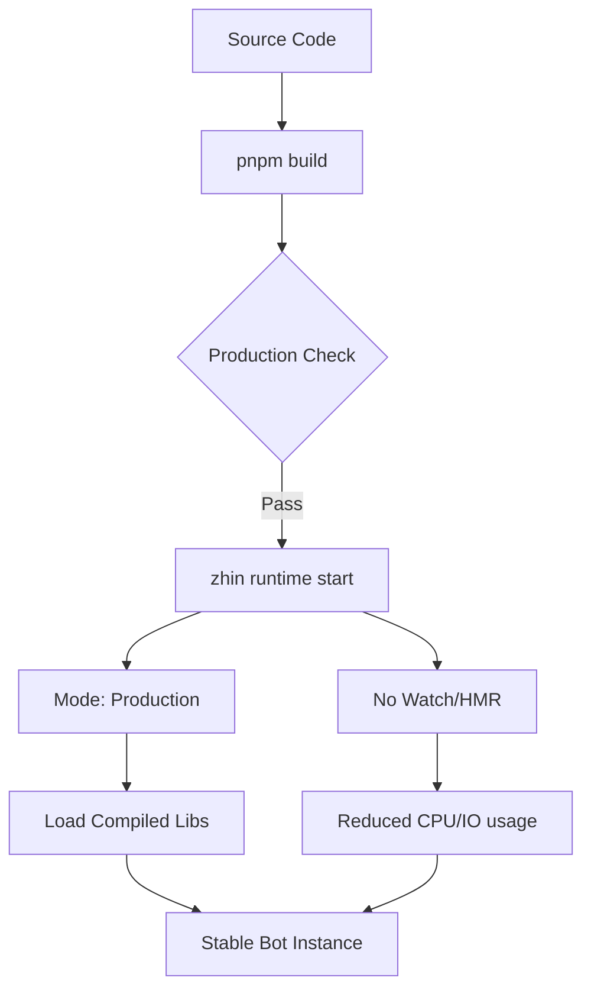
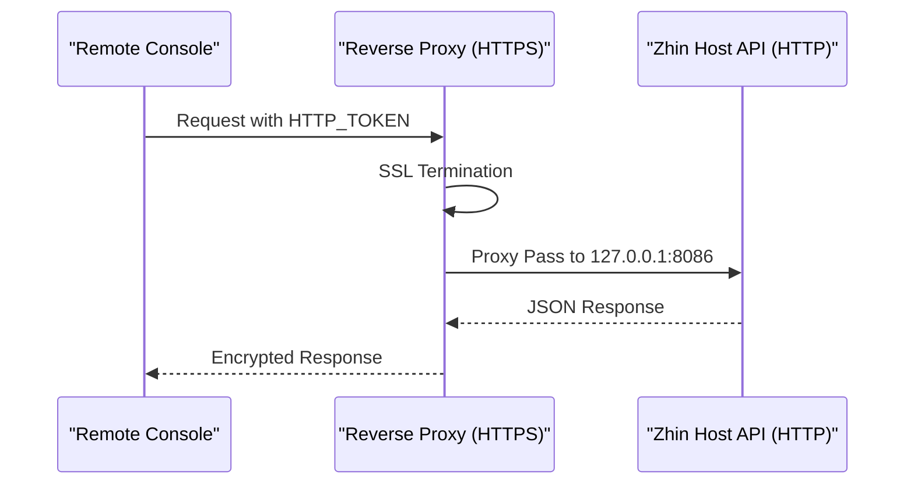

::: warning Generated reference snapshot
[Original Cubic page](https://www.cubic.dev/wikis/zhinjs/zhin?page=page-docker-prod) · captured 2026-09-23 · [source commit](https://github.com/zhinjs/zhin/commit/368db14caa4aa91311fb090f07bd792fe4b22fe7). This AI-generated page has not been verified against the current code. Use the [Zhin documentation](/en/getting-started/) for current behavior and [see known corrections](/en/wiki/).
:::

::: danger Known correction
The `8086` proxy example below applies only when that port is configured or the runtime uses its unconfigured fallback. New scaffolded projects use `8068`. See [Production Deployment](/en/operations/production).
:::

Relevant source files

The following files were used as context for generating this wiki page:

- [packages/toolkit/create-zhin/src/workspace.ts](https://github.com/zhinjs/zhin/blob/368db14caa4aa91311fb090f07bd792fe4b22fe7/packages/toolkit/create-zhin/src/workspace.ts)
- [packages/toolkit/create-zhin/README.md](https://github.com/zhinjs/zhin/blob/368db14caa4aa91311fb090f07bd792fe4b22fe7/packages/toolkit/create-zhin/README.md)
- [SECURITY.md](https://github.com/zhinjs/zhin/blob/368db14caa4aa91311fb090f07bd792fe4b22fe7/SECURITY.md)
- [agents/ops/system.md](https://github.com/zhinjs/zhin/blob/368db14caa4aa91311fb090f07bd792fe4b22fe7/agents/ops/system.md)
- [basic/cli/src/commands/migrate.ts](https://github.com/zhinjs/zhin/blob/368db14caa4aa91311fb090f07bd792fe4b22fe7/basic/cli/src/commands/migrate.ts)
- [CLAUDE.md](https://github.com/zhinjs/zhin/blob/368db14caa4aa91311fb090f07bd792fe4b22fe7/CLAUDE.md)
- [README.md](https://github.com/zhinjs/zhin/blob/368db14caa4aa91311fb090f07bd792fe4b22fe7/README.md)

# Production Deployment

Production deployment in the Zhin.js framework involves executing the specialized Plugin Runtime in a stable environment. The system transitions from development to production by switching the execution mode, disabling hot-module replacement (HMR), and utilizing OS-level process managers for durability.

Zhin.js provides automated scaffolding for various production environments, including Linux (systemd), macOS (launchd), Windows (NSSM), and cross-platform process managers like PM2. The deployment architecture ensures that messages flow through a unified pipeline while maintaining security through environment-isolated credentials and restricted API access.
Sources: [README.md:89-106](https://github.com/zhinjs/zhin/blob/368db14caa4aa91311fb090f07bd792fe4b22fe7/README.md#L89-L106), [packages/toolkit/create-zhin/src/workspace.ts:147-150](https://github.com/zhinjs/zhin/blob/368db14caa4aa91311fb090f07bd792fe4b22fe7/packages/toolkit/create-zhin/src/workspace.ts#L147-L150)

## Runtime Execution

The primary entry point for production is the `zhin runtime start` command. In production environments, this command must be invoked with specific flags to ensure stability and performance.

### Production Execution Flow

The following diagram illustrates the transition from a development state to a production-ready runtime.

The flow starts with code compilation via `pnpm build`, followed by a production check, and finally executes the runtime in a stable, non-watching mode.
Sources: [CLAUDE.md:28-40](https://github.com/zhinjs/zhin/blob/368db14caa4aa91311fb090f07bd792fe4b22fe7/CLAUDE.md#L28-L40), [packages/toolkit/create-zhin/src/workspace.ts:101-103](https://github.com/zhinjs/zhin/blob/368db14caa4aa91311fb090f07bd792fe4b22fe7/packages/toolkit/create-zhin/src/workspace.ts#L101-L103)

### CLI Parameters for Production

The CLI provides standardized scripts for different deployment needs.

| Command | Action | Flag |
| :--- | :--- | :--- |
| `pnpm start` | Production Startup | `zhin runtime start --mode production --no-watch` |
| `pnpm daemon` | Background Execution | `zhin runtime start --daemon` |
| `pnpm build` | Type-Check/Prep | `tsc --noEmit` |
| `pnpm stop` | Graceful Shutdown | N/A |

Sources: [basic/cli/src/commands/migrate.ts:25-30](https://github.com/zhinjs/zhin/blob/368db14caa4aa91311fb090f07bd792fe4b22fe7/basic/cli/src/commands/migrate.ts#L25-L30), [packages/toolkit/create-zhin/src/workspace.ts:101-105](https://github.com/zhinjs/zhin/blob/368db14caa4aa91311fb090f07bd792fe4b22fe7/packages/toolkit/create-zhin/src/workspace.ts#L101-L105)

## Process Management

Zhin.js generates configuration templates for various service managers to ensure the bot restarts automatically after crashes or system reboots.

### 1. Linux (systemd)
Scaffolding generates a `.service` file that utilizes `/usr/bin/env npx zhin` to avoid hardcoding specific Node.js paths from version managers like nvm.
- **Restart Policy**: `Restart=always` with `10s` delay.
- **Resource Limits**: `LimitNOFILE=65536` and `MemoryMax=2G`.
Sources: [packages/toolkit/create-zhin/src/workspace.ts:147-170](https://github.com/zhinjs/zhin/blob/368db14caa4aa91311fb090f07bd792fe4b22fe7/packages/toolkit/create-zhin/src/workspace.ts#L147-L170)

### 2. Windows (NSSM)
Deployment uses the Non-Sucking Service Manager (NSSM). A PowerShell script (`install-service.ps1`) automates:
- Setting the application directory.
- Rotating log files (`AppRotateBytes 10485760`).
- Setting environment variables to `production`.
Sources: [packages/toolkit/create-zhin/src/workspace.ts:219-256](https://github.com/zhinjs/zhin/blob/368db14caa4aa91311fb090f07bd792fe4b22fe7/packages/toolkit/create-zhin/src/workspace.ts#L219-L256)

### 3. macOS (launchd)
A `.plist` configuration manages the lifecycle, including `RunAtLoad` and `KeepAlive` keys.
Sources: [packages/toolkit/create-zhin/src/workspace.ts:175-214](https://github.com/zhinjs/zhin/blob/368db14caa4aa91311fb090f07bd792fe4b22fe7/packages/toolkit/create-zhin/src/workspace.ts#L175-L214)

### 4. PM2
A provided `ecosystem.config.cjs` enables clustered or single-instance management with memory monitoring.
Sources: [packages/toolkit/create-zhin/src/workspace.ts:291-316](https://github.com/zhinjs/zhin/blob/368db14caa4aa91311fb090f07bd792fe4b22fe7/packages/toolkit/create-zhin/src/workspace.ts#L291-L316)

## Security Configuration

Security in production focuses on credential isolation and network hardening.

### Environment Variable Protection
Sensitive keys such as `HTTP_TOKEN`, `AI_API_KEY`, and database credentials must be stored in the `.env` file. The framework requires that `.env` files are never committed to version control.
Sources: [SECURITY.md:39-45](https://github.com/zhinjs/zhin/blob/368db14caa4aa91311fb090f07bd792fe4b22fe7/SECURITY.md#L39-L45), [packages/toolkit/create-zhin/src/workspace.ts:335-345](https://github.com/zhinjs/zhin/blob/368db14caa4aa91311fb090f07bd792fe4b22fe7/packages/toolkit/create-zhin/src/workspace.ts#L335-L345)

### Host API Hardening
- **Local Binding**: The Host API (Port 8086) should default to `127.0.0.1` unless external management via Remote Console is explicitly required.
- **Token Usage**: Use a strong `HTTP_TOKEN` for Authorization headers.
- **Nginx Reverse Proxy**: It is recommended to use Nginx for SSL termination and as an additional security layer.
Sources: [SECURITY.md:47-53](https://github.com/zhinjs/zhin/blob/368db14caa4aa91311fb090f07bd792fe4b22fe7/SECURITY.md#L47-L53), [packages/toolkit/create-zhin/README.md:120-125](https://github.com/zhinjs/zhin/blob/368db14caa4aa91311fb090f07bd792fe4b22fe7/packages/toolkit/create-zhin/README.md#L120-L125)

Sequence showing how Nginx acts as a security buffer for the Zhin Host API.
Sources: [SECURITY.md:50-55](https://github.com/zhinjs/zhin/blob/368db14caa4aa91311fb090f07bd792fe4b22fe7/SECURITY.md#L50-L55), [packages/toolkit/create-zhin/README.md:130-135](https://github.com/zhinjs/zhin/blob/368db14caa4aa91311fb090f07bd792fe4b22fe7/packages/toolkit/create-zhin/README.md#L130-L135)

## Operations and Lifecycle

Operational integrity is maintained through strict release and update policies managed by SRE/Ops agents.

### Release Workflow
1. **CI Verification**: All workflows must pass (Type-check, Lint, Tests).
2. **Version Bumping**: Use `pnpm bump` and Changesets to manage version increments.
3. **Rollback Strategy**: Always maintain a path for rapid rollback.
4. **Artifact Validation**: Verify `npm publish` or Docker images before finalizing deployment.
Sources: [agents/ops/system.md:20-35](https://github.com/zhinjs/zhin/blob/368db14caa4aa91311fb090f07bd792fe4b22fe7/agents/ops/system.md#L20-L35), [CLAUDE.md:120-125](https://github.com/zhinjs/zhin/blob/368db14caa4aa91311fb090f07bd792fe4b22fe7/CLAUDE.md#L120-L125)

### Dependency Management
Administrators must regularly check for security vulnerabilities using `pnpm audit`. In production, only essential plugin directories should be monitored to prevent excessive file system IO.
Sources: [SECURITY.md:60-66](https://github.com/zhinjs/zhin/blob/368db14caa4aa91311fb090f07bd792fe4b22fe7/SECURITY.md#L60-L66), [agents/ops/system.md:40-45](https://github.com/zhinjs/zhin/blob/368db14caa4aa91311fb090f07bd792fe4b22fe7/agents/ops/system.md#L40-L45)

## Summary
Zhin.js production deployment relies on the `zhin runtime start` command with production flags. By utilizing generated service templates for systemd, PM2, or NSSM, and strictly following environment-based security practices, developers can ensure bot stability and data protection. The architecture separates development concerns (hot reloading) from production requirements (stability and resource efficiency).
Sources: [packages/toolkit/create-zhin/src/workspace.ts:365-380](https://github.com/zhinjs/zhin/blob/368db14caa4aa91311fb090f07bd792fe4b22fe7/packages/toolkit/create-zhin/src/workspace.ts#L365-L380), [SECURITY.md:180-195](https://github.com/zhinjs/zhin/blob/368db14caa4aa91311fb090f07bd792fe4b22fe7/SECURITY.md#L180-L195)
