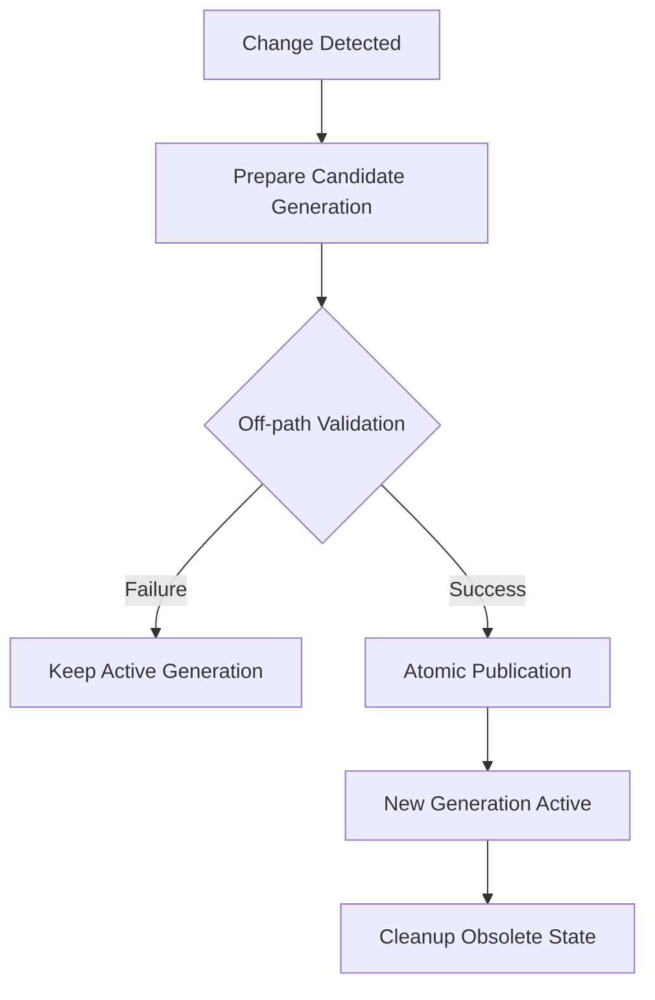
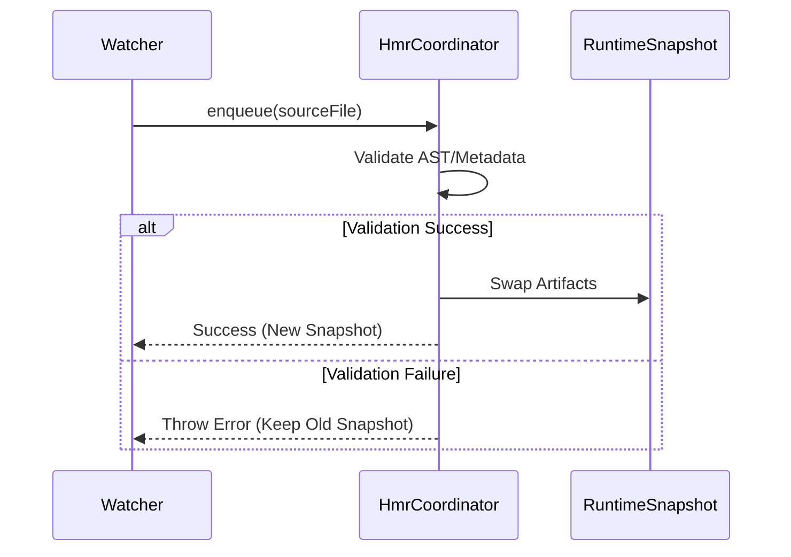

::: warning Generated reference snapshot
[Original Cubic page](https://www.cubic.dev/wikis/zhinjs/zhin?page=page-hmr-generation) · captured 2026-09-23 · [source commit](https://github.com/zhinjs/zhin/commit/368db14caa4aa91311fb090f07bd792fe4b22fe7). This AI-generated page has not been verified against the current code. Use the [Zhin documentation](/en/getting-started/) for current behavior and [see known corrections](/en/wiki/).
:::

Relevant source files

The following files were used as context for generating this wiki page:

- [README.md](https://github.com/zhinjs/zhin/blob/368db14caa4aa91311fb090f07bd792fe4b22fe7/README.md)
- [AGENTS.md](https://github.com/zhinjs/zhin/blob/368db14caa4aa91311fb090f07bd792fe4b22fe7/AGENTS.md)
- [packages/im/runtime/tests/console-feature-hmr.test.ts](https://github.com/zhinjs/zhin/blob/368db14caa4aa91311fb090f07bd792fe4b22fe7/packages/im/runtime/tests/console-feature-hmr.test.ts)
- [packages/console/pagemanager/tests/client-build/client-build.test.ts](https://github.com/zhinjs/zhin/blob/368db14caa4aa91311fb090f07bd792fe4b22fe7/packages/console/pagemanager/tests/client-build/client-build.test.ts)
- [packages/im/config-file/tests/yaml-config-document.test.ts](https://github.com/zhinjs/zhin/blob/368db14caa4aa91311fb090f07bd792fe4b22fe7/packages/im/config-file/tests/yaml-config-document.test.ts)
- [CLAUDE.md](https://github.com/zhinjs/zhin/blob/368db14caa4aa91311fb090f07bd792fe4b22fe7/CLAUDE.md)
- [agents/dev/system.md](https://github.com/zhinjs/zhin/blob/368db14caa4aa91311fb090f07bd792fe4b22fe7/agents/dev/system.md)

# Generations & Hot Module Replacement

Zhin.js manages system evolution through a generation-based transactional model. This architecture ensures that Hot Module Replacement (HMR) and configuration updates occur atomically without interrupting active services. The system prepares and validates every new plugin tree or configuration state off-path before publication.

Sources: [README.md:104-106](https://github.com/zhinjs/zhin/blob/368db14caa4aa91311fb090f07bd792fe4b22fe7/README.md#L104-L106), [agents/dev/system.md:46-48](https://github.com/zhinjs/zhin/blob/368db14caa4aa91311fb090f07bd792fe4b22fe7/agents/dev/system.md#L46-L48)

## Generation Lifecycle

Generations represent immutable snapshots of the runtime state. When the system detects a code or configuration change, it initiates a new generation transaction.

### Transactional Updates
The lifecycle follows a strict sequence to maintain stability:
1.  **Preparation**: The runtime constructs a candidate plugin tree or configuration snapshot.
2.  **Validation**: The system validates the candidate off-path. If validation fails, the active generation continues to serve traffic, preventing runtime crashes.
3.  **Atomic Publication**: Upon successful validation, the system swaps the current generation with the candidate.
4.  **State Resolution**: The runtime resolves all state through the current `Generation View` or snapshot resources.

Sources: [README.md:104-106](https://github.com/zhinjs/zhin/blob/368db14caa4aa91311fb090f07bd792fe4b22fe7/README.md#L104-L106), [AGENTS.md:126-128](https://github.com/zhinjs/zhin/blob/368db14caa4aa91311fb090f07bd792fe4b22fe7/AGENTS.md#L126-L128), [agents/dev/system.md:46-48](https://github.com/zhinjs/zhin/blob/368db14caa4aa91311fb090f07bd792fe4b22fe7/agents/dev/system.md#L46-L48)

The flow diagram above illustrates the atomic swap mechanism that prevents failed updates from affecting the live bot.

## Hot Module Replacement (HMR) Coordinator

The `HmrCoordinator` manages the queuing and execution of module updates. It specifically handles Feature slot replacements for components like Pages and Layouts in the Remote Console.

### Coordinator Functions
*   **Enqueuing**: The coordinator enqueues specific source files for update via `hmr.enqueue(source)`.
*   **Atomic Replacement**: It replaces artifacts (e.g., Page/Layout code) without re-executing client code or re-running full plugin `setup()` routines.
*   **Error Handling**: If a module fails to compile or validate, the coordinator triggers an `onError` callback and maintains the existing stable snapshot.
*   **Restart Detection**: The coordinator determines if a change requires a full process restart via `onRestartRequired`.

Sources: [packages/im/runtime/tests/console-feature-hmr.test.ts:47-75](https://github.com/zhinjs/zhin/blob/368db14caa4aa91311fb090f07bd792fe4b22fe7/packages/im/runtime/tests/console-feature-hmr.test.ts#L47-L75), [packages/console/pagemanager/tests/client-build/client-build.test.ts:98-105](https://github.com/zhinjs/zhin/blob/368db14caa4aa91311fb090f07bd792fe4b22fe7/packages/console/pagemanager/tests/client-build/client-build.test.ts#L98-L105)

### Implementation Example: Feature HMR
When a Page artifact is updated, the `HmrCoordinator` validates the new metadata (like title or route) before updating the `RuntimeSnapshot`.

The sequence diagram shows how the `HmrCoordinator` acts as a gatekeeper during the update process.

## Generation-Based Configuration

Configuration in Zhin.js is treated as versioned data owned by specific plugins. The runtime uses `YamlConfigDocument` to patch the system state within a generation transaction.

### Config Patching Logic
*   **Optimistic Concurrency**: The document system detects conflicts if the underlying file changes between a `read()` and a `commit()`.
*   **Atomic Commits**: Patches are applied to the AST while preserving comments and indentation.
*   **Rollback Capability**: If a generation fails to publish, the document system can restore the exact previous bytes of the configuration file.
*   **Validation**: The `RootRuntime` validates patches against the schema. It leaves the candidate untouched if the `setup()` routine of a child plugin fails with the new config.

Sources: [packages/im/config-file/tests/yaml-config-document.test.ts:24-40](https://github.com/zhinjs/zhin/blob/368db14caa4aa91311fb090f07bd792fe4b22fe7/packages/im/config-file/tests/yaml-config-document.test.ts#L24-L40), [packages/im/config-file/tests/yaml-config-document.test.ts:168-185](https://github.com/zhinjs/zhin/blob/368db14caa4aa91311fb090f07bd792fe4b22fe7/packages/im/config-file/tests/yaml-config-document.test.ts#L168-L185)

### Configuration Transaction Table

| Operation | Description | Outcome on Failure |
| :--- | :--- | :--- |
| `read()` | Reads current YAML/JSON and revisions | N/A |
| `prepare()` | Generates a candidate patch | Transaction remains uncommitted |
| `patchConfig()` | Applies changes and triggers shadow setup | Candidate discarded; active generation stays |
| `commit()` | Writes changes to disk atomically | File content is preserved via `rollback()` |

Sources: [packages/im/config-file/tests/yaml-config-document.test.ts:100-112](https://github.com/zhinjs/zhin/blob/368db14caa4aa91311fb090f07bd792fe4b22fe7/packages/im/config-file/tests/yaml-config-document.test.ts#L100-L112), [packages/im/config-file/tests/yaml-config-document.test.ts:187-202](https://github.com/zhinjs/zhin/blob/368db14caa4aa91311fb090f07bd792fe4b22fe7/packages/im/config-file/tests/yaml-config-document.test.ts#L187-L202)

## Architectural Constraints

The HMR and generation systems are protected by specific architectural rules to ensure consistency:

*   **No Global Singletons**: Developers must not use module-level mutable singletons. All state must reside in snapshot resources.
*   **No Command-line Registration**: Imperative capacity registration (e.g., `plugin.addCommand`) is discouraged in favor of convention-based directory discovery, which integrates better with the generation model.
*   **Immutable Snapshots**: The `RootRuntime` projects Root services through `CapabilityIngress`, ensuring that external providers follow the same generation-based governance.
*   **Invalidation Ports**: The `ModuleRuntime` provides ports for generation invalidation and tracking affected sources to determine the scope of an HMR event.

Sources: [AGENTS.md:126-128](https://github.com/zhinjs/zhin/blob/368db14caa4aa91311fb090f07bd792fe4b22fe7/AGENTS.md#L126-L128), [CLAUDE.md:66-70](https://github.com/zhinjs/zhin/blob/368db14caa4aa91311fb090f07bd792fe4b22fe7/CLAUDE.md#L66-L70), [packages/console/pagemanager/tests/client-build/client-build.test.ts:95-120](https://github.com/zhinjs/zhin/blob/368db14caa4aa91311fb090f07bd792fe4b22fe7/packages/console/pagemanager/tests/client-build/client-build.test.ts#L95-L120)

## Summary

Generations provide a safety net for the Zhin.js runtime, allowing for high-frequency updates through HMR without compromising system integrity. By treating both code and configuration as transactional units, the framework allows developers to iterate rapidly while ensuring that only validated states are ever published to the active bot.
