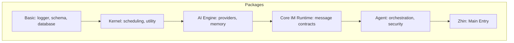
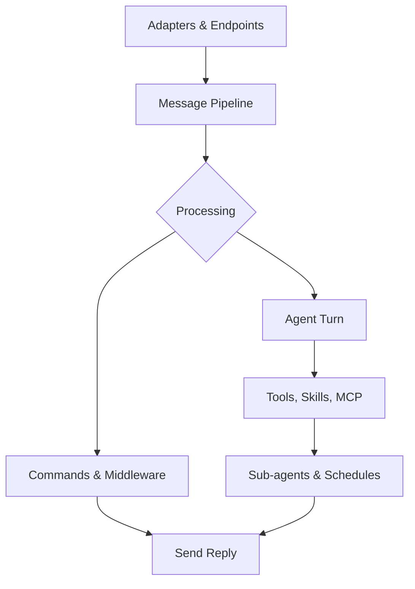
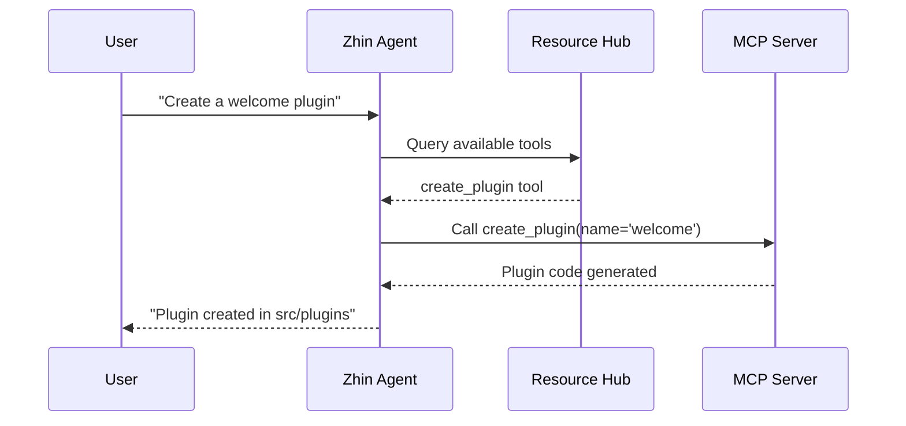

[中文版](/wiki/cubic/intro)

::: warning Generated reference snapshot
[Original Cubic page](https://www.cubic.dev/wikis/zhinjs/zhin?page=page-intro) · captured 2026-09-23 · [source commit](https://github.com/zhinjs/zhin/commit/368db14caa4aa91311fb090f07bd792fe4b22fe7). This AI-generated page has not been verified against the current code. Use the [Zhin documentation](/en/getting-started/) for current behavior and [see known corrections](/en/wiki/).
:::

::: details Relevant source files

The following files were used as context for generating this wiki page:

- [README.md](https://github.com/zhinjs/zhin/blob/368db14caa4aa91311fb090f07bd792fe4b22fe7/README.md)
- [AGENTS.md](https://github.com/zhinjs/zhin/blob/368db14caa4aa91311fb090f07bd792fe4b22fe7/AGENTS.md)
- [CLAUDE.md](https://github.com/zhinjs/zhin/blob/368db14caa4aa91311fb090f07bd792fe4b22fe7/CLAUDE.md)
- [packages/im/zhin/package.json](https://github.com/zhinjs/zhin/blob/368db14caa4aa91311fb090f07bd792fe4b22fe7/packages/im/zhin/package.json)
- [packages/im/core/package.json](https://github.com/zhinjs/zhin/blob/368db14caa4aa91311fb090f07bd792fe4b22fe7/packages/im/core/package.json)
- [packages/toolkit/create-zhin/src/workspace.ts](https://github.com/zhinjs/zhin/blob/368db14caa4aa91311fb090f07bd792fe4b22fe7/packages/toolkit/create-zhin/src/workspace.ts)
- [packages/host/mcp/README.md](https://github.com/zhinjs/zhin/blob/368db14caa4aa91311fb090f07bd792fe4b22fe7/packages/host/mcp/README.md)
:::

# Introduction to Zhin.js

Zhin.js is a multi-channel chatbot framework built with TypeScript for developers shipping serious assistants on chat platforms. It provides a unified codebase to run accounts across 20+ platforms, including QQ, WeChat, Discord, Slack, and Telegram. The framework offers an opt-in AI agent system, remote management via a browser-based console, and a convention-over-configuration plugin model.

Sources: [README.md:25-35](https://github.com/zhinjs/zhin/blob/368db14caa4aa91311fb090f07bd792fe4b22fe7/README.md#L25-L35), [AGENTS.md:7-12](https://github.com/zhinjs/zhin/blob/368db14caa4aa91311fb090f07bd792fe4b22fe7/AGENTS.md#L7-L12)

## Core Architecture

Zhin.js utilizes a layered monorepo architecture managed with pnpm and Turborepo. Each layer maintains a strict one-way dependency flow to ensure modularity and stability.

### Dependency Hierarchy

The framework enforces a hierarchy where lower layers remain independent of higher layers. The `basic/cli` package acts as the composition root, assembling the IM, Agent, and Console hosts.

*This diagram illustrates the unidirectional dependency flow from basic services to the main entry point.*

Sources: [CLAUDE.md:43-58](https://github.com/zhinjs/zhin/blob/368db14caa4aa91311fb090f07bd792fe4b22fe7/CLAUDE.md#L43-L58), [AGENTS.md:29-50](https://github.com/zhinjs/zhin/blob/368db14caa4aa91311fb090f07bd792fe4b22fe7/AGENTS.md#L29-L50)

### Key Package Roles

| Package | Role | Description |
| :--- | :--- | :--- |
| `zhin.js` | IM Entry | The primary entry point for the IM core (1.1.x stable line). |
| `@zhin.js/core` | Dispatcher | Manages the plugin runtime, adapters, and message dispatching. |
| `@zhin.js/ai` | AI Engine | Handles LLM provider abstractions, memory, and compaction without IM logic. |
| `@zhin.js/agent` | Orchestrator | Manages agent loops, security policies, and MCP clients. |
| `@zhin.js/cli` | CLI / Scaffold | Provides commands for initialization, setup, and runtime management. |

Sources: [README.md:129-136](https://github.com/zhinjs/zhin/blob/368db14caa4aa91311fb090f07bd792fe4b22fe7/README.md#L129-L136), [CLAUDE.md:60-70](https://github.com/zhinjs/zhin/blob/368db14caa4aa91311fb090f07bd792fe4b22fe7/CLAUDE.md#L60-L70)

## Message Pipeline

Zhin.js processes all interactions through a normalized message stream. A message enters the pipeline, undergoes processing by middleware or commands, potentially triggers an AI agent turn, and finally returns a reply through the unified send chain.

*The flowchart depicts the lifecycle of a message from ingress at an adapter to the final response.*

Sources: [README.md:65-80](https://github.com/zhinjs/zhin/blob/368db14caa4aa91311fb090f07bd792fe4b22fe7/README.md#L65-L80), [CLAUDE.md:72-76](https://github.com/zhinjs/zhin/blob/368db14caa4aa91311fb090f07bd792fe4b22fe7/CLAUDE.md#L72-L76)

### Send Chain Security
Zhin.js forbids bypassing the unified send chain. All outbound messages must flow through `Message.$reply` or `Adapter.sendMessage`. This ensures that all messages pass through `OutboundRenderer` and relevant outbound middleware before reaching the platform endpoint.

Sources: [CLAUDE.md:72-76](https://github.com/zhinjs/zhin/blob/368db14caa4aa91311fb090f07bd792fe4b22fe7/CLAUDE.md#L72-L76), [AGENTS.md:118-120](https://github.com/zhinjs/zhin/blob/368db14caa4aa91311fb090f07bd792fe4b22fe7/AGENTS.md#L118-L120)

## Plugin System

Zhin.js employs a convention-based plugin runtime. Developers define plugins using `definePlugin()`, and the framework automatically discovers capabilities located in specific directories.

### Convention Directories

| Directory | API Reference | Description |
| :--- | :--- | :--- |
| `commands/` | `defineCommand()` | Next.js-style routing for chat commands. |
| `middlewares/` | `defineMiddleware()` | Global message processing layers. |
| `components/` | `defineComponent()` | Rich media and message UI components. |
| `tools/` | `defineAgentTool()` | Capabilities exposed to AI agents. |
| `skills/` | `SKILL.md` | Markdown-based workflow descriptions for agents. |
| `pages/` | `definePage()` | Browser-based UI pages for the Remote Console. |

Sources: [CLAUDE.md:83-110](https://github.com/zhinjs/zhin/blob/368db14caa4aa91311fb090f07bd792fe4b22fe7/CLAUDE.md#L83-L110), [packages/toolkit/create-zhin/src/workspace.ts:316-335](https://github.com/zhinjs/zhin/blob/368db14caa4aa91311fb090f07bd792fe4b22fe7/packages/toolkit/create-zhin/src/workspace.ts#L316-L335)

### Generation Lifecycle
Zhin.js implements hot reloading as a "Generation" transaction. When code changes occur, the runtime prepares and validates a new plugin tree off-path. It only publishes the new generation if validation succeeds; otherwise, the active generation continues to serve traffic.

Sources: [README.md:92-95](https://github.com/zhinjs/zhin/blob/368db14caa4aa91311fb090f07bd792fe4b22fe7/README.md#L92-L95), [AGENTS.md:123-125](https://github.com/zhinjs/zhin/blob/368db14caa4aa91311fb090f07bd792fe4b22fe7/AGENTS.md#L123-L125)

## Installation Tiers

The framework follows a modular installation strategy to keep the core library small (<10MB). Additional features require specific peer dependencies.

| Tier | Required Packages | Capabilities |
| :--- | :--- | :--- |
| **IM Core** | `zhin.js` + adapter | Command system, plugin runtime, and Remote Console access. |
| **AI Agent** | `@zhin.js/agent`, `zod`, `ai` | ZhinAgent, session management, and tool execution. |
| **Provider** | `@ai-sdk/openai`, etc. | LLM integration for specific vendors. |
| **MCP** | `@modelcontextprotocol/sdk` | Model Context Protocol server/client support. |
| **Media** | `@zhin.js/html-renderer` | HTML/Markdown to PNG conversion for chat platforms. |

Sources: [README.md:108-120](https://github.com/zhinjs/zhin/blob/368db14caa4aa91311fb090f07bd792fe4b22fe7/README.md#L108-L120), [AGENTS.md:55-65](https://github.com/zhinjs/zhin/blob/368db14caa4aa91311fb090f07bd792fe4b22fe7/AGENTS.md#L55-L65)

## Agent and MCP Integration

The Agent system coordinates complex tasks using Tools and Skills. Through the Model Context Protocol (MCP), Zhin.js exposes framework internals to AI assistants, enabling automated plugin generation and system queries.

*A sequence diagram showing how the Agent interacts with the Resource Hub and MCP to perform developer tasks.*

Sources: [packages/host/mcp/README.md:15-30](https://github.com/zhinjs/zhin/blob/368db14caa4aa91311fb090f07bd792fe4b22fe7/packages/host/mcp/README.md#L15-L30), [packages/host/mcp/README.md:65-80](https://github.com/zhinjs/zhin/blob/368db14caa4aa91311fb090f07bd792fe4b22fe7/packages/host/mcp/README.md#L65-L80)

## Conclusion

Zhin.js provides a robust, layered architecture for building chat-based applications. By combining a small IM core with flexible AI agent capabilities and a convention-driven plugin model, it allows developers to scale from simple command-response bots to complex, tool-using autonomous assistants across multiple messaging platforms.

Sources: [README.md:40-50](https://github.com/zhinjs/zhin/blob/368db14caa4aa91311fb090f07bd792fe4b22fe7/README.md#L40-L50), [AGENTS.md:7-15](https://github.com/zhinjs/zhin/blob/368db14caa4aa91311fb090f07bd792fe4b22fe7/AGENTS.md#L7-L15)
