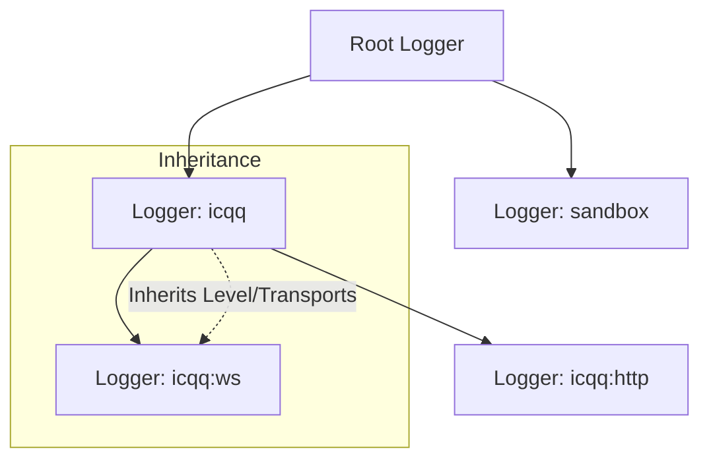
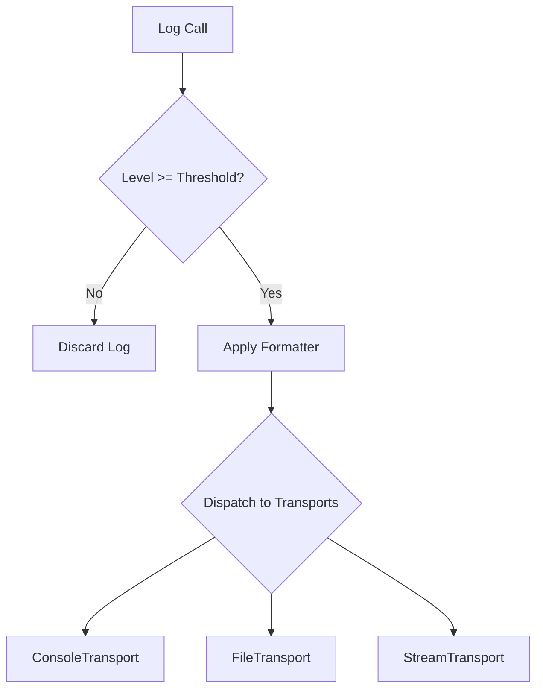

::: warning Generated reference snapshot
[Original Cubic page](https://www.cubic.dev/wikis/zhinjs/zhin?page=page-logging) · captured 2026-09-23 · [source commit](https://github.com/zhinjs/zhin/commit/368db14caa4aa91311fb090f07bd792fe4b22fe7). This AI-generated page has not been verified against the current code. Use the [Zhin documentation](/en/getting-started/) for current behavior and [see known corrections](/en/wiki/).
:::

<details>
<summary>Relevant source files</summary>

The following files were used as context for generating this wiki page:

- [basic/logger/src/logger.ts](https://github.com/zhinjs/zhin/blob/368db14caa4aa91311fb090f07bd792fe4b22fe7/basic/logger/src/logger.ts)
- [packages/im/plugin-runtime/src/system-log.ts](https://github.com/zhinjs/zhin/blob/368db14caa4aa91311fb090f07bd792fe4b22fe7/packages/im/plugin-runtime/src/system-log.ts)
- [basic/logger/README.md](https://github.com/zhinjs/zhin/blob/368db14caa4aa91311fb090f07bd792fe4b22fe7/basic/logger/README.md)
- [basic/logger/tests/logger.test.ts](https://github.com/zhinjs/zhin/blob/368db14caa4aa91311fb090f07bd792fe4b22fe7/basic/logger/tests/logger.test.ts)
- [basic/logger/package.json](https://github.com/zhinjs/zhin/blob/368db14caa4aa91311fb090f07bd792fe4b22fe7/basic/logger/package.json)
- [SECURITY.md](https://github.com/zhinjs/zhin/blob/368db14caa4aa91311fb090f07bd792fe4b22fe7/SECURITY.md)
- [basic/cli/src/commands/migrate.ts](https://github.com/zhinjs/zhin/blob/368db14caa4aa91311fb090f07bd792fe4b22fe7/basic/cli/src/commands/migrate.ts)
- [basic/cli/src/commands/setup.ts](https://github.com/zhinjs/zhin/blob/368db14caa4aa91311fb090f07bd792fe4b22fe7/basic/cli/src/commands/setup.ts)

</details>

# Logging & Telemetry

Zhin provides a high-performance, structured logging system through the `@zhin.js/logger` package. This system supports hierarchical namespaces, customizable transports, and performance telemetry to monitor bot activity and system health.

## Core Architecture

The logging system centers on the `Logger` class, which manages log levels, formatters, and output transports. Developers access loggers through the `getLogger` function, which creates or retrieves scoped instances based on a name string.

### Logger Hierarchy
Loggers follow a parent-child relationship. A child logger automatically inherits its parent's log level, formatter, and transports unless explicitly overridden. Namespaces are joined by colons (e.g., `App:Database`).


*The diagram shows how namespaces organize loggers into a tree structure for inherited configuration.*
Sources: [basic/logger/README.md:105-125](https://github.com/zhinjs/zhin/blob/368db14caa4aa91311fb090f07bd792fe4b22fe7/basic/logger/README.md#L105-L125), [basic/logger/tests/logger.test.ts:192-196](https://github.com/zhinjs/zhin/blob/368db14caa4aa91311fb090f07bd792fe4b22fe7/basic/logger/tests/logger.test.ts#L192-L196)

### Log Levels
Zhin defines five standard log levels. The system filters logs based on the current threshold; logs with a lower priority than the threshold do not process.

| Level | Value | Description |
| :--- | :--- | :--- |
| `DEBUG` | 0 | Detailed information for debugging. |
| `INFO` | 1 | General system information. |
| `WARN` | 2 | Potentially harmful situations. |
| `ERROR` | 3 | Error events that might allow the system to continue. |
| `SILENT` | 4 | Disables all logging output. |

Sources: [basic/logger/README.md:310-316](https://github.com/zhinjs/zhin/blob/368db14caa4aa91311fb090f07bd792fe4b22fe7/basic/logger/README.md#L310-L316), [basic/logger/tests/logger.test.ts:60-70](https://github.com/zhinjs/zhin/blob/368db14caa4aa91311fb090f07bd792fe4b22fe7/basic/logger/tests/logger.test.ts#L60-L70)

## Log Data Flow

When a component calls a log method (e.g., `logger.info()`), the system processes the entry through several stages:


*This flow illustrates the lifecycle of a log message from invocation to final output.*
Sources: [basic/logger/README.md:318-350](https://github.com/zhinjs/zhin/blob/368db14caa4aa91311fb090f07bd792fe4b22fe7/basic/logger/README.md#L318-L350), [basic/logger/tests/logger.test.ts:220-250](https://github.com/zhinjs/zhin/blob/368db14caa4aa91311fb090f07bd792fe4b22fe7/basic/logger/tests/logger.test.ts#L220-L250)

### Formatting
The `DefaultFormatter` organizes log data into a readable string. It uses a standard pattern: `[Date][Level] [Name] Message`.
- **Date**: Formatted as `HH:mm:ss.SSS`.
- **Name**: Represents the category, omitting the `Zhin` prefix for root-level children.
- **Level**: Color-coded output for console terminals.

Sources: [basic/logger/tests/logger.test.ts:160-185](https://github.com/zhinjs/zhin/blob/368db14caa4aa91311fb090f07bd792fe4b22fe7/basic/logger/tests/logger.test.ts#L160-L185), [basic/logger/README.md:40-50](https://github.com/zhinjs/zhin/blob/368db14caa4aa91311fb090f07bd792fe4b22fe7/basic/logger/README.md#L40-L50)

## Telemetry & Performance Monitoring

The `Logger` class provides built-in methods for measuring execution time. This telemetry helps identify performance bottlenecks in command execution or plugin initialization.

- **`logger.time(label)`**: Starts a high-precision timer associated with the provided label.
- **`logger.timeEnd(label)`**: Ends the timer and logs the duration in milliseconds.

```typescript
const timer = logger.time('data-processing');
// ... perform complex logic
timer.end(); // Outputs: data-processing took 12.45ms
```
Sources: [basic/logger/tests/logger.test.ts:80-95](https://github.com/zhinjs/zhin/blob/368db14caa4aa91311fb090f07bd792fe4b22fe7/basic/logger/tests/logger.test.ts#L80-L95), [basic/logger/README.md:140-150](https://github.com/zhinjs/zhin/blob/368db14caa4aa91311fb090f07bd792fe4b22fe7/basic/logger/README.md#L140-L150)

## Security & Best Practices

Logging sensitive information presents security risks. Zhin project guidelines recommend specific precautions for telemetry and logs:

1. **Avoid Sensitive Data**: Do not record API tokens, `.env` content, user IDs, or internal URLs in logs.
2. **Sanitize Output**: Replace sensitive fields with `<REDACTED>` before logging.
3. **Log Levels in Production**: Set the log level to `INFO` or `WARN` in production to reduce overhead and limit data exposure.
4. **Error Handling**: Log errors with full stacks in development but use generalized messages for end-users to prevent information leakage.

Sources: [SECURITY.md:85-95](https://github.com/zhinjs/zhin/blob/368db14caa4aa91311fb090f07bd792fe4b22fe7/SECURITY.md#L85-L95), [packages/toolkit/create-zhin/template/skills/summarize/SKILL.md:110-115](https://github.com/zhinjs/zhin/blob/368db14caa4aa91311fb090f07bd792fe4b22fe7/packages/toolkit/create-zhin/template/skills/summarize/SKILL.md#L110-L115)

## Usage Examples

### Scoped Plugin Logging
Plugins typically create a scoped logger during initialization to differentiate their logs from the core framework.

```typescript
import { getLogger } from '@zhin.js/logger';

const logger = getLogger('plugin-my-feature');
logger.success('Feature initialized');
logger.warn('Configuration missing optional field: %s', 'api_key');
```
Sources: [basic/logger/README.md:20-35](https://github.com/zhinjs/zhin/blob/368db14caa4aa91311fb090f07bd792fe4b22fe7/basic/logger/README.md#L20-L35), [basic/cli/src/commands/setup.ts:160](https://github.com/zhinjs/zhin/blob/368db14caa4aa91311fb090f07bd792fe4b22fe7/basic/cli/src/commands/setup.ts#L160)

### Global Configuration
Global settings apply to the default logger and are inherited by all new instances.

```typescript
import { setLevel, LogLevel, addGlobalTransport, FileTransport } from '@zhin.js/logger';
import fs from 'node:fs';

setLevel(LogLevel.INFO);
const stream = fs.createWriteStream('./bot.log');
addGlobalTransport(new FileTransport(stream));
```
Sources: [basic/logger/README.md:265-285](https://github.com/zhinjs/zhin/blob/368db14caa4aa91311fb090f07bd792fe4b22fe7/basic/logger/README.md#L265-L285)

## Conclusion
The Logging & Telemetry system in Zhin facilitates robust monitoring through its hierarchical design and performance tracking tools. By utilizing scoped loggers and appropriate transports, developers can maintain clear visibility into their bot's behavior while adhering to security best practices.
