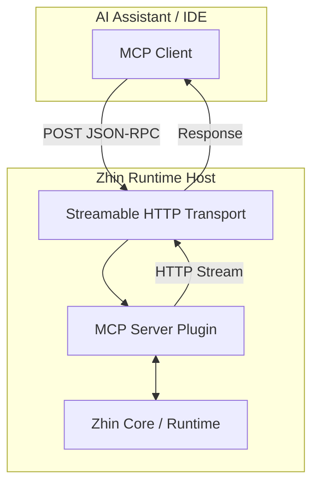
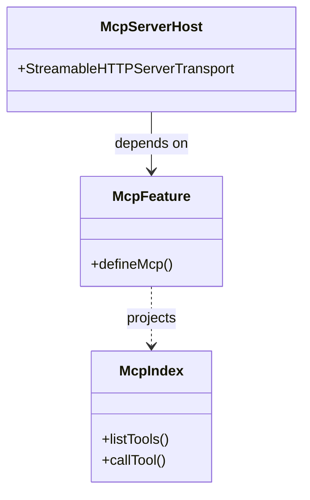

::: warning Generated reference snapshot
[Original Cubic page](https://www.cubic.dev/wikis/zhinjs/zhin?page=page-mcp) · captured 2026-09-23 · [source commit](https://github.com/zhinjs/zhin/commit/368db14caa4aa91311fb090f07bd792fe4b22fe7). This AI-generated page has not been verified against the current code. Use the [Zhin documentation](/en/getting-started/) for current behavior and [see known corrections](/en/wiki/).
:::

::: danger Known correction
The current Runtime Host registers **Tools only** and is mounted only with an explicit top-level `mcp:` configuration. `ai.mcpServers` configures the separate Agent MCP client. The generator, Resource, Prompt, and default-enabled server descriptions below are stale. See [the Host implementation](https://github.com/zhinjs/zhin/blob/main/packages/host/mcp/src/runtime.ts) and [the MCP documentation correction](https://github.com/zhinjs/zhin/pull/684).
:::

<details>
<summary>Relevant source files</summary>

The following files were used as context for generating this wiki page:

- [packages/host/mcp/README.md](https://github.com/zhinjs/zhin/blob/368db14caa4aa91311fb090f07bd792fe4b22fe7/packages/host/mcp/README.md)
- [packages/host/mcp/package.json](https://github.com/zhinjs/zhin/blob/368db14caa4aa91311fb090f07bd792fe4b22fe7/packages/host/mcp/package.json)
- [packages/im/runtime/tests/agent-feature-hmr.test.ts](https://github.com/zhinjs/zhin/blob/368db14caa4aa91311fb090f07bd792fe4b22fe7/packages/im/runtime/tests/agent-feature-hmr.test.ts)
- [AGENTS.md](https://github.com/zhinjs/zhin/blob/368db14caa4aa91311fb090f07bd792fe4b22fe7/AGENTS.md)
- [README.md](https://github.com/zhinjs/zhin/blob/368db14caa4aa91311fb090f07bd792fe4b22fe7/README.md)
- [packages/host/mcp/tests/index.test.ts](https://github.com/zhinjs/zhin/blob/368db14caa4aa91311fb090f07bd792fe4b22fe7/packages/host/mcp/tests/index.test.ts)
</details>

# Model Context Protocol (MCP)

Model Context Protocol (MCP) provides a service for AI assistants to interact with the Zhin framework. It enables Large Language Models (LLMs) to understand, query, and generate Zhin-specific artifacts such as plugins, commands, and adapters. Sources: [packages/host/mcp/README.md:1-7](https://github.com/zhinjs/zhin/blob/368db14caa4aa91311fb090f07bd792fe4b22fe7/packages/host/mcp/README.md#L1-L7), [README.md:110-120](https://github.com/zhinjs/zhin/blob/368db14caa4aa91311fb090f07bd792fe4b22fe7/README.md#L110-L120)

The implementation resides primarily in the `@zhin.js/mcp` package. It utilizes the official `@modelcontextprotocol/sdk` to expose Tools, Resources, and Prompts to clients like Claude Desktop, Cursor, or custom AI agents. Sources: [packages/host/mcp/package.json:44-50](https://github.com/zhinjs/zhin/blob/368db14caa4aa91311fb090f07bd792fe4b22fe7/packages/host/mcp/package.json#L44-L50), [packages/host/mcp/README.md:9-15](https://github.com/zhinjs/zhin/blob/368db14caa4aa91311fb090f07bd792fe4b22fe7/packages/host/mcp/README.md#L9-L15)

## Architecture and Transport

The Zhin MCP Server operates as a stateless service using a modernization transport method called **Streamable HTTP**. This transport handles independent POST requests to a specified endpoint. Sources: [packages/host/mcp/README.md:12](https://github.com/zhinjs/zhin/blob/368db14caa4aa91311fb090f07bd792fe4b22fe7/packages/host/mcp/README.md#L12), [packages/host/mcp/README.md:36-40](https://github.com/zhinjs/zhin/blob/368db14caa4aa91311fb090f07bd792fe4b22fe7/packages/host/mcp/README.md#L36-L40)

### Communication Flow
The following diagram illustrates how an AI Assistant communicates with the Zhin runtime through the MCP layer.


The MCP Server functions as a host plugin that is automatically assembled by the Zhin CLI during runtime. Sources: [packages/host/mcp/README.md:29-35](https://github.com/zhinjs/zhin/blob/368db14caa4aa91311fb090f07bd792fe4b22fe7/packages/host/mcp/README.md#L29-L35), [AGENTS.md:100-110](https://github.com/zhinjs/zhin/blob/368db14caa4aa91311fb090f07bd792fe4b22fe7/AGENTS.md#L100-L110)

### Connection Parameters
Clients must configure a HTTP URL rather than a long-lived connection like `curl -N`. The default endpoint is typically served on port 8086. Sources: [packages/host/mcp/README.md:38-42](https://github.com/zhinjs/zhin/blob/368db14caa4aa91311fb090f07bd792fe4b22fe7/packages/host/mcp/README.md#L38-L42), [packages/host/mcp/README.md:126-135](https://github.com/zhinjs/zhin/blob/368db14caa4aa91311fb090f07bd792fe4b22fe7/packages/host/mcp/README.md#L126-L135)

## Core Capabilities

The protocol implements three primary capability sets: Tools, Resources, and Prompts. Sources: [packages/host/mcp/README.md:11](https://github.com/zhinjs/zhin/blob/368db14caa4aa91311fb090f07bd792fe4b22fe7/packages/host/mcp/README.md#L11)

### 1. Tools
Tools allow the AI assistant to perform actions within the Zhin environment. The server provides generators for boilerplate code and query tools for introspection. Sources: [packages/host/mcp/README.md:65-112](https://github.com/zhinjs/zhin/blob/368db14caa4aa91311fb090f07bd792fe4b22fe7/packages/host/mcp/README.md#L65-L112)

| Tool Name | Description | Required Parameters |
|-----------|-------------|---------------------|
| `create_plugin` | Creates a new Zhin plugin file structure. | `name`, `description` |
| `create_command` | Generates command code snippets using Next.js style patterns. | `pattern`, `description` |
| `create_component` | Generates message component code. | `name`, `props` |
| `create_adapter` | Generates platform adapter code (e.g., Telegram, Discord). | `name`, `description` |
| `create_model` | Generates database model definitions. | `name`, `fields` |
| `query_plugin` | Retrieves detailed information about a specific loaded plugin. | `pluginName` |
| `list_plugins` | Lists all plugins currently active in the Zhin instance. | None |

Sources: [packages/host/mcp/README.md:67-105](https://github.com/zhinjs/zhin/blob/368db14caa4aa91311fb090f07bd792fe4b22fe7/packages/host/mcp/README.md#L67-L105)

### 2. Resources
Resources provide the AI assistant with static or dynamic contextual data. Zhin exposes its internal documentation and examples through a `zhin://` URI scheme. Sources: [packages/host/mcp/README.md:113-125](https://github.com/zhinjs/zhin/blob/368db14caa4aa91311fb090f07bd792fe4b22fe7/packages/host/mcp/README.md#L113-L125)

*   **Documentation**: `zhin://docs/architecture`, `zhin://docs/plugin-development`, `zhin://docs/command-system`.
*   **Examples**: `zhin://examples/basic-plugin`, `zhin://examples/adapter`.

### 3. Prompts
Prompts define standardized workflows for the AI to follow. Sources: [packages/host/mcp/README.md:126-140](https://github.com/zhinjs/zhin/blob/368db14caa4aa91311fb090f07bd792fe4b22fe7/packages/host/mcp/README.md#L126-L140)

*   **`create-plugin-workflow`**: Guides the AI through creating commands, middleware, or components.
*   **`debug-plugin`**: Provides steps and techniques for troubleshooting Zhin errors.
*   **`best-practices`**: Suggests development patterns specific to the Zhin framework.

## Configuration

MCP is enabled by default in the `zhin.config.yml` file. The server requires the Zhin HTTP host to be active. Sources: [packages/host/mcp/README.md:29-35](https://github.com/zhinjs/zhin/blob/368db14caa4aa91311fb090f07bd792fe4b22fe7/packages/host/mcp/README.md#L29-L35), [packages/host/mcp/README.md:148-155](https://github.com/zhinjs/zhin/blob/368db14caa4aa91311fb090f07bd792fe4b22fe7/packages/host/mcp/README.md#L148-L155)

```yaml
mcp:
  enabled: true
  path: /mcp
http:
  port: 8086
```
Sources: [packages/host/mcp/README.md:32-35](https://github.com/zhinjs/zhin/blob/368db14caa4aa91311fb090f07bd792fe4b22fe7/packages/host/mcp/README.md#L32-L35), [packages/host/mcp/README.md:164-170](https://github.com/zhinjs/zhin/blob/368db14caa4aa91311fb090f07bd792fe4b22fe7/packages/host/mcp/README.md#L164-L170)

### Dependency Hierarchy
The MCP functionality is split between the host implementation and the internal feature protocol. Sources: [packages/im/runtime/tests/agent-feature-hmr.test.ts:25-35](https://github.com/zhinjs/zhin/blob/368db14caa4aa91311fb090f07bd792fe4b22fe7/packages/im/runtime/tests/agent-feature-hmr.test.ts#L25-L35), [packages/host/mcp/package.json:1-20](https://github.com/zhinjs/zhin/blob/368db14caa4aa91311fb090f07bd792fe4b22fe7/packages/host/mcp/package.json#L1-L20)


Sources: [packages/im/runtime/tests/agent-feature-hmr.test.ts:140-150](https://github.com/zhinjs/zhin/blob/368db14caa4aa91311fb090f07bd792fe4b22fe7/packages/im/runtime/tests/agent-feature-hmr.test.ts#L140-L150), [packages/host/mcp/package.json:44-50](https://github.com/zhinjs/zhin/blob/368db14caa4aa91311fb090f07bd792fe4b22fe7/packages/host/mcp/package.json#L44-L50)

## Implementation Details

The MCP server relies on the `McpIndex` to manage tool execution and discovery. During Hot Module Replacement (HMR) events, MCP definitions can be projected through candidate generations without restarting the core plugin setup. Sources: [packages/im/runtime/tests/agent-feature-hmr.test.ts:36-55](https://github.com/zhinjs/zhin/blob/368db14caa4aa91311fb090f07bd792fe4b22fe7/packages/im/runtime/tests/agent-feature-hmr.test.ts#L36-L55)

### Entry Point Verification
The package provides a standard entry point at `src/index.ts` with explicit exports for `adapter-tools-helper` and `runtime`. Sources: [packages/host/mcp/package.json:7-25](https://github.com/zhinjs/zhin/blob/368db14caa4aa91311fb090f07bd792fe4b22fe7/packages/host/mcp/package.json#L7-L25), [packages/host/mcp/tests/index.test.ts:5-15](https://github.com/zhinjs/zhin/blob/368db14caa4aa91311fb090f07bd792fe4b22fe7/packages/host/mcp/tests/index.test.ts#L5-L15)

### Manual Smoke Test
You can verify the MCP server status using a JSON-RPC `initialize` request via `curl`:
```bash
curl -sS -X POST http://127.0.0.1:8086/mcp \
  -H 'Content-Type: application/json' \
  -d '{"jsonrpc":"2.0","id":1,"method":"initialize","params":{"protocolVersion":"2024-11-05","capabilities":{},"clientInfo":{"name":"curl","version":"1.0"}}}'
```
Sources: [packages/host/mcp/README.md:58-62](https://github.com/zhinjs/zhin/blob/368db14caa4aa91311fb090f07bd792fe4b22fe7/packages/host/mcp/README.md#L58-L62)

## Summary
The Zhin MCP implementation bridges the gap between the TypeScript framework and AI development tools. By providing a structured interface for code generation and system querying, it facilitates an "AI-first" development experience where the assistant can autonomously manage Zhin plugins and configurations. Sources: [packages/host/mcp/README.md:1-20](https://github.com/zhinjs/zhin/blob/368db14caa4aa91311fb090f07bd792fe4b22fe7/packages/host/mcp/README.md#L1-L20), [README.md:65-75](https://github.com/zhinjs/zhin/blob/368db14caa4aa91311fb090f07bd792fe4b22fe7/README.md#L65-L75)
