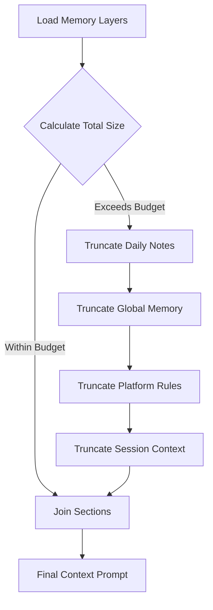
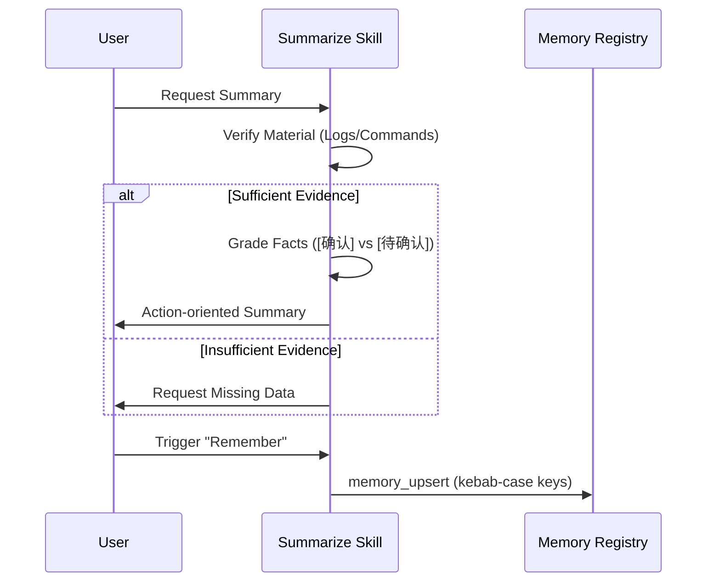

[中文版](/wiki/cubic/memory)

::: warning Generated reference snapshot
[Original Cubic page](https://www.cubic.dev/wikis/zhinjs/zhin?page=page-memory) · captured 2026-09-23 · [source commit](https://github.com/zhinjs/zhin/commit/368db14caa4aa91311fb090f07bd792fe4b22fe7). This AI-generated page has not been verified against the current code. Use the [Zhin documentation](/en/getting-started/) for current behavior and [see known corrections](/en/wiki/archive).
:::

::: details Relevant source files

The following files were used as context for generating this wiki page:

- [packages/im/agent/src/memory-layers.ts](https://github.com/zhinjs/zhin/blob/368db14caa4aa91311fb090f07bd792fe4b22fe7/packages/im/agent/src/memory-layers.ts)
- [packages/im/agent/src/bootstrap.ts](https://github.com/zhinjs/zhin/blob/368db14caa4aa91311fb090f07bd792fe4b22fe7/packages/im/agent/src/bootstrap.ts)
- [packages/toolkit/create-zhin/template/skills/summarize/SKILL.md](https://github.com/zhinjs/zhin/blob/368db14caa4aa91311fb090f07bd792fe4b22fe7/packages/toolkit/create-zhin/template/skills/summarize/SKILL.md)
- [packages/im/agent/tests/workroom/project-knowledge-registry.test.ts](https://github.com/zhinjs/zhin/blob/368db14caa4aa91311fb090f07bd792fe4b22fe7/packages/im/agent/tests/workroom/project-knowledge-registry.test.ts)
- [basic/cli/src/commands/setup.ts](https://github.com/zhinjs/zhin/blob/368db14caa4aa91311fb090f07bd792fe4b22fe7/basic/cli/src/commands/setup.ts)
- [examples/full-bot/skills/memory-consolidate/SKILL.md](https://github.com/zhinjs/zhin/blob/368db14caa4aa91311fb090f07bd792fe4b22fe7/examples/full-bot/skills/memory-consolidate/SKILL.md)
:::

# Memory, Context & Compaction

Memory, Context, and Compaction within Zhin.js comprise the system for managing long-term persistence, short-term session context, and the reduction of information into actionable summaries. This architecture enables AI agents to maintain continuity across conversations while staying within token limits through tiered storage and structured summarization.

The system partitions data into different layers of sensitivity and scope, ranging from global deployment-wide rules to specific session-bound memories. Compaction workflows ensure that only verified facts are retained, preventing the accumulation of redundant or unverified information.

## Tiered Memory Architecture

Zhin.js implements a tiered file-based memory system that organizes information by scope. The `loadMemoryLayers` function aggregates these layers into a unified prompt context for the agent.

### Memory Layers
Memory is categorized into four primary slices:
*   **Global Memory**: Deployment-wide instructions and long-term facts stored in `data/memory/global/MEMORY.md`.
*   **Daily Notes**: Temporary facts relevant to the current date, stored as `YYYY-MM-DD.md`.
*   **Platform Memory**: Rules and adapter-specific configurations for a particular platform (e.g., Discord, Telegram).
*   **Session Memory**: Conversation-specific context tied to a unique `sessionKey`, allowing the agent to remember user-specific details within a single thread.

Sources: [packages/im/agent/src/memory-layers.ts:7-10](https://github.com/zhinjs/zhin/blob/368db14caa4aa91311fb090f07bd792fe4b22fe7/packages/im/agent/src/memory-layers.ts#L7-L10), [packages/im/agent/src/memory-layers.ts:114-159](https://github.com/zhinjs/zhin/blob/368db14caa4aa91311fb090f07bd792fe4b22fe7/packages/im/agent/src/memory-layers.ts#L114-L159)

### Budget Management
To prevent context window overflow, the system applies character budgets to each memory layer. If the total content exceeds the limit, the system truncates layers in a specific order: `daily` → `global` → `platform` → `session`.

| Layer | Default Budget (Characters) | Purpose |
| :--- | :--- | :--- |
| Session | 8,000 | Recent conversation continuity |
| Platform | 4,000 | Platform-specific behavior rules |
| Global | 4,000 | Cross-project constants and facts |
| Daily | 2,000 | Current date context |

Sources: [packages/im/agent/src/memory-layers.ts:18-30](https://github.com/zhinjs/zhin/blob/368db14caa4aa91311fb090f07bd792fe4b22fe7/packages/im/agent/src/memory-layers.ts#L18-L30), [packages/im/agent/src/memory-layers.ts:184-219](https://github.com/zhinjs/zhin/blob/368db14caa4aa91311fb090f07bd792fe4b22fe7/packages/im/agent/src/memory-layers.ts#L184-L219)

The diagram shows the priority-based truncation flow used to ensure the combined memory prompt fits within system limits. Sources: [packages/im/agent/src/memory-layers.ts:184-219](https://github.com/zhinjs/zhin/blob/368db14caa4aa91311fb090f07bd792fe4b22fe7/packages/im/agent/src/memory-layers.ts#L184-L219)

## Bootstrap Files and Persona

Bootstrap files define the core identity and operational guidelines of the agent. These files are typically loaded during project scaffolding or instance initialization.

### Core Bootstrap Files
*   **SOUL.md**: Defines the agent's personality, values, and work style. It emphasizes action-oriented behavior and concise communication.
*   **TOOLS.md**: Provides guidelines for tool usage, including risk assessment for shell commands and file operations.
*   **AGENTS.md**: Serves as the primary entry point for persistent memory, user preferences, and TODO lists.

Sources: [packages/im/agent/src/bootstrap.ts:32-40](https://github.com/zhinjs/zhin/blob/368db14caa4aa91311fb090f07bd792fe4b22fe7/packages/im/agent/src/bootstrap.ts#L32-L40), [basic/cli/src/commands/setup.ts:24-106](https://github.com/zhinjs/zhin/blob/368db14caa4aa91311fb090f07bd792fe4b22fe7/basic/cli/src/commands/setup.ts#L24-L106)

### Loading Mechanism
The system searches for bootstrap files in both the project root and the `data/` directory. It uses a `ContextFile` interface to inject these contents into the system prompt, applying a total maximum limit (default 48KB) to prevent prompt injection.

Sources: [packages/im/agent/src/bootstrap.ts:50-70](https://github.com/zhinjs/zhin/blob/368db14caa4aa91311fb090f07bd792fe4b22fe7/packages/im/agent/src/bootstrap.ts#L50-L70), [packages/im/agent/src/bootstrap.ts:119-150](https://github.com/zhinjs/zhin/blob/368db14caa4aa91311fb090f07bd792fe4b22fe7/packages/im/agent/src/bootstrap.ts#L119-L150)

## Compaction and Summarization

Compaction is the process of compressing large volumes of data—such as logs, long dialogues, or CI failures—into evidence-tagged summaries.

### Fact Grading System
The summarization skill enforces a strict grading system to ensure technical accuracy:
*   **`[确认]` (Confirmed)**: Facts supported by command output, file contents, or reproducible logs. These are placed in the "Completed" section.
*   **`[待确认]` (To be Confirmed)**: Claims mentioned in conversation but not yet verified. These are placed in "Pending" or "Blocked" sections.
*   **Prohibited**: Inferring cause and effect without evidence is strictly forbidden.

Sources: [packages/toolkit/create-zhin/template/skills/summarize/SKILL.md:65-80](https://github.com/zhinjs/zhin/blob/368db14caa4aa91311fb090f07bd792fe4b22fe7/packages/toolkit/create-zhin/template/skills/summarize/SKILL.md#L65-L80)

### Summarization Workflow
1.  **Audience Check**: Determine if the summary is for a handoff, an Issue/PR, or persistent memory.
2.  **Material Verification**: Check for required logs, executed commands, and file paths.
3.  **Mode Selection**: Use "Insufficient Material Mode" if evidence is lacking, providing a list of missing items instead of conclusions.
4.  **Sensitive Information Scrubbing**: Redact tokens, secrets, and private IDs before outputting the summary.

Sources: [packages/toolkit/create-zhin/template/skills/summarize/SKILL.md:23-63](https://github.com/zhinjs/zhin/blob/368db14caa4aa91311fb090f07bd792fe4b22fe7/packages/toolkit/create-zhin/template/skills/summarize/SKILL.md#L23-L63), [packages/toolkit/create-zhin/template/skills/summarize/SKILL.md:129-131](https://github.com/zhinjs/zhin/blob/368db14caa4aa91311fb090f07bd792fe4b22fe7/packages/toolkit/create-zhin/template/skills/summarize/SKILL.md#L129-L131)

This sequence illustrates how the system transitions from raw conversation to structured summary and finally to durable memory. Sources: [packages/toolkit/create-zhin/template/skills/summarize/SKILL.md:15-100](https://github.com/zhinjs/zhin/blob/368db14caa4aa91311fb090f07bd792fe4b22fe7/packages/toolkit/create-zhin/template/skills/summarize/SKILL.md#L15-L100), [examples/full-bot/skills/memory-consolidate/SKILL.md:16-25](https://github.com/zhinjs/zhin/blob/368db14caa4aa91311fb090f07bd792fe4b22fe7/examples/full-bot/skills/memory-consolidate/SKILL.md#L16-L25)

## Project Knowledge Registry

The `ProjectKnowledgeRegistry` manages authoritative structured knowledge, isolating it from transient execution data.

### Knowledge Characteristics
*   **Authoritative Sources Only**: The registry only accepts sources like `acceptance_record`, `accepted_task_memory`, and `sponsor_decision`. It rejects raw discussion or execution logs.
*   **Domain Isolation**: Knowledge is partitioned by `projectId`. The registry prevents cross-project leakage of sensitive data (PII).
*   **Conflict Resolution**: Replacement or rollback of conflicting knowledge entries requires "Sponsor Decision" authority.

Sources: [packages/im/agent/tests/workroom/project-knowledge-registry.test.ts:48-90](https://github.com/zhinjs/zhin/blob/368db14caa4aa91311fb090f07bd792fe4b22fe7/packages/im/agent/tests/workroom/project-knowledge-registry.test.ts#L48-L90)

### Data Structures
Knowledge entries include a `governedContent` reference and a `schema` reference. Sensitivity levels (standard, restricted, high) control how content is loaded and displayed.

Sources: [packages/im/agent/tests/workroom/project-knowledge-registry.test.ts:34-45](https://github.com/zhinjs/zhin/blob/368db14caa4aa91311fb090f07bd792fe4b22fe7/packages/im/agent/tests/workroom/project-knowledge-registry.test.ts#L34-L45)

## Memory Consolidation

Consolidation occurs at the end of a workroom run or when explicitly triggered by a user (e.g., saying "Remember this").

*   **Deduplication**: The system runs `memory_search` before writing to avoid duplicate keys.
*   **Granularity**: Facts are stored as short, searchable strings (≤200 characters).
*   **Key Formatting**: Keys use a `type:identifier` format, such as `capability:workroom_kernel_v1` or `preference:language`.

Sources: [examples/full-bot/skills/memory-consolidate/SKILL.md:11-25](https://github.com/zhinjs/zhin/blob/368db14caa4aa91311fb090f07bd792fe4b22fe7/examples/full-bot/skills/memory-consolidate/SKILL.md#L11-L25)

The Memory, Context & Compaction system ensures Zhin.js agents operate with a high degree of reliability by strictly separating verified facts from conversation noise and enforcing tiered access and size constraints on all contextual data.
