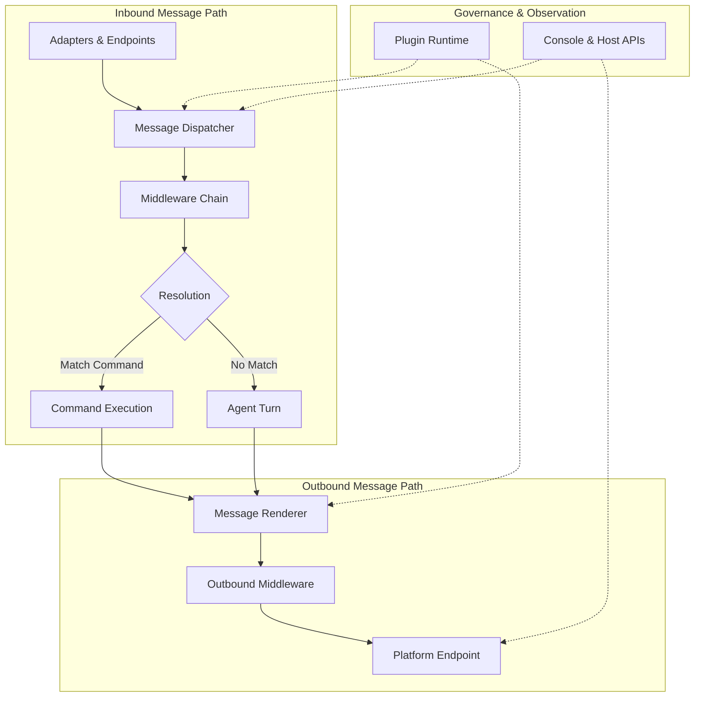
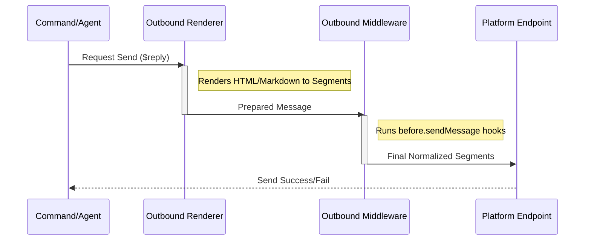

::: warning Generated reference snapshot
[Original Cubic page](https://www.cubic.dev/wikis/zhinjs/zhin?page=page-message-flow) · captured 2026-09-23 · [source commit](https://github.com/zhinjs/zhin/commit/368db14caa4aa91311fb090f07bd792fe4b22fe7). This AI-generated page has not been verified against the current code. Use the [Zhin documentation](/en/getting-started/) for current behavior and [see known corrections](/en/wiki/).
:::

Relevant source files

The following files were used as context for generating this wiki page:

- [packages/im/core/src/plugin-runtime/im/im-runtime.ts](https://github.com/zhinjs/zhin/blob/368db14caa4aa91311fb090f07bd792fe4b22fe7/packages/im/core/src/plugin-runtime/im/im-runtime.ts)
- [packages/im/core/src/plugin-runtime/im/message-dispatcher.ts](https://github.com/zhinjs/zhin/blob/368db14caa4aa91311fb090f07bd792fe4b22fe7/packages/im/core/src/plugin-runtime/im/message-dispatcher.ts)
- [packages/im/core/src/plugin-runtime/im/outbound-delivery-runtime.ts](https://github.com/zhinjs/zhin/blob/368db14caa4aa91311fb090f07bd792fe4b22fe7/packages/im/core/src/plugin-runtime/im/outbound-delivery-runtime.ts)
- [README.md](https://github.com/zhinjs/zhin/blob/368db14caa4aa91311fb090f07bd792fe4b22fe7/README.md)
- [CLAUDE.md](https://github.com/zhinjs/zhin/blob/368db14caa4aa91311fb090f07bd792fe4b22fe7/CLAUDE.md)
- [packages/README.md](https://github.com/zhinjs/zhin/blob/368db14caa4aa91311fb090f07bd792fe4b22fe7/packages/README.md)
- [AGENTS.md](https://github.com/zhinjs/zhin/blob/368db14caa4aa91311fb090f07bd792fe4b22fe7/AGENTS.md)

# Inbound & Outbound Message Pipeline

Zhin.js implements a normalized message stream architecture to support multi-channel communication across 20+ chat platforms. The message pipeline ensures that regardless of the source platform (QQ, WeChat, Discord, etc.), messages are processed through a consistent, governed sequence of layers including adapters, middleware, and AI agents.

Sources: [README.md](https://github.com/zhinjs/zhin/blob/368db14caa4aa91311fb090f07bd792fe4b22fe7/README.md), [CLAUDE.md](https://github.com/zhinjs/zhin/blob/368db14caa4aa91311fb090f07bd792fe4b22fe7/CLAUDE.md)

## Pipeline Architecture

The pipeline consists of modular layers that govern the lifecycle of a message from ingestion to delivery. The IM core remains lightweight, while advanced capabilities like AI, speech, and rich media are layered on as needed.

This diagram illustrates the flow from inbound platform ingestion to outbound platform delivery, highlighting the role of the dispatcher and renderer.
Sources: [README.md:58-71](https://github.com/zhinjs/zhin/blob/368db14caa4aa91311fb090f07bd792fe4b22fe7/README.md#L58-L71), [CLAUDE.md:65-68](https://github.com/zhinjs/zhin/blob/368db14caa4aa91311fb090f07bd792fe4b22fe7/CLAUDE.md#L65-L68)

### Architectural Tiers
The pipeline logic is distributed across specific package layers to maintain strict dependency direction:
*   **im/core**: Canonical IM runtime, message contracts, and outbound rendering.
*   **im/adapter**: Protocol-specific normalization.
*   **im/agent**: Orchestration, security policies, and AI integration.

Sources: [CLAUDE.md:37-48](https://github.com/zhinjs/zhin/blob/368db14caa4aa91311fb090f07bd792fe4b22fe7/CLAUDE.md#L37-L48), [packages/README.md:27-46](https://github.com/zhinjs/zhin/blob/368db14caa4aa91311fb090f07bd792fe4b22fe7/packages/README.md#L27-L46)

## Inbound Message Flow

Inbound processing transforms platform-specific raw data into a normalized `Message` object. The `MessageDispatcher` handles the routing and lifecycle events for these incoming signals.

### Dispatch Stages
1.  **Normalization**: The platform adapter converts raw events into a standard format.
2.  **Ingress**: The `MessageDispatcher` receives the normalized stream.
3.  **Middleware Processing**: Messages pass through a sequential chain of middleware for validation, logging, or modification.
4.  **Target Resolution**: The system determines if the message matches a registered command or should be routed to an Agent Turn.

Sources: [README.md:52-57](https://github.com/zhinjs/zhin/blob/368db14caa4aa91311fb090f07bd792fe4b22fe7/README.md#L52-L57), [CLAUDE.md:80-92](https://github.com/zhinjs/zhin/blob/368db14caa4aa91311fb090f07bd792fe4b22fe7/CLAUDE.md#L80-L92), [AGENTS.md:120-130](https://github.com/zhinjs/zhin/blob/368db14caa4aa91311fb090f07bd792fe4b22fe7/AGENTS.md#L120-L130)

### Inbound Components
| Component | Responsibility |
| :--- | :--- |
| **Adapter** | Converts external platform events into normalized Zhin messages. |
| **Dispatcher** | Manages the routing of inbound messages to commands or agents. |
| **Middleware** | Intercepts messages to perform cross-cutting concerns like permissions or filtering. |

Sources: [packages/README.md:30-45](https://github.com/zhinjs/zhin/blob/368db14caa4aa91311fb090f07bd792fe4b22fe7/packages/README.md#L30-L45), [CLAUDE.md:52-53](https://github.com/zhinjs/zhin/blob/368db14caa4aa91311fb090f07bd792fe4b22fe7/CLAUDE.md#L52-L53)

## Outbound Message Flow

The outbound pipeline is a governed "send chain" that must not be bypassed. All outgoing communications must flow through the `OutboundDeliveryRuntime` and associated renderers to ensure consistency and observability.

### Outbound Sequence
1.  **Initiation**: A component calls `Message.$reply` or `Adapter.sendMessage`.
2.  **Rendering**: The `OutboundRenderer` processes the content, converting abstractions (like Markdown or HTML) into platform-specific segments.
3.  **Governance Middleware**: Outbound middleware (e.g., `before.sendMessage`) performs final checks or transformations.
4.  **Platform Delivery**: The delivery runtime hands the processed message to the specific platform Endpoint.

Sources: [CLAUDE.md:65-68](https://github.com/zhinjs/zhin/blob/368db14caa4aa91311fb090f07bd792fe4b22fe7/CLAUDE.md#L65-L68), [AGENTS.md:120-130](https://github.com/zhinjs/zhin/blob/368db14caa4aa91311fb090f07bd792fe4b22fe7/AGENTS.md#L120-L130), [README.md:125-132](https://github.com/zhinjs/zhin/blob/368db14caa4aa91311fb090f07bd792fe4b22fe7/README.md#L125-L132)

The sequence diagram demonstrates the mandatory path for all outbound messages, ensuring no component bypasses platform-specific rendering logic.
Sources: [CLAUDE.md:65-68](https://github.com/zhinjs/zhin/blob/368db14caa4aa91311fb090f07bd792fe4b22fe7/CLAUDE.md#L65-L68), [README.md:52-57](https://github.com/zhinjs/zhin/blob/368db14caa4aa91311fb090f07bd792fe4b22fe7/README.md#L52-L57)

## Governance and Constraints

The pipeline operates under strict architectural rules to ensure stability and security.

### Key Constraints
*   **Non-Bypassable Send Chain**: All outbound messages MUST flow through the standardized path: `Message.$reply` / `Adapter.sendMessage` -> `renderSendMessage` -> `before.sendMessage` -> Endpoint.
*   **Dependency Direction**: Lower layers (kernel, ai) must never import from higher layers (core, agent, zhin). The dispatcher and delivery runtimes reside in `core` to serve as the integration point.
*   **Generation Scoping**: Pipeline state is managed via `Generation View` snapshots. This prevents module-level singleton leaks during plugin hot-reloads.

Sources: [CLAUDE.md:118-130](https://github.com/zhinjs/zhin/blob/368db14caa4aa91311fb090f07bd792fe4b22fe7/CLAUDE.md#L118-L130), [AGENTS.md:120-135](https://github.com/zhinjs/zhin/blob/368db14caa4aa91311fb090f07bd792fe4b22fe7/AGENTS.md#L120-L135)

### Messaging Feature Support
The pipeline supports various media tiers depending on installed packages:
*   **Rich Media**: Inbound/Outbound support for images, files, and cards.
*   **Speech**: Inbound STT (Speech-to-Text) and outbound TTS (Text-to-Speech).
*   **AI Integration**: Seamless handoff to `ZhinAgent` for turns involving memory and tool execution.

Sources: [README.md:125-132](https://github.com/zhinjs/zhin/blob/368db14caa4aa91311fb090f07bd792fe4b22fe7/README.md#L125-L132), [packages/README.md:41-45](https://github.com/zhinjs/zhin/blob/368db14caa4aa91311fb090f07bd792fe4b22fe7/packages/README.md#L41-L45)

## Summary

The Zhin.js Inbound & Outbound Message Pipeline provides a centralized, governed pathway for all communications. By enforcing a normalized flow through the `MessageDispatcher` and `OutboundDeliveryRuntime`, the framework guarantees platform-agnostic behavior, reliable rendering, and consistent observability for both traditional command-based and modern AI-driven interactions.
