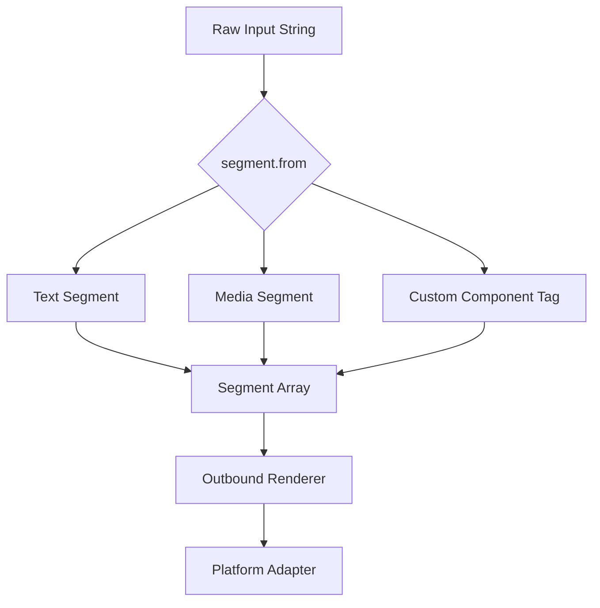
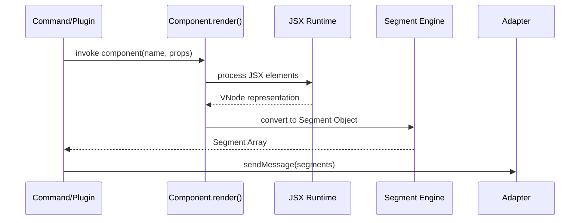

[中文版](/wiki/cubic/messaging)

::: warning Generated reference snapshot
[Original Cubic page](https://www.cubic.dev/wikis/zhinjs/zhin?page=page-messaging) · captured 2026-09-23 · [source commit](https://github.com/zhinjs/zhin/commit/368db14caa4aa91311fb090f07bd792fe4b22fe7). This AI-generated page has not been verified against the current code. Use the [Zhin documentation](/en/getting-started/) for current behavior and [see known corrections](/en/wiki/archive).
:::

::: danger Known correction
The example below uses `raw` from `zhin.js/core/runtime`, which wraps outbound content. The distinct `segment.raw` utility formats a preview string. The utility table in the Cubic original used incorrect parameter types; this copy corrects them. See [Middleware and Components](/en/authoring/middleware-components).
:::

::: details Relevant source files

The following files were used as context for generating this wiki page:

- [packages/im/core/src/built/segment-contract/index.ts](https://github.com/zhinjs/zhin/blob/368db14caa4aa91311fb090f07bd792fe4b22fe7/packages/im/core/src/built/segment-contract/index.ts)
- [packages/im/core/src/component.ts](https://github.com/zhinjs/zhin/blob/368db14caa4aa91311fb090f07bd792fe4b22fe7/packages/im/core/src/component.ts)
- [packages/im/core/src/jsx.ts](https://github.com/zhinjs/zhin/blob/368db14caa4aa91311fb090f07bd792fe4b22fe7/packages/im/core/src/jsx.ts)
- [packages/im/core/tests/utils.test.ts](https://github.com/zhinjs/zhin/blob/368db14caa4aa91311fb090f07bd792fe4b22fe7/packages/im/core/tests/utils.test.ts)
- [packages/toolkit/create-zhin/src/workspace.ts](https://github.com/zhinjs/zhin/blob/368db14caa4aa91311fb090f07bd792fe4b22fe7/packages/toolkit/create-zhin/src/workspace.ts)
- [CLAUDE.md](https://github.com/zhinjs/zhin/blob/368db14caa4aa91311fb090f07bd792fe4b22fe7/CLAUDE.md)
:::

# Universal Segments & Components

Universal Segments & Components provide a unified abstraction for handling rich media and interactive elements across diverse chat platforms. The Zhin.js framework normalizes message content into a segment-based structure, ensuring that a single codebase can render text, images, and complex UI components consistently on QQ, Discord, Telegram, and other supported adapters.

This system relies on a custom JSX implementation and a declarative component API. Developers build reusable UI blocks using `defineComponent`, which the framework translates into platform-specific segments or raw text during the outbound message flow.

## Message Segments

Segments are the atomic building blocks of messages in Zhin.js. Each segment represents a specific type of content, such as plain text, an emoji (face), or a media file. The `segment` utility handles the lifecycle of these objects, including escaping, parsing, and serialization.

### Segment Types and Utilities
The framework provides several core methods to manage segments:
*   **escape/unescape**: Converts HTML entities to prevent malformed rendering in chat clients.
*   **text**: Creates a simple text segment.
*   **face**: Creates an emoji or platform-specific face segment using an ID.
*   **from**: Parses template strings (e.g., `<image url="..." />`) into segment arrays.
*   **raw**: Converts segment objects back into a serialized string format (e.g., `Hello{face}(😊)`).
*   **toString**: Serializes segments into a template-compatible string.

Sources: [packages/im/core/tests/utils.test.ts:58-123](https://github.com/zhinjs/zhin/blob/368db14caa4aa91311fb090f07bd792fe4b22fe7/packages/im/core/tests/utils.test.ts#L58-L123), [packages/im/core/src/built/segment-contract/index.ts](https://github.com/zhinjs/zhin/blob/368db14caa4aa91311fb090f07bd792fe4b22fe7/packages/im/core/src/built/segment-contract/index.ts)

### Segment Processing Flow


The diagram shows how raw input strings are parsed into standardized segment arrays before being dispatched to platform-specific adapters.
Sources: [packages/im/core/tests/utils.test.ts:79-100](https://github.com/zhinjs/zhin/blob/368db14caa4aa91311fb090f07bd792fe4b22fe7/packages/im/core/tests/utils.test.ts#L79-L100)

## Component Architecture

Components in Zhin.js allow developers to wrap logic and rendering into reusable units. They are particularly useful for generating complex visual feedback, such as status cards or interactive menus.

### The defineComponent API
Developers define components using the `defineComponent` function. Each component receives a `props` object and returns a rendered segment or a combination of segments.

```typescript
import { raw } from 'zhin.js/core/runtime';

export default defineComponent<StatusCardProps>({
  render({ title, lines }) {
    // Component logic here
    return raw({
      type: 'html',
      data: {
        html: wrapCardHtml(body, DEFAULT_CARD_THEME.canvas),
        width: 540,
      },
    });
  },
});
```
Sources: [packages/toolkit/create-zhin/src/workspace.ts:600-630](https://github.com/zhinjs/zhin/blob/368db14caa4aa91311fb090f07bd792fe4b22fe7/packages/toolkit/create-zhin/src/workspace.ts#L600-L630), [packages/im/core/src/component.ts](https://github.com/zhinjs/zhin/blob/368db14caa4aa91311fb090f07bd792fe4b22fe7/packages/im/core/src/component.ts)

### Key Component Features
| Feature | Description |
| :--- | :--- |
| **Props Injection** | Components accept typed properties for dynamic rendering. |
| **JSX Support** | Plugins use `jsx: "react-jsx"` with `jsxImportSource: "zhin.js"` for message templates. |
| **Automatic Discovery** | Components placed in the `components/` directory are discovered automatically by the Feature provider. |
| **Segment Integration** | Components can return `raw` HTML segments which the `html-renderer` converts to images. |

Sources: [CLAUDE.md:120-130](https://github.com/zhinjs/zhin/blob/368db14caa4aa91311fb090f07bd792fe4b22fe7/CLAUDE.md#L120-L130), [packages/toolkit/create-zhin/src/workspace.ts:515-525](https://github.com/zhinjs/zhin/blob/368db14caa4aa91311fb090f07bd792fe4b22fe7/packages/toolkit/create-zhin/src/workspace.ts#L515-L525), [packages/toolkit/create-zhin/template/skills/plugin-develop/SKILL.md:40-55](https://github.com/zhinjs/zhin/blob/368db14caa4aa91311fb090f07bd792fe4b22fe7/packages/toolkit/create-zhin/template/skills/plugin-develop/SKILL.md#L40-L55)

## JSX and Rendering

Zhin.js implements a custom JSX runtime to facilitate the creation of message segments. This avoids a dependency on browser-based UI libraries and keeps the IM core lightweight.

### JSX Configuration
For the compiler to recognize Zhin-specific JSX, the `tsconfig.json` must be configured to point the `jsxImportSource` to `zhin.js`. Satori card components specifically use the `@zhin.js/satori` import source for specialized card rendering.

```json
{
  "compilerOptions": {
    "jsx": "react-jsx",
    "jsxImportSource": "zhin.js"
  }
}
```
Sources: [packages/toolkit/create-zhin/src/workspace.ts:510-520](https://github.com/zhinjs/zhin/blob/368db14caa4aa91311fb090f07bd792fe4b22fe7/packages/toolkit/create-zhin/src/workspace.ts#L510-L520), [CLAUDE.md:122-125](https://github.com/zhinjs/zhin/blob/368db14caa4aa91311fb090f07bd792fe4b22fe7/CLAUDE.md#L122-L125)

### Rendering Sequence


The sequence shows the transition from a command invoking a component to the final segment transmission by an adapter.
Sources: [packages/toolkit/create-zhin/src/workspace.ts:575-595](https://github.com/zhinjs/zhin/blob/368db14caa4aa91311fb090f07bd792fe4b22fe7/packages/toolkit/create-zhin/src/workspace.ts#L575-L595), [packages/im/core/src/jsx.ts](https://github.com/zhinjs/zhin/blob/368db14caa4aa91311fb090f07bd792fe4b22fe7/packages/im/core/src/jsx.ts)

## Segment Utility Reference

| Method | Parameters | Returns | Description |
| :--- | :--- | :--- | :--- |
| `segment.text(content)` | `string` | `Segment` | Creates a text segment. |
| `segment.face(id, text?)` | `string, string?` | `Segment` | Creates a face/emoji segment. |
| `segment.escape(text)` | `string` | `string` | Escapes special characters like `<` and `&`. |
| `segment.from(content)` | `SendContent` | `SendContent` | Parses tags into segment structures. |
| `segment.raw(content)` | `SendContent` | `string` | Serializes segments for storage or logs. |

Sources: [packages/im/core/tests/utils.test.ts:58-123](https://github.com/zhinjs/zhin/blob/368db14caa4aa91311fb090f07bd792fe4b22fe7/packages/im/core/tests/utils.test.ts#L58-L123)

Universal Segments and Components ensure that developers focus on content logic rather than platform-specific formatting. By abstracting the message layer into segments and providing a JSX-compatible component system, Zhin.js maintains high interoperability across diverse chat environments while allowing for rich, media-heavy interactions.
